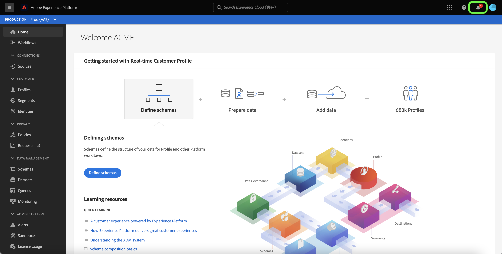
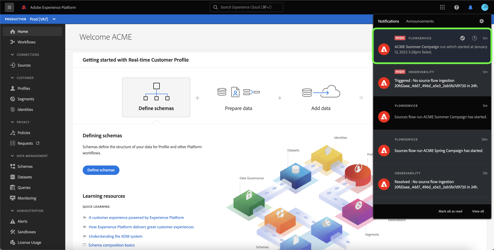

# UI에서 소스 데이터 흐름에 대한 경고 구독

>[!NOTE]
>
>비프로덕션 샌드박스에서 경고가 지원되지 않습니다. 경고를 구독하려면 프로덕션 샌드박스를 사용하고 있는지 확인해야 합니다.

Adobe Experience Platform에서는 Adobe Experience Platform 활동에 대한 이벤트 기반 경고를 구독할 수 있습니다. 경고는 를 폴링할 필요가 없어지거나 없어집니다 [[!DNL Observability Insights] API](../../../observability/api/overview.md) 작업이 완료되었는지, 워크플로우 내의 특정 이정표에 도달했는지 또는 오류가 발생했는지 확인하기 위해.

데이터 흐름을 만들 때 경고를 구독하면 흐름 실행 상태, 성공 또는 실패와 관련된 경고 메시지를 받을 수 있습니다.

이 문서에서는 소스 데이터 흐름에 대한 경고 메시지를 구독하는 방법에 대해 설명합니다.

## 시작하기

이 문서를 사용하려면 Adobe Experience Platform의 다음 구성 요소를 이해하고 있어야 합니다.

* [소스](../../home.md): [!DNL Experience Platform] 을(를) 사용하여 들어오는 데이터를 구조화, 레이블 지정 및 향상시키는 기능을 제공하면서 다양한 소스에서 데이터를 수집할 수 있습니다. [!DNL Platform] 서비스.
* [가시성](../../../observability/home.md): [!DNL Observability Insights] 통계 지표 및 이벤트 알림을 사용하여 플랫폼 활동을 모니터링할 수 있습니다.
   * [경고](../../../observability/alerts/overview.md): 플랫폼 작업의 특정 조건 세트에 도달하면(예: 시스템이 임계값을 위반한 경우 발생할 수 있는 문제) Platform은 해당 조건을 구독한 조직의 모든 사용자에게 경고 메시지를 전달할 수 있습니다.

## UI에서 경고 구독 {#subscribe-sources-alerts}

>[!CONTEXTUALHELP]
>id="platform_sources_alerts_subscribe"
>title="소스 알림 구독"
>abstract="경고를 사용하여 소스 데이터 흐름 상태에 따라 알림을 수신할 수 있습니다. 데이터 흐름이 시작되거나 성공 또는 실패했을 경우 또는 데이터를 수집하지 않은 경우 경고 알림을 설정하여 업데이트를 받을 수 있습니다."
>text="Learn more in documentation"

>[!IMPORTANT]
>
>데이터 흐름에 대한 이메일 기반 경고 알림을 받으려면 플랫폼 계정에 대해 전자 메일의 인스턴트 알림을 활성화해야 합니다.

다음 기간 동안 데이터 흐름에 대한 경고를 활성화할 수 있습니다 [!UICONTROL 데이터 흐름 세부 정보] 소스 작업 공간에서 소스 워크플로우 단계.

소스 데이터 흐름에 사용할 수 있는 경고는 다음과 같습니다.

| 경고 | 설명 |
| --- | --- |
| 소스 데이터 흐름 실행 시작 | 이 경고는 소스 데이터 흐름이 시작되면 메시지를 보냅니다. |
| 소스 데이터 흐름 실행 성공 | 이 경고는 소스의 데이터를 Platform에 성공적으로 수집하면 메시지를 보냅니다. |
| 소스 데이터 흐름 실행 실패 | 이 경고는 데이터 플로우에서 오류가 발생하면 메시지를 보냅니다. |
| ~~소스 데이터 흐름 수집 부족~~ | ~~이 경고는 수집이 7시간 이상 지연되고 Platform에 데이터를 수집하지 않는 경우 메시지를 보냅니다.~~  **참고:** 이 경고는 더 이상 사용되지 않으므로 더 이상 경고를 받지 않습니다. |

가입하려는 경고를 선택한 다음 선택합니다 **[!UICONTROL 다음]** 데이터 흐름을 검토하고 완료하려면

UI에서 소스 데이터 흐름을 만드는 자세한 단계는 다음 안내서를 참조하십시오.

* [Advertising](./dataflow/advertising.md)
* [클라우드 스토리지](./dataflow/batch/cloud-storage.md)
* [CRM](./dataflow/crm.md)
* [데이터베이스](./dataflow/databases.md)
* [전자 상거래](./dataflow/ecommerce.md)
* [로컬 파일](./create/local-system/local-file-upload.md)
* [마케팅 자동화](./dataflow/marketing-automation.md)
* [결제](./dataflow/payments.md)
* [프로토콜](./dataflow/protocols.md)

## 경고 받기

데이터 흐름이 실행되면 UI 또는 이메일을 통해 경고를 받을 수 있습니다.

### UI에서

경고는 Platform UI의 상단 헤더에 있는 알림 아이콘으로 UI에 표시됩니다. 데이터 흐름과 관련된 특정 경고 메시지를 보려면 알림 아이콘을 선택합니다.

알림 패널이 나타나고 생성한 데이터 플로에 상태 업데이트 목록이 표시됩니다.

경고 메시지를 마우스로 가리키면 읽은 것으로 표시하거나 시계 아이콘을 선택하여 데이터 흐름 상태에 대한 향후 미리 알림을 설정할 수 있습니다.

데이터 집합에 대한 특정 정보를 보려면 경고 메시지를 선택하십시오.

다음 [!UICONTROL 데이터 흐름 실행 개요] 페이지가 나타납니다. 화면 상단에는 해당 속성, 해당 데이터 흐름 실행 ID 및 높은 수준의 오류 요약이 포함된 데이터 흐름 개요가 표시됩니다.

페이지 하단에는 모든 항목이 표시됩니다 [!UICONTROL 데이터 흐름 실행 오류] 데이터 흐름 실행 단계 동안 발생한 작업입니다. 여기에서 오류 진단을 미리 보거나 [[!DNL Data Access] API](https://www.adobe.io/experience-platform-apis/references/data-access/) 오류 진단 또는 데이터 플로우에 해당하는 파일 매니페스트를 다운로드하려면 다음을 수행하십시오.

데이터 흐름 오류 처리에 대한 자세한 내용은 [UI에서 소스 데이터 흐름 모니터링](../../../dataflows/ui/monitor-sources.md).

### 이메일

데이터 흐름에 대한 경고도 이메일로 사용자에게 전달됩니다. 데이터 흐름에 대한 자세한 내용을 보려면 전자 메일 본문에서 데이터 흐름 이름을 선택합니다.

UI 경고와 유사하며, [!UICONTROL 데이터 흐름 실행 개요] 데이터 흐름과 관련된 오류를 조사할 수 있는 인터페이스를 제공하는 페이지가 나타납니다.

## 경고 구독 및 구독 취소

추가 경고에 가입하거나, [!UICONTROL 데이터 흐름] 페이지. 목록에서 만드는 데이터 흐름을 찾은 다음 줄임표(`...`) 를 클릭하여 옵션 드롭다운 메뉴를 확인합니다. 다음 을 선택합니다. **[!UICONTROL 경고 구독]** 데이터 흐름의 경고 설정을 수정하려면 다음을 수행합니다.

소스 경고 목록을 제공하는 팝업 창이 나타납니다. 가입하려는 경고를 선택하거나 가입을 해지할 경고를 선택 취소합니다. 완료되면 을 선택합니다 **[!UICONTROL 저장]**.

## 다음 단계

이 문서에서는 소스 데이터 흐름에 대한 컨텍스트 내 경고를 구독하는 방법에 대한 단계별 가이드를 제공합니다. 자세한 내용은 [경고 UI 안내서](../../../observability/alerts/ui.md).