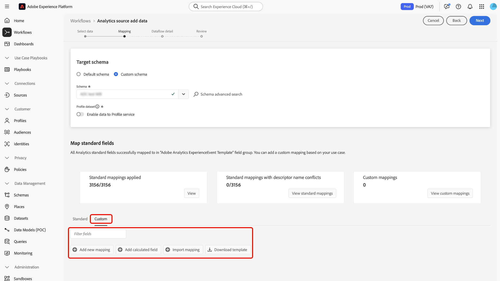

# UI에서 Adobe Analytics 소스 연결 만들기

이 자습서에서는 UI에서 Adobe Analytics 소스 연결을 만들어 Adobe Analytics 보고서 세트 데이터를 Adobe Experience Platform으로 가져오는 단계를 제공합니다.

## 시작하기

이 자습서에서는 다음 Experience Platform 구성 요소를 이해하고 있어야 합니다.

* [경험 데이터 모델(XDM) 시스템](../../../../../xdm/home.md): Experience Platform이 고객 경험 데이터를 구성하는 표준화된 프레임워크입니다.
* [실시간 고객 프로필](../../../../../profile/home.md): 여러 소스의 집계 데이터를 기반으로 통합 실시간 소비자 프로필을 제공합니다.
* [샌드박스](../../../../../sandboxes/home.md): Experience Platform은 디지털 경험 애플리케이션을 개발하고 발전시키는 데 도움이 되는 단일 플랫폼 인스턴스를 별도의 가상 환경으로 분할하는 가상 샌드박스를 제공합니다.

### 주요 용어

이 문서 전체에서 사용되는 다음 주요 용어를 이해하는 것이 중요합니다.

* **표준 속성**: 표준 속성은 Adobe에 의해 사전 정의된 모든 속성입니다. 모든 고객에 대해 동일한 의미를 포함하며 다음에서 사용할 수 있습니다. [!DNL Analytics] 소스 데이터 및 [!DNL Analytics] 스키마 필드 그룹.
* **사용자 지정 속성**: 사용자 지정 속성은 의 사용자 지정 변수 계층 구조에 있는 모든 속성입니다. [!DNL Analytics]. 사용자 지정 속성은 Adobe Analytics 구현 내에서 특정 정보를 보고서 세트에 캡처하는 데 사용되며 보고서 세트마다 용도가 다를 수 있습니다. 사용자 지정 속성에는 eVar, prop 및 목록이 포함됩니다. 다음을 참조하십시오 [[!DNL Analytics] 전환 변수에 대한 설명서](https://experienceleague.adobe.com/docs/analytics/admin/admin-tools/conversion-variables/conversion-var-admin.html) eVar에 대한 자세한 내용은
* **사용자 정의 필드 그룹의 모든 속성**: 고객이 만든 필드 그룹에서 시작된 속성은 모두 사용자가 정의하며 표준 또는 사용자 지정 속성이 아닌 것으로 간주됩니다.
* **알기 쉬운 이름**: 친숙한 이름은 의 사용자 지정 변수에 대해 사용자가 제공한 레이블입니다 [!DNL Analytics] 구현. 다음을 참조하십시오 [[!DNL Analytics] 전환 변수에 대한 설명서](https://experienceleague.adobe.com/docs/analytics/admin/admin-tools/conversion-variables/conversion-var-admin.html) 친숙한 이름에 대한 자세한 정보입니다.

## Adobe Analytics과의 소스 연결 만들기

>[!NOTE]
>
>프로덕션 샌드박스에서 Analytics 소스 데이터 흐름을 만들면 두 개의 데이터 흐름이 만들어집니다.
>
>* 내역 보고서 세트 데이터를 데이터 레이크로 13개월 채우도록 하는 데이터 흐름입니다. 이 데이터 흐름은 채우기가 완료되면 종료됩니다.
>* 라이브 데이터를 데이터 레이크 및 로 전송하는 데이터 흐름 [!DNL Real-Time Customer Profile]. 이 데이터 흐름은 지속적으로 실행됩니다.

Platform UI에서 를 선택합니다. **[!UICONTROL 소스]** 을(를) 왼쪽 탐색에서 [!UICONTROL 소스] 작업 영역. 다음 [!UICONTROL 카탈로그] 화면에는 계정을 만들 수 있는 다양한 소스가 표시됩니다.

화면 왼쪽에 있는 카탈로그에서 적절한 카테고리를 선택할 수 있습니다. 검색 창을 사용하여 표시되는 소스의 범위를 좁힐 수도 있습니다.

아래 **[!UICONTROL Adobe 애플리케이션]** 범주, 선택 **[!UICONTROL Adobe Analytics]** 다음을 선택합니다. **[!UICONTROL 데이터 추가]**.

### 데이터 선택

>[!IMPORTANT]
>
>화면에 나열된 보고서 세트는 다양한 지역에서 온 것일 수 있습니다. 데이터의 제한 사항 및 의무와 Adobe Experience Platform의 여러 지역에서 해당 데이터를 사용하는 방법을 이해해야 합니다. 귀사에서 이를 허용했는지 확인하십시오.

다음 **[!UICONTROL Analytics 소스 데이터 추가]** 단계는 다음 목록을 제공합니다. [!DNL Analytics] 소스 연결을 만들 보고서 세트 데이터입니다.

보고서 세트는 의 기초를 이루는 데이터의 컨테이너입니다 [!DNL Analytics] 보고. 조직에는 서로 다른 데이터 세트를 포함하는 많은 보고서 세트가 있을 수 있습니다.

소스 연결이 생성되는 Experience Platform 샌드박스 인스턴스와 동일한 조직에 매핑되어 있는 한 모든 지역(미국, 영국 또는 싱가포르)에서 보고서 세트를 수집할 수 있습니다. 보고서 세트는 단일 활성 데이터 흐름만 사용하여 수집할 수 있습니다. 선택할 수 없는 보고서 세트는 사용 중인 샌드박스 또는 다른 샌드박스에서 이미 수집되었습니다.

여러 보고서 세트를 동일한 샌드박스로 가져오기 위해 바인딩된 연결을 여러 개 만들 수 있습니다. 보고서 세트에 변수(예: eVar 또는 이벤트)에 대한 다른 스키마가 있는 경우 사용자 정의 필드 그룹의 특정 필드에 매핑하고 를 사용하여 데이터 충돌을 방지해야 합니다 [데이터 준비](../../../../../data-prep/ui/mapping.md). 보고서 세트는 단일 샌드박스에만 추가할 수 있습니다.

>[!NOTE]
>
>여러 보고서 세트의 데이터는 의미가 다른 두 개의 사용자 지정 속성(eVar, 목록 및 prop)과 같이 데이터 충돌이 없는 경우에만 실시간 고객 프로필에 대해 활성화할 수 있습니다.

을(를) 만들려면 [!DNL Analytics] 소스 연결에서 보고서 세트를 선택한 다음 를 선택합니다. **[!UICONTROL 다음]** 계속합니다.

&lt;!—Analytics 보고서 세트는 한 번에 하나의 샌드박스에 대해 구성할 수 있습니다. 동일한 보고서 세트를 다른 샌드박스로 가져오려면 다른 샌드박스에 대한 구성을 통해 데이터 세트 흐름을 삭제하고 다시 인스턴스화해야 합니다.—>

### 매핑

>[!IMPORTANT]
>
>데이터 준비 변환은 전체 데이터 흐름에 지연을 추가할 수 있습니다. 추가되는 지연은 변환 로직의 복잡성에 따라 달라집니다.

매핑하기 전에 [!DNL Analytics] 대상 XDM 스키마에 대한 데이터에서 먼저 기본 스키마를 사용할지 아니면 사용자 지정 스키마를 사용할지 선택해야 합니다.

기본 스키마는 사용자를 대신하여 다음을 포함하는 새 스키마를 만듭니다. [!DNL Adobe Analytics ExperienceEvent Template] 필드 그룹입니다. 기본 스키마를 사용하려면 다음을 선택합니다. **[!UICONTROL 기본 스키마]**.

사용자 지정 스키마를 사용하면 사용 가능한 스키마를 선택할 수 있습니다. [!DNL Analytics] 해당 스키마에 가 있는 한 데이터 [!DNL Adobe Analytics ExperienceEvent Template] 필드 그룹입니다. 사용자 지정 스키마를 사용하려면 다음을 선택합니다. **[!UICONTROL 사용자 지정 스키마]**.

다음 [!UICONTROL 매핑] 페이지는 소스 필드를 해당 대상 스키마 필드에 매핑하는 인터페이스를 제공합니다. 여기에서 사용자 지정 변수를 새 스키마 필드 그룹에 매핑하고 데이터 준비에서 지원하는 대로 계산을 적용할 수 있습니다. 대상 스키마를 선택하여 매핑 프로세스를 시작합니다.

>[!TIP]
>
>이 있는 스키마만 [!DNL Adobe Analytics ExperienceEvent Template] 필드 그룹이 스키마 선택 메뉴에 표시됩니다. 다른 스키마는 생략됩니다. 보고서 세트 데이터에 사용할 수 있는 적절한 스키마가 없는 경우 새 스키마를 만들어야 합니다. 스키마 만들기에 대한 자세한 단계는 의 안내서를 참조하십시오. [ui에서 스키마 생성 및 편집](../../../../../xdm/ui/resources/schemas.md).

다음 [!UICONTROL 표준 필드 매핑] 섹션에는 다음에 대한 패널이 표시됩니다 [!UICONTROL 표준 매핑 적용됨], [!UICONTROL 일치하지 않는 표준 매핑] 및 [!UICONTROL 사용자 정의 매핑]. 각 카테고리에 대한 특정 정보는 다음 표를 참조하십시오.

| 표준 필드 매핑 | 설명 |
| --- | --- |
| [!UICONTROL 표준 매핑 적용됨] | 다음 [!UICONTROL 표준 매핑 적용됨] 패널에는 매핑된 속성의 총 수가 표시됩니다. 표준 매핑은 소스의 모든 속성 간의 매핑 세트를 의미합니다 [!DNL Analytics] 의 데이터 및 해당 속성 [!DNL Analytics] 필드 그룹입니다. 이는 사전 매핑되며 편집할 수 없습니다. |
| [!UICONTROL 일치하지 않는 표준 매핑] | 다음 [!UICONTROL 일치하지 않는 표준 매핑] 패널은 친숙한 이름 충돌이 포함된 매핑된 속성의 수를 나타냅니다. 이러한 충돌은 이미 다른 보고서 세트의 필드 설명자 세트가 채워진 스키마를 다시 사용할 때 나타납니다. 다음 작업을 진행할 수 있습니다. [!DNL Analytics] 알기 쉬운 이름 충돌이 있는 데이터 흐름. |
| [!UICONTROL 사용자 정의 매핑] | 다음 [!UICONTROL 사용자 정의 매핑] 패널에는 eVar, prop 및 목록을 포함하여 매핑된 사용자 지정 속성의 수가 표시됩니다. 사용자 지정 매핑은 소스의 사용자 지정 속성 간 매핑 세트를 의미합니다 [!DNL Analytics] 선택한 스키마에 포함된 사용자 지정 필드 그룹의 데이터 및 특성입니다. |

을(를) 미리 보려면 [!DNL Analytics] ExperienceEvent 템플릿 스키마 필드 그룹, 선택 **[!UICONTROL 보기]** 다음에서 [!UICONTROL 표준 매핑 적용됨] 패널.

다음 [!UICONTROL Adobe Analytics ExperienceEvent 템플릿 스키마 필드 그룹] 페이지는 스키마 구조를 검사하는 데 사용할 인터페이스를 제공합니다. 완료되면 다음을 선택합니다. **[!UICONTROL 닫기]**.

Platform은 모든 친숙한 이름 충돌에 대한 매핑 세트를 자동으로 감지합니다. 매핑 세트와 충돌하지 않는 경우 다음을 선택합니다. **[!UICONTROL 다음]** 계속합니다.

>[!TIP]
>
>소스 보고서 세트와 선택한 스키마 간에 친숙한 이름 충돌이 있는 경우 [!DNL Analytics] 필드 설명자가 변경되지 않음을 확인하는 데이터 흐름. 또는 설명자 세트가 비어 있는 새 스키마를 만들도록 선택할 수 있습니다.

#### 사용자 정의 매핑

데이터 준비 함수를 사용하여 새 사용자 지정 매핑 또는 사용자 지정 특성에 대한 계산된 필드를 추가할 수 있습니다. 사용자 정의 매핑을 추가하려면 다음을 선택합니다. **[!UICONTROL 사용자 정의]**.

필요에 따라 다음 중 하나를 선택할 수 있습니다 **[!UICONTROL 새 매핑 추가]** 또는 **[!UICONTROL 계산된 필드 추가]** 사용자 지정 특성에 대한 사용자 지정 매핑을 만듭니다. 데이터 준비 기능 사용 방법에 대한 포괄적인 단계는 [데이터 준비 UI 안내서](../../../../../data-prep/ui/mapping.md).

다음 설명서는 데이터 준비, 계산된 필드 및 매핑 함수 이해에 대한 추가 리소스를 제공합니다.

* [데이터 준비 개요](../../../../../data-prep/home.md)
* [데이터 준비 매핑 기능](../../../../../data-prep/functions.md)
* [계산된 필드 추가](../../../../../data-prep/ui/mapping.md#calculated-fields)

<!-- 
To use Data Prep functions and add new mapping or calculated fields for custom attributes, select **[!UICONTROL View custom mappings]**.

Next, select **[!UICONTROL Add new mapping]**.

Depending on your needs, you can select either **[!UICONTROL Add new mapping]** or **[!UICONTROL Add calculated field]** from the options that appear. 

An empty mapping set appears. Select the mapping icon to add a source field.

You can use the interface to navigate through the source schema structure and identify the new source field that you want to use. Once you have selected the source field that you want to map, select **[!UICONTROL Select]**.

Next, select the mapping icon under [!UICONTROL Target Field] to map your selected source field to its appropriate target field.

Similar to the source schema, you can use the interface to navigate through the target schema structure and select the target field you want to map to. Once you have selected the appropriate target field, select **[!UICONTROL Select]**.

With your custom mapping set completed, select **[!UICONTROL Next]** to proceed.

 -->

### 실시간 고객 프로필 필터링 {#filtering-for-profile}

>[!CONTEXTUALHELP]
>id="platform_data_prep_analytics_filtering"
>title="필터 규칙 만들기"
>abstract="데이터를 실시간 고객 프로필로 전송할 때 행 및 열 수준 필터링 규칙을 정의합니다. 행 수준 필터링을 사용하여 조건을 적용하고 **프로필 수집에 포함**&#x200B;할 데이터를 보여 줍니다. 열 수준 필터링을 사용하여 **프로필 수집에서 제외**&#x200B;할 데이터 열을 선택합니다. 필터링 규칙은 데이터 레이크로 전송된 데이터에 적용되지 않습니다."

에 대한 매핑을 완료한 후 [!DNL Analytics] 보고서 세트 데이터에서 필터링 규칙 및 조건을 적용하여 실시간 고객 프로필에 수집에서 데이터를 선택적으로 포함하거나 제외할 수 있습니다. 필터링에 대한 지원은 다음에만 가능합니다. [!DNL Analytics] 데이터 및 데이터는 입력 전에 필터링됩니다. [!DNL Profile.] 모든 데이터는 데이터 레이크로 수집됩니다.

#### 행 수준 필터링

>[!IMPORTANT]
>
>행 수준 필터링을 사용하여 조건을 적용하고 **프로필 수집에 포함**&#x200B;할 데이터를 보여 줍니다. 열 수준 필터링을 사용하여 **프로필 수집에서 제외**&#x200B;할 데이터 열을 선택합니다.

다음에 대한 데이터를 필터링할 수 있습니다. [!DNL Profile] 행 수준 및 열 수준에서 수집. 행 수준 필터링을 사용하면 문자열 포함, 다음과 같음, 시작 또는 끝과 같은 기준을 정의할 수 있습니다. 행 수준 필터링을 사용하여 다음을 사용하여 조건을 연결할 수도 있습니다. `AND` 뿐만 아니라 `OR`및 을 사용하여 조건 부정 `NOT`.

다음을 필터링하려면 [!DNL Analytics] 행 수준에서 데이터를 선택하고 **[!UICONTROL 행 필터]**.

왼쪽 레일을 사용하여 스키마 계층을 탐색하고 선택한 스키마 속성을 선택하여 특정 스키마를 추가로 드릴다운합니다.

구성할 속성을 식별했으면 왼쪽 레일에서 속성을 선택하고 필터링 패널로 드래그합니다.

다른 조건을 구성하려면 다음을 선택합니다 **[!UICONTROL 다음과 같음]** 드롭다운 창에서 조건을 선택합니다.

구성 가능한 조건 목록은 다음과 같습니다.

* [!UICONTROL 다음과 같음]
* [!UICONTROL 다음과 같지 않음]
* [!UICONTROL 다음으로 시작]
* [!UICONTROL 다음으로 끝남]
* [!UICONTROL 다음으로 끝나지 않음]
* [!UICONTROL 다음 포함]
* [!UICONTROL 다음을 포함하지 않음]
* [!UICONTROL 존재]
* [!UICONTROL 존재하지 않음]

그런 다음 선택한 속성에 따라 포함할 값을 입력합니다. 아래 예에서는 [!DNL Apple] 및 [!DNL Google] 의 일부로 수집하기 위해 선택됩니다. **[!UICONTROL 제조업체]** 특성.

필터링 조건을 추가로 지정하려면 스키마에서 다른 속성을 추가한 다음 해당 속성을 기반으로 값을 추가합니다. 아래 예에서는 **[!UICONTROL 모델]** 속성이 추가되고 모델(예: [!DNL iPhone 13] 및 [!DNL Google Pixel 6] 수집을 위해 필터링됩니다.

새 컨테이너를 추가하려면 생략 부호(`...`)을 클릭하여 필터링 인터페이스의 오른쪽 상단에서 **[!UICONTROL 컨테이너 추가]**.

새 컨테이너가 추가되면 다음을 선택합니다. **[!UICONTROL 포함]** 다음을 선택합니다. **[!UICONTROL 제외]** 표시되는 드롭다운 창에서 을 선택합니다.

그런 다음 스키마 속성을 드래그하고 필터링에서 제외할 해당 값을 추가하여 동일한 프로세스를 완료합니다. 아래 예에서는 [!DNL iPhone 12], [!DNL iPhone 12 mini], 및 [!DNL Google Pixel 5] 에서 제외에서 모두 필터링됩니다. **[!UICONTROL 모델]** 특성, 가로가 다음에서 제외됨 **[!UICONTROL 화면 방향]**, 및 모델 번호 [!DNL A1633] 다음에서 제외됨 **[!UICONTROL 모델 번호]**.

완료되면 다음을 선택합니다. **[!UICONTROL 다음]**.

#### 열 수준 필터링

선택 **[!UICONTROL 열 필터]** 열 수준 필터링을 적용할 헤더입니다.

페이지가 대화형 스키마 트리로 업데이트되어 열 수준에서 스키마 속성이 표시됩니다. 여기에서 제외하려는 데이터 열을 선택할 수 있습니다 [!DNL Profile] 수집. 또는 열을 확장하고 제외할 특정 속성을 선택할 수 있습니다.

기본적으로 모두 [!DNL Analytics] 다음으로 이동 [!DNL Profile] 및 이 프로세스를 통해 XDM 데이터 분기를 [!DNL Profile] 수집.

완료되면 다음을 선택합니다. **[!UICONTROL 다음]**.

### 데이터 흐름 세부 정보 제공

다음 **[!UICONTROL 데이터 흐름 세부 정보]** 데이터 흐름의 이름과 설명(선택 사항)을 입력해야 하는 단계가 나타납니다. 선택 **[!UICONTROL 다음]** 완료 시.

### 검토

다음 [!UICONTROL 리뷰] 새 Analytics 데이터 흐름을 만들기 전에 검토할 수 있는 단계가 나타납니다. 연결의 세부 정보는 다음을 포함하여 범주별로 그룹화됩니다.

* [!UICONTROL 연결]: 연결의 소스 플랫폼을 표시합니다.
* [!UICONTROL 데이터 유형]: 선택한 보고서 세트와 해당 보고서 세트 ID를 표시합니다.

## 데이터 흐름 모니터링 {#monitor-your-dataflow}

데이터 흐름이 완료되면 다음을 선택합니다. **[!UICONTROL 데이터 흐름]** 소스 카탈로그에서 를 클릭하여 데이터의 활동 및 상태를 모니터링합니다.

조직의 기존 Analytics 데이터 흐름 목록이 나타납니다. 여기에서 타겟 데이터 세트를 선택하여 해당 수집 활동을 확인합니다.

다음 [!UICONTROL 데이터 세트 활동] Experience Platform은 Analytics에서 페이지로 전송되는 데이터의 진행 상황에 대한 정보를 제공합니다. 인터페이스는 수집된 레코드 수, 수집된 배치 수 및 실패한 배치 수와 같은 지표를 표시합니다.

소스는 두 개의 데이터 세트 흐름을 인스턴스화합니다. 한 흐름은 채우기 데이터를 나타내고 다른 흐름은 라이브 데이터에 대한 것입니다. 채우기 데이터는 실시간 고객 프로필로 수집되도록 구성되지 않지만 분석 및 데이터 과학 사용 사례를 위해 데이터 레이크로 전송됩니다.

채우기, 라이브 데이터 및 해당 지연에 대한 자세한 내용은 [Analytics 소스 개요](../../../../connectors/adobe-applications/analytics.md).

+++기존 모니터링 인터페이스를 사용하여 개별 배치 보기

데이터 세트 활동 페이지에 개별 배치 목록이 표시되지 않습니다. 개별 배치 목록을 보려면 데이터 세트 활동 인터페이스에서 차트를 선택합니다.

모니터링 대시보드로 이동합니다. 그런 다음 을 선택합니다. **[!UICONTROL 수집 실패만 해당: 예]** 필터를 지우고 개별 배치 목록을 봅니다.

인터페이스는 해당 지표에 대한 정보를 포함하여 개별 배치 목록으로 업데이트합니다.

| 지표 | 설명 |
| --- | --- |
| 일괄 처리 ID | 지정된 일괄 처리의 ID. 이 값은 내부적으로 생성됩니다. |
| 데이터 세트 이름 | Analytics 데이터에 사용된 특정 데이터 세트의 이름. |
| 소스 | 수집된 데이터의 소스. |
| 업데이트된 기능 | 가장 최근 플로우 실행 반복의 날짜입니다. |
| 데이터 세트의 레코드 | 데이터 집합에 있는 총 레코드 수입니다. **참고**: 이 매개 변수는 때때로 의 상태를 표시합니다. `in-progress`. 이 상태는 레코드 수집 프로세스가 아직 완료되지 않았음을 나타냅니다. |
| 새 프로필 조각 | 수집된 새 프로필 조각의 총 수입니다. |
| 기존 프로필 조각 | 기존 프로필 조각의 총 수입니다. |
| ID 레코드 결합됨 | 수집 후 함께 결합된 총 ID 레코드 수입니다. |
| 프로필의 레코드 | 실시간 고객 프로필에 수집된 총 레코드 수입니다. |

{style="table-layout:auto"}

+++

## 다음 단계 및 추가 리소스

연결이 만들어지면 들어오는 데이터를 포함하도록 데이터 흐름이 자동으로 만들어지고 데이터 세트를 선택한 스키마로 채웁니다. 또한 데이터 다시 채우기가 발생하고 최대 13개월 동안의 이전 데이터가 수집됩니다. 초기 수집이 완료되면 [!DNL Analytics] 다음과 같은 다운스트림 플랫폼 서비스에서 사용 및 사용 [!DNL Real-Time Customer Profile] 및 세분화 서비스. 자세한 내용은 다음 문서를 참조하십시오.

* [[!DNL Real-Time Customer Profile] 개요](../../../../../profile/home.md)
* [[!DNL Segmentation Service] 개요](../../../../../segmentation/home.md)
* [[!DNL Data Science Workspace] 개요](../../../../../data-science-workspace/home.md)
* [[!DNL Query Service] 개요](../../../../../query-service/home.md)

다음 비디오는 Adobe Analytics 소스 커넥터를 사용하는 데이터 수집에 대한 이해를 돕기 위한 것입니다.

>[!WARNING]
>
> 다음 [!DNL Platform] 다음 비디오에 표시된 UI가 최신 상태가 아닙니다. 최신 UI 스크린샷 및 기능은 위의 설명서를 참조하십시오.

>[!VIDEO](https://video.tv.adobe.com/v/29687?quality=12&learn=on)
