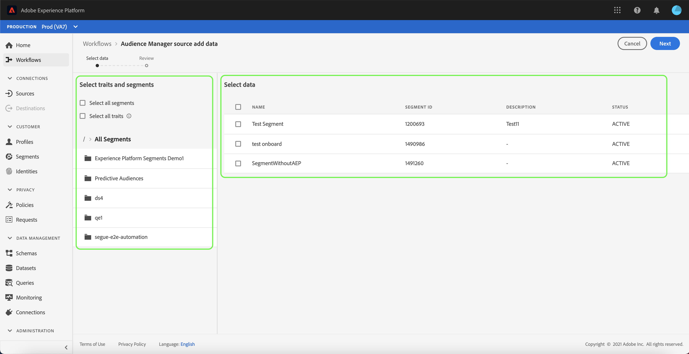
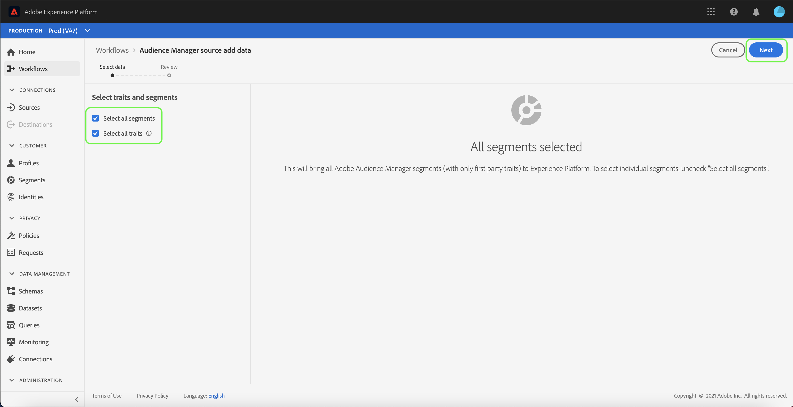

# UI에서 Adobe Audience Manager 소스 연결 만들기

이 자습서에서는 Adobe Audience Manager에서 사용자 인터페이스를 사용하여 Platform으로 소비자 경험 이벤트 데이터를 가져올 수 있는 소스 커넥터를 만드는 단계를 안내합니다.

## Adobe Audience Manager과의 소스 연결 만들기

Platform UI에서 를 선택합니다. **[!UICONTROL 소스]** 을(를) 왼쪽 탐색에서 [!UICONTROL 소스] 작업 영역. 다음 [!UICONTROL 카탈로그] 화면에는 계정을 만들 수 있는 다양한 소스가 표시됩니다.

화면 왼쪽에 있는 카탈로그에서 적절한 카테고리를 선택할 수 있습니다. 또는 검색 창을 사용하여 작업할 특정 소스를 찾을 수 있습니다.

아래 [!UICONTROL Adobe 애플리케이션], 선택 **[!UICONTROL Adobe Audience Manager]** 다음을 선택합니다. **[!UICONTROL 설정]**.

### 트레이트 및 세그먼트 선택

>[!NOTE]
>
>Audience Manager 소스에서 Experience Platform으로 지역 데이터를 수집할 수 없습니다. 지역 데이터가 필요한 Analytics 사용 사례가 있는 경우 [Analytics 소스 커넥터](../adobe-applications/analytics.md).

다음 [!UICONTROL 트레이트 및 세그먼트 선택] 트레이트, 세그먼트 및 데이터를 탐색하고 선택할 수 있는 대화형 인터페이스를 제공하는 단계가 나타납니다.

* 인터페이스의 왼쪽 패널에는 [!UICONTROL 트레이트 및 세그먼트 선택] 사용 가능한 모든 세그먼트의 계층 디렉토리뿐만 아니라 옵션도 제공됩니다.
* 인터페이스의 오른쪽 절반에서는 선택한 세그먼트와 상호 작용하고 사용할 특정 데이터를 선택할 수 있습니다.

사용 가능한 세그먼트를 탐색하려면 다음에서 액세스할 폴더를 선택합니다 [!UICONTROL 모든 세그먼트] 패널. 폴더를 선택하면 폴더의 계층 구조를 통과하고 필터링할 세그먼트 목록을 제공할 수 있습니다.

사용할 세그먼트를 식별하고 선택하면 오른쪽에 새 패널이 나타나고 선택한 항목 목록이 표시됩니다. 계속해서 다른 폴더에 액세스하고 연결에 대해 다른 세그먼트를 선택할 수 있습니다. 더 많은 세그먼트를 선택하면 오른쪽의 패널이 업데이트됩니다.

또는 **[!UICONTROL 모든 세그먼트 선택]** 및 **[!UICONTROL 모든 트레이트 선택]** 상자. 모든 세그먼트를 선택하면 Audience Manager 세그먼트가 플랫폼으로 이동되지만 모든 트레이트를 선택하면 Audience Manager에서 모든 자사 트레이트가 활성화됩니다.

>[!WARNING]
>
>크기 조정 가능한 Audience Manager 세그먼트 모집단의 수집은 Audience Manager 소스를 사용하여 Audience Manager 세그먼트를 처음 플랫폼으로 보낼 때 총 프로필 수에 직접적인 영향을 미칩니다. 즉, 모든 세그먼트를 선택하면 라이선스 사용 권한을 초과하는 프로필 수가 발생할 수 있습니다. 다음을 검토하십시오. [라이선스 사용 수당](../../../../../dashboards/guides/license-usage.md) 계속하기 전에

완료되면 다음을 선택합니다. **[!UICONTROL 다음]**

다음 [!UICONTROL 리뷰] 단계가 나타나므로 선택한 트레이트와 세그먼트를 플랫폼에 연결하기 전에 검토할 수 있습니다. 세부 사항은 다음 범주 내에서 그룹화됩니다.

* **[!UICONTROL 연결]**: 소스 플랫폼과 연결 상태를 표시합니다.
* **[!UICONTROL 선택한 데이터]**: 선택한 세그먼트 수와 활성화된 트레이트를 표시합니다.

데이터 흐름을 검토한 후 다음을 선택합니다 **[!UICONTROL 완료]** 데이터 흐름이 만들어지는 데 시간이 걸릴 수 있습니다.

## 다음 단계

Audience Manager 데이터 흐름이 활성화된 동안에는 들어오는 데이터가 자동으로 실시간 고객 프로필에 수집됩니다. 이제 플랫폼 세분화 서비스를 사용하여 수신 데이터를 활용하고 대상 세그먼트를 만들 수 있습니다. 자세한 내용은 다음 문서를 참조하십시오.

* [실시간 고객 프로필 개요](../../../../../profile/home.md)
* [세그먼테이션 서비스 개요](../../../../../segmentation/home.md)
