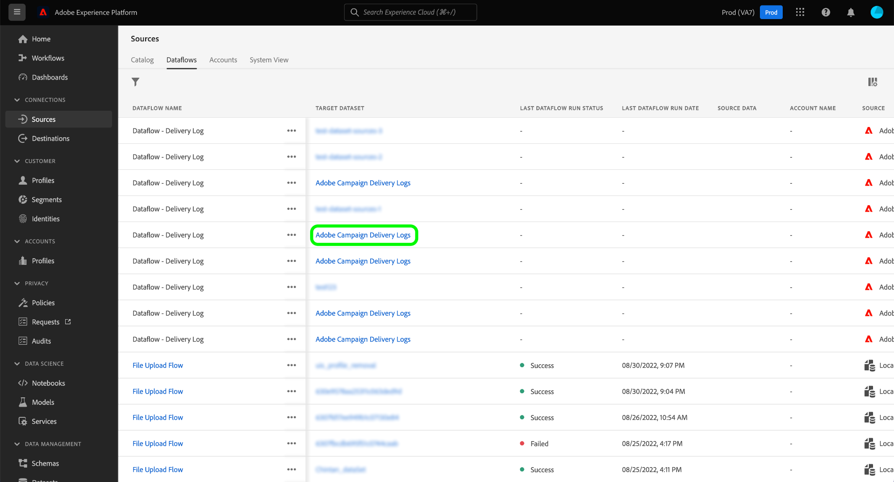

# Platform UI를 사용하여 Adobe Campaign Managed Cloud Services 소스 연결 만들기

이 자습서에서는 Adobe Campaign Managed Cloud Services 데이터를 Adobe Experience Platform으로 가져오기 위한 소스 연결을 만드는 단계를 제공합니다.

## 시작하기

이 안내서에서는 Experience Platform의 다음 구성 요소에 대한 작업 이해를 필요로 합니다.

* [소스](../../../../home.md): 플랫폼을 사용하면 플랫폼 서비스를 사용하여 들어오는 데이터를 구조화, 레이블 지정 및 향상시키는 기능을 제공하면서 다양한 소스에서 데이터를 수집할 수 있습니다.
* [[!DNL Experience Data Model (XDM)] 시스템](../../../../../xdm/home.md): Experience Platform이 고객 경험 데이터를 구성하는 표준화된 프레임워크입니다.
   * [스키마 작성 기본 사항](../../../../../xdm/schema/composition.md): 스키마 컴포지션의 주요 원칙 및 모범 사례를 포함하여 XDM 스키마의 기본 빌딩 블록에 대해 알아봅니다.
   * [스키마 편집기 자습서](../../../../../xdm/tutorials/create-schema-ui.md): 스키마 편집기 UI를 사용하여 사용자 지정 스키마를 만드는 방법을 알아보십시오.
* [샌드박스](../../../../../sandboxes/home.md): 플랫폼은 디지털 경험 애플리케이션을 개발하고 발전시키는 데 도움이 되는 단일 플랫폼 인스턴스를 별도의 가상 환경으로 분할하는 가상 샌드박스를 제공합니다.

## Platform에 Adobe Campaign Managed Cloud Services 연결

플랫폼 UI에서 **[!UICONTROL 소스]** 왼쪽 탐색에서 로 이동하여 [!UICONTROL 소스] 작업 공간. 다음 [!UICONTROL 카탈로그] 화면에는 계정을 만들 수 있는 다양한 소스가 표시됩니다.

화면 왼쪽에 있는 카탈로그에서 적절한 카테고리를 선택할 수 있습니다. 검색 창을 사용하여 표시된 소스 범위를 좁힐 수도 있습니다.

아래에 **[!UICONTROL Adobe 애플리케이션]** 카테고리, 선택 **[!UICONTROL Adobe Campaign Managed Cloud Services]** 그런 다음 **[!UICONTROL 데이터 추가]**.

### 데이터 선택 {#select-data}

>[!CONTEXTUALHELP]
>id="platform_sources_campaign_instance"
>title="Adobe Campaign 환경 인스턴스"
>abstract="사용할 Adobe Campaign 환경의 이름입니다."
>text="Learn more in documentation"

>[!CONTEXTUALHELP]
>id="platform_sources_campaign_mapping"
>title="대상 매핑"
>abstract="타겟 매핑은 메시지를 전달하기 위해 Campaign에서 사용하는 기술 개체이며 게재를 보내는 데 필요한 모든 기술 설정(주소, 전화 번호, 옵트인 지표, 추가 식별자...)을 포함합니다."
>text="Learn more in documentation"

>[!CONTEXTUALHELP]
>id="platform_sources_campaign_schema"
>title="스키마 이름"
>abstract="Adobe Campaign 데이터베이스에 정의된 엔터티의 이름입니다."
>text="Learn more in documentation"

다음 [!UICONTROL 데이터 선택] 단계가 나타나고 구성 인터페이스를 제공합니다. [!UICONTROL Adobe Campaign 인스턴스], [!UICONTROL 대상 매핑], 및 [!UICONTROL 스키마 이름].

| 속성 | 설명 |
| --- | --- |
| Adobe Campaign 인스턴스 | 사용 중인 Adobe Campaign 환경 인스턴스의 이름입니다. |
| 대상 매핑 | Campaign이 메시지를 배달하기 위해 사용하는 기술 개체이며 게재를 보내는 데 필요한 모든 기술 설정을 포함합니다. |
| 스키마 이름 | Platform으로 가져오는 스키마 엔터티의 이름입니다. 옵션에는 게재 로그 및 추적 로그가 포함됩니다. |

Campaign 인스턴스, 대상 매핑 및 스키마 이름에 대한 값을 제공하면 스키마 미리 보기와 샘플 데이터 세트를 표시하도록 화면이 업데이트됩니다. 완료되면 을 선택합니다 **[!UICONTROL 다음]**.

### 기존 데이터 세트 사용

다음 [!UICONTROL 데이터 흐름 세부 정보] 페이지에서 기존 데이터 집합을 사용할지 아니면 데이터 집합에 대한 새 데이터 집합을 구성할지를 선택할 수 있습니다.

기존 데이터 세트를 사용하려면 **[!UICONTROL 기존 데이터 세트]**. 를 사용하여 기존 데이터 세트를 검색할 수 있습니다 [!UICONTROL 고급 검색] 옵션을 선택하거나 드롭다운 메뉴에서 기존 데이터 세트 목록을 스크롤하여 선택합니다.

데이터 세트를 선택하고 데이터 흐름의 이름과 선택적 설명을 제공합니다.

### 새 데이터 세트 사용

새 데이터 세트를 사용하려면 **[!UICONTROL 새 데이터 세트]** 그런 다음 출력 데이터 세트 이름과 선택적 설명을 제공합니다. 다음으로 를 사용하여 매핑할 스키마를 선택합니다 [!UICONTROL 고급 검색] 옵션을 선택하거나 드롭다운 메뉴에서 기존 스키마 목록을 스크롤하여 선택합니다. 완료되면 을 선택합니다 **[!UICONTROL 다음]**.

### 경고 활성화

경고를 활성화하여 데이터 흐름 상태에 대한 알림을 받을 수 있습니다. 목록에서 경고를 선택하여 데이터 흐름 상태에 대한 알림을 구독하고 받습니다. 경고에 대한 자세한 내용은 [UI를 사용하여 소스 경고 구독](../../alerts.md).

데이터 집합에 세부 정보 제공을 마치면 를 선택합니다 **[!UICONTROL 다음]**.

### XDM 스키마에 데이터 필드 매핑

다음 [!UICONTROL 매핑] 소스 스키마의 소스 필드를 대상 스키마의 적절한 대상 XDM 필드에 매핑하는 인터페이스를 제공하는 단계가 나타납니다.

플랫폼은 선택한 대상 스키마나 데이터 세트를 기반으로 자동 매핑 필드에 대한 지능형 권장 사항을 제공합니다. 사용 사례에 맞게 매핑 규칙을 수동으로 조정할 수 있습니다. 필요에 따라 필드를 직접 매핑하거나 데이터 준비 함수를 사용하여 소스 데이터를 변환하여 계산 또는 계산된 값을 도출할 수 있습니다. 매퍼 인터페이스 및 계산된 필드를 사용하는 방법에 대한 포괄적인 단계는 다음을 참조하십시오 [데이터 준비 UI 안내서](../../../../../data-prep/ui/mapping.md).

>[!IMPORTANT]
>
>소스 필드를 대상 XDM 필드에 매핑할 때는 지정된 기본 ID 필드를 해당 대상 XDM 필드에 매핑해야 합니다.

소스 데이터가 매핑되면 을 선택합니다 **[!UICONTROL 다음]**.

### 데이터 흐름 검토

다음 **[!UICONTROL 검토]** 새 데이터 흐름을 만들기 전에 검토할 수 있는 단계가 나타납니다. 세부 사항은 다음 범주 내에 그룹화됩니다.

* **[!UICONTROL 연결]**: 소스 유형, 선택한 소스 파일의 관련 경로 및 해당 소스 파일 내의 열 양을 표시합니다.
* **[!UICONTROL 데이터 세트 및 맵 필드 할당]**: 데이터 세트가 준수하는 스키마를 포함하여 소스 데이터가 수집되는 데이터 세트를 표시합니다.

데이터 흐름을 검토한 후 **[!UICONTROL 완료]** 데이터 흐름을 만들 시간을 허용합니다.

### 데이터 세트 활동 모니터링

데이터 흐름을 만든 후에는 데이터 흐름을 통해 수집 중인 데이터를 모니터링하여 수집된 비율 및 성공적인 배치 및 실패한 배치에 대한 정보를 볼 수 있습니다.

데이터 세트 활동 보기를 시작하려면 다음을 선택합니다 **[!UICONTROL 데이터 흐름]** 소스 카탈로그에 있습니다.

그런 다음 나타나는 데이터 흐름 목록에서 대상 데이터 세트를 선택합니다.

데이터 집합 활동 페이지가 나타납니다. 여기에서 수집 비율, 성공적인 배치 및 실패한 배치 등 데이터 흐름 성능 정보를 볼 수 있습니다.

또한 이 페이지에서는 데이터 흐름의 메타데이터 설명을 업데이트하고, 부분 수집 및 오류 진단을 활성화하고, 데이터 집합에 새 데이터를 추가할 수 있는 인터페이스를 제공합니다.

## 다음 단계

이 자습서를 따라 Campaign v8 게재 로그 및 추적 로그 데이터를 Platform에 가져올 데이터 흐름을 성공적으로 만들었습니다. 이제 와 같은 다운스트림 Platform 서비스에서 들어오는 데이터를 사용할 수 있습니다. [!DNL Real-time Customer Profile] 및 [!DNL Data Science Workspace]. 자세한 내용은 다음 문서를 참조하십시오.

* [[!DNL Real-time Customer Profile] 개요](../../../../../profile/home.md)
* [[!DNL Data Science Workspace] 개요](../../../../../data-science-workspace/home.md)
