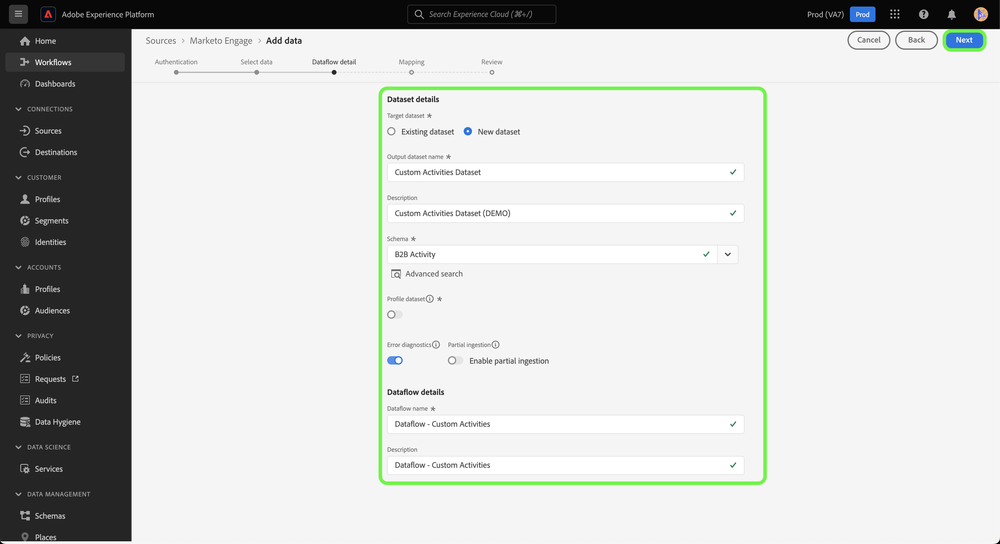
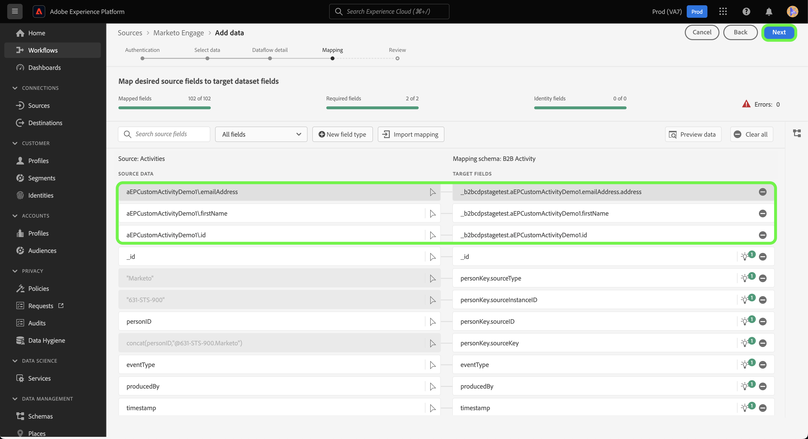

# 만들기 [!DNL Marketo Engage] UI의 사용자 지정 활동 데이터에 대한 소스 연결 및 데이터 흐름

>[!NOTE]
>
>이 자습서에서는 설정 및 가져오기 방법에 대한 특정 단계를 제공합니다 **사용자 지정 활동** 데이터 출처: [!DNL Marketo] Experience Platform. 다음을 가져오는 방법에 대한 단계: **표준 활동** 데이터, 읽기 [[!DNL Marketo] UI 안내서](./marketo.md).

에 더하여 [표준 활동](../../../../connectors/adobe-applications/mapping/marketo.md#activities), 를 사용할 수도 있습니다. [!DNL Marketo] 소스: 사용자 지정 활동 데이터를 Adobe Experience Platform으로 가져옵니다. 이 문서에서는 다음을 사용하여 사용자 지정 활동 데이터에 대한 소스 연결 및 데이터 흐름을 만드는 방법에 대한 단계를 설명합니다. [!DNL Marketo] UI의 소스.

## 시작하기

이 자습서에서는 Adobe Experience Platform의 다음 구성 요소를 이해하고 있어야 합니다.

* [B2B 네임스페이스 및 스키마 자동 생성 유틸리티](../../../../connectors/adobe-applications/marketo/marketo-namespaces.md): B2B 네임스페이스 및 스키마 자동 생성 유틸리티를 사용하여 [!DNL Postman] 을 클릭하여 B2B 네임스페이스 및 스키마에 대한 값을 자동으로 생성합니다. 를 만들기 전에 먼저 B2B 네임스페이스와 스키마를 완료해야 합니다. [!DNL Marketo] 소스 연결 및 데이터 흐름.
* [소스](../../../../home.md): Experience Platform을 사용하면 플랫폼 서비스를 사용하여 들어오는 데이터를 구조화하고, 레이블을 지정하고, 개선할 수 있는 기능을 제공하면서 다양한 소스에서 데이터를 수집할 수 있습니다.
* [경험 데이터 모델(XDM)](../../../../../xdm/home.md): Experience Platform이 고객 경험 데이터를 구성하는 표준화된 프레임워크입니다.
   * [UI에서 스키마 만들기 및 편집](../../../../../xdm/ui/resources/schemas.md): UI에서 스키마를 만들고 편집하는 방법을 알아봅니다.
* [ID 네임스페이스](../../../../../identity-service/namespaces.md): ID 네임스페이스는 의 구성 요소입니다 [!DNL Identity Service] id가 연관되는 컨텍스트의 지표 역할을 합니다. 정규화된 ID에는 ID 값과 네임스페이스가 포함됩니다.
* [[!DNL Real-Time Customer Profile]](/help/profile/home.md): 여러 소스의 집계 데이터를 기반으로 통합 실시간 소비자 프로필을 제공합니다.
* [샌드박스](../../../../../sandboxes/home.md): Experience Platform은 디지털 경험 애플리케이션을 개발하고 발전시키는 데 도움이 되는 단일 플랫폼 인스턴스를 별도의 가상 환경으로 분할하는 가상 샌드박스를 제공합니다.

## 사용자 지정 활동 세부 정보 가져오기

사용자 지정 활동 데이터를 가져올 첫 번째 단계입니다. [!DNL Marketo] Experience Platform은 API 이름과 사용자 지정 활동의 표시 이름을 검색하는 것입니다.

다음을 사용하여 계정에 로그인 [[!DNL Marketo]](https://app-sjint.marketo.com/#MM0A1) 인터페이스. 왼쪽 탐색에서 [!DNL Database Management], 선택 **Marketo 사용자 지정 활동**.

인터페이스는 해당 표시 이름 및 API 이름에 대한 정보를 포함하여 사용자 지정 활동의 표시로 업데이트됩니다. 오른쪽 레일을 사용하여 계정에서 다른 사용자 지정 활동을 선택하고 볼 수도 있습니다.


선택 **필드** 을 클릭하여 사용자 지정 활동과 연관된 필드를 맨 위 헤더에서 볼 수 있습니다. 이 페이지에서는 사용자 지정 활동에 있는 필드의 이름, API 이름, 설명 및 데이터 유형을 볼 수 있습니다. 개별 필드에 대한 세부 정보는 스키마를 생성할 때 이후 단계에서 사용됩니다.


## B2B 활동 스키마에서 사용자 지정 활동에 대한 필드 그룹 설정

다음에서 *[!UICONTROL 스키마]* Experience Platform UI의 대시보드에서 다음을 선택합니다. **[!UICONTROL 찾아보기]** 다음을 선택합니다. **[!UICONTROL B2B 활동]** 스키마 목록에서 제외합니다.

>[!TIP]
>
>검색 창을 사용하여 스키마 목록을 빠르게 탐색할 수 있습니다.


### 사용자 지정 활동에 대한 새 필드 그룹 만들기

그런 다음 새 필드 그룹을 [!DNL B2B Activity] 스키마. 이 필드 그룹은 수집하려는 사용자 정의 활동에 해당해야 하며 이전에 검색한 사용자 정의 활동의 표시 이름을 사용해야 합니다.

새 필드 그룹을 추가하려면 **[!UICONTROL + 추가]** 의 옆에 *[!UICONTROL 필드 그룹]* 패널 아래 *[!UICONTROL 컴포지션]*.


다음 *[!UICONTROL 필드 그룹 추가]* 창이 나타납니다. 선택 **[!UICONTROL 새 필드 그룹 만들기]** 그런 다음 이전 단계에서 검색한 사용자 지정 활동에 대해 동일한 표시 이름을 제공하고 새 필드 그룹에 대한 선택적 설명을 제공합니다. 완료되면 다음을 선택합니다. **[!UICONTROL 필드 그룹 추가]**.


사용자 지정 활동에 대한 새 필드 그룹이 생성되면에 표시됩니다. [!UICONTROL 필드 그룹] 카탈로그.


### 스키마 구조에 새 필드 추가

그런 다음 스키마에 새 필드를 추가합니다. 이 새 필드는 (으)로 설정해야 합니다. `type: object` 및 에는 사용자 지정 활동의 개별 필드가 포함됩니다.

새 필드를 추가하려면 더하기 기호(`+`)을 클릭하여 제품에서 사용할 수 있습니다. 다음에 대한 항목: *[!UICONTROL 제목 없는 필드 | 유형]* 가 표시됩니다. 다음으로, 를 사용하여 필드의 속성을 구성합니다. *[!UICONTROL 필드 속성]* 패널. 필드 이름을 사용자 지정 활동의 API 이름으로 설정하고 표시 이름을 사용자 지정 활동의 표시 이름으로 설정합니다. 그런 다음 유형을 로 설정합니다. `object` 이전 단계에서 생성한 사용자 정의 활동 필드 그룹에 필드 그룹을 할당합니다. 완료되면 다음을 선택합니다. **[!UICONTROL 적용]**.


스키마에 새 필드가 나타납니다.


### 오브젝트 필드에 하위 필드 추가 {#add-sub-fields-to-the-object-field}

스키마를 준비하는 마지막 단계는 이전 단계에서 만든 필드 내에 개별 필드를 추가하는 것입니다.


## 데이터 흐름 만들기

스키마 설정이 완료되면 이제 사용자 지정 활동 데이터에 대한 데이터 흐름을 만들 수 있습니다.

Platform UI에서 를 선택합니다. **[!UICONTROL 소스]** 왼쪽 탐색 모음에서 다음 위치에 액세스: [!UICONTROL 소스] 작업 영역. 다음 [!UICONTROL 카탈로그] 화면에는 계정을 만들 수 있는 다양한 소스가 표시됩니다.

화면 왼쪽에 있는 카탈로그에서 적절한 카테고리를 선택할 수 있습니다. 또는 검색 창을 사용하여 작업할 특정 소스를 찾을 수 있습니다.

아래 [!UICONTROL Adobe 애플리케이션] 범주, 선택 **[!UICONTROL Marketo Engage]**. 그런 다음 을 선택합니다. **[!UICONTROL 데이터 추가]** 새로 만들려면 [!DNL Marketo] 데이터 흐름.


### 데이터 선택

선택 **[!UICONTROL 활동]** 목록에서 [!DNL Marketo] 데이터 세트를 선택한 다음 **[!UICONTROL 다음]**.


### 데이터 흐름 세부 정보

다음, [데이터 흐름에 대한 정보 제공](./marketo.md#provide-dataflow-details), 데이터 세트 및 데이터 흐름에 대한 이름 및 설명, 사용할 스키마 및 구성 포함 [!DNL Profile] 수집, 오류 진단 및 부분 수집



### 매핑

표준 활동 필드에 대한 매핑은 자동으로 채워지지만 사용자 지정 활동 필드는 해당 대상 필드에 수동으로 매핑해야 합니다.

사용자 정의 활동 필드 매핑을 시작하려면 다음을 선택합니다. **[!UICONTROL 새 필드 유형]** 다음을 선택합니다. **[!UICONTROL 새 필드 추가]**.


소스 데이터 구조를 탐색하고 수집할 사용자 지정 활동 필드를 찾습니다. 완료되면 다음을 선택합니다. **[!UICONTROL 선택]**.

>[!TIP]
>
>혼동을 방지하고 중복 필드 이름을 처리하기 위해 사용자 지정 활동 필드 앞에 API 이름이 붙습니다.


대상 필드를 추가하려면 스키마 아이콘을 선택합니다  그런 다음 대상 스키마에서 사용자 지정 활동 필드를 선택합니다.


단계를 반복하여 사용자 지정 활동 매핑 필드의 나머지 부분을 추가합니다. 완료되면 다음을 선택합니다. **[!UICONTROL 다음]**.



### 검토

다음 *[!UICONTROL 리뷰]* 새 데이터 흐름을 만들기 전에 검토할 수 있는 단계가 나타납니다. 세부 사항은 다음 범주 내에서 그룹화됩니다.

* **[!UICONTROL 연결]**: 소스 유형, 선택한 소스 엔티티의 관련 경로 및 해당 소스 엔티티 내의 열 양을 표시합니다.
* **[!UICONTROL 데이터 세트 할당 및 필드 매핑]**: 데이터 세트가 준수하는 스키마를 포함하여 소스 데이터가 수집되는 데이터 세트를 표시합니다.

데이터 흐름을 검토한 후 다음을 선택합니다 **[!UICONTROL 저장 및 수집]** 데이터 흐름이 만들어지는 데 시간이 걸릴 수 있습니다.


### 기존 활동 데이터 흐름에 사용자 지정 활동 추가 {#add-to-existing-dataflows}

기존 데이터 흐름에 사용자 지정 활동 데이터를 추가하려면 기존 활동 데이터 흐름과 수집하려는 사용자 지정 활동 데이터의 매핑을 수정합니다. 이렇게 하면 사용자 지정 활동을 동일한 기존 활동 데이터 세트에 수집할 수 있습니다. 기존 데이터 흐름의 매핑을 업데이트하는 방법에 대한 자세한 내용은 의 안내서를 참조하십시오 [UI에서 데이터 흐름 업데이트](../../update-dataflows.md).

### 사용 [!DNL Query Service] 사용자 지정 활동에 대한 활동을 필터링하려면 {#query-service-filter}

데이터 흐름이 완료되면 다음을 사용할 수 있습니다. [쿼리 서비스](../../../../../query-service/home.md) 을 클릭하여 사용자 지정 활동 데이터에 대한 활동을 필터링할 수 있습니다.

사용자 지정 활동이 Platform으로 수집되면 사용자 지정 활동의 API 이름이 자동으로 이 됩니다 `eventType`. 사용 `eventType={API_NAME}` 사용자 지정 활동 데이터를 필터링합니다.

```sql
SELECT * FROM with_custom_activities_ds_today WHERE eventType='aepCustomActivityDemo1' 
```

사용 `IN` 여러 사용자 지정 활동을 필터링할 절:

```sql
SELECT * FROM $datasetName WHERE eventType='{API_NAME}'
SELECT * FROM $datasetName WHERE eventType IN ('aepCustomActivityDemo1', 'aepCustomActivityDemo2')
```

아래 그림에서는 [쿼리 편집기](../../../../../query-service/ui/user-guide.md) 사용자 지정 활동 데이터를 필터링합니다.


## 다음 단계

이 자습서에 따라 용 플랫폼 스키마를 설정했습니다. [!DNL Marketo] 사용자 지정 활동 데이터를 만들고 해당 데이터를 플랫폼으로 가져오는 데이터 흐름을 만들었습니다. 에 대한 일반적인 정보 [!DNL Marketo] 소스, 읽기 [[!DNL Marketo] 소스 개요](../../../../connectors/adobe-applications/marketo/marketo.md).