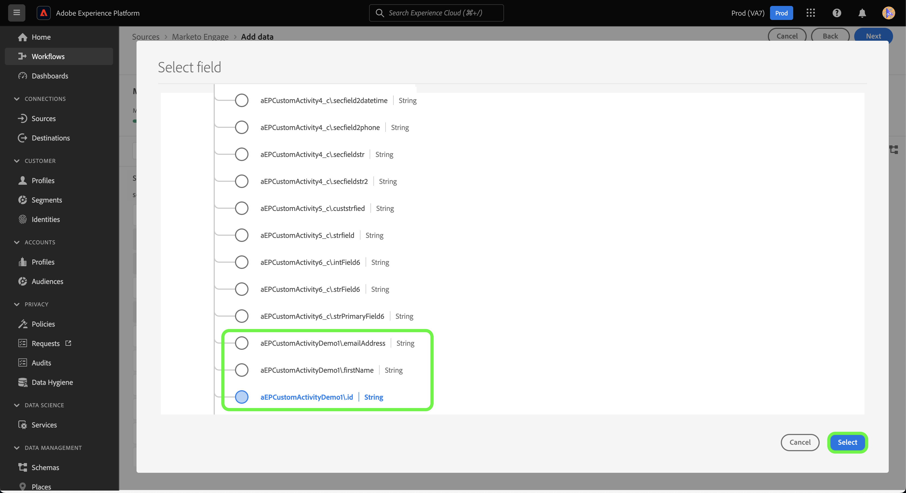

# UI에서 사용자 지정 활동 데이터에 대한 [!DNL Marketo Engage] 소스 연결 및 데이터 흐름을 만듭니다.

>[!NOTE]
>
>이 자습서에서는 [!DNL Marketo]에서 **사용자 지정 활동** 데이터를 설정하고 Experience Platform 상태로 만드는 방법에 대한 특정 단계를 제공합니다. **표준 활동** 데이터를 가져오는 방법에 대한 단계는 [[!DNL Marketo] UI 안내서](./marketo.md)를 참조하십시오.

[표준 활동](../../../../connectors/adobe-applications/mapping/marketo.md#activities) 외에 [!DNL Marketo] 소스를 사용하여 사용자 지정 활동 데이터를 Adobe Experience Platform으로 가져올 수도 있습니다. 이 문서에서는 UI에서 [!DNL Marketo] 소스를 사용하여 사용자 지정 활동 데이터에 대한 소스 연결 및 데이터 흐름을 만드는 방법에 대한 단계를 제공합니다.

## 시작하기

이 자습서에서는 Adobe Experience Platform의 다음 구성 요소를 이해하고 있어야 합니다.

* [B2B 네임스페이스 및 스키마 자동 생성 유틸리티](../../../../connectors/adobe-applications/marketo/marketo-namespaces.md): B2B 네임스페이스 및 스키마 자동 생성 유틸리티를 사용하면 [!DNL Postman]을(를) 사용하여 B2B 네임스페이스 및 스키마에 대한 값을 자동 생성할 수 있습니다. [!DNL Marketo] 원본 연결 및 데이터 흐름을 만들기 전에 먼저 B2B 네임스페이스와 스키마를 완료해야 합니다.
* [소스](../../../../home.md): Experience Platform을 사용하면 플랫폼 서비스를 사용하여 들어오는 데이터를 구조화하고 레이블을 지정하고 개선하는 기능을 제공하는 동시에 다양한 소스에서 데이터를 수집할 수 있습니다.
* [XDM(경험 데이터 모델)](../../../../../xdm/home.md): Experience Platform이 고객 경험 데이터를 구성하는 표준화된 프레임워크입니다.
   * [UI에서 스키마를 만들고 편집](../../../../../xdm/ui/resources/schemas.md): UI에서 스키마를 만들고 편집하는 방법에 대해 알아봅니다.
* [ID 네임스페이스](../../../../../identity-service/features/namespaces.md): ID 네임스페이스는 [!DNL Identity Service]의 구성 요소이며 ID와 관련된 컨텍스트의 지표 역할을 합니다. 정규화된 ID에는 ID 값과 네임스페이스가 포함됩니다.
* [[!DNL Real-Time Customer Profile]](/help/profile/home.md): 여러 원본의 집계된 데이터를 기반으로 통합된 실시간 소비자 프로필을 제공합니다.
* [샌드박스](../../../../../sandboxes/home.md): Experience Platform은 단일 플랫폼 인스턴스를 별도의 가상 환경으로 분할하여 디지털 경험 애플리케이션을 개발하고 발전시키는 데 도움이 되는 가상 샌드박스를 제공합니다.

## 사용자 지정 활동 세부 정보 가져오기

[!DNL Marketo]에서 Experience Platform으로 사용자 지정 활동 데이터를 가져오는 첫 번째 단계는 사용자 지정 활동의 API 이름 및 표시 이름을 검색하는 것입니다.

[[!DNL Marketo]](https://app-sjint.marketo.com/#MM0A1) 인터페이스를 사용하여 계정에 로그인합니다. 왼쪽 탐색의 [!DNL Database Management]에서 **Marketo 사용자 지정 활동**&#x200B;을 선택합니다.

인터페이스는 해당 표시 이름 및 API 이름에 대한 정보를 포함하여 사용자 지정 활동의 표시로 업데이트됩니다. 오른쪽 레일을 사용하여 계정에서 다른 사용자 지정 활동을 선택하고 볼 수도 있습니다.


사용자 지정 활동과 연결된 필드를 보려면 상단 헤더에서 **필드**&#x200B;을(를) 선택하십시오. 이 페이지에서는 사용자 지정 활동에 있는 필드의 이름, API 이름, 설명 및 데이터 유형을 볼 수 있습니다. 개별 필드에 대한 세부 정보는 스키마를 생성할 때 이후 단계에서 사용됩니다.


## B2B 활동 스키마에서 사용자 지정 활동에 대한 필드 그룹 설정

Experience Platform UI의 *[!UICONTROL 스키마]* 대시보드에서 **[!UICONTROL 찾아보기]**&#x200B;를 선택한 다음 스키마 목록에서 **[!UICONTROL B2B 활동]**&#x200B;을 선택합니다.

>[!TIP]
>
>검색 창을 사용하여 스키마 목록을 빠르게 탐색할 수 있습니다.


### 사용자 지정 활동에 대한 새 필드 그룹 만들기

[!DNL B2B Activity] 스키마에 새 필드 그룹을 추가합니다. 이 필드 그룹은 수집하려는 사용자 정의 활동에 해당해야 하며 이전에 검색한 사용자 정의 활동의 표시 이름을 사용해야 합니다.

새 필드 그룹을 추가하려면 *[!UICONTROL 컴포지션]* 아래의 *[!UICONTROL 필드 그룹]* 패널 옆의 **[!UICONTROL + 추가]**&#x200B;를 선택하십시오.


*[!UICONTROL 필드 그룹 추가]* 창이 나타납니다. **[!UICONTROL 새 필드 그룹 만들기]**&#x200B;를 선택한 다음 이전 단계에서 검색한 사용자 지정 활동에 대해 동일한 표시 이름을 제공하고 새 필드 그룹에 대한 선택적 설명을 제공합니다. 완료되면 **[!UICONTROL 필드 그룹 추가]**&#x200B;를 선택합니다.


만든 후에는 사용자 지정 활동에 대한 새 필드 그룹이 [!UICONTROL 필드 그룹] 카탈로그에 표시됩니다.


### 스키마 구조에 새 필드 추가

그런 다음 스키마에 새 필드를 추가합니다. 이 새 필드는 `type: object`(으)로 설정해야 하며 사용자 지정 활동의 개별 필드를 포함합니다.

새 필드를 추가하려면 스키마 이름 옆에 있는 더하기 기호(`+`)를 선택하십시오. *[!UICONTROL 제목 없는 필드에 대한 항목 | 유형]*&#x200B;이(가) 나타납니다. 그런 다음 *[!UICONTROL 필드 속성]* 패널을 사용하여 필드의 속성을 구성합니다. 필드 이름을 사용자 지정 활동의 API 이름으로 설정하고 표시 이름을 사용자 지정 활동의 표시 이름으로 설정합니다. 그런 다음 형식을 `object`(으)로 설정하고 필드 그룹을 이전 단계에서 만든 사용자 지정 활동 필드 그룹에 할당합니다. 완료되면 **[!UICONTROL 적용]**&#x200B;을 선택합니다.


스키마에 새 필드가 나타납니다.


### 오브젝트 필드에 하위 필드 추가 {#add-sub-fields-to-the-object-field}

스키마를 준비하는 마지막 단계는 이전 단계에서 만든 필드 내에 개별 필드를 추가하는 것입니다.


## 데이터 흐름 만들기

스키마 설정이 완료되면 이제 사용자 지정 활동 데이터에 대한 데이터 흐름을 만들 수 있습니다.

Platform UI의 왼쪽 탐색 막대에서 **[!UICONTROL 소스]**&#x200B;를 선택하여 [!UICONTROL 소스] 작업 영역에 액세스합니다. [!UICONTROL 카탈로그] 화면에 계정을 만들 수 있는 다양한 소스가 표시됩니다.

화면 왼쪽에 있는 카탈로그에서 적절한 카테고리를 선택할 수 있습니다. 또는 검색 창을 사용하여 작업할 특정 소스를 찾을 수 있습니다.

[!UICONTROL Adobe 응용 프로그램] 범주 아래에서 **[!UICONTROL Marketo Engage]**&#x200B;을 선택합니다. 그런 다음 **[!UICONTROL 데이터 추가]**&#x200B;를 선택하여 새 [!DNL Marketo] 데이터 흐름을 만듭니다.


### 데이터 선택

[!DNL Marketo] 데이터 세트 목록에서 **[!UICONTROL 활동]**&#x200B;을 선택한 후 **[!UICONTROL 다음]**&#x200B;을 선택합니다.


### 데이터 흐름 세부 정보

다음으로, [데이터 흐름의 이름과 설명, 사용할 스키마, [!DNL Profile] 수집, 오류 진단 및 부분 수집에 대한 구성을 포함하여 데이터 흐름에 대한 정보를 제공합니다](./marketo.md#provide-dataflow-details).


### 매핑

표준 활동 필드에 대한 매핑은 자동으로 채워지지만 사용자 지정 활동 필드는 해당 대상 필드에 수동으로 매핑해야 합니다.

사용자 지정 활동 필드 매핑을 시작하려면 **[!UICONTROL 새 필드 유형]**&#x200B;을 선택한 다음 **[!UICONTROL 새 필드 추가]**&#x200B;를 선택하십시오.


소스 데이터 구조를 탐색하고 수집할 사용자 지정 활동 필드를 찾습니다. 완료되면 **[!UICONTROL 선택]**&#x200B;을 선택합니다.

>[!TIP]
>
>혼동을 방지하고 중복 필드 이름을 처리하기 위해 사용자 지정 활동 필드 앞에 API 이름이 붙습니다.



대상 필드를 추가하려면 스키마 아이콘 을 선택한 다음 대상 스키마에서 사용자 지정 활동 필드를 선택하십시오.


단계를 반복하여 사용자 지정 활동 매핑 필드의 나머지 부분을 추가합니다. 완료되면 **[!UICONTROL 다음]**&#x200B;을 선택합니다.


### 검토

새 데이터 흐름을 만들기 전에 검토할 수 있는 *[!UICONTROL 검토]* 단계가 나타납니다. 세부 사항은 다음 범주 내에서 그룹화됩니다.

* **[!UICONTROL 연결]**: 원본 형식, 선택한 원본 엔터티의 관련 경로 및 해당 원본 엔터티 내 열의 양을 표시합니다.
* **[!UICONTROL 데이터 집합 및 맵 필드 할당]**: 데이터 집합이 준수하는 스키마를 포함하여 소스 데이터가 수집되는 데이터 집합을 표시합니다.

데이터 흐름을 검토한 후 **[!UICONTROL 저장 및 수집]**&#x200B;을 선택하고 데이터 흐름이 생성될 수 있도록 잠시 기다립니다.


### 기존 활동 데이터 흐름에 사용자 지정 활동 추가 {#add-to-existing-dataflows}

기존 데이터 흐름에 사용자 지정 활동 데이터를 추가하려면 기존 활동 데이터 흐름과 수집하려는 사용자 지정 활동 데이터의 매핑을 수정합니다. 이렇게 하면 사용자 지정 활동을 동일한 기존 활동 데이터 세트에 수집할 수 있습니다. 기존 데이터 흐름의 매핑을 업데이트하는 방법에 대한 자세한 내용은 [UI에서 데이터 흐름 업데이트](../../update-dataflows.md)에 대한 안내서를 참조하십시오.

### [!DNL Query Service]을(를) 사용하여 사용자 지정 활동에 대한 활동을 필터링하세요. {#query-service-filter}

데이터 흐름이 완료되면 [쿼리 서비스](../../../../../query-service/home.md)를 사용하여 사용자 지정 활동 데이터에 대한 활동을 필터링할 수 있습니다.

사용자 지정 활동을 플랫폼으로 수집하면 사용자 지정 활동의 API 이름이 자동으로 해당 `eventType`이(가) 됩니다. `eventType={API_NAME}`을(를) 사용하여 사용자 지정 활동 데이터를 필터링합니다.

```sql
SELECT * FROM with_custom_activities_ds_today WHERE eventType='aepCustomActivityDemo1' 
```

`IN` 절을 사용하여 여러 사용자 지정 활동을 필터링합니다.

```sql
SELECT * FROM $datasetName WHERE eventType='{API_NAME}'
SELECT * FROM $datasetName WHERE eventType IN ('aepCustomActivityDemo1', 'aepCustomActivityDemo2')
```

아래 이미지는 사용자 지정 활동 데이터를 필터링하는 [쿼리 편집기](../../../../../query-service/ui/user-guide.md)의 예제 SQL 문을 보여 줍니다.


## 다음 단계

이 자습서에 따라 [!DNL Marketo] 사용자 지정 활동 데이터에 대한 플랫폼 스키마를 설정하고 해당 데이터를 플랫폼으로 가져오기 위한 데이터 흐름을 만들었습니다. [!DNL Marketo] 원본에 대한 일반 정보는 [[!DNL Marketo] 원본 개요](../../../../connectors/adobe-applications/marketo/marketo.md)를 참조하세요.
