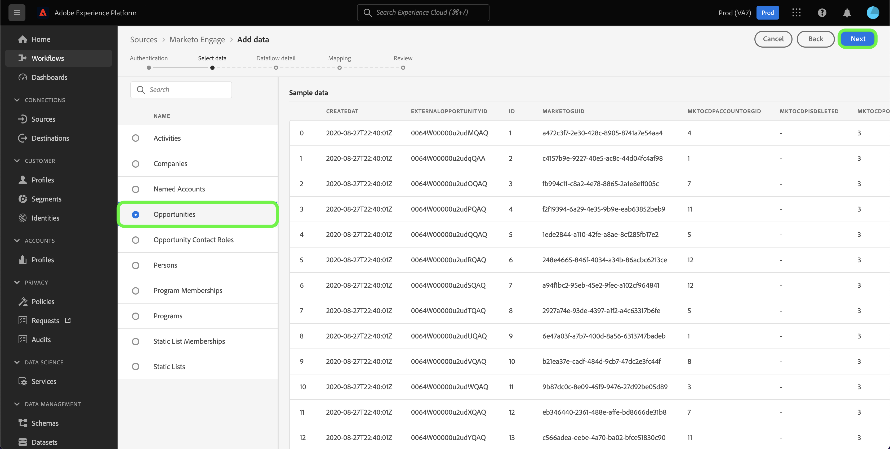
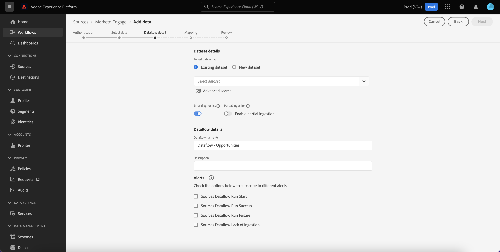
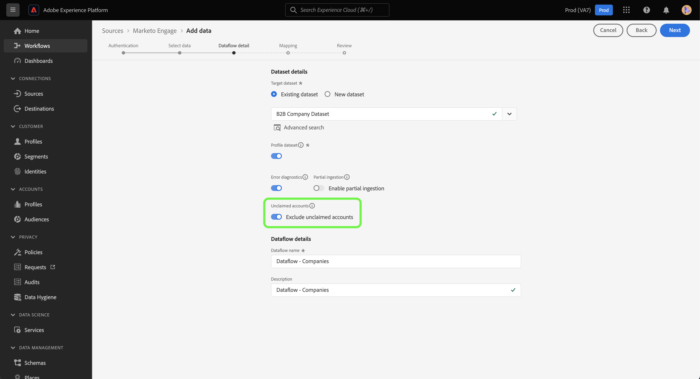

# 만들기 [!DNL Marketo Engage] ui의 소스 연결 및 데이터 흐름

>[!IMPORTANT]
>
>만들기 전 [!DNL Marketo Engage] 소스 연결 및 데이터 흐름의 유효성을 검사하려면 [Adobe 조직 ID를 매핑했습니다.](https://experienceleague.adobe.com/docs/marketo/using/product-docs/core-marketo-concepts/miscellaneous/set-up-adobe-organization-mapping.html?lang=en) 위치: [!DNL Marketo]. 또한 을 완료했는지 확인해야 합니다 [자동 채우기 [!DNL Marketo] B2B 네임스페이스 및 스키마](../../../../connectors/adobe-applications/marketo/marketo-namespaces.md) 소스 연결 및 데이터 흐름을 만들기 전에

이 자습서에서는 다음을 만드는 단계를 제공합니다 [!DNL Marketo Engage] (이하 &quot;라고 한다)[!DNL Marketo]&quot;) UI의 소스 커넥터 를 사용하여 B2B 데이터를 Adobe Experience Platform으로 가져옵니다.

## 시작하기

이 자습서에서는 Adobe Experience Platform의 다음 구성 요소를 이해하고 있어야 합니다.

* [B2B 네임스페이스 및 스키마 자동 생성 유틸리티](../../../../connectors/adobe-applications/marketo/marketo-namespaces.md): B2B 네임스페이스 및 스키마 자동 생성 유틸리티를 사용하여 [!DNL Postman] 을 클릭하여 B2B 네임스페이스 및 스키마에 대한 값을 자동으로 생성합니다. 를 만들기 전에 먼저 B2B 네임스페이스와 스키마를 완료해야 합니다. [!DNL Marketo] 소스 연결 및 데이터 흐름.
* [소스](../../../../home.md): Experience Platform을 사용하면 플랫폼 서비스를 사용하여 들어오는 데이터를 구조화하고, 레이블을 지정하고, 개선할 수 있는 기능을 제공하면서 다양한 소스에서 데이터를 수집할 수 있습니다.
* [경험 데이터 모델(XDM)](../../../../../xdm/home.md): Experience Platform이 고객 경험 데이터를 구성하는 표준화된 프레임워크입니다.
   * [UI에서 스키마 만들기 및 편집](../../../../../xdm/ui/resources/schemas.md): UI에서 스키마를 만들고 편집하는 방법을 알아봅니다.
* [ID 네임스페이스](../../../../../identity-service/namespaces.md): ID 네임스페이스는 의 구성 요소입니다 [!DNL Identity Service] id가 연관되는 컨텍스트의 지표 역할을 합니다. 정규화된 ID에는 ID 값과 네임스페이스가 포함됩니다.
* [[!DNL Real-Time Customer Profile]](/help/profile/home.md): 여러 소스의 집계 데이터를 기반으로 통합 실시간 소비자 프로필을 제공합니다.
* [샌드박스](../../../../../sandboxes/home.md): Experience Platform은 디지털 경험 애플리케이션을 개발하고 발전시키는 데 도움이 되는 단일 플랫폼 인스턴스를 별도의 가상 환경으로 분할하는 가상 샌드박스를 제공합니다.

### 필요한 자격 증명 수집

에 액세스하려면 [!DNL Marketo] 플랫폼의 계정에서 다음 값을 제공해야 합니다.

| 자격 증명 | 설명 |
| ---------- | ----------- |
| `munchkinId` | Munchkin ID는 특정 사용자에 대한 고유 식별자입니다 [!DNL Marketo] 인스턴스. |
| `clientId` | 에 대한 고유 클라이언트 ID [!DNL Marketo] 인스턴스. |
| `clientSecret` | 에 대한 고유한 클라이언트 암호 [!DNL Marketo] 인스턴스. |

이러한 값을 가져오는 방법에 대한 자세한 내용은 [[!DNL Marketo] 인증 안내서](../../../../connectors/adobe-applications/marketo/marketo-auth.md).

필요한 자격 증명을 수집했으면 다음 섹션의 단계를 따를 수 있습니다.

## 연결 [!DNL Marketo] account

Platform UI에서 를 선택합니다. **[!UICONTROL 소스]** 왼쪽 탐색 모음에서 다음 위치에 액세스: [!UICONTROL 소스] 작업 영역. 다음 [!UICONTROL 카탈로그] 화면에는 계정을 만들 수 있는 다양한 소스가 표시됩니다.

화면 왼쪽에 있는 카탈로그에서 적절한 카테고리를 선택할 수 있습니다. 또는 검색 창을 사용하여 작업할 특정 소스를 찾을 수 있습니다.

아래 [!UICONTROL Adobe 애플리케이션] 범주, 선택 **[!UICONTROL Marketo Engage]**. 그런 다음 을 선택합니다. **[!UICONTROL 데이터 추가]** 새로 만들려면 [!DNL Marketo] 데이터 흐름.

다음 **[!UICONTROL Marketo Engage 계정 연결]** 페이지가 나타납니다. 이 페이지에서 새 계정을 사용하거나 기존 계정에 액세스할 수 있습니다.

### 기존 계정

기존 계정으로 데이터 흐름을 만들려면 다음을 선택합니다. **[!UICONTROL 기존 계정]** 을(를) 선택한 다음 [!DNL Marketo] 사용할 계정입니다. 선택 **[!UICONTROL 다음]** 계속합니다.

### 새 계정

새 계정을 만드는 경우 다음을 선택합니다 **[!UICONTROL 새 계정]**. 표시되는 입력 양식에서 계정 이름, 설명(선택 사항) 및 [!DNL Marketo] 인증 자격 증명입니다. 완료되면 다음을 선택합니다. **[!UICONTROL 소스에 연결]** 그런 다음 새 연결을 설정하는 데 시간이 걸릴 수 있습니다.

## 데이터 세트 선택

을(를) 만든 후 [!DNL Marketo] 계정, 다음 단계는 탐색할 인터페이스를 제공합니다. [!DNL Marketo] 데이터 세트.

인터페이스의 왼쪽 절반은 10을 표시하는 디렉토리 브라우저입니다. [!DNL Marketo] 데이터 세트. 완전히 기능하는 [!DNL Marketo] 소스 연결에는 9개의 서로 다른 데이터 세트를 수집해야 합니다. 또한 을 사용하는 경우 [!DNL Marketo] 계정 기반 마케팅(ABM) 기능을 사용하면 다음을 수집할 10번째 데이터 흐름도 만들어야 합니다. [!UICONTROL 명명된 계정] 데이터 세트.

>[!NOTE]
>
>간결성을 위해 다음 자습서에서는 를 사용합니다 [!UICONTROL 영업 기회] 예를 들어, 아래에 설명된 단계는 다음 10개 중 하나에 적용됩니다. [!DNL Marketo] 데이터 세트.

먼저 수집하려는 데이터 세트를 선택한 다음 를 선택합니다 **[!UICONTROL 다음]**.

## 데이터 흐름 세부 정보 제공 {#provide-dataflow-details}

다음 [!UICONTROL 데이터 흐름 세부 정보] 페이지에서는 기존 데이터 세트를 사용할지 또는 새 데이터 세트를 사용할지 선택할 수 있습니다. 이 프로세스 도중에에 대한 설정을 구성할 수도 있습니다. [!UICONTROL 프로필 데이터 세트], [!UICONTROL 오류 진단], [!UICONTROL 부분 수집], 및 [!UICONTROL 경고].

>[!BEGINTABS]

>[!TAB 기존 데이터 세트 사용]

기존 데이터 세트에 데이터를 수집하려면 다음을 선택합니다. **[!UICONTROL 기존 데이터 세트]**. 다음을 사용하여 기존 데이터 세트를 검색할 수 있습니다. [!UICONTROL 고급 검색] 또는 드롭다운 메뉴에서 기존 데이터 세트 목록을 스크롤하여 옵션을 선택할 수 있습니다. 데이터 세트를 선택한 후에는 데이터 흐름의 이름과 설명을 입력합니다.

>[!TAB 새 데이터 세트 사용]

새 데이터 세트로 수집하려면 다음을 선택합니다. **[!UICONTROL 새 데이터 세트]** 그런 다음 출력 데이터 세트 이름과 선택적 설명을 제공합니다. 그런 다음 를 사용하여 매핑할 스키마를 선택합니다 [!UICONTROL 고급 검색] 또는 드롭다운 메뉴에서 기존 스키마 목록을 스크롤하여 선택합니다. 스키마를 선택하면 데이터 흐름의 이름과 설명을 입력합니다.

>[!ENDTABS]

### 사용 [!DNL Profile] 및 오류 진단

그런 다음 **[!UICONTROL 프로필 데이터 세트]** 에 대한 데이터 세트를 활성화하려면 전환 [!DNL Profile]. 이를 통해 엔티티의 속성 및 동작을 전체적으로 볼 수 있습니다. 모든 데이터 [!DNL Profile]-enabled 데이터 세트는에 포함됩니다. [!DNL Profile] 및 변경 사항은 데이터 흐름을 저장할 때 적용됩니다.

[!UICONTROL 오류 진단] 에서는 데이터 흐름에서 발생하는 모든 잘못된 레코드에 대해 자세한 오류 메시지를 생성할 수 있습니다. [!UICONTROL 부분 수집] 을 사용하면 수동으로 정의하는 특정 임계값까지, 오류가 포함된 데이터를 수집할 수 있습니다. 다음을 참조하십시오. [부분 일괄 처리 수집 개요](../../../../../ingestion/batch-ingestion/partial.md) 추가 정보.

>[!IMPORTANT]
>
>다음 [!DNL Marketo] 소스는 일괄 처리 수집을 사용하여 모든 기록 레코드를 수집하고 실시간 업데이트를 위해 스트리밍 수집을 사용합니다. 이렇게 하면 잘못된 레코드를 수집하는 동안 소스에서 스트리밍을 계속할 수 있습니다. 활성화 **[!UICONTROL 부분 수집]** 전환 후 설정 [!UICONTROL 오류 임계값 %] 데이터 흐름이 실패하는 것을 방지하기 위해 최대로 설정합니다.

### 경고 활성화

경고를 활성화하여 데이터 흐름 상태에 대한 알림을 받을 수 있습니다. 목록에서 경고를 선택하여 데이터 흐름 상태에 대한 알림을 수신합니다. 경고에 대한 자세한 내용은 다음 안내서를 참조하십시오. [ui를 사용하여 소스 경고에 구독](../../alerts.md).

데이터 흐름에 세부 정보를 제공했으면 을 선택합니다. **[!UICONTROL 다음]**.

### 회사 데이터를 수집할 때 미청구 계정 건너뛰기

회사 데이터 세트에서 데이터를 수집하기 위한 데이터 흐름을 만들 때 다음을 구성할 수 있습니다. [!UICONTROL 미청구 계정 제외] 수집에서 미청구 계정을 제외하거나 포함합니다.

개인이 작성하시면, [!DNL Marketo] 다른 데이터가 포함되지 않은 회사 이름을 기반으로 팬텀 계정 레코드를 생성합니다. 새 데이터 흐름의 경우 미청구 계정을 제외하기 위한 토글이 기본적으로 활성화됩니다. 기존 데이터 흐름의 경우 기존 데이터가 아닌 새로 수집된 데이터에 변경 사항이 적용되도록 기능을 활성화하거나 비활성화할 수 있습니다.

## 매핑 [!DNL Marketo] 타겟 XDM 필드에 대한 데이터 세트 소스 필드

다음 [!UICONTROL 매핑] 소스 스키마의 소스 필드를 타겟 스키마의 해당 타겟 XDM 필드에 매핑하는 인터페이스를 제공하는 단계가 나타납니다.

각 [!DNL Marketo] 데이터 세트에는 따라야 할 고유한 매핑 규칙이 있습니다. 매핑 방법에 대한 자세한 내용은 다음을 참조하십시오 [!DNL Marketo] xdm에 대한 데이터 세트:

* [활동](../../../../connectors/adobe-applications/mapping/marketo.md#activities)
* [프로그램](../../../../connectors/adobe-applications/mapping/marketo.md#programs)
* [프로그램 멤버십](../../../../connectors/adobe-applications/mapping/marketo.md#program-memberships)
* [회사](../../../../connectors/adobe-applications/mapping/marketo.md#companies)
* [정적 목록](../../../../connectors/adobe-applications/mapping/marketo.md#static-lists)
* [정적 목록 멤버십](../../../../connectors/adobe-applications/mapping/marketo.md#static-list-memberships)
* [명명된 계정](../../../../connectors/adobe-applications/mapping/marketo.md#named-accounts)
* [영업 기회](../../../../connectors/adobe-applications/mapping/marketo.md#opportunities)
* [영업 기회 연락처 역할](../../../../connectors/adobe-applications/mapping/marketo.md#opportunity-contact-roles)
* [개인](../../../../connectors/adobe-applications/mapping/marketo.md#persons)

필요에 따라 필드를 직접 매핑하도록 선택하거나 데이터 준비 함수를 사용하여 소스 데이터를 변환하여 계산된 값 또는 계산된 값을 파생할 수 있습니다. 매핑 인터페이스 사용에 대한 포괄적인 단계는 [데이터 준비 UI 안내서](../../../../../data-prep/ui/mapping.md).

매핑 세트가 준비되면 다음을 선택합니다. **[!UICONTROL 다음]** 새 데이터 흐름을 만들 수 있도록 잠시 기다려 주십시오.

## 데이터 흐름 검토

다음 **[!UICONTROL 리뷰]** 새 데이터 흐름을 만들기 전에 검토할 수 있는 단계가 나타납니다. 세부 사항은 다음 범주 내에서 그룹화됩니다.

* **[!UICONTROL 연결]**: 소스 유형, 선택한 소스 엔티티의 관련 경로 및 해당 소스 엔티티 내의 열 양을 표시합니다.
* **[!UICONTROL 데이터 세트 할당 및 필드 매핑]**: 데이터 세트가 준수하는 스키마를 포함하여 소스 데이터가 수집되는 데이터 세트를 표시합니다.

데이터 흐름을 검토한 후 다음을 선택합니다 **[!UICONTROL 저장 및 수집]** 데이터 흐름이 만들어지는 데 시간이 걸릴 수 있습니다.

## 데이터 흐름 모니터링

데이터 흐름이 만들어지면 데이터 흐름을 통해 수집되는 데이터를 모니터링하여 수집 비율, 성공 및 오류에 대한 정보를 볼 수 있습니다. 데이터 흐름을 모니터링하는 방법에 대한 자세한 내용은 [ui에서 데이터 흐름 모니터링](../../../../../dataflows/ui/monitor-sources.md).

## 속성 삭제

데이터 세트의 사용자 지정 속성은 소급하여 숨기거나 제거할 수 없습니다. 기존 데이터 세트에서 사용자 지정 속성을 숨기거나 제거하려면 이 사용자 지정 속성, 새 XDM 스키마 없이 새 데이터 세트를 만들고 만든 새 데이터 세트에 대한 새 데이터 흐름을 구성해야 합니다. 숨기거나 제거할 사용자 지정 특성이 있는 데이터 세트로 구성된 원본 데이터 흐름도 비활성화하거나 삭제해야 합니다.

## 데이터 흐름 삭제

를 사용하여 더 이상 필요하지 않거나 잘못 생성된 데이터 흐름을 삭제할 수 있습니다. **[!UICONTROL 삭제]** 다음에서 사용할 수 있는 함수 [!UICONTROL 데이터 흐름] 작업 영역. 데이터 흐름을 삭제하는 방법에 대한 자세한 내용은 [UI에서 데이터 흐름 삭제](../../delete.md).

## 다음 단계

이 자습서를 따라 가져올 데이터 흐름을 만들었습니다 [!DNL Marketo] 데이터. 이제 다음과 같은 다운스트림 플랫폼 서비스에서 수신 데이터를 사용할 수 있습니다. [!DNL Real-Time Customer Profile] 및 [!DNL Data Science Workspace]. 자세한 내용은 다음 문서를 참조하십시오.

* [[!DNL Real-Time Customer Profile] 개요](/help/profile/home.md)
* [[!DNL Data Science Workspace] 개요](/help/data-science-workspace/home.md)

## 부록 {#appendix}

다음 섹션에서는 사용 시 따라야 할 추가 지침을 제공합니다. [!DNL Marketo] 소스.

### UI의 오류 메시지 {#error-messages}

플랫폼에서 설정 문제를 감지하면 UI에 다음 오류 메시지가 표시됩니다.

#### [!DNL Munchkin ID] 이(가) 적절한 조직에 매핑되지 않음

다음 경우에 인증이 거부됩니다. [!DNL Munchkin ID] 은 사용 중인 Platform 조직에 매핑되지 않습니다. 간의 매핑 구성 [!DNL Munchkin ID] 및 을 사용하는 조직 [[!DNL Marketo] 인터페이스](https://app-sjint.marketo.com/#MM0A1).

#### 기본 ID 누락

기본 ID가 누락된 경우 데이터 흐름이 저장 및 수집되지 않습니다. 다음을 확인합니다. [기본 ID는 XDM 스키마 내에 있습니다](../../../../../xdm/tutorials/create-schema-ui.md)를 클릭한 다음 데이터 흐름을 구성하십시오.

