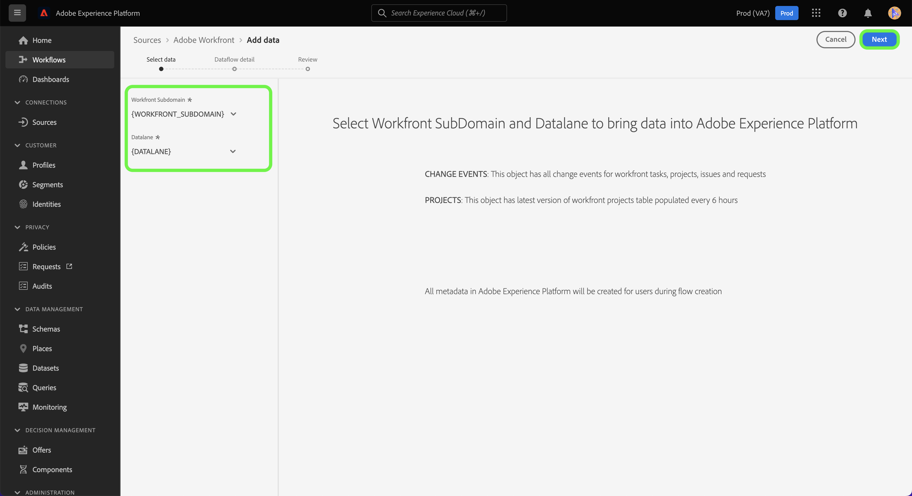
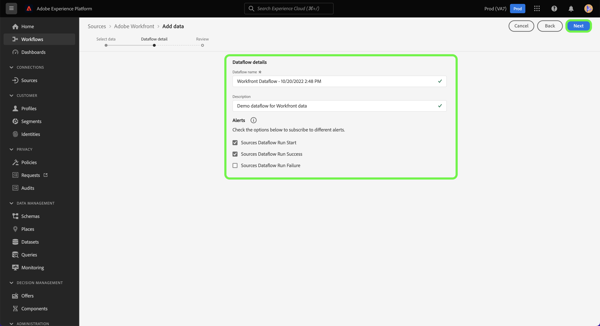

# (베타) UI에서 Adobe Workfront 소스 연결 만들기

>[!NOTE]
>
>Adobe Workfront 소스가 베타 버전입니다. 자세한 내용은 [소스 개요](../../../../home.md#terms-and-conditions) 베타 레이블이 지정된 소스 사용에 대한 자세한 정보.

이 자습서에서는 사용자 인터페이스를 사용하여 Workfront 데이터를 Adobe Experience Platform으로 가져오기 위한 Adobe Workfront 소스 연결을 만드는 단계를 제공합니다.

## 시작하기

>[!IMPORTANT]
>
>Workfront 소스에 액세스하려면 Adobe Admin Console에서 관리자로 구성해야 합니다.

이 자습서에서는 Experience Platform의 다음 구성 요소를 이해하고 있어야 합니다.

* [XDM(경험 데이터 모델) 시스템](../../../../../xdm/home.md): Experience Platform이 고객 경험 데이터를 구성하는 표준화된 프레임워크입니다.
* [실시간 고객 프로필](../../../../../profile/home.md): 여러 소스에서 집계된 데이터를 기반으로 통합된 실시간 소비자 프로필을 제공합니다.
* [샌드박스](../../../../../sandboxes/home.md): Experience Platform은 디지털 경험 애플리케이션을 개발하고 발전시키는 데 도움이 되는 단일 플랫폼 인스턴스를 별도의 가상 환경으로 분할하는 가상 샌드박스를 제공합니다.

## UI에서 Workfront 소스 연결 만들기

플랫폼 UI에서 **[!UICONTROL 소스]** 왼쪽 탐색에서 로 이동하여 [!UICONTROL 소스] 작업 공간. 다음 [!UICONTROL 카탈로그] 화면에는 계정을 만드는 데 사용할 수 있는 다양한 소스가 표시됩니다.

화면 왼쪽에 있는 카탈로그에서 적절한 카테고리를 선택할 수 있습니다. 검색 창을 사용하여 표시된 소스 범위를 좁힐 수도 있습니다.

아래에 **[!UICONTROL Adobe 애플리케이션]** 카테고리, 선택 **[!UICONTROL Adobe Workfront]** 그런 다음 **[!UICONTROL 데이터 추가]**.

## 데이터 선택

다음 [!UICONTROL 데이터 선택] 단계가 나타납니다. 여기서는 Workfront 하위 도메인과 Datalane의 값을 제공해야 합니다. Workfront 하위 도메인은 Workfront 인스턴스에 액세스하는 데 사용하는 것과 동일한 URL입니다. 예를 들어 `https://acme.workfront.com/`인 반면 데이터 란은 사용하려는 workfront 환경을 나타냅니다.

하위 도메인과 datalane을 추가한 후 **[!UICONTROL 다음]**.

## 데이터 흐름 세부 정보 제공

데이터 흐름 세부 정보 단계에서는 데이터 흐름의 이름과 선택적 설명을 제공할 수 있습니다. 이 단계에서 경고에 가입하여 데이터 흐름의 상태에 대한 알림을 받을 수도 있습니다. 경고에 대한 자세한 내용은 [소스 UI에서 경고 구독](../../alerts.md).

데이터 흐름 세부 정보를 제공하고 원하는 경고 설정을 구성했으면 을 선택합니다 **[!UICONTROL 다음]**.

## 검토

다음 **[!UICONTROL 검토]** 새 데이터 흐름을 만들기 전에 검토할 수 있는 단계가 나타납니다. 세부 사항은 다음 범주 내에 그룹화됩니다.

* **[!UICONTROL 연결]**: 소스 유형, 선택한 소스 파일의 관련 경로 및 해당 소스 파일 내의 열 양을 표시합니다.
* **[!UICONTROL 데이터 세트 및 맵 필드 할당]**: 데이터 세트가 준수하는 스키마를 포함하여 소스 데이터가 수집되는 데이터 세트를 표시합니다.

데이터 흐름을 검토한 후 **[!UICONTROL 완료]** 데이터 흐름을 만들 시간을 허용합니다.

## 부록

다음 섹션에서는 Workfront 소스에 대한 추가 정보를 제공합니다.

### Workfront 변경 이벤트 스키마

Platform의 Workfront 데이터는 시계열 레코드 데이터로 표시됩니다. 여기서 데이터에서 각 행에 이벤트가 발생한 시간과 해당 이벤트와 관련된 속성이 표시되는 타임스탬프가 있습니다.

설정 중에 Workfront 플로우에서 이벤트 변경 이라는 스키마가 만들어집니다.

| 스키마 필드 | 설명 |
| --- | --- |
| `timestamp` | 선택한 이벤트가 발생한 시간입니다. 타임스탬프는 GTM 시간대로 표시됩니다. |
| `_workfront.objectType` | 개체 유형입니다. 사용할 수 있는 값에는 다음이 포함될 수 있습니다 `project`, `task`, `portfolio`, 및 기타 변수는 변경되거나 생성된 객체에 따라 다릅니다. |
| `_workfront.objectID` | 개체 유형에 해당하는 ID입니다. |
| `_workfront.created` | 이 값은 `1` 이벤트가 객체 생성을 나타내는 경우 |
| `_workfront.deleted` | 이 값은 `1` 객체가 삭제되는 경우 |
| `_worfkront.updated` | 이 값은 `1` 개체가 업데이트되는 경우 |
| `_workfront.completed` | 이 값은 `1` 객체가 완료된 것으로 표시된 경우 |
| `_workfront.parentObjectType` | (선택 사항) 객체의 상위에 해당하는 객체 유형입니다. |
| `_workfront.parentID` | 상위 개체의 ID입니다. |
| `_workfront.customData` | 이벤트 중에 채워진 모든 사용자 지정 양식 필드 및 값의 맵. |

>[!IMPORTANT]
>
>변경 또는 이벤트의 일부로 만들어진 속성만 채워집니다. 예를 들어 개체의 이름만 변경하면 채워지는 필드는 다음과 같습니다.<ul><li>`timestamp`</li><li>`_workfront.update (=1)`</li><li>`_workfront.objectType`</li><li>`_workfront.objectID`</li><li>`_workfront.objectName`</li></ul>

## 다음 단계

이제 이 자습서를 따라 Workfront에서 Experience Platform으로 데이터를 가져올 데이터 흐름을 만들었습니다. 이제 다음과 같은 서비스를 사용할 수 있습니다 [쿼리 서비스](../../../../../query-service/home.md) 데이터에 대한 추가 분석을 실행하기 위한 작업. Workfront에 대한 자세한 내용은 [Workfront 개요](../../../../connectors/adobe-applications/workfront.md).
