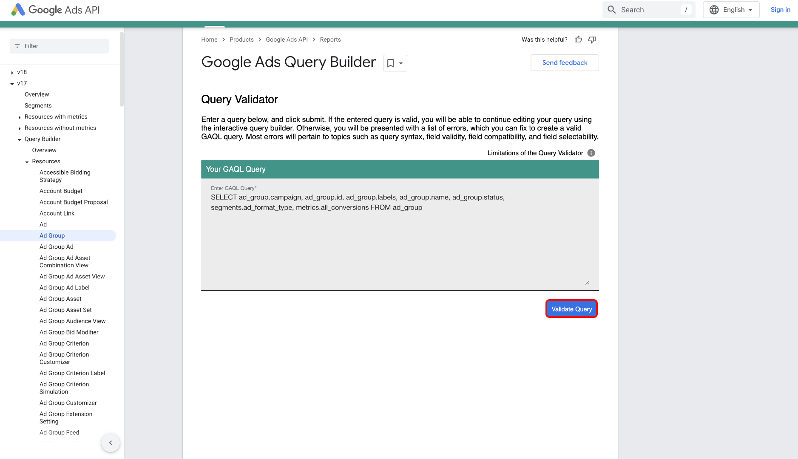

# UI를 사용하여 [!DNL Google Ads]을(를) Experience Platform에 연결

>[!NOTE]
>
>[!DNL Google Ads] 원본이 Beta 버전입니다. 베타 레이블 소스를 사용하는 방법에 대한 자세한 내용은 [소스 개요](../../../../home.md#terms-and-conditions)를 참조하십시오.

Experience Platform UI의 소스 작업 영역을 사용하여 [!DNL Google Ads] 계정을 Adobe Experience Platform에 연결하는 방법을 알아보려면 이 안내서를 참조하십시오.

## 시작하기

이 자습서에서는 Experience Platform의 다음 구성 요소를 이해하고 있어야 합니다.

* [[!DNL Experience Data Model (XDM)] 시스템](../../../../../xdm/home.md): Experience Platform에서 고객 경험 데이터를 구성하는 표준화된 프레임워크입니다.
   * [스키마 컴포지션의 기본 사항](../../../../../xdm/schema/composition.md): 스키마 컴포지션의 주요 원칙 및 모범 사례를 포함하여 XDM 스키마의 기본 구성 요소에 대해 알아봅니다.
   * [스키마 편집기 튜토리얼](../../../../../xdm/tutorials/create-schema-ui.md): 스키마 편집기 UI를 사용하여 사용자 지정 스키마를 만드는 방법을 알아봅니다.
* [[!DNL Real-Time Customer Profile]](../../../../../profile/home.md): 여러 원본의 집계된 데이터를 기반으로 통합된 실시간 소비자 프로필을 제공합니다.

이미 올바른 [!DNL Google Ads] 연결이 있는 경우 이 문서의 나머지 부분을 건너뛰고 [데이터 흐름 구성](../../dataflow/advertising.md)에 대한 자습서로 진행할 수 있습니다.

### 필요한 자격 증명 수집

인증에 대한 자세한 내용은 [[!DNL Google Ads] 원본 개요](../../../../connectors/advertising/ads.md)를 참조하세요.

## Google 광고 계정 연결

Experience Platform UI의 왼쪽 탐색에서 **[!UICONTROL 소스]**&#x200B;를 선택하여 *[!UICONTROL 소스]* 작업 영역에 액세스합니다. *[!UICONTROL 범주]* 패널에서 해당 범주를 선택할 수 있습니다. 또는 검색 창을 사용하여 사용할 특정 소스로 이동할 수 있습니다.

[!DNL Google Ads]을(를) 사용하려면 *[!UICONTROL Google]*&#x200B;에서 **[!UICONTROL Advertising 광고]** 소스 카드를 선택한 다음 **[!UICONTROL 데이터 추가]**&#x200B;를 선택하십시오.

.

### 기존 계정

기존 계정을 사용하려면 **[!UICONTROL 기존 계정]**&#x200B;을 선택한 다음 인터페이스의 계정 목록에서 사용할 계정을 선택하십시오.

계정을 선택한 후 **[!UICONTROL 다음]**&#x200B;을(를) 선택하여 다음 단계로 진행합니다.

.

### 새 계정

기존 계정이 없는 경우 소스와 일치하는 필요한 인증 자격 증명을 제공하여 새 계정을 만들어야 합니다.

새 계정을 만들려면 **[!UICONTROL 새 계정]**&#x200B;을 선택한 다음 계정 이름과 필요한 경우 계정 세부 정보에 대한 설명을 입력하십시오. 그런 다음 Experience Platform에 대해 소스를 인증하기 위해 적절한 인증 값을 제공합니다.

* **클라이언트 고객 ID**: 클라이언트 고객 ID는 [!DNL Google Ads] API로 관리할 [!DNL Google Ads] 클라이언트 계정에 해당하는 계정 번호입니다. 이 ID는 `123-456-7890`의 템플릿을 따릅니다.
* **로그인 고객 ID**: 로그인 고객 ID는 [!DNL Google Ads] 관리자 계정에 해당하는 계정 번호이며 특정 운영 고객으로부터 보고서 데이터를 가져오는 데 사용됩니다. 로그인 고객 ID에 대한 자세한 내용은 [[!DNL Google Ads] API 설명서](https://developers.google.com/search-ads/reporting/concepts/login-customer-id)를 참조하세요.
* **개발자 토큰**: 개발자 토큰을 사용하면 [!DNL Google Ads] API에 액세스할 수 있습니다. 모든 [!DNL Google Ads] 계정에 대해 동일한 개발자 토큰을 사용하여 요청을 수행할 수 있습니다. [관리자 계정에 로그인](https://ads.google.com/home/tools/manager-accounts/)한 다음 API 센터 페이지로 이동하여 개발자 토큰을 검색하십시오.
* **새로 고침 토큰**: 새로 고침 토큰은 [!DNL OAuth2] 인증의 일부입니다. 이 토큰을 사용하면 액세스 토큰이 만료된 후 다시 생성할 수 있습니다.
* **클라이언트 ID**: 클라이언트 ID는 [!DNL OAuth2] 인증의 일부로 클라이언트 암호와 함께 사용됩니다. 클라이언트 ID와 클라이언트 암호를 사용하면 응용 프로그램을 [!DNL Google]에 식별하여 응용 프로그램이 계정을 대신하여 작동할 수 있습니다.
* **클라이언트 암호**: 클라이언트 암호는 [!DNL OAuth2] 인증의 일부로 클라이언트 ID와 함께 사용됩니다. 클라이언트 ID와 클라이언트 암호를 사용하면 응용 프로그램을 [!DNL Google]에 식별하여 응용 프로그램이 계정을 대신하여 작동할 수 있습니다.
* **[!DNL Google Ads]API 버전**: [!DNL Google Ads]에서 지원하는 현재 API 버전입니다. 최신 버전은 `v18`이지만 Experience Platform에서 지원되는 최신 버전은 `v17`입니다.

자격 증명을 입력했으면 **[!UICONTROL 소스에 연결]**&#x200B;을(를) 선택하고 연결을 처리할 수 있도록 잠시 기다립니다. 완료되면 **[!UICONTROL 다음]**&#x200B;을 선택합니다.

.

## 데이터 선택 {#select-data}

[!DNL Google Ads]을(를) 사용하면 워크플로우의 데이터 선택 단계 동안 수집할 특성 목록을 제공해야 합니다. 이러한 특성을 검색하려면 [[!DNL Google Ads Query Builder]](https://developers.google.com/google-ads/api/fields/v17/overview_query_builder)을(를) 사용해야 합니다.

[!DNL Google Ads Query Builder]에서 사용할 리소스 유형으로 이동한 다음 특성 선택기를 사용하여 특성, 세그먼트 및 지표를 선택합니다.

선택한 특성이 [!DNL Google Ads Query Language] 패널을 채웁니다. [!DNL Standard] 모드를 사용하는지 확인한 다음 **[!DNL Enter or edit a query]**&#x200B;을(를) 선택하십시오.

**[!DNL Validate Query]**&#x200B;을(를) 선택하여 [!DNL Google Ads] 쿼리의 유효성을 검사합니다.

성공하면 [!DNL Google Ads Query Builder]에서 쿼리가 유효함을 나타내는 메시지를 반환합니다. 그런 다음 쿼리 내에서 **특성만**&#x200B;을(를) 복사합니다.

Experience Platform UI에서 소스 워크플로우의 데이터 선택 단계로 돌아가서 *[!UICONTROL 목록 특성]* 패널에 특성을 붙여 넣습니다.

데이터를 미리 보려면 **[!UICONTROL 미리 보기]**&#x200B;를 선택한 후 계속하려면 **[!UICONTROL 다음]**&#x200B;을 선택하십시오.

## 데이터 흐름을 만들어 광고 데이터 수집

이 자습서에 따라 Google Ads 계정에 대한 연결을 설정했습니다. 이제 다음 자습서를 계속 진행하고 [광고 데이터를 플랫폼으로 가져오도록 데이터 흐름을 구성](../../dataflow/advertising.md)할 수 있습니다.
