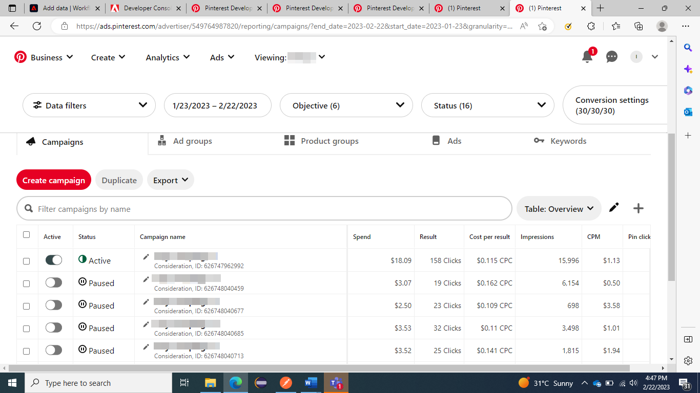

# UI에서 [!DNL Pinterest Ads] 소스 연결 만들기

>[!NOTE]
>
>[!DNL Pinterest Ads] 원본이 Beta 버전입니다. 베타 레이블 소스를 사용하는 방법에 대한 자세한 내용은 [소스 개요](../../../../home.md#terms-and-conditions)를 참조하십시오.

이 자습서에서는 Adobe Experience Platform 사용자 인터페이스를 사용하여 [!DNL Pinterest Ads] 소스 커넥터를 만드는 단계를 제공합니다.

## 시작하기 {#getting-started}

이 자습서에서는 Experience Platform의 다음 구성 요소를 이해하고 있어야 합니다.

* [[!DNL Experience Data Model (XDM)] 시스템](../../../../../xdm/home.md): Experience Platform이 고객 경험 데이터를 구성하는 표준화된 프레임워크입니다.
   * [스키마 컴포지션의 기본 사항](../../../../../xdm/schema/composition.md): 스키마 컴포지션의 주요 원칙 및 모범 사례를 포함하여 XDM 스키마의 기본 구성 요소에 대해 알아봅니다.
   * [스키마 편집기 튜토리얼](../../../../../xdm/tutorials/create-schema-ui.md): 스키마 편집기 UI를 사용하여 사용자 지정 스키마를 만드는 방법을 알아봅니다.
* [[!DNL Real-Time Customer Profile]](../../../../../profile/home.md): 여러 원본의 집계된 데이터를 기반으로 통합된 실시간 소비자 프로필을 제공합니다.

## 전제 조건 {#prerequisites}

[!DNL Pinterest Ads]을(를) Experience Platform에 연결하려면 다음 연결 속성에 대한 값을 제공해야 합니다.

* [!DNL Pinterest] 액세스 토큰입니다.
* [!DNL Pinterest] 광고 계정 ID.
* 필요에 따라 [!DNL Pinterest] 캠페인, 광고 그룹 또는 광고 ID 중 하나입니다.

이러한 연결 속성에 대한 자세한 내용은 [[!DNL Pinterest Ads] 개요](../../../../connectors/advertising/pinterest-ads.md#prerequisites)를 참조하십시오.

### Experience Platform 스키마 만들기 {#create-platform-schema}

또한 먼저 [!DNL Pinterst Ads] 소스에 사용할 Experience Platform 스키마를 만들어야 합니다. 스키마를 만드는 방법에 대한 포괄적인 단계를 보려면 [Experience Platform 스키마 만들기](../../../../../xdm/schema/composition.md)에 대한 자습서를 참조하십시오.


[!DNL Pinterest] 캠페인, 광고 그룹 및 광고 API에서 지원하는 필드 목록은 [[!DNL Pinterest] 필드](#pinterest-fields) 섹션을 참조하십시오.

## [!DNL Pinterest Ads] 계정 연결 {#connect-account}

Experience Platform UI의 왼쪽 탐색 모음에서 **[!UICONTROL 소스]**&#x200B;를 선택하여 [!UICONTROL 소스] 작업 영역에 액세스합니다. [!UICONTROL 카탈로그] 화면에 계정을 만들 수 있는 다양한 소스가 표시됩니다.

화면 왼쪽에 있는 카탈로그에서 적절한 카테고리를 선택할 수 있습니다. 또는 검색 옵션을 사용하여 작업할 특정 소스를 찾을 수 있습니다.

*Advertising* 범주에서 **[!UICONTROL Pinterest 광고]**&#x200B;를 선택한 다음 **[!UICONTROL 데이터 추가]**&#x200B;를 선택합니다.


**[!UICONTROL Pinterest 광고 계정 연결]** 페이지가 나타납니다. 이 페이지에서 새 자격 증명 또는 기존 자격 증명을 사용할 수 있습니다.

### 기존 계정 {#existing-account}

기존 계정을 사용하려면 새 데이터 흐름을 만들 [!DNL Pinterest Ads] 계정을 선택한 다음 **[!UICONTROL 다음]**&#x200B;을 선택하여 계속합니다.


### 새 계정 {#new-account}

새 계정을 만드는 경우 **[!UICONTROL 새 계정]**&#x200B;을(를) 선택한 다음 이름, 설명(선택 사항) 및 자격 증명을 제공합니다. 완료되면 **[!UICONTROL 소스에 연결]**&#x200B;을 선택한 다음 새 연결을 설정할 수 있는 시간을 허용하세요.


## 데이터 선택 {#select-data}

API에 전달되는 정보를 입력하여 원하는 데이터를 Experience Platform으로 가져올 수 있는 인터페이스를 제공하는 **[!UICONTROL 데이터 선택]** 단계가 나타납니다.

| 필드 | 설명 |
| --- | --- |
| [!UICONTROL ad_account_id] | [!DNL Pinterest Ads] 광고 계정 ID입니다. 지침이 필요한 경우 [[!DNL Pinterest] 광고 관리자에서 ID 찾기에 대한 안내서](https://help.pinterest.com/en/business/article/find-ids-in-ads-manager)를 참조하세요. |
| [!UICONTROL object_type] | 정보를 가져올 [!DNL Pinterest]개의 Analytics API에 따라 **캠페인**, **광고 그룹** 또는 **광고** 중 하나를 선택하십시오. |
| [!UICONTROL object_ids] | 선택한 개체의 ID입니다. **Pinterest Business Hub** > **광고 계정 요약** > **캠페인** / **광고 그룹** / **광고**&#x200B;에 대한 [!DNL Pinterest] 페이지로 이동하고 각 이름 바로 아래에 언급된 필수 ID를 복사합니다. |

>[!TIP]
>
>쉼표로 구분된 값을 전달하여 여러 `object_ids`을(를) 제공할 수 있습니다. 단일 요청에서 전달할 수 있는 최대 ID 수는 100개입니다. 잘못된 값이 전달되면 Experience Platform에 다음 메시지가 표시됩니다. `The request could not be processed. Error from flow provider: Unknown error while processing request.`

값을 제공한 후 **[!UICONTROL 선택]**&#x200B;을 선택합니다. 제공된 값이 유효하면 인터페이스의 오른쪽 부분인 미리보기 데이터가 채워집니다.


## 다음 단계 {#next-steps}

이 자습서에 따라 [!DNL Pinterest Ads] 계정에 대한 연결을 설정했습니다. 이제 다음 자습서를 계속 진행하고 [데이터 흐름을 구성하여 광고 데이터를 Experience Platform으로 가져올 수 있습니다](../../dataflow/advertising.md).

## 추가 리소스 {#additional-resources}

아래 섹션에서는 [!DNL Pinterest Ads] 소스를 사용할 때 참조할 수 있는 추가 리소스를 제공합니다.

## 일정 조정 {#scheduling}

수집을 위해 [!DNL Pinterest Ads] 데이터 흐름을 예약할 때 다음 빈도 및 간격 구성 중 하나를 선택해야 합니다.

| 빈도 | 간격 |
| --- | --- |
| `Day` | 1 |
| `Hour` | 24 |

[!DNL Pinterest Ads] 데이터 흐름 예약에 대한 자세한 내용은  [!DNL Pinterest Ads] 개요](../../../../connectors/advertising/pinterest-ads.md#guardrails)의 [보호 기능을 참조하십시오.

일정에 대한 값을 제공했으면 **[!UICONTROL 다음]**&#x200B;을 선택합니다.


### 유효성 검사 {#validation}

원본을 올바르게 설정했는지 확인하고 [!DNL Pinterest Ads] 데이터가 수집되고 있는지 확인하려면 아래 단계를 수행하십시오.

Experience Platform UI에서 카탈로그 페이지의 [!DNL Pinterest Ads] 카드 메뉴 옆에 있는 **[!UICONTROL 데이터 흐름 보기]**&#x200B;를 선택합니다. 그런 다음 [!UICONTROL 데이터 집합 미리 보기]를 선택하여 수집된 데이터를 확인할 수 있습니다.


[!DNL Pinterest] UI에 표시되는 카운트에 대해 데이터를 확인할 수 있습니다

>[!BEGINTABS]

>[!TAB 캠페인]



>[!TAB 광고 그룹]


>[!TAB 광고]


>[!ENDTABS]


### [!DNL Pinterest]개 필드 {#pinterest-fields}

[!DNL Pinterest] 캠페인, 광고 그룹 및 광고 API에서 지원하는 필드는 다음과 같습니다.

+++ 페이로드 보기

```json
{
  "items": [
    {
      "name": "AD_GROUP_ID",
      "category": "ADS",
      "definition": "Unique ID for your ad group",
      "display_name": "Ad group ID"
    },
    {
      "name": "AD_ID",
      "category": "ADS",
      "definition": "Unique ID for your ad",
      "display_name": "Ad ID"
    },
    {
      "name": "CAMPAIGN_BOOKING_REFERENCE",
      "category": "ADS",
      "definition": "Campaign booking reference number",
      "display_name": "Campaign booking reference"
    },
    {
      "name": "CAMPAIGN_DAILY_SPEND_CAP",
      "category": "ADS",
      "definition": "The maximum amount you're willing to spend in one day",
      "display_name": "Daily budget"
    },
    {
      "name": "CAMPAIGN_ID",
      "category": "ADS",
      "definition": "Unique ID for your campaign",
      "display_name": "Campaign ID"
    },
    {
      "name": "CAMPAIGN_LIFETIME_SPEND_CAP",
      "category": "ADS",
      "definition": "The maximum amount you're willing to spend over the lifetime of your campaign",
      "display_name": "Lifetime budget"
    },
    {
      "name": "CAMPAIGN_NAME",
      "category": "ADS",
      "definition": "Name, objective and ID of your campaign",
      "display_name": "Campaign name"
    },
    {
      "name": "CHECKOUT_ROAS",
      "category": "ADS",
      "definition": "Average return on ad spend for checkout events. This metric may include conversions that are modeled.",
      "display_name": "ROAS (Checkout)"
    },
    {
      "name": "CLICKTHROUGH_1",
      "category": "ADS",
      "definition": "The total number of clicks on your Pin to content on or off of Pinterest",
      "display_name": "Paid Pin clicks"
    },
    {
      "name": "CLICKTHROUGH_1_GROSS",
      "category": "ADS",
      "definition": "Unfiltered number of times someone clicks your ad (paid)",
      "display_name": "Gross Pin clicks"
    },
    {
      "name": "CLICKTHROUGH_2",
      "category": "ADS",
      "definition": "Total number of Pin clicks from ads saved to another person's board",
      "display_name": "Earned Pin clicks"
    },
    {
      "name": "CPC_IN_MICRO_DOLLAR",
      "category": "ADS",
      "definition": "The cost per click in micro dollars"
    },
    {
      "name": "CPM_IN_DOLLAR",
      "category": "ADS",
      "definition": "Average cost per 1k paid impressions",
      "display_name": "CPM"
    },
    {
      "name": "CPM_IN_MICRO_DOLLAR",
      "category": "ADS",
      "definition": "Cost per thousand first-order impressions in micro dollars"
    },
    {
      "name": "CPW_IN_DOLLAR",
      "category": "ADS",
      "definition": "The cost per web session in dollars"
    },
    {
      "name": "CPW_IN_MICRO_DOLLAR",
      "category": "ADS",
      "definition": "The cost per web session in micro dollars"
    },
    {
      "name": "CTR",
      "category": "ADS",
      "definition": "Paid Pin clicks divided by paid impressions",
      "display_name": "Paid CTR"
    },
    {
      "name": "CTR_2",
      "category": "ADS",
      "definition": "Earned Pin clicks divided by earned impressions",
      "display_name": "Earned CTR"
    },
    {
      "name": "ECPCV_IN_DOLLAR",
      "category": "ADS",
      "definition": "Average cost per video view that was watched to completion",
      "display_name": "CPCV (100%)"
    },
    {
      "name": "ECPCV_P95_IN_DOLLAR",
      "category": "ADS",
      "definition": "Average cost per video that was watched until 95% of its length",
      "display_name": "CPCV (95%)"
    },
    {
      "name": "ECPC_IN_DOLLAR",
      "category": "ADS",
      "definition": "Average cost per click",
      "display_name": "CPC"
    },
    {
      "name": "ECPC_IN_MICRO_DOLLAR",
      "category": "ADS",
      "definition": "Effective CPC (including first-order and downstream clicks) in micro dollars"
    },
    {
      "name": "ECPE_IN_DOLLAR",
      "category": "ADS",
      "definition": "Cost per engagement",
      "display_name": "CPE"
    },
    {
      "name": "ECPM_IN_MICRO_DOLLAR",
      "category": "ADS",
      "definition": "Effective CPM (including first-order and downstream impressions) in micro dollars"
    },
    {
      "name": "ECPV_IN_DOLLAR",
      "category": "ADS",
      "definition": "Average cost per video view",
      "display_name": "CPV"
    },
    {
      "name": "ECTR",
      "category": "ADS",
      "definition": "Total Pin clicks divided by total impressions",
      "display_name": "CTR"
    },
    {
      "name": "EENGAGEMENT_RATE",
      "category": "ADS",
      "definition": "Total engagements divided by total impressions",
      "display_name": "Engagement rate"
    },
    {
      "name": "ENGAGEMENT",
      "category": "ORGANIC",
      "definition": "The total number of engagements on your Pins. This includes saves, Pin clicks, outbound clicks, carousel card swipes, secondary creative (collections) clicks and Idea Pin forward/backward swipes.",
      "display_name": "Engagement"
    },
    {
      "name": "ENGAGEMENT_1",
      "category": "ADS",
      "definition": "Paid actions taken as a result of your ads",
      "display_name": "Paid engagements"
    },
    {
      "name": "ENGAGEMENT_2",
      "category": "ADS",
      "definition": "Earned actions from ads saved to boards",
      "display_name": "Earned engagements"
    },
    {
      "name": "ENGAGEMENT_RATE",
      "category": "ADS",
      "definition": "Paid engagements divided by paid impressions"
    },
    {
      "name": "ENGAGEMENT_RATE",
      "category": "ORGANIC",
      "definition": "The total engagements with your Pins divided by the total number of times your Pins were seen. Engagements include saves, Pin clicks, and outbound clicks.",
      "display_name": "Engagement rate"
    },
    {
      "name": "IDEA_PIN_PAGE_BACKWARD_1",
      "category": "ADS",
      "definition": "The number of times someone goes back to a previous page within an Idea Pin you promoted"
    },
    {
      "name": "IDEA_PIN_PAGE_BACKWARD_2",
      "category": "ADS",
      "definition": "The number of times someone goes back to a previous page within your Idea Pin on someone else's board"
    },
    {
      "name": "IDEA_PIN_PAGE_FORWARD_1",
      "category": "ADS",
      "definition": "The number of times someone advances to a new page within an Idea Pin you promoted"
    },
    {
      "name": "IDEA_PIN_PAGE_FORWARD_2",
      "category": "ADS",
      "definition": "The number of times someone advances to a new page within your Idea Pin on someone else's board"
    },
    {
      "name": "IDEA_PIN_PRODUCT_TAG_VISIT_1",
      "category": "ADS",
      "definition": "The number of times someone taps on a product tagged within an Idea Pin you promoted"
    },
    {
      "name": "IDEA_PIN_PRODUCT_TAG_VISIT_2",
      "category": "ADS",
      "definition": "The number of times someone taps on a product tagged within an Idea ad saved to another person's board"
    },
    {
      "name": "IMPRESSION",
      "category": "ORGANIC",
      "definition": "The number of times your Pins were on screen.",
      "display_name": "Impressions"
    },
    {
      "name": "IMPRESSION_1",
      "category": "ADS",
      "definition": "The number of times your ad was seen",
      "display_name": "Paid impressions"
    },
    {
      "name": "IMPRESSION_1_GROSS",
      "category": "ADS",
      "definition": "Unfiltered number of times your ad was on screen (paid)",
      "display_name": "Gross impressions"
    },
    {
      "name": "IMPRESSION_2",
      "category": "ADS",
      "definition": "Total number of times your ad was viewed after being saved to another person's board",
      "display_name": "Earned impressions"
    },
    {
      "name": "INAPP_CHECKOUT_COST_PER_ACTION",
      "category": "ADS",
      "definition": "Average cost per in-app checkout event",
      "display_name": "In-app CPA (Checkout)"
    },
    {
      "name": "OUTBOUND_CLICK",
      "category": "ORGANIC",
      "definition": "The number of times people perform actions that lead them to a destination off Pinterest.",
      "display_name": "Outbound clicks"
    },
    {
      "name": "OUTBOUND_CLICK_1",
      "category": "ADS",
      "definition": "The total number of clicks to the destination URL associated with your ad",
      "display_name": "Paid outbound clicks"
    },
    {
      "name": "OUTBOUND_CLICK_2",
      "category": "ADS",
      "definition": "The total number of clicks to the destination URL associated with your ad saved to another person's board",
      "display_name": "Earned outbound clicks"
    },
    {
      "name": "OUTBOUND_CLICK_RATE",
      "category": "ORGANIC",
      "definition": "The total number of clicks to the destination URL associated with your Pin divided by the total number of times your Pins were on screen.",
      "display_name": "Outbound click rate"
    },
    {
      "name": "PAGE_VISIT_COST_PER_ACTION",
      "category": "ADS",
      "definition": "Average cost per page visit event. This metric may include conversions that are modeled.",
      "display_name": "CPA (Page visit)"
    },
    {
      "name": "PAGE_VISIT_ROAS",
      "category": "ADS",
      "definition": "Average return on ad spend for page visit events. This metric may include conversions that are modeled.",
      "display_name": "ROAS (Page visit)"
    },
    {
      "name": "PAID_IMPRESSION",
      "category": "ADS",
      "definition": "The number of impressions that you paid for",
      "display_name": "Paid Impressions"
    },
    {
      "name": "PINTEREST_CHECKOUT_COST_PER_ACTION",
      "category": "ADS",
      "definition": "Average cost per Pinterest checkout event",
      "display_name": "Pinterest CPA (Checkout)"
    },
    {
      "name": "PINTEREST_CHECKOUT_ROAS",
      "category": "ADS",
      "definition": "Average return on ad spend for Pinterest checkout events",
      "display_name": "Pinterest ROAS (Checkout)"
    },
    {
      "name": "PIN_CLICK",
      "category": "ORGANIC",
      "definition": "The total number of clicks on your Pin so it opens in closeup.",
      "display_name": "Pin click"
    },
    {
      "name": "PIN_CLICK_RATE",
      "category": "ORGANIC",
      "definition": "The total number of clicks from your Pin to content on or off Pinterest, divided by the total number of times your Pins were on screen.",
      "display_name": "Pin click rate"
    },
    {
      "name": "PIN_ID",
      "category": "ADS",
      "definition": "Thumbnail of your ad's image or video",
      "display_name": "Organic pin ID"
    },
    {
      "name": "PIN_PROMOTION_ID",
      "category": "ADS",
      "definition": "Unique ID for your ad",
      "display_name": "Ad ID"
    },
    {
      "name": "QUARTILE_95_PERCENT_VIEW",
      "category": "ORGANIC",
      "definition": "The number of times your video was viewed to 95% of its length.",
      "display_name": "Played to 95%"
    },
    {
      "name": "REPIN_1",
      "category": "ADS",
      "definition": "Total number of saves for your ad",
      "display_name": "Paid saves"
    },
    {
      "name": "REPIN_2",
      "category": "ADS",
      "definition": "Number of times your ad was saved from another person's board",
      "display_name": "Earned saves"
    },
    {
      "name": "REPIN_RATE",
      "category": "ADS",
      "definition": "Paid saves divided by paid impressions",
      "display_name": "Paid save rate"
    },
    {
      "name": "SAVE",
      "category": "ORGANIC",
      "definition": "The number of times people saved your Pin to a board.",
      "display_name": "Saves"
    },
    {
      "name": "SAVE_RATE",
      "category": "ORGANIC",
      "definition": "The total saves of your Pins divided by the total number of times your Pins were on screen.",
      "display_name": "Save rate"
    },
    {
      "name": "SPEND_IN_DOLLAR",
      "category": "ADS",
      "definition": "Total amount you've spent during the reporting time period",
      "display_name": "Spend"
    },
    {
      "name": "SPEND_IN_MICRO_DOLLAR",
      "category": "ADS",
      "definition": "The money you spend for promoted Pins, in micro dollars",
      "display_name": "Spend in account currency"
    },
    {
      "name": "SPEND_IN_MICRO_US_DOLLAR",
      "category": "ADS",
      "definition": "The money you spend for promoted Pins, in micro USD",
      "display_name": "Spend in micro USD"
    },
    {
      "name": "SPEND_IN_US_DOLLAR",
      "category": "ADS",
      "definition": "Total amount you've spent during the reporting time period (in USD)",
      "display_name": "Spend In USD"
    },
    {
      "name": "TOTAL_CHECKOUT",
      "category": "ADS",
      "definition": "Total number of checkout events that resulted from interactions with your ad. This metric may include conversions that are modeled.",
      "display_name": "Conversions (Checkout)"
    },
    {
      "name": "TOTAL_CHECKOUT_VALUE_IN_MICRO_DOLLAR",
      "category": "ADS",
      "definition": "Total value of checkout events resulting from interactions with your ad. This metric may include conversions that are modeled.",
      "display_name": "Order value (Checkout)"
    },
    {
      "name": "TOTAL_CLICKTHROUGH",
      "category": "ADS",
      "definition": "The total number of clicks on your Pin to content on or off of Pinterest (paid and earned)",
      "display_name": "Pin clicks"
    },
    {
      "name": "TOTAL_CLICK_ADD_TO_CART",
      "category": "ADS",
      "definition": "The number of add to cart events resulting from clicks on your ad. This metric may include conversions that are modeled.",
      "display_name": "Click-through conversions (Add to cart)"
    },
    {
      "name": "TOTAL_CLICK_CHECKOUT",
      "category": "ADS",
      "definition": "Total number of checkout events resulting from clicks on your ad. This metric may include conversions that are modeled.",
      "display_name": "Click-through conversions (Checkout)"
    },
    {
      "name": "TOTAL_CLICK_CHECKOUT_VALUE_IN_MICRO_DOLLAR",
      "category": "ADS",
      "definition": "Total value of checkout events resulting from clicks on your ad. This metric may include conversions that are modeled.",
      "display_name": "Click-through order value (Checkout)"
    },
    {
      "name": "TOTAL_CLICK_LEAD",
      "category": "ADS",
      "definition": "Total number of lead events resulting from clicks on your ad. This metric may include conversions that are modeled.",
      "display_name": "Click-through conversions (Lead)"
    },
    {
      "name": "TOTAL_CLICK_SIGNUP",
      "category": "ADS",
      "definition": "Number of signup events resulting from clicks on your ad. This metric may include conversions that are modeled.",
      "display_name": "Click-through conversions (Signup)"
    },
    {
      "name": "TOTAL_CLICK_SIGNUP_VALUE_IN_MICRO_DOLLAR",
      "category": "ADS",
      "definition": "Total value of signup events resulting from clicks on your ad. This metric may include conversions that are modeled.",
      "display_name": "Click-through value (Signup)"
    },
    {
      "name": "TOTAL_CONVERSIONS",
      "category": "ADS",
      "definition": "Total number of conversions for all event types using the Pinterest Tag integration after an ad interaction. This metric may include conversions that are modeled.",
      "display_name": "Conversions"
    },
    {
      "name": "TOTAL_CUSTOM",
      "category": "ADS",
      "definition": "Total number of custom events resulting from interactions with your ad. This metric may include conversions that are modeled.",
      "display_name": "Conversions (Custom)"
    },
    {
      "name": "TOTAL_ENGAGEMENT",
      "category": "ADS",
      "definition": "The total number of engagements on your ads, including clicks, saves, carousel swipes, and collections secondary saves",
      "display_name": "Engagements"
    },
    {
      "name": "TOTAL_ENGAGEMENT_CHECKOUT",
      "category": "ADS",
      "definition": "Total number of checkout events resulting from engagements with your ad. Engagements includes saves, closeups, carousel swipes, collection secondary closeups, and collection secondary saves. This metric may include conversions that are modeled.",
      "display_name": "Engagement conversions (Checkout)"
    },
    {
      "name": "TOTAL_ENGAGEMENT_CHECKOUT_VALUE_IN_MICRO_DOLLAR",
      "category": "ADS",
      "definition": "Total value of checkout events resulting from engagements with your ad. Engagements includes saves, closeups, carousel swipes, collection secondary closeups, and collection secondary saves. This metric may include conversions that are modeled.",
      "display_name": "Engagement order value (Checkout)"
    },
    {
      "name": "TOTAL_ENGAGEMENT_LEAD",
      "category": "ADS",
      "definition": "Total number of lead events resulting from engagement with your ad. Engagements includes saves, closeups, carousel swipes, collection secondary closeups, and collection secondary saves. This metric may include conversions that are modeled.",
      "display_name": "Engagement conversions (Lead)"
    },
    {
      "name": "TOTAL_ENGAGEMENT_SIGNUP",
      "category": "ADS",
      "definition": "Total number of signup events resulting from engagements with your ad. Engagements includes saves, closeups, carousel swipes, collection secondary closeups, and collection secondary saves. This metric may include conversions that are modeled.",
      "display_name": "Engagement conversions (Signup)"
    },
    {
      "name": "TOTAL_ENGAGEMENT_SIGNUP_VALUE_IN_MICRO_DOLLAR",
      "category": "ADS",
      "definition": "Total value of signup events resulting from engagements with your ad. Engagements includes saves, closeups, carousel swipes, collection secondary closeups, and collection secondary saves. This metric may include conversions that are modeled.",
      "display_name": "Engagement value (Signup)"
    },
    {
      "name": "TOTAL_IDEA_PIN_PAGE_BACKWARD",
      "category": "ADS",
      "definition": "The total number of times someone goes back to a previous page within an Idea Pin, including paid and earned",
      "display_name": "Total Idea Pin page backward"
    },
    {
      "name": "TOTAL_IDEA_PIN_PAGE_FORWARD",
      "category": "ADS",
      "definition": "The total number of times someone advances to a new page within an Idea Pin, including paid and earned",
      "display_name": "Total Idea Pin page forward"
    },
    {
      "name": "TOTAL_IDEA_PIN_PRODUCT_TAG_VISIT",
      "category": "ADS",
      "definition": "The number of times someone taps on a product tagged within an Idea Pin, paid and earned.",
      "display_name": "Total Idea Pin product tag visits"
    },
    {
      "name": "TOTAL_IMPRESSION_FREQUENCY",
      "category": "ADS",
      "definition": "The average number of times each user saw your ad.",
      "display_name": "Frequency"
    },
    {
      "name": "TOTAL_IMPRESSION_USER",
      "category": "ADS",
      "definition": "Total number of unique users who saw your ads",
      "display_name": "Reach"
    },
    {
      "name": "TOTAL_LEAD",
      "category": "ADS",
      "definition": "Total number of lead events resulting from interactions with your ad. This metric may include conversions that are modeled.",
      "display_name": "Conversions (Lead)"
    },
    {
      "name": "TOTAL_OFFLINE_CHECKOUT",
      "category": "ADS",
      "definition": "Total number of offline checkout events resulting from clicks on your ad",
      "display_name": "Offline conversions (Checkout)"
    },
    {
      "name": "TOTAL_PAGE_VISIT",
      "category": "ADS",
      "definition": "Total number of page visit events resulting from interactions with your ad. This metric may include conversions that are modeled.",
      "display_name": "Conversions (Page visit)"
    },
    {
      "name": "TOTAL_PINTEREST_CHECKOUT",
      "category": "ADS",
      "definition": "Total number of Pinterest checkout events resulting from clicks on your ad",
      "display_name": "Pinterest conversions (Checkout)"
    },
    {
      "name": "TOTAL_PINTEREST_CHECKOUT_VALUE_IN_MICRO_DOLLAR",
      "category": "ADS",
      "definition": "Total value of Pinterest checkout events resulting from interactions with your ad",
      "display_name": "Pinterest order value (Checkout)"
    },
    {
      "name": "TOTAL_REPIN_RATE",
      "category": "ADS",
      "definition": "Total saves divided by total impressions",
      "display_name": "Total save rate"
    },
    {
      "name": "TOTAL_SIGNUP",
      "category": "ADS",
      "definition": "Total number of signup events resulting from interactions with your ad. This metric may include conversions that are modeled.",
      "display_name": "Conversions (Signup)"
    },
    {
      "name": "TOTAL_SIGNUP_VALUE_IN_MICRO_DOLLAR",
      "category": "ADS",
      "definition": "Total value of signup events resulting from interactions with your ad. This metric may include conversions that are modeled.",
      "display_name": "Value (Signup)"
    },
    {
      "name": "TOTAL_VIDEO_3SEC_VIEWS",
      "category": "ADS",
      "definition": "Total number of times your video ad played continuously for at least 3 seconds while 50% visible (paid and earned)",
      "display_name": "Total 3-Second Video Views"
    },
    {
      "name": "TOTAL_VIDEO_AVG_WATCHTIME_IN_SECOND",
      "category": "ADS",
      "definition": "Averaged across all videos that begin playback, including seeks and loops. Start time triggered when video begins playback.",
      "display_name": "Average Watch Time In Seconds"
    },
    {
      "name": "TOTAL_VIDEO_MRC_VIEWS",
      "category": "ADS",
      "definition": "Total number of times your video ad played continuously for at least 2 seconds while 50% visible (paid and earned)",
      "display_name": "Video views"
    },
    {
      "name": "TOTAL_VIDEO_P0_COMBINED",
      "category": "ADS",
      "definition": "Total number of times your video ad started playing (paid and earned)",
      "display_name": "Total video starts"
    },
    {
      "name": "TOTAL_VIDEO_P100_COMPLETE",
      "category": "ADS",
      "definition": "Total number of times your video ad played 100% of its length, including views that skipped ahead to this point (paid and earned)",
      "display_name": "Total video played at 100%"
    },
    {
      "name": "TOTAL_VIDEO_P25_COMBINED",
      "category": "ADS",
      "definition": "Total number of times your video ad played 25% of its length, including views that skipped ahead to this point (paid and earned)",
      "display_name": "Total video played at 25%"
    },
    {
      "name": "TOTAL_VIDEO_P50_COMBINED",
      "category": "ADS",
      "definition": "Total number of times your video ad played 50% of its length, including views that skipped ahead to this point (paid and earned)",
      "display_name": "Total video played at 50%"
    },
    {
      "name": "TOTAL_VIDEO_P75_COMBINED",
      "category": "ADS",
      "definition": "Total number of times your video ad played 75% of its length, including views that skipped ahead to this point (paid and earned)",
      "display_name": "Total video played at 75%"
    },
    {
      "name": "TOTAL_VIDEO_P95_COMBINED",
      "category": "ADS",
      "definition": "Total number of times your video ad played 95% of its length, including views that skipped ahead to this point (paid and earned)",
      "display_name": "Total video played at 95%"
    },
    {
      "name": "TOTAL_VIEW_ADD_TO_CART",
      "category": "ADS",
      "definition": "Total number of add to cart events resulting from views of your ad. This metric may include conversions that are modeled.",
      "display_name": "View-through conversions (Add to cart)"
    },
    {
      "name": "TOTAL_VIEW_CHECKOUT",
      "category": "ADS",
      "definition": "Total number of checkout events resulting from views of your ad. This metric may include conversions that are modeled.",
      "display_name": "View-through conversions (Checkout)"
    },
    {
      "name": "TOTAL_VIEW_CHECKOUT_VALUE_IN_MICRO_DOLLAR",
      "category": "ADS",
      "definition": "Total value of checkout events resulting from views of your ad. This metric may include conversions that are modeled.",
      "display_name": "View-through order value (Checkout)"
    },
    {
      "name": "TOTAL_VIEW_LEAD",
      "category": "ADS",
      "definition": "Total number of lead events resulting from views of your ad. This metric may include conversions that are modeled.",
      "display_name": "View-through conversions (Lead)"
    },
    {
      "name": "TOTAL_VIEW_SIGNUP",
      "category": "ADS",
      "definition": "Number of signup events resulting from views of your ad. This metric may include conversions that are modeled.",
      "display_name": "View-through conversions (Signup)"
    },
    {
      "name": "TOTAL_VIEW_SIGNUP_VALUE_IN_MICRO_DOLLAR",
      "category": "ADS",
      "definition": "Total value of signup events resulting from views of your ad. This metric may include conversions that are modeled.",
      "display_name": "View-through value (Signup)"
    },
    {
      "name": "TOTAL_WEB_CHECKOUT",
      "category": "ADS",
      "definition": "Total number of web checkout events resulting from clicks on your ad. This metric may include conversions that are modeled.",
      "display_name": "Web conversions (Checkout)"
    },
    {
      "name": "TOTAL_WEB_CHECKOUT_VALUE_IN_MICRO_DOLLAR",
      "category": "ADS",
      "definition": "Total value of web checkout events resulting from interactions with your ad. This metric may include conversions that are modeled.",
      "display_name": "Web order value (Checkout)"
    },
    {
      "name": "TOTAL_WEB_CLICK_CHECKOUT",
      "category": "ADS",
      "definition": "Total number of web checkout events resulting from clicks on your ad. This metric may include conversions that are modeled.",
      "display_name": "Web click-through conversions (Checkout)"
    },
    {
      "name": "TOTAL_WEB_CLICK_CHECKOUT_VALUE_IN_MICRO_DOLLAR",
      "category": "ADS",
      "definition": "Total value of web checkout events resulting from clicks on your ad. This metric may include conversions that are modeled.",
      "display_name": "Web click-through order value (Checkout)"
    },
    {
      "name": "TOTAL_WEB_ENGAGEMENT_CHECKOUT",
      "category": "ADS",
      "definition": "Total number of web checkout events resulting from engagements with your ad (save, closeup or carousel swipe). This metric may include conversions that are modeled.",
      "display_name": "Web engagement conversions (Checkout)"
    },
    {
      "name": "TOTAL_WEB_ENGAGEMENT_CHECKOUT_VALUE_IN_MICRO_DOLLAR",
      "category": "ADS",
      "definition": "Total value of web checkout events resulting from engagements with your ad (save, closeup or carousel swipe). This metric may include conversions that are modeled.",
      "display_name": "Web engagement order value (Checkout)"
    },
    {
      "name": "TOTAL_WEB_SESSIONS",
      "category": "ADS",
      "definition": "Total number of sessions loaded in a browser",
      "display_name": "Web sessions"
    },
    {
      "name": "TOTAL_WEB_VIEW_CHECKOUT",
      "category": "ADS",
      "definition": "Total number of web checkout events resulting from views of your ad. This metric may include conversions that are modeled.",
      "display_name": "Web view-through conversions (Checkout)"
    },
    {
      "name": "TOTAL_WEB_VIEW_CHECKOUT_VALUE_IN_MICRO_DOLLAR",
      "category": "ADS",
      "definition": "Total value of web checkout events resulting from views of your ad. This metric may include conversions that are modeled.",
      "display_name": "Web view-through order value (Checkout)"
    },
    {
      "name": "VIDEO_10S_VIEW",
      "category": "ORGANIC",
      "definition": "The number of times your video was viewed for at least 10 seconds.",
      "display_name": "10-second plays"
    },
    {
      "name": "VIDEO_3SEC_VIEWS_2",
      "category": "ADS",
      "definition": "The number of times your video ad played continuously for 3 seconds while 50% in view after being saved to another person's board",
      "display_name": "Earned 3-Second Video Views"
    },
    {
      "name": "VIDEO_AVG_WATCH_TIME",
      "category": "ORGANIC",
      "definition": "The average time someone spent playing the video and static image cards included in your pin.",
      "display_name": "Average video play time"
    },
    {
      "name": "VIDEO_LENGTH",
      "category": "ADS",
      "definition": "Runtime of your video ad",
      "display_name": "Video length"
    },
    {
      "name": "VIDEO_MRC_VIEW",
      "category": "ORGANIC",
      "definition": "The amount of views for at least 2 seconds with 50% of video in view.",
      "display_name": "Video views"
    },
    {
      "name": "VIDEO_MRC_VIEWS_2",
      "category": "ADS",
      "definition": "The number of times your video ad played continuously for 2 seconds while 50% in view after being saved to another person's board",
      "display_name": "Earned video views"
    },
    {
      "name": "VIDEO_P0_COMBINED_2",
      "category": "ADS",
      "definition": "Total number of times your video ad started playing after it was saved to another person's board",
      "display_name": "Earned video starts"
    },
    {
      "name": "VIDEO_P100_COMPLETE_2",
      "category": "ADS",
      "definition": "Total number of times your video ad reached 100% of its length after it was saved to another person's board, including views that skipped ahead to this point",
      "display_name": "Earned video played at 100%"
    },
    {
      "name": "VIDEO_P25_COMBINED_2",
      "category": "ADS",
      "definition": "Total number of times your video ad reached 25% of its length after it was saved to another person's board, including views that skipped ahead to this point",
      "display_name": "Earned video played at 25%"
    },
    {
      "name": "VIDEO_P50_COMBINED_2",
      "category": "ADS",
      "definition": "Total number of times your video ad reached 50% of its length after it was saved to another person's board, including views that skipped ahead to this point",
      "display_name": "Earned video played at 50%"
    },
    {
      "name": "VIDEO_P75_COMBINED_2",
      "category": "ADS",
      "definition": "Total number of times your video ad reached 75% of its length after it was saved to another person's board, including views that skipped ahead to this point",
      "display_name": "Earned video played at 75%"
    },
    {
      "name": "VIDEO_P95_COMBINED_2",
      "category": "ADS",
      "definition": "Total number of times your video ad reached 95% of its length after it was saved to another person's board, including views that skipped ahead to this point",
      "display_name": "Earned video played at 95%"
    },
    {
      "name": "VIDEO_START",
      "category": "ORGANIC",
      "definition": "Total number of video starts."
    },
    {
      "name": "VIDEO_V50_WATCH_TIME",
      "category": "ORGANIC",
      "definition": "The total play time for your video in minutes.",
      "display_name": "Total play time (minutes)"
    },
    {
      "name": "WEB_CHECKOUT_COST_PER_ACTION",
      "category": "ADS",
      "definition": "Average cost per web checkout event. This metric may include conversions that are modeled.",
      "display_name": "Web CPA (Checkout)"
    },
    {
      "name": "WEB_CHECKOUT_ROAS",
      "category": "ADS",
      "definition": "Average return on ad spend for web checkout events. This metric may include conversions that are modeled.",
      "display_name": "Web ROAS (Checkout)"
    },
    {
      "name": "WEB_SESSIONS_1",
      "category": "ADS",
      "definition": "Number of paid sessions loaded in a browser",
      "display_name": "Paid web sessions"
    },
    {
      "name": "WEB_SESSIONS_2",
      "category": "ADS",
      "definition": "Number of earned sessions loaded in a browser",
      "display_name": "Earned web sessions"
    }
  ]
}
```

+++
