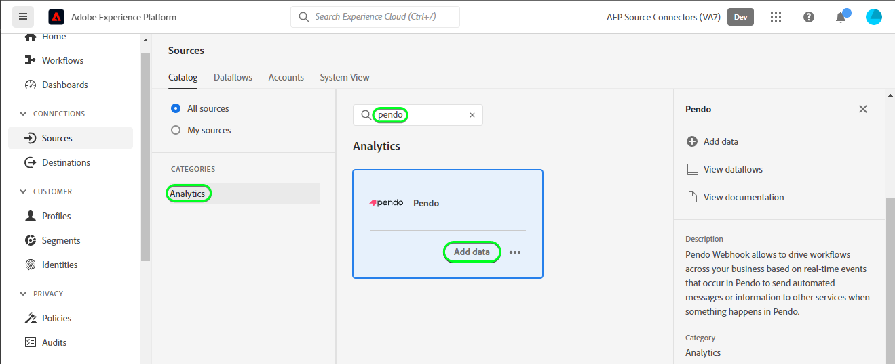

# [!DNL Pendo] 원본 연결 데이터 흐름을 만들고 UI에

>[!NOTE]
>
>[!DNL Pendo] 원본이 Beta 버전입니다. 베타 레이블 소스를 사용하는 방법에 대한 자세한 내용은 [소스 개요](../../../../home.md#terms-and-conditions)를 참조하십시오.

이 자습서에서는 Adobe Experience Platform 사용자 인터페이스를 사용하여 [!DNL Pendo] 소스 연결 및 데이터 흐름을 만드는 단계를 제공합니다.

## 시작하기 {#getting-started}

이 자습서에서는 Experience Platform의 다음 구성 요소를 이해하고 있어야 합니다.

* [[!DNL Experience Data Model (XDM)] 시스템](../../../../../xdm/home.md): [!DNL Experience Platform]에서 고객 경험 데이터를 구성하는 표준화된 프레임워크입니다.
   * [스키마 컴포지션의 기본 사항](../../../../../xdm/schema/composition.md): 스키마 컴포지션의 주요 원칙 및 모범 사례를 포함하여 XDM 스키마의 기본 구성 요소에 대해 알아봅니다.
   * [스키마 편집기 튜토리얼](../../../../../xdm/tutorials/create-schema-ui.md): 스키마 편집기 UI를 사용하여 사용자 지정 스키마를 만드는 방법을 알아봅니다.
* [[!DNL Real-Time Customer Profile]](../../../../../profile/home.md): 여러 원본의 집계된 데이터를 기반으로 통합된 실시간 소비자 프로필을 제공합니다.

## 전제 조건 {#prerequisites}

다음 섹션에서는 [!DNL Pendo] 원본 연결을 만들기 전에 완료해야 하는 필수 구성 요소에 대해 설명합니다.

### [!DNL Pendo]에 대한 소스 스키마를 정의하는 샘플 JSON {#prerequisites-json-schema}

[!DNL Pendo] 원본 연결을 만들기 전에 원본 스키마를 제공해야 합니다. 아래 JSON을 사용할 수 있습니다.

```
{
  "accountId": "58f79ee324d3f",
  "timestamp": 1673372516,
  "visitorId": "test@test.com",
  "uniqueId": "166e50cdf40930fe1367e4d44795c9c74d88b83a",
  "properties": {
    "guideProperties": {
  "name": "Guide Conversion Test"
  }
}
}
```

자세한 내용은 [[!DNL Pendo] Webhooks의 안내서](https://support.pendo.io/hc/en-us/articles/360032285012-Webhooks)를 참조하십시오.

### [!DNL Pendo]에 대한 Experience Platform 스키마 만들기 {#create-platform-schema}

또한 먼저 소스에 사용할 Experience Platform 스키마를 만들어야 합니다. 스키마를 만드는 방법에 대한 포괄적인 단계를 보려면 [Experience Platform 스키마 만들기](../../../../../xdm/schema/composition.md)에 대한 자습서를 참조하십시오.


## [!DNL Pendo] 계정 연결 {#connect-account}

Experience Platform UI의 왼쪽 탐색에서 **[!UICONTROL 소스]**&#x200B;를 선택하여 [!UICONTROL 소스] 작업 영역에 액세스하고 Experience Platform에서 사용할 수 있는 소스 카탈로그를 확인합니다.

*[!UICONTROL 범주]* 메뉴를 사용하여 범주별로 원본을 필터링하세요. 또는 검색 막대에 소스 이름을 입력하여 카탈로그에서 특정 소스를 찾습니다.

[!UICONTROL Analytics] 범주로 이동하여 [!DNL Pendo] 원본 카드를 확인합니다. 시작하려면 **[!UICONTROL 데이터 추가]**&#x200B;를 선택하세요.



## 데이터 선택 {#select-data}

Experience Platform으로 가져올 데이터를 선택할 수 있는 인터페이스를 제공하는 **[!UICONTROL 데이터 선택]** 단계가 나타납니다.

* 인터페이스의 왼쪽 부분은 계정 내에서 사용 가능한 데이터 스트림을 볼 수 있는 브라우저입니다.
* 인터페이스의 오른쪽 부분에서 JSON 파일에서 최대 100개의 데이터 행을 미리 볼 수 있습니다.

로컬 시스템에서 JSON 파일을 업로드하려면 **[!UICONTROL 파일 업로드]**&#x200B;를 선택하십시오. 또는 업로드할 JSON 파일을 [!UICONTROL 파일 끌어다 놓기] 패널로 끌어다 놓을 수 있습니다.


파일이 업로드되면 미리보기 인터페이스가 업데이트되어 업로드한 스키마의 미리보기가 표시됩니다. 미리보기 인터페이스를 사용하여 파일의 내용과 구조를 검사할 수 있습니다. [!UICONTROL 검색 필드] 유틸리티를 사용하여 스키마 내의 특정 항목에 액세스할 수도 있습니다.

완료되면 **[!UICONTROL 다음]**&#x200B;을 선택합니다.


## 데이터 흐름 세부 정보 {#dataflow-detail}

**데이터 흐름 세부 정보** 단계가 표시되어 기존 데이터 집합을 사용하거나 데이터 흐름의 새 데이터 집합을 설정하는 옵션을 제공하고 데이터 흐름의 이름과 설명을 제공할 수 있습니다. 이 단계에서는 프로필 수집, 오류 진단, 부분 수집 및 경고에 대한 설정을 구성할 수도 있습니다.

완료되면 **[!UICONTROL 다음]**&#x200B;을 선택합니다.


## 매핑 {#mapping}

소스 스키마의 소스 필드를 대상 스키마의 해당 대상 XDM 필드에 매핑할 수 있는 인터페이스를 제공하는 [!UICONTROL 매핑] 단계가 나타납니다.

Experience Platform은 선택한 대상 스키마 또는 데이터 세트를 기반으로 자동 매핑된 필드에 대한 지능형 권장 사항을 제공합니다. 사용 사례에 맞게 매핑 규칙을 수동으로 조정할 수 있습니다. 필요에 따라 필드를 직접 매핑하도록 선택하거나 데이터 준비 함수를 사용하여 소스 데이터를 변환하여 계산된 값 또는 계산된 값을 파생할 수 있습니다. 매퍼 인터페이스 및 계산된 필드 사용에 대한 포괄적인 단계는 [데이터 준비 UI 안내서](../../../../../data-prep/ui/mapping.md)를 참조하십시오.

아래 나열된 매핑은 필수이며 [!UICONTROL 검토] 단계로 진행하기 전에 설정해야 합니다.

| 대상 필드 | 설명 |
| --- | --- |
| `uniqueId` | 이벤트의 [!DNL Pendo] 식별자입니다. |

원본 데이터가 성공적으로 매핑되면 **[!UICONTROL 다음]**&#x200B;을(를) 선택하십시오.


## 검토 {#review}

새 데이터 흐름을 만들기 전에 검토할 수 있는 **[!UICONTROL 검토]** 단계가 나타납니다. 세부 사항은 다음 범주 내에서 그룹화됩니다.

* **[!UICONTROL 연결]**: 원본 형식, 선택한 원본 파일의 관련 경로 및 해당 원본 파일에 있는 열의 양을 표시합니다.
* **[!UICONTROL 데이터 집합 및 맵 필드 할당]**: 데이터 집합이 준수하는 스키마를 포함하여 소스 데이터가 수집되는 데이터 집합을 표시합니다.

데이터 흐름을 검토한 후 **[!UICONTROL 완료]**&#x200B;를 선택하고 데이터 흐름이 만들어지도록 잠시 기다립니다.


## 스트리밍 끝점 URL 가져오기 {#get-streaming-endpoint-url}

스트리밍 데이터 흐름이 만들어지면 이제 스트리밍 끝점 URL을 검색할 수 있습니다. 이 끝점은 Webhook에 가입하는 데 사용되며 스트리밍 소스에서 Experience Platform과 통신할 수 있습니다.

[!DNL Pendo]에서 Webhook를 구성하는 데 사용되는 URL을 만들려면 다음을 검색해야 합니다.

* **[!UICONTROL 데이터 흐름 ID]**
* **[!UICONTROL 스트리밍 끝점]**

**[!UICONTROL 데이터 흐름 ID]** 및 **[!UICONTROL 스트리밍 끝점]**&#x200B;을 검색하려면 방금 만든 데이터 흐름의 [!UICONTROL 데이터 흐름 활동] 페이지로 이동하여 [!UICONTROL 속성] 패널 아래쪽에서 세부 정보를 복사합니다.


스트리밍 끝점 및 데이터 흐름 ID를 검색한 후에는 ```{STREAMING_ENDPOINT}?x-adobe-flow-id={DATAFLOW_ID}``` 패턴을 기반으로 URL을 빌드합니다. 예를 들어 구성된 웹후크 URL의 형태는 다음과 같습니다. ```https://dcs.adobedc.net/collection/0c61859cc71939a0caf01123f91b2fc52589018800ad46b6c76c2dff3595ee95```

## [!DNL Pendo]에서 Webhook 설정 {#set-up-webhook}

그런 다음 [[!DNL Pendo]](https://pendo.io/)에서 계정에 로그인하고 웹후크를 만듭니다. [!DNL Pendo] 사용자 인터페이스를 사용하여 웹후크를 만드는 방법에 대한 단계는 [[!DNL Pendo] 웹후크 만들기에 대한 안내서](https://support.pendo.io/hc/en-us/articles/360032285012-Webhooks#create-a-webhook-0-4)를 참조하십시오.

웹후크가 만들어지면 [!DNL Pendo] 웹후크의 설정 페이지로 이동하여 [!DNL URL] 필드에 웹후크 URL을 입력합니다.


>[!TIP]
>
>다양한 이벤트 범주를 구독하여 [!DNL Pendo] 인스턴스에서 Experience Platform으로 보낼 이벤트의 종류를 결정할 수 있습니다. 다른 이벤트에 대한 자세한 내용은 [[!DNL Pendo] 설명서](https://support.pendo.io/hc/en-us/articles/360032285012-Webhooks#create-a-webhook-0-4)를 참조하세요.

## 다음 단계 {#next-steps}

이 자습서를 따라 [!DNL Pendo] 데이터를 Experience Platform으로 가져오기 위한 스트리밍 데이터 흐름을 구성했습니다. 수집되는 데이터를 모니터링하려면 [Experience Platform UI를 사용하여 스트리밍 데이터 흐름 모니터링](../../monitor-streaming.md)에 대한 안내서를 참조하세요.

## 추가 리소스 {#additional-resources}

아래 섹션에서는 [!DNL Pendo] 소스를 사용할 때 참조할 수 있는 추가 리소스를 제공합니다.

### 유효성 검사 {#validation}

원본을 올바르게 설정했는지 확인하고 [!DNL Pendo]개의 메시지가 수집되고 있는지 확인하려면 아래 단계를 수행하십시오.

* [!DNL Pendo] **[!UICONTROL 보고서]** > **[!UICONTROL 채팅 기록]** 페이지에서 [!DNL Pendo]이(가) 캡처하는 이벤트를 확인할 수 있습니다.


* Experience Platform UI에서 소스 카탈로그의 [!DNL Pendo] 카드 메뉴 옆에 있는 **[!UICONTROL 데이터 흐름 보기]**&#x200B;를 선택합니다. 그런 다음 **[!UICONTROL 데이터 집합 미리 보기]**&#x200B;를 선택하여 [!DNL Pendo] 내에 구성한 웹후크에 대해 수집된 데이터를 확인합니다.


### 오류 및 문제 해결 {#errors-and-troubleshooting}

데이터 흐름 실행을 확인할 때 다음 오류 메시지가 표시될 수 있습니다. `The message can't be validated ... uniqueID:expected minLength:1, actual 0].`


이 오류를 해결하려면 *uniqueID* 매핑이 설정되었는지 확인해야 합니다. 추가 지침은 [Mmpping](#mapping) 섹션을 참조하십시오.

자세한 내용은 [[!DNL Pendo] 도움말 센터](https://www.pendo.io/help-center/)를 참조하세요.
