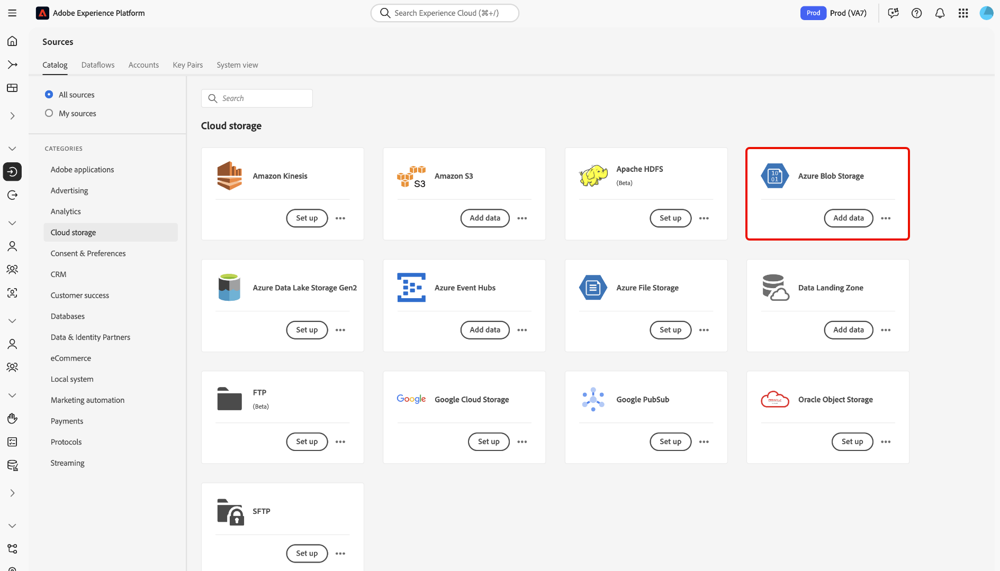
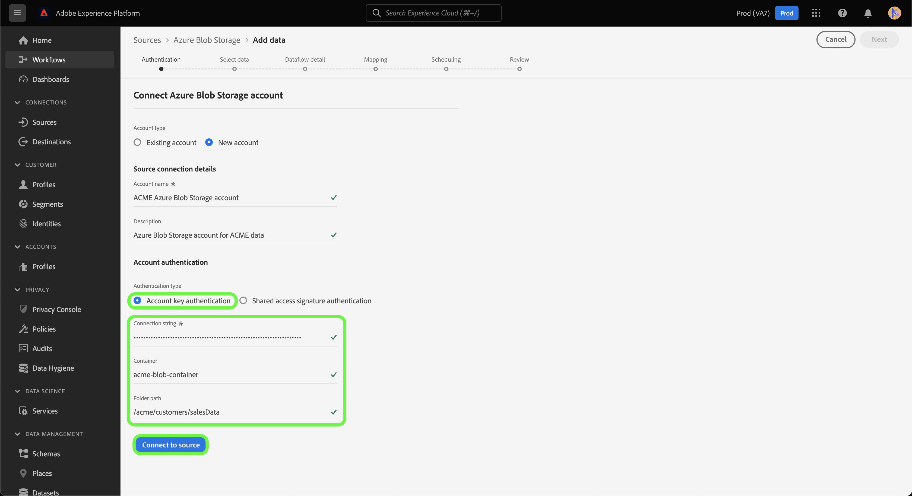
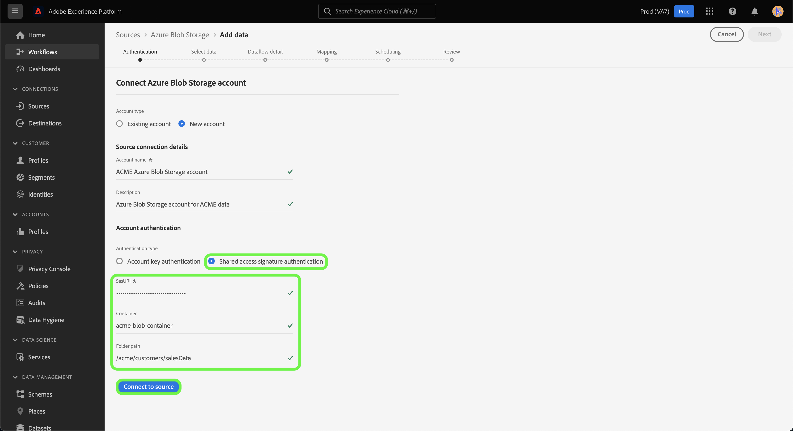

# UI에서 [!DNL Azure Blob] 소스 연결 만들기

이 자습서에서는 Experience Platform 사용자 인터페이스를 사용하여 [!DNL Azure Blob]&#x200B;(이하 &quot;[!DNL Blob]&quot;) 소스 연결을 만드는 단계를 제공합니다.

## 시작하기

이 자습서에서는 Adobe Experience Platform의 다음 구성 요소를 이해하고 있어야 합니다.

* [[!DNL Experience Data Model (XDM)] 시스템](../../../../../xdm/home.md): Experience Platform에서 고객 경험 데이터를 구성하기 위한 표준화된 프레임워크입니다.
   * [스키마 컴포지션의 기본 사항](../../../../../xdm/schema/composition.md): 스키마 컴포지션의 주요 원칙 및 모범 사례를 포함하여 XDM 스키마의 기본 구성 요소에 대해 알아봅니다.
   * [스키마 편집기 튜토리얼](../../../../../xdm/tutorials/create-schema-ui.md): 스키마 편집기 UI를 사용하여 사용자 지정 스키마를 만드는 방법을 알아봅니다.
* [[!DNL Real-Time Customer Profile]](../../../../../profile/home.md): 여러 원본의 집계된 데이터를 기반으로 통합된 실시간 소비자 프로필을 제공합니다.

이미 올바른 [!DNL Blob] 연결이 있는 경우 이 문서의 나머지 부분을 건너뛰고 [데이터 흐름 구성](../../dataflow/batch/cloud-storage.md)에 대한 자습서로 진행할 수 있습니다.

### 지원되는 파일 형식

Experience Platform은 외부 스토리지에서 수집할 다음 파일 형식을 지원합니다.

* 구분 기호로 구분된 값 (DSV): 탭, 쉼표, 파이프, 세미콜론 또는 해시와 같은 단일 열 구분 기호를 사용하여 모든 형식의 플랫 파일을 수집할 수 있습니다.
* JavaScript 개체 표기법(JSON): JSON 형식의 데이터 파일은 XDM을 준수해야 합니다.
* Apache Parquet: Parquet 포맷의 데이터 파일은 XDM을 준수해야 합니다.

### 필요한 자격 증명 수집

Experience Platform에서 [!DNL Blob] 저장소에 액세스하려면 다음 자격 증명에 대한 유효한 값을 제공해야 합니다.

>[!BEGINTABS]

>[!TAB 연결 문자열 인증]

| 자격 증명 | 설명 |
| --- | --- |
| 연결 문자열 | Experience Platform에 [!DNL Blob]을(를) 인증하는 데 필요한 권한 부여 정보가 포함된 문자열입니다. [!DNL Blob] 연결 문자열 패턴은 `DefaultEndpointsProtocol=https;AccountName={ACCOUNT_NAME};AccountKey={ACCOUNT_KEY}`입니다. 연결 문자열에 대한 자세한 내용은 [연결 문자열 구성](https://docs.microsoft.com/en-us/azure/storage/common/storage-configure-connection-string)에서 이 [!DNL Blob] 문서를 참조하십시오. |

>[!TAB SAS URI 인증]

| 자격 증명 | 설명 |
| --- | --- |
| SAS URI | [!DNL Blob] 계정에 연결하는 데 대체 인증 유형으로 사용할 수 있는 공유 액세스 서명 URI입니다. [!DNL Blob] SAS URI 패턴: `https://{ACCOUNT_NAME}.blob.core.windows.net/?sv=<storage version>&st={START_TIME}&se={EXPIRE_TIME}&sr={RESOURCE}&sp={PERMISSIONS}>&sip=<{IP_RANGE}>&spr={PROTOCOL}&sig={SIGNATURE}>` 자세한 내용은 [공유 액세스 서명 URI](https://docs.microsoft.com/en-us/azure/data-factory/connector-azure-blob-storage#shared-access-signature-authentication)에 대한 이 [!DNL Blob] 문서를 참조하십시오. |
| 컨테이너 | 액세스를 지정할 컨테이너의 이름입니다. [!DNL Blob] 원본으로 새 계정을 만들 때 컨테이너 이름을 제공하여 선택한 하위 폴더에 대한 사용자 액세스를 지정할 수 있습니다. |
| 폴더 경로 | 액세스 권한을 제공할 폴더의 경로입니다. |

>[!ENDTABS]

필요한 자격 증명을 수집했으면 아래 단계에 따라 [!DNL Blob] 저장소를 Experience Platform에 연결할 수 있습니다

## [!DNL Blob] 계정 연결

Experience Platform UI의 왼쪽 탐색 모음에서 **[!UICONTROL 소스]**&#x200B;를 선택하여 [!UICONTROL 소스] 작업 영역에 액세스합니다. [!UICONTROL 카탈로그] 화면에 계정을 만들 수 있는 다양한 소스가 표시됩니다.

화면 왼쪽에 있는 카탈로그에서 적절한 카테고리를 선택할 수 있습니다. 또는 검색 창을 사용하여 작업할 특정 소스를 찾을 수 있습니다.

[!UICONTROL 클라우드 저장소] 범주에서 **[!UICONTROL Azure Blob 저장소]**&#x200B;를 선택한 다음 **[!UICONTROL 데이터 추가]**&#x200B;를 선택합니다.

**[!UICONTROL Azure Blob 저장소에 연결]** 페이지가 나타납니다. 이 페이지에서 새 자격 증명 또는 기존 자격 증명을 사용할 수 있습니다.

### 기존 계정

기존 계정을 사용하려면 새 데이터 흐름을 만들 [!DNL Blob] 계정을 선택한 다음 **[!UICONTROL 다음]**&#x200B;을 선택하여 계속합니다.

### 새 계정

>[!TIP]
>
>만든 후에는 [!DNL Blob] 기본 연결의 인증 유형을 변경할 수 없습니다. 인증 유형을 변경하려면 새 기본 연결을 만들어야 합니다.

새 계정을 만드는 경우 **[!UICONTROL 새 계정]**&#x200B;을(를) 선택한 다음 새 [!DNL Blob] 계정에 대한 이름과 선택적 설명을 입력하십시오.

[!DNL Blob] 원본은 계정 키 인증과 SAS(공유 액세스 서명) 인증을 모두 지원합니다. 계정 키 기반 인증에는 확인을 위한 연결 문자열이 필요한 반면 SAS 인증은 계정의 안전한 위임 권한 부여를 허용하는 URI를 사용합니다.

이 단계에서는 컨테이너 이름과 하위 폴더에 대한 경로를 정의하여 계정이 액세스할 하위 폴더를 지정할 수도 있습니다.

>[!BEGINTABS]

>[!TAB 연결 문자열]

계정 키로 인증하려면 **[!UICONTROL 계정 키 인증]**&#x200B;을 선택하고 연결 문자열을 제공하십시오. 이 단계에서 액세스할 하위 폴더의 컨테이너 이름과 경로를 지정할 수도 있습니다. 완료되면 **[!UICONTROL 소스에 연결]**&#x200B;을 선택합니다.

>[!TAB SAS URI]

SAS 기반 인증을 사용하면 권한, 시작 및 만료일을 설정할 수 있을 뿐만 아니라 특정 리소스에 프로비저닝을 할 수 있으므로 SAS를 사용하여 다양한 액세스 수준으로 인증 자격 증명을 만들 수 있습니다.

공유 액세스 서명으로 인증하려면 **[!UICONTROL 공유 액세스 서명 인증]**&#x200B;을 선택한 다음 SAS URI를 제공하십시오. 이 단계에서 액세스할 하위 폴더의 컨테이너 이름과 경로를 지정할 수도 있습니다. 완료되면 **[!UICONTROL 소스에 연결]**&#x200B;을 선택합니다.

>[!ENDTABS]

## 다음 단계

이 자습서에 따라 [!DNL Blob] 계정에 대한 연결을 설정했습니다. 이제 다음 자습서를 계속 진행하고 [클라우드 저장소에서 Experience Platform으로 데이터를 가져오도록 데이터 흐름을 구성](../../dataflow/batch/cloud-storage.md)할 수 있습니다.
