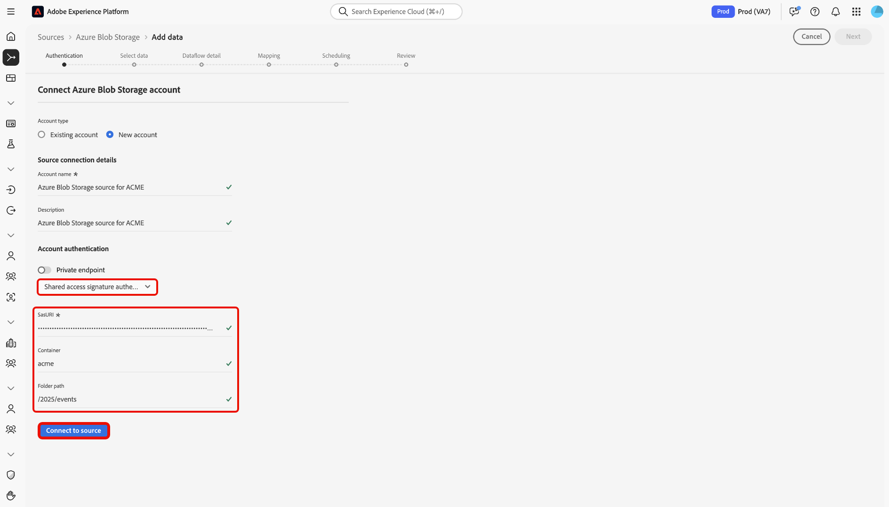

# UI를 사용하여 [!DNL Azure Blob Storage]을(를) Experience Platform에 연결

Experience Platform 사용자 인터페이스의 소스 작업 영역을 사용하여 Adobe Experience Platform에 [!DNL Azure Blob Storage] 인스턴스를 연결하는 방법을 알아보려면 이 안내서를 참조하십시오.

## 시작

이 자습서에서는 Adobe Experience Platform의 다음 구성 요소를 이해하고 있어야 합니다.

* [[!DNL Experience Data Model (XDM)] 시스템](../../../../../xdm/home.md): Experience Platform에서 고객 경험 데이터를 구성하기 위한 표준화된 프레임워크입니다.
   * [스키마 컴포지션의 기본 사항](../../../../../xdm/schema/composition.md): 스키마 컴포지션의 주요 원칙 및 모범 사례를 포함하여 XDM 스키마의 기본 구성 요소에 대해 알아봅니다.
   * [스키마 편집기 튜토리얼](../../../../../xdm/tutorials/create-schema-ui.md): 스키마 편집기 UI를 사용하여 사용자 지정 스키마를 만드는 방법을 알아봅니다.
* [[!DNL Real-Time Customer Profile]](../../../../../profile/home.md): 여러 원본의 집계된 데이터를 기반으로 통합된 실시간 소비자 프로필을 제공합니다.

이미 올바른 [!DNL Azure Blob Storage] 연결이 있는 경우 이 문서의 나머지 부분을 건너뛰고 [데이터 흐름 구성](../../dataflow/batch/cloud-storage.md)에 대한 자습서로 진행할 수 있습니다.

### 지원되는 파일 형식

Experience Platform은 외부 스토리지에서 수집할 다음 파일 형식을 지원합니다.

* 구분 기호로 구분된 값 (DSV): 탭, 쉼표, 파이프, 세미콜론 또는 해시와 같은 단일 열 구분 기호를 사용하여 모든 형식의 플랫 파일을 수집할 수 있습니다.
* JavaScript 개체 표기법(JSON): JSON 형식의 데이터 파일은 XDM을 준수해야 합니다.
* Apache Parquet: Parquet 포맷의 데이터 파일은 XDM을 준수해야 합니다.

### 필요한 자격 증명 수집

인증에 대한 자세한 내용은 [[!DNL Azure Blob Storage] 개요](../../../../connectors/cloud-storage/blob.md#authentication)를 읽어 보십시오.

## 소스 카탈로그 탐색

Experience Platform UI의 왼쪽 탐색에서 **[!UICONTROL 소스]**&#x200B;를 선택하여 *[!UICONTROL 소스]* 작업 영역에 액세스합니다. 카테고리를 선택하거나 검색 창을 사용하여 소스를 찾습니다.

[!DNL Azure Blob Storage]에 연결하려면 *[!UICONTROL 클라우드 저장소]* 범주로 이동하여 **[!UICONTROL Azure Blob 저장소]** 원본 카드를 선택한 다음 **[!UICONTROL 설정]**&#x200B;을 선택하세요.

>[!TIP]
>
>소스에 새 연결에 대한 **[!UICONTROL 설정]** 및 계정이 이미 있는 경우 **[!UICONTROL 데이터 추가]**&#x200B;가 표시됩니다.

## 기존 계정 사용

기존 계정을 사용하려면 **[!UICONTROL 기존 계정]**&#x200B;을(를) 선택한 다음 사용할 [!DNL Azure Blob Storage] 계정을 선택하십시오.

## 새 계정 만들기

새 계정을 만들려면 **[!UICONTROL 새 계정]**&#x200B;을 선택한 다음 이름을 입력하고 필요에 따라 계정에 대한 설명을 추가하십시오. 다음 인증 유형을 사용하여 [!DNL Azure Blob Storage] 계정을 Experience Platform에 연결할 수 있습니다.

* **계정 키 인증**: 저장소 계정의 액세스 키를 사용하여 인증하고 [!DNL Azure Blob Storage] 계정에 연결합니다.
* **SAS(공유 액세스 서명)**: SAS URI를 사용하여 [!DNL Azure Blob Storage] 계정의 리소스에 위임되고 제한된 시간 제한 액세스를 제공합니다.
* **서비스 사용자 기반 인증**: Azure Active Directory(AAD) 서비스 사용자(클라이언트 ID 및 암호)를 사용하여 Azure Blob 저장소 계정을 안전하게 인증합니다.

>[!BEGINTABS]

>[!TAB 계정 키 인증]

**[!UICONTROL 계정 키 인증]**&#x200B;을 선택하고 `connectionString`, `container` 및 `folderPath`을(를) 제공하세요. 그런 다음 **[!UICONTROL 소스에 연결]**&#x200B;을 선택하고 연결을 설정할 수 있도록 잠시 기다립니다.

>[!TAB 공유 액세스 서명]

**[!UICONTROL 공유 액세스 서명]**&#x200B;을(를) 선택하고 `sasUri`, `container` 및 `folderPath`을(를) 제공합니다. 그런 다음 **[!UICONTROL 소스에 연결]**&#x200B;을 선택하고 연결을 설정할 수 있도록 잠시 기다립니다.

>[!TAB 서비스 사용자 기반 인증]

**[!UICONTROL 서비스 사용자 기반 인증]**&#x200B;을 선택하고 `serviceEndpoint`, `servicePrincipalId`, `servicePrincipalKey`, `accountKind`, `tenant`, `container` 및 `folderPath`을(를) 제공합니다. 그런 다음 **[!UICONTROL 소스에 연결]**&#x200B;을 선택하고 연결을 설정할 수 있도록 잠시 기다립니다.

>[!ENDTABS]

## 다음 단계

이 자습서에 따라 [!DNL Azure Blob Storage] 계정에 대한 연결을 설정했습니다. 이제 다음 자습서를 계속 진행하고 [클라우드 저장소에서 Experience Platform으로 데이터를 가져오도록 데이터 흐름을 구성](../../dataflow/batch/cloud-storage.md)할 수 있습니다.
