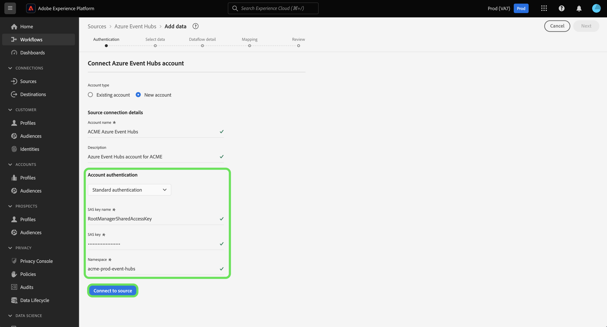

# 만들기 [!DNL Azure Event Hubs] UI의 소스 연결

>[!IMPORTANT]
>
>다음 [!DNL Azure Event Hubs] 소스는 Real-time Customer Data Platform Ultimate를 구매한 사용자에게 소스 카탈로그에서 사용할 수 있습니다.

이 튜토리얼에서는 [!DNL Azure Event Hubs] Adobe Experience Platform 사용자 인터페이스를 사용하는 계정입니다.

## 시작하기

이 자습서에서는 Adobe Experience Platform의 다음 구성 요소를 이해하고 있어야 합니다.

* [[!DNL Experience Data Model (XDM)] 시스템](../../../../../xdm/home.md): 표준화된 프레임워크 [!DNL Experience Platform] 고객 경험 데이터를 구성합니다.
   * [스키마 컴포지션 기본 사항](../../../../../xdm/schema/composition.md): 스키마 컴포지션의 주요 원칙 및 모범 사례를 포함하여 XDM 스키마의 기본 구성 요소에 대해 알아봅니다.
   * [스키마 편집기 튜토리얼](../../../../../xdm/tutorials/create-schema-ui.md): 스키마 편집기 UI를 사용하여 사용자 정의 스키마를 만드는 방법을 알아봅니다.
* [[!DNL Real-Time Customer Profile]](../../../../../profile/home.md): 여러 소스의 집계 데이터를 기반으로 통합 실시간 소비자 프로필을 제공합니다.

이미 유효한 을(를) 가지고 있는 경우 [!DNL Event Hubs] 연결을 통해 이 문서의 나머지 부분을 건너뛰고 다음 튜토리얼을 진행할 수 있습니다. [데이터 흐름 구성](../../dataflow/streaming/cloud-storage-streaming.md).

### 필요한 자격 증명 수집

을(를) 인증하려면 [!DNL Event Hubs] 소스 커넥터에서는 다음 연결 속성에 대한 값을 제공해야 합니다.

>[!BEGINTABS]

>[!TAB 표준 인증]

| 자격 증명 | 설명 |
| --- | --- |
| SAS 키 이름 | SAS 키 이름이라고도 하는 인증 규칙의 이름입니다. |
| SAS 키 | 의 기본 키 [!DNL Event Hubs] 네임스페이스입니다. 다음 `sasPolicy` 해당 `sasKey` 은(는) 다음을 포함해야 합니다. `manage` 에 대해 순서대로 구성된 권한 [!DNL Event Hubs] 채울 목록입니다. |
| 네임스페이스 | 의 네임스페이스 [!DNL Event Hubs] 에 액세스하고 있습니다. An [!DNL Event Hubs] 네임스페이스는 하나 이상을 만들 수 있는 고유한 범위 컨테이너를 제공합니다 [!DNL Event Hubs]. |

>[!TAB SAS 인증]

| 자격 증명 | 설명 |
| --- | --- |
| SAS 키 이름 | SAS 키 이름이라고도 하는 인증 규칙의 이름입니다. |
| SAS 키 | 의 기본 키 [!DNL Event Hubs] 네임스페이스입니다. 다음 `sasPolicy` 해당 `sasKey` 은(는) 다음을 포함해야 합니다. `manage` 에 대해 순서대로 구성된 권한 [!DNL Event Hubs] 채울 목록입니다. |
| 네임스페이스 | 의 네임스페이스 [!DNL Event Hubs] 에 액세스하고 있습니다. An [!DNL Event Hubs] 네임스페이스는 하나 이상을 만들 수 있는 고유한 범위 컨테이너를 제공합니다 [!DNL Event Hubs]. |
| 이벤트 허브 이름 | 에 대한 이름 [!DNL Event Hubs] 소스. |

>[!ENDTABS]

이러한 값에 대한 자세한 내용은 [이 이벤트 허브 문서](https://docs.microsoft.com/en-us/azure/event-hubs/authenticate-shared-access-signature).

필요한 자격 증명을 수집했으면 아래 단계에 따라 를 연결할 수 있습니다. [!DNL Event Hubs] Experience Platform 계정.

## 연결 [!DNL Event Hubs] account

Platform UI에서 를 선택합니다. **[!UICONTROL 소스]** 을(를) 왼쪽 탐색에서 [!UICONTROL 소스] 작업 영역. 다음 [!UICONTROL 카탈로그] 화면에는 계정을 만들 수 있는 다양한 소스가 표시됩니다.

화면 왼쪽에 있는 카탈로그에서 적절한 카테고리를 선택할 수 있습니다. 또는 검색 옵션을 사용하여 작업할 특정 소스를 찾을 수 있습니다.

아래 [!UICONTROL 클라우드 스토리지] 범주, 선택 **[!UICONTROL Azure 이벤트 허브]**&#x200B;을 선택한 다음 을 선택합니다 **[!UICONTROL 데이터 추가]**.

다음 **[!UICONTROL Azure 이벤트 허브에 연결]** 대화 상자가 나타납니다. 이 페이지에서 새 자격 증명 또는 기존 자격 증명을 사용할 수 있습니다.

### 기존 계정

기존 계정을 사용하려면 [!DNL Event Hubs] 사용할 계정을 선택한 다음 **[!UICONTROL 다음]** 계속합니다.

### 새 계정

>[!TIP]
>
>만든 후에는 의 인증 유형을 변경할 수 없습니다. [!DNL Event Hubs] 기본 연결. 인증 유형을 변경하려면 새 기본 연결을 만들어야 합니다.

새 계정을 만들려면 다음을 선택합니다. **[!UICONTROL 새 계정]**&#x200B;을 클릭하고 새 항목의 이름과 설명(선택 사항)을 입력합니다 [!DNL Event Hubs] 계정입니다.

>[!BEGINTABS]

>[!TAB 표준 인증]

을(를) 만들려면 [!DNL Event Hubs] 표준 인증을 사용하는 계정에서 **[!UICONTROL 표준 인증]** 그런 다음 의 값을 제공합니다. [!UICONTROL SAS 키 이름], [!UICONTROL SAS 키], 및 [!UICONTROL 네임스페이스].

인증 자격 증명을 입력했으면 다음을 선택합니다. **[!UICONTROL 소스에 연결]**.

>[!TAB SAS 인증]

을(를) 만들려면 [!DNL Event Hubs] SAS 인증을 사용하여 계정, 선택 **[!UICONTROL SAS 인증]** 그런 다음 의 값을 제공합니다. [!UICONTROL SAS 키 이름], [!UICONTROL SAS 키], [!UICONTROL 네임스페이스], 및 [!UICONTROL 이벤트 허브 이름].

인증 자격 증명을 입력했으면 다음을 선택합니다. **[!UICONTROL 소스에 연결]**.

>[!ENDTABS]

## 다음 단계

이 자습서를 따라 [!DNL Event Hubs] Experience Platform 계정. 이제 다음 튜토리얼을 계속 진행하여 [클라우드 스토리지의 데이터를 Experience Platform으로 가져오도록 데이터 흐름 구성](../../dataflow/streaming/cloud-storage-streaming.md).
