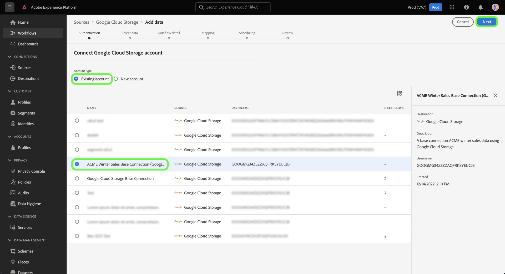

# 만들기 [!DNL Google Cloud Storage] UI의 소스 연결

이 자습서에서는 을(를) 만드는 단계를 제공합니다 [!DNL Google Cloud Storage] Adobe Experience Platform UI를 사용한 소스 연결.

## 시작하기

이 자습서에서는 Adobe Experience Platform의 다음 구성 요소를 이해하고 있어야 합니다.

* [[!DNL Experience Data Model (XDM)] 시스템](../../../../../xdm/home.md): Experience Platform이 고객 경험 데이터를 구성하는 표준화된 프레임워크입니다.
   * [스키마 작성 기본 사항](../../../../../xdm/schema/composition.md): 스키마 컴포지션의 주요 원칙 및 모범 사례를 포함하여 XDM 스키마의 기본 빌딩 블록에 대해 알아봅니다.
   * [스키마 편집기 자습서](../../../../../xdm/tutorials/create-schema-ui.md): 스키마 편집기 UI를 사용하여 사용자 지정 스키마를 만드는 방법을 알아보십시오.
* [[!DNL Real-Time Customer Profile]](../../../../../profile/home.md): 여러 소스에서 집계된 데이터를 기반으로 통합된 실시간 소비자 프로필을 제공합니다.

이미 유효한 [!DNL Google Cloud Storage] 연결을 통해 이 문서의 나머지 부분을 건너뛰고 다음 자습서를 진행할 수 있습니다. [데이터 흐름 구성](../../dataflow/batch/cloud-storage.md).

### 지원되는 파일 형식

[!DNL Experience Platform] 에서는 외부 저장소에서 수집할 다음 파일 형식을 지원합니다.

* 구분 기호로 구분된 값(DSV): 모든 단일 문자 값은 DSV 형식 데이터 파일의 구분 기호로 사용할 수 있습니다.
* JavaScript 개체 표기법(JSON): JSON 형식 데이터 파일은 XDM 규격 파일이어야 합니다.
* Apache Parquet: Parquet 형식 데이터 파일은 XDM 규격 파일이어야 합니다.

### 필요한 자격 증명 수집

에 액세스하려면 [!DNL Google Cloud Storage] 플랫폼의 데이터는 다음 값을 제공해야 합니다.

| 자격 증명 | 설명 |
| ---------- | ----------- |
| 액세스 키 ID | 인증을 위해 사용되는 61자의 영숫자 문자열입니다 [!DNL Google Cloud Storage] Platform에 계정을 설정합니다. |
| 비밀 액세스 키 | 인증을 위해 사용되는 40자의 기본-64로 인코딩된 문자열입니다 [!DNL Google Cloud Storage] Platform에 계정을 설정합니다. |
| 버킷 이름 | 사용자 이름 [!DNL Google Cloud Storage] 버킷. 클라우드 저장소의 특정 하위 폴더에 대한 액세스를 제공하려면 버킷 이름을 지정해야 합니다. |
| 폴더 경로 | 액세스를 제공할 폴더의 경로입니다. |

이러한 값에 대한 자세한 내용은 [Google 클라우드 스토리지 HMAC 키](https://cloud.google.com/storage/docs/authentication/hmackeys#overview) 안내서. 고유한 액세스 키 ID 및 비밀 액세스 키를 생성하는 방법에 대한 단계는 [[!DNL Google Cloud Storage] 개요](../../../../connectors/cloud-storage/google-cloud-storage.md).

필요한 자격 증명을 수집하면 아래 단계에 따라 를 연결할 수 있습니다 [!DNL Google Cloud Storage] Platform에 계정을 설정합니다.

## 연결 [!DNL Google Cloud Storage] account

플랫폼 UI에서 **[!UICONTROL 소스]** 왼쪽 탐색 모음에서 를 클릭하여 [!UICONTROL 소스] 작업 공간. 다음 [!UICONTROL 카탈로그] 화면에 계정을 만들 수 있는 다양한 소스가 표시됩니다.

화면 왼쪽에 있는 카탈로그에서 적절한 카테고리를 선택할 수 있습니다. 또는 검색 옵션을 사용하여 작업할 특정 소스를 찾을 수 있습니다.

아래에 [!UICONTROL 클라우드 스토리지] 카테고리, 선택 **[!UICONTROL Google 클라우드 스토리지]** 그런 다음 **[!UICONTROL 데이터 추가]**.

다음 **[!UICONTROL Google Cloud 스토리지에 연결]** 페이지가 나타납니다. 이 페이지에서 새 자격 증명 또는 기존 자격 증명을 사용할 수 있습니다.

### 기존 계정

기존 계정을 연결하려면 [!DNL Google Cloud Storage] 연결할 계정을 선택한 다음 **[!UICONTROL 다음]** 계속 진행합니다.

### 새 계정

새 자격 증명을 사용하는 경우 **[!UICONTROL 새 계정]**. 표시되는 입력 양식에서 이름, 선택적 설명 및 [!DNL Google Cloud Storage] 자격 증명. 이 단계에서는 하위 폴더에 대한 경로 이름을 정의하여 계정에 액세스할 하위 폴더를 지정할 수도 있습니다.

완료되면 을 선택합니다 **[!UICONTROL 소스에 연결]** 그런 다음 새 연결이 설정될 시간을 허용합니다.

## 다음 단계

이 자습서에 따라 [!DNL Google Cloud Storage] 계정이 필요합니다. 이제 다음 자습서를 계속 진행하고 [클라우드 저장소에서 플랫폼으로 데이터를 가져오도록 데이터 흐름 구성](../../dataflow/batch/cloud-storage.md).
