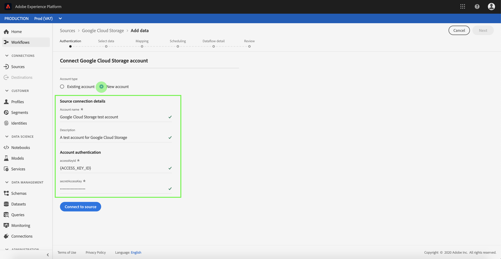

# UI에 [!DNL Google Cloud Storage] 소스 연결 만들기

Adobe Experience Platform의 소스 커넥터는 예약된 기준에 따라 외부 소스 데이터를 인제스트하는 기능을 제공합니다. 이 자습서에서는 [!DNL Platform] 사용자 인터페이스를 사용하여 [!DNL Google Cloud Storage](이하 &quot;GCS&quot;) 소스 커넥터를 만드는 단계를 제공합니다.

## 시작하기

이 자습서에서는 Adobe Experience Platform의 다음 구성 요소에 대해 작업해야 합니다.

* [[!DNL Experience Data Model (XDM)] 시스템](../../../../../xdm/home.md):Experience Platform이 고객 경험 데이터를 구성하는 표준화된 프레임워크입니다.
   * [스키마 컴포지션의 기본 사항](../../../../../xdm/schema/composition.md):스키마 컴포지션의 주요 원칙 및 모범 사례를 포함하여 XDM 스키마의 기본 구성 블록에 대해 알아봅니다.
   * [스키마 편집기 자습서](../../../../../xdm/tutorials/create-schema-ui.md):스키마 편집기 UI를 사용하여 사용자 정의 스키마를 생성하는 방법을 알아봅니다.
* [[!DNL Real-time Customer Profile]](../../../../../profile/home.md):여러 소스에서 집계된 데이터를 기반으로 통합된 실시간 소비자 프로필을 제공합니다.

이미 유효한 GCS 연결이 있는 경우 이 문서의 나머지 부분을 건너뛰고 [데이터 흐름 구성](../../dataflow/batch/cloud-storage.md)에서 자습서로 진행할 수 있습니다.

### 지원되는 파일 형식

[!DNL Experience Platform] 외부 저장소에서 인제스트할 다음 파일 형식을 지원합니다.

* 구분 기호 구분 값(DSV):DSV 형식 데이터 파일에 대한 지원은 현재 쉼표로 구분된 값으로 제한됩니다. DSV 형식 파일 내의 필드 헤더 값은 영숫자 문자와 밑줄로만 구성되어야 합니다. 일반 DSV 파일에 대한 지원은 나중에 제공될 예정입니다.
* JavaScript 개체 표기법(JSON):JSON 형식 데이터 파일은 XDM 규격이어야 합니다.
* Apache Parided:쪽모이 세공된 형식의 데이터 파일은 XDM 규격이어야 합니다.

### 필요한 자격 증명 수집

[!DNL Platform]의 GCS 데이터에 액세스하려면 다음 값을 제공해야 합니다.

| 자격 증명 | 설명 |
| ---------- | ----------- |
| 액세스 키 ID | 플랫폼에 대한 [!DNL Google Cloud Storage] 계정을 인증하는 데 사용되는 61자의 영숫자 문자열입니다. |
| 비밀 액세스 키 | 플랫폼에 대한 [!DNL Google Cloud Storage] 계정을 인증하는 데 사용되는 40자의 기본-64로 인코딩된 문자열. |

이러한 값에 대한 자세한 내용은 [Google Cloud 저장소 HMAC 키](https://cloud.google.com/storage/docs/authentication/hmackeys#overview) 안내서를 참조하십시오. 자신의 액세스 키 ID 및 비밀 액세스 키를 생성하는 방법에 대한 자세한 내용은 [[!DNL Google Cloud Storage] overview](../../../../connectors/cloud-storage/google-cloud-storage.md)을 참조하십시오.

## [!DNL Google Cloud Storage] 계정 연결

필요한 자격 증명을 수집했으면 아래 절차에 따라 GCS 계정을 [!DNL Platform]에 연결할 수 있습니다.

[Adobe Experience Platform](https://platform.adobe.com)에 로그인한 다음 왼쪽 탐색 막대에서 **[!UICONTROL Sources]**&#x200B;를 선택하여 **[!UICONTROL Sources]** 작업 영역에 액세스합니다. **[!UICONTROL Catalog]** 화면에는 계정을 만들 수 있는 다양한 소스가 표시됩니다.

화면의 왼쪽에 있는 카탈로그에서 적절한 범주를 선택할 수 있습니다. 또는 검색 옵션을 사용하여 작업할 특정 소스를 찾을 수 있습니다.

**[!UICONTROL Databases]** 범주에서 **[!UICONTROL Google Cloud Storage]**&#x200B;을 선택합니다. 이 커넥터를 처음 사용하는 경우 **[!UICONTROL Configure]** 을 선택합니다. 그렇지 않은 경우 **[!UICONTROL Add data]**&#x200B;을 선택하여 새 GCS 커넥터를 만듭니다.

**[!UICONTROL Connect to Google Cloud Storage]** 페이지가 나타납니다. 이 페이지에서 새 자격 증명이나 기존 자격 증명을 사용할 수 있습니다.

### 새 계정

새 자격 증명을 사용 중인 경우 **[!UICONTROL New account]**&#x200B;을 선택합니다. 표시되는 입력 양식에서 이름, 선택적 설명 및 GCS 자격 증명을 제공합니다. 완료되면 **[!UICONTROL Connect]**&#x200B;을 선택한 다음 새 연결이 설정될 때까지 잠시 기다려 주십시오.

### 기존 계정

기존 계정을 연결하려면 연결하려는 GCS 계정을 선택한 다음 계속하려면 **[!UICONTROL Next]**&#x200B;을 선택합니다.

## 다음 단계

이 튜토리얼을 따라 GCS 계정에 대한 연결을 설정했습니다. 이제 다음 튜토리얼을 계속 진행할 수 있으며 [데이터 흐름 구성을 통해 클라우드 스토리지의 데이터를 [!DNL Platform]](../../dataflow/batch/cloud-storage.md)로 가져올 수 있습니다.