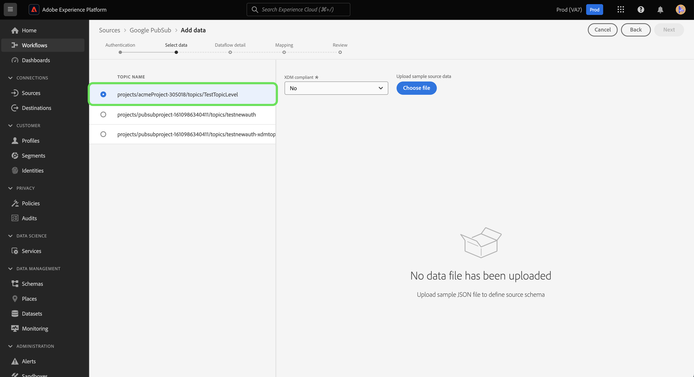

# 만들기 [!DNL Google PubSub] UI의 소스 연결

이 자습서에서는 다음을 만드는 단계를 제공합니다 [!DNL Google PubSub] (이하 &quot;라고 한다)[!DNL PubSub]&quot;) Platform 사용자 인터페이스를 사용합니다.

## 시작하기

이 자습서에서는 Adobe Experience Platform의 다음 구성 요소를 이해하고 있어야 합니다.

* [소스](../../../../home.md): Experience Platform을 사용하면 플랫폼 서비스를 사용하여 들어오는 데이터를 구조화하고, 레이블을 지정하고, 개선할 수 있는 기능을 제공하면서 다양한 소스에서 데이터를 수집할 수 있습니다.
* [샌드박스](../../../../../sandboxes/home.md): Experience Platform은 디지털 경험 애플리케이션을 개발하고 발전시키는 데 도움이 되는 단일 플랫폼 인스턴스를 별도의 가상 환경으로 분할하는 가상 샌드박스를 제공합니다.

이미 유효한 을(를) 가지고 있는 경우 [!DNL PubSub] 연결을 통해 이 문서의 나머지 부분을 건너뛰고 다음 튜토리얼을 진행할 수 있습니다. [데이터 흐름 구성](../../dataflow/batch/cloud-storage.md).

### 필요한 자격 증명 수집

연결하려면 [!DNL PubSub] 플랫폼에 다음 자격 증명에 대한 유효한 값을 제공해야 합니다.

| 자격 증명 | 설명 |
| ---------- | ----------- |
| 프로젝트 ID | 인증에 필요한 프로젝트 ID [!DNL PubSub]. |
| 자격 증명 | 인증에 필요한 자격 증명 또는 개인 키 ID [!DNL PubSub]. |
| 주제 이름 | 의 이름 [!DNL PubSub] 구독. 위치 [!DNL PubSub]가입을 사용하면 메시지가 게시된 주제를 구독하여 메시지를 받을 수 있습니다. **참고**: 단일 [!DNL PubSub] 구독은 하나의 데이터 흐름에만 사용할 수 있습니다. 여러 데이터 흐름을 만들려면 구독이 여러 개 있어야 합니다. |
| 구독 이름 | 의 이름 [!DNL PubSub] 구독. 위치 [!DNL PubSub]가입을 사용하면 메시지가 게시된 주제를 구독하여 메시지를 받을 수 있습니다. |

이러한 값에 대한 자세한 내용은 다음을 참조하십시오 [PubSub 인증](https://cloud.google.com/pubsub/docs/authentication) 문서. 서비스 계정 기반 인증을 사용하는 경우 다음을 참조하십시오 [PubSub 안내서](https://cloud.google.com/docs/authentication/production#create_service_account) 자격 증명을 생성하는 방법에 대한 단계입니다.

>[!TIP]
>
>서비스 계정 기반 인증을 사용하는 경우 자격 증명을 복사하고 붙여넣을 때 서비스 계정에 대한 충분한 사용자 액세스 권한을 부여했는지 그리고 JSON에 추가 공백이 없는지 확인하십시오.

필요한 자격 증명을 수집했으면 아래 단계에 따라 를 연결할 수 있습니다. [!DNL PubSub] 계정을 플랫폼에 추가합니다.

## 연결 [!DNL PubSub] account

Platform UI에서 를 선택합니다. **[!UICONTROL 소스]** 을(를) 왼쪽 탐색에서 [!UICONTROL 소스] 작업 영역. 다음 [!UICONTROL 카탈로그] 화면에는 계정을 만들 수 있는 다양한 소스가 표시됩니다.

화면 왼쪽에 있는 카탈로그에서 적절한 카테고리를 선택할 수 있습니다. 또는 검색 옵션을 사용하여 작업할 특정 소스를 찾을 수 있습니다.

아래 [!UICONTROL 클라우드 스토리지] 범주, 선택 **[!UICONTROL Google Pubsub]**&#x200B;을 선택한 다음 을 선택합니다 **[!UICONTROL 데이터 추가]**.

다음 **[!UICONTROL Google PubSub에 연결]** 페이지가 나타납니다. 이 페이지에서 새 자격 증명 또는 기존 자격 증명을 사용할 수 있습니다.

### 기존 계정

기존 계정을 사용하려면 [!DNL PubSub] 새 데이터 흐름을 만들 계정 을 선택합니다. **[!UICONTROL 다음]** 계속합니다.

### 새 계정

>[!TIP]
>
>액세스 권한이 제한된 계정을 만들 때 주제 이름이나 구독 이름 중 하나 이상을 제공해야 합니다. 두 값이 모두 누락된 경우 인증이 실패합니다.

새 계정을 만드는 경우 다음을 선택합니다 **[!UICONTROL 새 계정]**&#x200B;을 클릭하고 새 항목의 이름과 설명(선택 사항)을 입력합니다 [!DNL PubSub] 계정입니다.

다음 [!DNL PubSub] 소스를 사용하면 인증 중에 허용할 액세스 유형을 지정할 수 있습니다. 프로젝트 기반 인증 또는 주제 및 구독 기반 인증을 갖도록 계정을 설정할 수 있습니다. 프로젝트 기반 인증을 사용하면 계정의 루트 수준 프로젝트에 대한 액세스 권한을 부여할 수 있고 주제 및 구독 기반 인증을 사용하면 특정 프로젝트에 대한 액세스 권한을 제한할 수 있습니다 [!DNL PubSub] 주제 및 구독.

>[!BEGINTABS]

>[!TAB 프로젝트 기반 인증]

루트에 액세스할 수 있는 계정을 만들려면 [!DNL PubSub] 프로젝트 폴더. 선택 **[!UICONTROL Google PubSub 인증 자격 증명]** 를 인증 유형으로 사용하고 프로젝트 ID 및 자격 증명을 제공합니다. 완료되면 다음을 선택합니다. **[!UICONTROL 소스에 연결]** 그런 다음 새 연결을 설정하는 데 시간이 걸릴 수 있습니다.

>[!TAB 주제 및 구독 기반 인증]

특정 항목에 대해서만 제한된 액세스 권한을 가진 계정을 만들려면 [!DNL PubSub] 주제 및 가입, 선택 **[!UICONTROL Google PubSub 범위 인증 자격 증명]** 자격 증명, 주제 이름 및/또는 구독 이름을 제공하십시오. 완료되면 다음을 선택합니다. **[!UICONTROL 소스에 연결]** 그런 다음 새 연결을 설정하는 데 시간이 걸릴 수 있습니다.

>[!ENDTABS]

>[!NOTE]
>
>에 할당된 사용자(역할) [!DNL PubSub] 프로젝트는 내에서 생성된 모든 주제 및 구독에서 상속됩니다. [!DNL PubSub] 프로젝트. 주도자(역할)가 특정 주제에 액세스할 수 있도록 하려면 해당 주도자(역할)도 주제의 해당 구독에 추가해야 합니다. 자세한 내용은 [[!DNL PubSub] 액세스 제어에 대한 설명서](<https://cloud.google.com/pubsub/docs/access-control>).

## 데이터 선택

인증이 성공하면 다음으로 이동합니다. [!UICONTROL 데이터 선택] 단계를 통해 탐색할 수 있습니다. [!DNL PubSub] 데이터 계층 구조를 사용하고 Experience Platform으로 가져올 데이터를 선택합니다.

>[!BEGINTABS]

>[!TAB 프로젝트 기반 인증]

프로젝트 기반 액세스로 인증한 경우 [!UICONTROL 데이터 선택] 인터페이스는 프로젝트 내에 주제가 첨부된 모든 구독을 표시합니다.

>[!TAB 주제 및 구독 기반 인증]

항목 및 구독 기반 액세스 권한으로 을 인증한 경우 [!UICONTROL 데이터 선택] 제공된 정보에 따라 인터페이스 표시가 달라질 수 있습니다.

* 주제 이름만 제공하면 제공된 주제에 해당하는 모든 주제-가입 쌍이 인터페이스에 표시됩니다.
* 가입 이름만 제공하면 제공된 가입 이름에 해당하는 모든 주제-가입 쌍이 인터페이스에 표시됩니다.
* 주제 및 가입 이름이 모두 제공되면 제공된 두 값에 해당하는 주제-가입 쌍이 인터페이스에 표시됩니다.

>[!ENDTABS]

## 다음 단계

이 자습서를 따라 [!DNL PubSub] 계정과 플랫폼. 이제 다음 튜토리얼을 계속 진행하여 [클라우드 스토리지의 스트리밍 데이터를 플랫폼으로 가져오도록 데이터 흐름을 구성합니다.](../../dataflow/streaming/cloud-storage-streaming.md).
