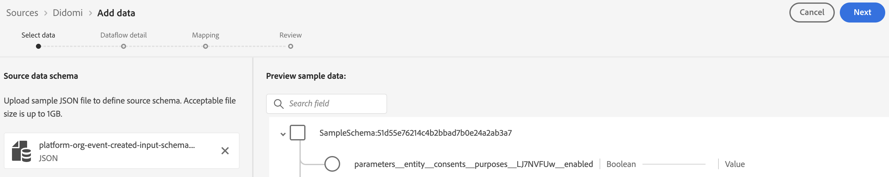

# Experience Platform에 [!DNL Didomi] 연결

UI의 소스 작업 영역을 사용하여 [!DNL Didomi] 계정을 Adobe Experience Platform에 연결하는 방법을 알아보려면 이 안내서를 참조하십시오.

>[!IMPORTANT]
>
>* 이 문서 페이지는 *Didomi* 팀에서 만들었습니다. 문의 사항이나 업데이트 요청은 *support@didomi.io*&#x200B;로 직접 연락하십시오.
>* 연결 생성에 대한 단계별 지침은 [Didomi Adobe 소스 커넥터 설명서](https://developers.didomi.io/integrations/third-party-apps/preference-management-platform-integrations/Adobe-source-connector)를 참조하십시오.

## 시작

이 자습서에서는 Adobe Experience Platform의 다음 구성 요소를 이해하고 있어야 합니다.

* [[!DNL Experience Data Model (XDM)] 시스템](../../../../../xdm/home.md): Experience Platform에서 고객 경험 데이터를 구성하는 표준화된 프레임워크입니다.
   * [스키마 컴포지션의 기본 사항](../../../../../xdm/schema/composition.md): 스키마 컴포지션의 주요 원칙 및 모범 사례를 포함하여 XDM 스키마의 기본 구성 요소에 대해 알아봅니다.
   * [스키마 편집기 튜토리얼](../../../../../xdm/tutorials/create-schema-ui.md): 스키마 편집기 UI를 사용하여 사용자 지정 스키마를 만드는 방법을 알아봅니다.
* [[!DNL Real-Time Customer Profile]](../../../../../profile/home.md): 여러 원본의 집계된 데이터를 기반으로 통합된 실시간 소비자 프로필을 제공합니다.

### [!DNL Didomi] 계정 설정

계속하려면 [[!DNL Didomi] 개요](../../../../connectors/consent-and-preferences/didomi.md#prerequisites)에 설명된 필수 구성 요소 단계를 읽고 완료하여 계정을 Experience Platform에 연결하십시오.

## 소스 카탈로그 탐색

Experience Platform UI의 왼쪽 탐색에서 **[!UICONTROL 소스]**&#x200B;를 선택하여 *[!UICONTROL 소스]* 작업 영역에 액세스합니다. 카테고리를 선택하거나 검색 창을 사용하여 소스를 찾습니다.

[!DNL Didomi]에 연결하려면 *[!UICONTROL 데이터베이스]* 범주로 이동하여 **[!UICONTROL Didomi]** 원본 카드를 선택한 다음 **[!UICONTROL 설정]**&#x200B;을 선택하십시오.

>[!TIP]
>
>지정된 소스에 아직 인증된 계정이 없는 경우 소스 카탈로그의 소스에 **[!UICONTROL 설정]** 옵션이 표시됩니다. 인증된 계정을 만들면 이 옵션이 **[!UICONTROL 데이터 추가]**(으)로 변경됩니다.

## 소스 데이터 스키마 추가

그런 다음 *[!UICONTROL 데이터 선택]* 인터페이스를 사용하여 [사전 요구 단계](../../../../connectors/consent-and-preferences/didomi.md#download-the-sample-payload-file)에서 다운로드한 JSON 파일을 업로드합니다.

미리 보기 인터페이스를 사용하여 페이로드의 파일 구조를 볼 수 있습니다. 완료되면 **[!UICONTROL 다음]**&#x200B;을 선택합니다.

## 데이터 흐름 세부 정보 제공

그런 다음 데이터 세트 및 데이터 흐름에 대한 정보를 제공해야 합니다.

### 데이터 세트 세부 정보

데이터 세트는 스키마(열) 및 필드(행)를 포함하는 데이터 수집을 위한 저장소 및 관리 구조입니다. Experience Platform에 성공적으로 수집된 데이터는 데이터 세트로 데이터 레이크 내에 유지됩니다.

이 단계에서는 기존 데이터 세트를 사용하거나 새 데이터 세트를 만들 수 있습니다.

>[!NOTE]
>
>기존 데이터 집합을 사용하는지 또는 새 데이터 집합을 만드는지 여부에 관계없이 데이터 집합이 **프로필** 수집에 대해 활성화되었는지 확인해야 합니다.

+++프로필 수집, 오류 진단 및 부분 수집을 활성화하는 단계를 선택합니다.

Real-Time Customer Profile에 대해 데이터 세트를 사용하도록 설정한 경우 이 단계에서 **[!UICONTROL 프로필 데이터 세트]**&#x200B;를 전환하여 프로필 수집을 위해 데이터를 사용하도록 설정할 수 있습니다. 이 단계를 사용하여 **[!UICONTROL 오류 진단]** 및 **[!UICONTROL 부분 수집]**&#x200B;을 사용하도록 설정할 수도 있습니다.

* **[!UICONTROL 오류 진단]**: **[!UICONTROL 오류 진단]**&#x200B;을 선택하여 데이터 집합 활동 및 데이터 흐름 상태를 모니터링할 때 나중에 참조할 수 있는 오류 진단을 생성하도록 소스에 지시합니다.
* **[!UICONTROL 부분 수집]**: 부분 일괄 처리 수집은 구성 가능한 특정 임계값까지 오류가 포함된 데이터를 수집하는 기능입니다. 이 기능을 사용하면 모든 정확한 데이터를 Experience Platform에 성공적으로 수집할 수 있으며 잘못된 데이터는 모두 잘못된 이유에 대한 정보로 별도로 배치됩니다.

+++

### 데이터 흐름 세부 정보

데이터 세트가 구성되면 이름, 선택적 설명 및 경고 구성을 포함하여 데이터 흐름에 대한 세부 정보를 제공해야 합니다.

| 데이터 흐름 구성 | 설명 |
| --- | --- |
| 데이터 흐름 이름 | 데이터 흐름의 이름입니다.  기본적으로 가져올 파일의 이름이 사용됩니다. |
| 설명 | (선택 사항) 데이터 흐름에 대한 간략한 설명입니다. |
| 경고 | Experience Platform은 사용자가 구독할 수 있는 이벤트 기반 경고를 생성할 수 있습니다. 이러한 옵션은 모두 실행 중인 데이터 흐름으로 이러한 경고를 트리거합니다.  자세한 내용은 [경고 개요](../../alerts.md)를 참조하세요. <ul><li>**원본 데이터 흐름 실행 시작**: 데이터 흐름 실행이 시작될 때 알림을 받으려면 이 경고를 선택하십시오.</li><li>**소스 데이터 흐름 실행 성공**: 데이터 흐름이 오류 없이 종료될 경우 알림을 받으려면 이 경고를 선택하십시오.</li><li>**원본 데이터 흐름 실행 실패**: 데이터 흐름 실행이 오류로 인해 종료되는 경우 알림을 받으려면 이 경고를 선택하십시오.</li></ul> |

{style="table-layout:auto"}

## 매핑

Experience Platform으로 데이터를 수집하기 전에 매핑 인터페이스를 사용하여 소스 데이터를 적절한 스키마 필드에 매핑합니다.  자세한 내용은 UI의 [매핑 가이드](../../../../../data-prep/ui/mapping.md)를 참조하세요.

매핑은 특히 **에서 Experience Platform 데이터 세트로**&#x200B;목적 데이터[!DNL Didomi]를 전송하는 데 사용됩니다. 이러한 목적은 사용자의 동의 선택(예: 분석, 개인화, 광고 등)을 나타내며 이 통합에서 유일하게 허용되는 매핑 필드입니다.

[ 웹후크 설정에서 다운로드한 ](../../../../connectors/consent-and-preferences/didomi.md#download-the-sample-payload-file)샘플 웹후크 페이로드[!DNL Didomi]를 사용하여 각 [!DNL Didomi] 목적을 Adobe 데이터 세트의 해당 필드에 매핑하십시오.

완료되면 **[!UICONTROL 다음]**&#x200B;을 선택합니다.

## 검토

*[!UICONTROL 검토]* 단계가 표시되어 데이터 흐름을 만들기 전에 세부 사항을 검토할 수 있습니다. 세부 사항은 다음 범주 내에서 그룹화됩니다.

* **[!UICONTROL 연결]**: 계정 이름, 원본 플랫폼 및 원본 이름을 표시합니다.
* **[!UICONTROL 데이터 집합 및 맵 필드 할당]**: 대상 데이터 집합과 데이터 집합이 준수하는 스키마를 표시합니다.

세부 정보가 올바른지 확인한 후 **[!UICONTROL 마침]**&#x200B;을 선택합니다.

## 스트리밍 끝점 URL 검색

연결이 생성되면 소스 세부 정보 페이지가 나타납니다. 이 페이지에는 이전에 실행한 데이터 흐름, ID 및 스트리밍 끝점 URL을 포함하여 새로 생성된 연결의 세부 정보가 표시됩니다.

## Adobe에서 구성 완료

데이터 흐름이 만들어지면 *[!UICONTROL 소스]* 카탈로그로 이동한 다음 **[!UICONTROL 데이터 흐름]**&#x200B;을 선택하십시오. 데이터 흐름 디렉터리를 사용하여 [!DNL Didomi] 데이터 흐름을 찾고 *[!UICONTROL 데이터 흐름 활동]* 인터페이스에 액세스합니다. 그런 다음 오른쪽 레일의 *[!UICONTROL 속성]* 패널을 사용하여 다음 값을 검색합니다.

* [!UICONTROL 스트리밍 끝점]
* [!UICONTROL 데이터 흐름 ID]

Experience Platform UI에서:

1. 구성을 완료한 후 초기 Webhook 설정에서 누락된 구성 매개변수를 검토하십시오.
2. 이러한 값을 사용할 수 있게 되면 Didomi로 돌아가서 웹후크 구성을 업데이트합니다.

## Webhook 구성 업데이트

구성이 완료되면 [!DNL Didomi] 콘솔로 다시 이동하여 **스트리밍 끝점 URL** 및 **데이터 흐름 ID**(으)로 Webhook 구성을 업데이트합니다.

이 작업이 완료되면 [!DNL Didomi]이(가) 통합을 통해 동의 관리 및 환경 설정 관리 이벤트를 보내기 시작하고 데이터가 Adobe 데이터 집합에 저장됩니다.

## 다음 단계

이 자습서를 따라 [!DNL Didomi] 소스에서 Experience Platform으로 일괄 처리 데이터를 가져오는 데이터 흐름을 만들었습니다. 추가 리소스는 아래 설명된 설명서를 참조하십시오.

### 데이터 흐름 모니터링

데이터 흐름이 만들어지면 데이터 흐름을 통해 수집되는 데이터를 모니터링하여 수집 비율, 성공 및 오류에 대한 정보를 볼 수 있습니다. 데이터 흐름을 모니터링하는 방법에 대한 자세한 내용은 [UI에서 계정 및 데이터 흐름 모니터링](../../../../../dataflows/ui/monitor-sources.md)에 대한 자습서를 참조하십시오.

### 데이터 흐름 업데이트

데이터 흐름 예약, 매핑 및 일반 정보에 대한 구성을 업데이트하려면 [UI에서 소스 데이터 흐름 업데이트](../../update-dataflows.md)에 대한 자습서를 참조하십시오.

### 데이터 흐름 삭제

**[!UICONTROL 데이터 흐름]** 작업 영역에서 사용할 수 있는 **[!UICONTROL Delete]** 함수를 사용하여 더 이상 필요하지 않거나 잘못 만들어진 데이터 흐름을 삭제할 수 있습니다. 데이터 흐름을 삭제하는 방법에 대한 자세한 내용은 [UI에서 데이터 흐름 삭제](../../delete.md)에 대한 자습서를 참조하십시오.
