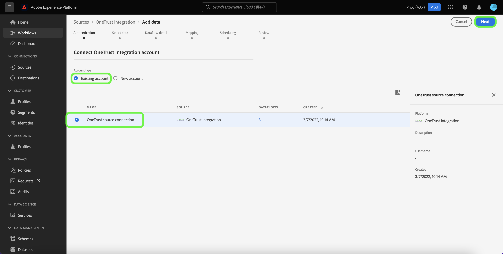

# UI에서 [!DNL OneTrust Integration] 소스 연결 만들기

>[!NOTE]
>
>[!DNL OneTrust Integration] 원본은 동의 및 환경 설정 데이터 수집만 지원하며 쿠키는 지원하지 않습니다.

이 자습서에서는 Platform 사용자 인터페이스를 사용하여 기록 데이터와 예약된 동의 데이터를 모두 Adobe Experience Platform으로 수집하기 위해 [[!DNL OneTrust Integration]](https://my.onetrust.com/s/contactsupport?language=en_US) 소스 연결을 만드는 단계를 제공합니다.

## 전제 조건

>[!IMPORTANT]
>
>[!DNL OneTrust Integration] 팀에서 [!DNL OneTrust Integration] 소스 커넥터 및 설명서를 만들었습니다. 문의 사항이나 업데이트 요청은 [[!DNL OneTrust] 팀](https://my.onetrust.com/s/contactsupport?language=en_US)에 직접 문의하십시오.

[!DNL OneTrust Integration]을(를) 플랫폼에 연결하려면 먼저 액세스 토큰을 검색해야 합니다. 액세스 토큰을 찾는 방법에 대한 자세한 지침은 [[!DNL OneTrust Integration] OAuth 2 안내서](https://developer.onetrust.com/docs/api-docs-v3/b3A6MjI4OTUyOTc-generate-access-token)를 참조하십시오.

[!DNL OneTrust]에서 시스템 간 새로 고침 토큰을 지원하지 않으므로 액세스 토큰이 만료된 후 자동으로 새로 고쳐지지 않습니다. 따라서 액세스 토큰이 만료되기 전에 연결에서 업데이트되었는지 확인해야 합니다. 액세스 토큰의 최대 구성 가능한 수명은 1년입니다. 액세스 토큰 업데이트에 대한 자세한 내용은 [[!DNL OneTrust] OAuth 2.0 클라이언트 자격 증명 관리에 대한 문서](https://developer.onetrust.com/docs/documentation/ZG9jOjIyODk1MTUw-managing-o-auth-2-0-client-credentials)를 참조하십시오.

### 필요한 자격 증명 수집

[!DNL OneTrust Integration]을(를) 플랫폼에 연결하려면 다음 인증 자격 증명의 값을 제공해야 합니다.

| 자격 증명 | 설명 | 예 |
| --- | --- | --- |
| 호스트 이름 | [!DNL OneTrust Integration] 데이터를 가져올 환경입니다. | `app.onetrust.com` |
| 인증 테스트 URL | (선택 사항) 인증 테스트 URL은 기본 연결을 만들 때 자격 증명의 유효성을 검사하는 데 사용됩니다. 제공되지 않으면 소스 연결 생성 단계에서 자격 증명이 자동으로 확인됩니다. | |
| 액세스 토큰 | [!DNL OneTrust Integration] 계정에 해당하는 액세스 토큰입니다. | `ZGFkZDMyMjFhMmEyNDQ2ZGFhNTdkZjNkZjFmM2IyOWE6QjlUSERVUTNjOFVsRmpEZTJ6Vk9oRnF3Sk8xNlNtcm4=` |

이러한 자격 증명에 대한 자세한 내용은 [[!DNL OneTrust Integration] 인증 설명서](https://developer.onetrust.com/docs/api-docs-v3/b3A6MjI4OTUyOTc-generate-access-token)를 참조하세요.

## [!DNL OneTrust Integration] 계정 연결

>[!NOTE]
>
>[!DNL OneTrust Integration] API 사양이 데이터 수집을 위해 Adobe과 공유되고 있습니다.

Platform UI의 왼쪽 탐색에서 **[!UICONTROL 소스]**&#x200B;를 선택하여 Experience Platform에서 사용할 수 있는 소스 카탈로그의 [!UICONTROL 소스] 작업 영역에 액세스합니다.

*[!UICONTROL 범주]* 메뉴를 사용하여 범주별로 원본을 필터링하세요. 또는 검색 막대에 소스 이름을 입력하여 카탈로그에서 특정 소스를 찾습니다.

[!DNL OneTrust Integration] 원본 카드의 [!UICONTROL 동의 및 환경 설정] 범주로 이동합니다. 시작하려면 **[!UICONTROL 데이터 추가]**&#x200B;를 선택하세요.

**[!UICONTROL OneTrust 통합 계정 연결]** 페이지가 나타납니다. 이 페이지에서 새 자격 증명 또는 기존 자격 증명을 사용할 수 있습니다.

### 기존 계정

기존 계정을 사용하려면 새 데이터 흐름을 만들 [!DNL OneTrust Integration] 계정을 선택한 다음 **[!UICONTROL 다음]**&#x200B;을 선택하여 계속합니다.

### 새 계정

새 계정을 만드는 경우 **[!UICONTROL 새 계정]**&#x200B;을(를) 선택한 다음 이름, 설명(선택 사항) 및 자격 증명을 제공합니다. 완료되면 **[!UICONTROL 소스에 연결]**&#x200B;을 선택한 다음 새 연결을 설정할 수 있는 시간을 허용하세요.

## 다음 단계

이 자습서에 따라 [!DNL OneTrust Integration] 계정에 대한 연결을 설정했습니다. 이제 다음 자습서를 계속 진행하고 [동의 데이터를 플랫폼으로 가져오도록 데이터 흐름을 구성](../../dataflow/consent-and-preferences.md)할 수 있습니다.
