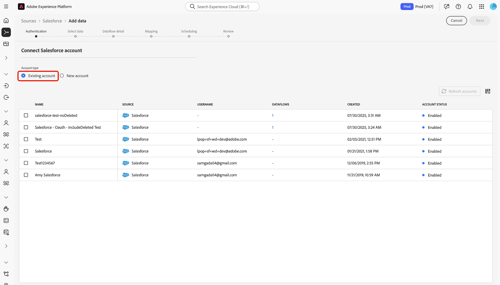

# 연결 [!DNL Salesforce] UI를 사용하여 Experience Platform 할 계정

이 튜토리얼에서는 을(를) 연결하는 방법에 대한 단계를 제공합니다. [!DNL Salesforce] Experience Platform 사용자 인터페이스를 사용하여 CRM 데이터를 Adobe Experience Platform으로 가져오고 계정을 만듭니다.

## 시작하기

이 자습서에서는 다음 Experience Platform 구성 요소를 이해하고 있어야 합니다.

* [[!DNL Experience Data Model (XDM)] 시스템](../../../../../xdm/home.md): Experience Platform이 고객 경험 데이터를 구성하는 표준화된 프레임워크입니다.
   * [스키마 컴포지션 기본 사항](../../../../../xdm/schema/composition.md): 스키마 컴포지션의 주요 원칙 및 모범 사례를 포함하여 XDM 스키마의 기본 구성 요소에 대해 알아봅니다.
   * [스키마 편집기 튜토리얼](../../../../../xdm/tutorials/create-schema-ui.md): 스키마 편집기 UI를 사용하여 사용자 정의 스키마를 만드는 방법을 알아봅니다.
* [[!DNL Real-Time Customer Profile]](../../../../../profile/home.md): 여러 소스의 집계 데이터를 기반으로 통합 실시간 소비자 프로필을 제공합니다.

이미 인증된 사용자가 있는 경우 [!DNL Salesforce] 계정, 이 문서의 나머지 부분을 건너뛰고 다음에 대한 자습서로 진행할 수 있습니다. [crm 데이터에 대한 데이터 흐름 구성](../../dataflow/crm.md).

### 필요한 자격 증명 수집 {#gather-required-credentials}

을(를) 인증하려면 [!DNL Salesforce] Experience Platform에 대한 계정에서 다음에 해당하는 값을 제공해야 합니다 [!DNL Salesforce] 자격 증명:

| 자격 증명 | 설명 |
| --- | --- |
| `environmentUrl` | 의 URL [!DNL Salesforce] 소스 인스턴스. |
| `username` | 의 사용자 이름 [!DNL Salesforce] 사용자 계정입니다. |
| `password` | 에 대한 암호 [!DNL Salesforce] 사용자 계정입니다. |
| `securityToken` | 에 대한 보안 토큰 [!DNL Salesforce] 사용자 계정입니다. |
| `apiVersion` | (선택 사항) 의 REST API 버전 [!DNL Salesforce] 사용 중인 인스턴스. API 버전의 값은 십진수로 형식을 지정해야 합니다. 예를 들어 API 버전을 사용하는 경우 `52`을 누르고 값을 다음으로 입력해야 합니다. `52.0` 이 필드를 비워 두면 Experience Platform은 자동으로 사용 가능한 최신 버전을 사용합니다. |

인증에 대한 자세한 내용은 [이 [!DNL Salesforce] 인증 안내서](https://developer.salesforce.com/docs/atlas.en-us.api_rest.meta/api_rest/quickstart_oauth.htm).

필요한 자격 증명을 수집했으면 아래 단계에 따라 연결할 수 있습니다. [!DNL Salesforce] Experience Platform 계정.

## 연결 [!DNL Salesforce] account

Platform UI에서 를 선택합니다. **[!UICONTROL 소스]** 왼쪽 탐색에서 소스 작업 영역에 액세스합니다. 다음 *[!UICONTROL 카탈로그]* 화면에는 Experience Platform 소스 카탈로그에서 사용할 수 있는 다양한 소스가 표시됩니다.

화면 왼쪽에 있는 카탈로그에서 적절한 카테고리를 선택할 수 있습니다. 또는 검색 옵션을 사용하여 특정 소스를 찾을 수 있습니다.

선택 **[!UICONTROL CRM]** 소스 범주 목록에서 을 선택한 다음 **[!UICONTROL 데이터 추가]** 다음에서 [!DNL Salesforce] 카드.

다음 **[!UICONTROL Salesforce에 연결]** 페이지가 나타납니다. 이 페이지에서 새 자격 증명 또는 기존 자격 증명을 사용할 수 있습니다.

>[!BEGINTABS]

>[!TAB 기존 Salesforce 계정 사용]

기존 계정을 사용하려면 **[!UICONTROL 기존 계정]** 그런 다음 나타나는 목록에서 사용할 계정을 선택합니다. 완료되면 다음을 선택합니다. **[!UICONTROL 다음]** 계속합니다.

>[!TAB 새 Salesforce 계정 만들기]

새 계정을 사용하려면 다음을 선택합니다. **[!UICONTROL 새 계정]** 이름, 설명 및 [!DNL Salesforce] 인증 자격 증명입니다. 완료되면 다음을 선택합니다. **[!UICONTROL 소스에 연결]** 새 연결이 설정되도록 몇 초 동안 기다립니다.

>[!ENDTABS]

## 다음 단계

이 자습서를 따라 [!DNL Salesforce] 계정입니다. 이제 다음 튜토리얼을 계속 진행하여 [데이터 흐름을 구성하여 데이터 가져오기 [!DNL Platform]](../../dataflow/crm.md).
