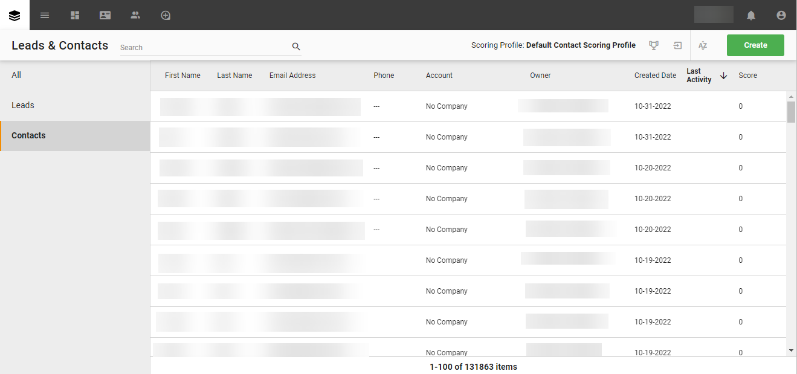

# (Beta) [!DNL SugarCRM Accounts & Contacts] UI의 소스 연결

>[!NOTE]
>
>다음 [!DNL SugarCRM Accounts & Contacts] 소스는 베타 버전입니다. 다음을 참조하십시오. [소스 개요](../../../../home.md#terms-and-conditions) beta 레이블 소스를 사용하는 방법에 대한 자세한 내용.

이 자습서에서는 다음을 만드는 단계를 제공합니다 [!DNL SugarCRM Accounts & Contacts] Adobe Experience Platform 사용자 인터페이스를 사용한 소스 연결.

## 시작하기

이 자습서에서는 다음 Experience Platform 구성 요소를 이해하고 있어야 합니다.

* [[!DNL Experience Data Model (XDM)] 시스템](../../../../../xdm/home.md): 표준화된 프레임워크 [!DNL Experience Platform] 고객 경험 데이터를 구성합니다.
   * [스키마 컴포지션 기본 사항](../../../../../xdm/schema/composition.md): 스키마 컴포지션의 주요 원칙 및 모범 사례를 포함하여 XDM 스키마의 기본 구성 요소에 대해 알아봅니다.
   * [스키마 편집기 튜토리얼](../../../../../xdm/tutorials/create-schema-ui.md): 스키마 편집기 UI를 사용하여 사용자 정의 스키마를 만드는 방법을 알아봅니다.
* [[!DNL Real-Time Customer Profile]](../../../../../profile/home.md): 여러 소스의 집계 데이터를 기반으로 통합 실시간 소비자 프로필을 제공합니다.

이미 유효한 을(를) 가지고 있는 경우 [!DNL SugarCRM] 계정, 이 문서의 나머지 부분을 건너뛰고 다음에 대한 자습서로 진행할 수 있습니다. [데이터 흐름 구성](../../dataflow/crm.md).

### 필요한 자격 증명 수집

연결하려면 [!DNL SugarCRM Accounts & Contacts] 플랫폼에 다음 연결 속성에 대한 값을 제공해야 합니다.

| 자격 증명 | 설명 | 예 |
| --- | --- | --- |
| `Host` | 소스가 연결되는 SugarCRM API 엔드포인트. | `developer.salesfusion.com` |
| `Username` | SugarCRM 개발자 계정 사용자 이름입니다. | `abc.def@example.com@sugarmarketdemo000.com` |
| `Password` | SugarCRM 개발자 계정 암호입니다. | `123456789` |

### 플랫폼 스키마 만들기

만들기 전 [!DNL SugarCRM] 소스 연결에서 소스에 사용할 플랫폼 스키마를 먼저 만들어야 합니다. 다음 튜토리얼 참조: [플랫폼 스키마 생성](../../../../../xdm/schema/composition.md) 스키마를 만드는 방법에 대한 포괄적인 단계를 설명합니다.

다음 [!DNL SugarCRM Accounts & Contacts] 는 여러 API를 지원합니다. 즉, 활용하는 객체 유형에 따라 별도의 스키마를 만들어야 합니다. 계정 및 연락처 스키마에 대해서는 아래 예를 참조하십시오.

>[!BEGINTABS]

>[!TAB 계정]

>[!TAB 연락처]

>[!ENDTABS]

## 연결 [!DNL SugarCRM Accounts & Contacts] account

Platform UI에서 를 선택합니다. **[!UICONTROL 소스]** 왼쪽 탐색 모음에서 다음 위치에 액세스: [!UICONTROL 소스] 작업 영역. 다음 [!UICONTROL 카탈로그] 화면에는 계정을 만들 수 있는 다양한 소스가 표시됩니다.

화면 왼쪽에 있는 카탈로그에서 적절한 카테고리를 선택할 수 있습니다. 또는 검색 옵션을 사용하여 작업할 특정 소스를 찾을 수 있습니다.

아래 *CRM* 범주, 선택 **[!UICONTROL SugarCRM 계정 및 연락처]**&#x200B;을 선택한 다음 을 선택합니다 **[!UICONTROL 데이터 추가]**.

다음 **[!UICONTROL SugarCRM 계정 및 연락처 계정 연결]** 페이지가 나타납니다. 이 페이지에서 새 자격 증명 또는 기존 자격 증명을 사용할 수 있습니다.

### 기존 계정

기존 계정을 사용하려면 [!DNL SugarCRM Accounts & Contacts] 새 데이터 흐름을 만들 계정 을 선택합니다. **[!UICONTROL 다음]** 계속합니다.

### 새 계정

새 계정을 만드는 경우 다음을 선택합니다 **[!UICONTROL 새 계정]**&#x200B;을 누르고 이름, 설명(선택 사항) 및 자격 증명을 제공합니다. 완료되면 다음을 선택합니다. **[!UICONTROL 소스에 연결]** 그런 다음 새 연결을 설정하는 데 시간이 걸릴 수 있습니다.

### 데이터 선택

마지막으로 플랫폼으로 수집할 객체 유형을 선택해야 합니다.

| 오브젝트 유형 | 설명 |
| --- | --- |
| `Accounts` | 조직이 관계를 맺고 있는 회사입니다. |
| `Contacts` | 조직이 관계를 수립한 개별 사용자입니다. |

>[!BEGINTABS]

>[!TAB 계정]

>[!TAB 연락처]

>[!ENDTABS]

## 다음 단계

이 자습서를 따라 [!DNL SugarCRM Accounts & Contacts] 계정입니다. 이제 다음 튜토리얼을 계속 진행하여 [데이터를 Platform으로 가져오는 데이터 흐름 구성](../../dataflow/crm.md).

## 추가 리소스

아래 섹션에서는 사용 시 참조할 수 있는 추가 리소스를 제공합니다. [!DNL SugarCRM] 소스.

### 가드레일 {#guardrails}

다음 [!DNL SugarCRM] API 스로틀 속도는 분당 90회 호출 또는 일별 2,000회 호출 중 먼저 발생하는 것입니다. 하지만 연결 사양에 매개 변수를 추가하여 속도 제한에 도달하지 않도록 요청 시간을 지연시킴으로써 이러한 제한을 피할 수 있습니다.

### 유효성 검사 {#validation}

소스 및 를 올바르게 설정했는지 확인하려면 [!DNL SugarCRM Accounts & Contacts] 데이터를 수집하는 중입니다. 아래 단계를 따르십시오.

* Platform UI에서 를 선택합니다. **[!UICONTROL 데이터 흐름 보기]** 의 옆에 [!DNL SugarCRM Accounts & Contacts] 소스 카탈로그의 카드 메뉴. 그런 다음 을 선택합니다. **[!UICONTROL 데이터 세트 미리 보기]** 수집된 데이터를 확인합니다.

* 작업 중인 객체 유형에 따라 집계된 데이터를 [!DNL SugarMarket] 계정 또는 연락처 페이지:

>[!BEGINTABS]

>[!TAB 계정]

>[!TAB 연락처]

>[!ENDTABS]

>[!NOTE]
>
>다음 [!DNL SugarMarket] 페이지에는 삭제된 개체 수가 포함되어 있지 않습니다. 그러나 이 소스를 통해 검색된 데이터에는 삭제된 카운트도 포함되며 이 카운트에는 삭제된 플래그가 표시됩니다.
