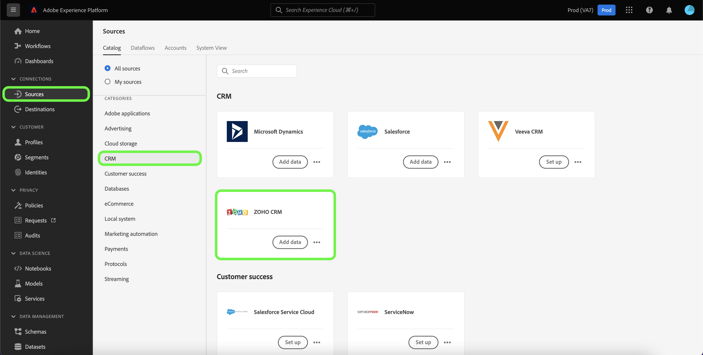

# 만들기 [!DNL Zoho CRM] UI의 소스 연결

Adobe Experience Platform의 소스 커넥터는 외부 소스 CRM 데이터를 일정에 따라 수집하는 기능을 제공합니다. 이 자습서에서는 다음을 만드는 단계를 제공합니다 [!DNL Zoho CRM] 를 사용하는 소스 커넥터 [!DNL Platform] 사용자 인터페이스.

## 시작하기

이 자습서에서는 Adobe Experience Platform의 다음 구성 요소를 이해하고 있어야 합니다.

* [[!DNL Experience Data Model (XDM)] 시스템](../../../../../xdm/home.md): 표준화된 프레임워크 [!DNL Experience Platform] 고객 경험 데이터를 구성합니다.
   * [스키마 컴포지션 기본 사항](../../../../../xdm/schema/composition.md): 스키마 컴포지션의 주요 원칙 및 모범 사례를 포함하여 XDM 스키마의 기본 구성 요소에 대해 알아봅니다.
   * [스키마 편집기 튜토리얼](../../../../../xdm/tutorials/create-schema-ui.md): 스키마 편집기 UI를 사용하여 사용자 정의 스키마를 만드는 방법을 알아봅니다.
* [[!DNL Real-Time Customer Profile]](../../../../../profile/home.md): 여러 소스의 집계 데이터를 기반으로 통합 실시간 소비자 프로필을 제공합니다.

이미 유효한 을(를) 가지고 있는 경우 [!DNL Zoho CRM] 계정, 이 문서의 나머지 부분을 건너뛰고 다음에 대한 자습서로 진행할 수 있습니다. [데이터 흐름 구성](../../dataflow/crm.md).

### 필요한 자격 증명 수집

연결하려면 [!DNL Zoho CRM] 플랫폼에 다음 연결 속성에 대한 값을 제공해야 합니다.

| 자격 증명 | 설명 |
| --- | --- |
| 엔드포인트 | 의 엔드포인트 [!DNL Zoho CRM] 요청을 수행하는 서버입니다. |
| 계정 URL | 계정 URL은 액세스 및 새로 고침 토큰을 생성하는 데 사용됩니다. URL은 도메인별 URL이어야 합니다. |
| 클라이언트 ID | 에 해당하는 클라이언트 ID [!DNL Zoho CRM] 사용자 계정입니다. |
| 클라이언트 암호 | 에 해당하는 클라이언트 암호 [!DNL Zoho CRM] 사용자 계정입니다. |
| 액세스 토큰 | 액세스 토큰은 보안 및 임시 액세스 권한을 부여합니다. [!DNL Zoho CRM] 계정입니다. |
| 토큰 새로 고침 | 새로 고침 토큰은 액세스 토큰이 만료된 후 새 액세스 토큰을 생성하는 데 사용되는 토큰입니다. |

이러한 자격 증명에 대한 자세한 내용은 [[!DNL Zoho CRM] 인증](https://www.zoho.com/crm/developer/docs/api/v2/oauth-overview.html).

## 연결 [!DNL Zoho CRM] account

필요한 자격 증명을 수집했으면 아래 단계에 따라 를 연결할 수 있습니다. [!DNL Zoho CRM] 계정 위치: [!DNL Platform].

Platform UI에서 를 선택합니다. **[!UICONTROL 소스]** 왼쪽 탐색 모음에서 다음 위치에 액세스: [!UICONTROL 소스] 작업 영역. 다음 [!UICONTROL 카탈로그] 화면에는 계정을 만들 수 있는 다양한 소스가 표시됩니다.

화면 왼쪽에 있는 카탈로그에서 적절한 카테고리를 선택할 수 있습니다. 또는 검색 옵션을 사용하여 작업할 특정 소스를 찾을 수 있습니다.

아래 [!UICONTROL CRM] 범주, 선택 **[!UICONTROL Zoho CRM]**&#x200B;을 선택한 다음 을 선택합니다 **[!UICONTROL 데이터 추가]**.

다음 **[!UICONTROL Zoho CRM 계정 연결]** 페이지가 나타납니다. 이 페이지에서 새 자격 증명 또는 기존 자격 증명을 사용할 수 있습니다.

### 기존 계정

기존 계정을 사용하려면 [!DNL Zoho CRM] 새 데이터 흐름을 만들 계정 을 선택합니다. **[!UICONTROL 다음]** 계속합니다.

### 새 계정

새 계정을 만드는 경우 다음을 선택합니다 **[!UICONTROL 새 계정]**&#x200B;을 누르고 이름, 설명(선택 사항) 및 [!DNL Zoho CRM] 자격 증명. 완료되면 다음을 선택합니다. **[!UICONTROL 소스에 연결]** 그런 다음 새 연결을 설정하는 데 시간이 걸릴 수 있습니다.

>[!TIP]
>
>계정 URL 도메인은 적절한 도메인 위치와 일치해야 합니다. 다음은 다양한 도메인과 해당 계정 URL입니다.<ul><li>미국: https://accounts.zoho.com</li><li>오스트레일리아: https://accounts.zoho.com.au</li><li>유럽: https://accounts.zoho.eu</li><li>인도: https://accounts.zoho.in</li><li>중국: https://accounts.zoho.com.cn</li></ul>

## 다음 단계

이 자습서를 따라 [!DNL Zoho CRM] 계정입니다. 이제 다음 튜토리얼을 계속 진행하여 [데이터를 Platform으로 가져오는 데이터 흐름 구성](../../dataflow/crm.md).
