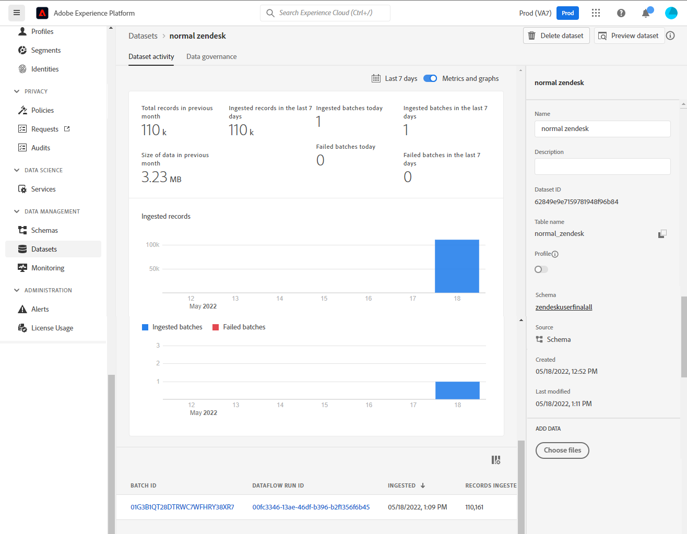

# UI에서 [!DNL Zendesk] 소스 연결 만들기

이 자습서에서는 Adobe Experience Platform 사용자 인터페이스를 사용하여 [!DNL Zendesk] 소스 연결을 만드는 단계를 제공합니다.

## 시작하기

이 자습서에서는 Adobe Experience Platform의 다음 구성 요소를 이해하고 있어야 합니다.

* [[!DNL Experience Data Model (XDM)] 시스템](../../../../../xdm/home.md): [!DNL Experience Platform]에서 고객 경험 데이터를 구성하는 표준화된 프레임워크입니다.
   * [스키마 컴포지션의 기본 사항](../../../../../xdm/schema/composition.md): 스키마 컴포지션의 주요 원칙 및 모범 사례를 포함하여 XDM 스키마의 기본 구성 요소에 대해 알아봅니다.
   * [스키마 편집기 튜토리얼](../../../../../xdm/tutorials/create-schema-ui.md): 스키마 편집기 UI를 사용하여 사용자 지정 스키마를 만드는 방법을 알아봅니다.
* [[!DNL Real-Time Customer Profile]](../../../../../profile/home.md): 여러 원본의 집계된 데이터를 기반으로 통합된 실시간 소비자 프로필을 제공합니다.

### 필요한 자격 증명 수집

플랫폼에서 [!DNL Zendesk] 계정에 액세스하려면 다음 자격 증명에 대한 값을 제공해야 합니다.

| 자격 증명 | 설명 | 예 |
| --- | --- | --- |
| 하위 도메인 | 등록 프로세스 중에 생성된 계정과 관련된 고유 도메인입니다. | `yoursubdomain` |
| 액세스 토큰 | Zendesk API 토큰. | `0lZnClEvkJSTQ7olGLl7PMhVq99gu26GTbJtf` |

[!DNL Zendesk] 원본 인증에 대한 자세한 내용은 [[!DNL Zendesk] 원본 개요](../../../../connectors/customer-success/zendesk.md)를 참조하세요.

### [!DNL Zendesk]에 대한 플랫폼 스키마 만들기

[!DNL Zendesk] 소스 연결을 만들기 전에 먼저 소스에 사용할 Platform 스키마를 만들어야 합니다. 스키마를 만드는 방법에 대한 포괄적인 단계를 보려면 [플랫폼 스키마 만들기](../../../../../xdm/schema/composition.md)에 대한 자습서를 참조하십시오.

[!DNL Zendesk Search API]에 필요한 [!DNL Zendesk] 스키마에 대한 추가 지침은 아래의 [제한](#limits) 섹션을 참조하십시오.

## [!DNL Zendesk] 계정 연결

Platform UI의 왼쪽 탐색 막대에서 **[!UICONTROL 소스]**&#x200B;를 선택하여 [!UICONTROL 소스] 작업 영역에 액세스합니다. [!UICONTROL 카탈로그] 화면에 계정을 만들 수 있는 다양한 소스가 표시됩니다.

화면 왼쪽에 있는 카탈로그에서 적절한 카테고리를 선택할 수 있습니다. 또는 검색 옵션을 사용하여 작업할 특정 소스를 찾을 수 있습니다.

*고객 성공* 범주에서 **[!UICONTROL Zendesk]**&#x200B;을(를) 선택한 다음 **[!UICONTROL 데이터 추가]**&#x200B;를 선택합니다.

**[!UICONTROL Connect Zendesk 계정]** 페이지가 나타납니다. 이 페이지에서 새 자격 증명 또는 기존 자격 증명을 사용할 수 있습니다.

### 기존 계정

기존 계정을 사용하려면 새 데이터 흐름을 만들 *Zendesk* 계정을 선택한 후 **[!UICONTROL 다음]**&#x200B;을 선택하여 계속하십시오.

### 새 계정

새 계정을 만드는 경우 **[!UICONTROL 새 계정]**&#x200B;을(를) 선택한 다음 이름, 설명(선택 사항) 및 자격 증명을 제공합니다. 완료되면 **[!UICONTROL 소스에 연결]**&#x200B;을 선택한 다음 새 연결을 설정할 수 있는 시간을 허용하세요.

### 데이터 선택

소스가 인증되면 페이지는 데이터의 계층 구조를 탐색하고 검사할 수 있는 대화형 스키마 트리로 업데이트됩니다. 계속하려면 **[!UICONTROL 다음]**&#x200B;을(를) 선택하십시오.

## 다음 단계

이 자습서에 따라 [!DNL Zendesk] 계정과 플랫폼 간의 소스 연결을 인증하고 만들었습니다. 이제 다음 자습서를 계속 진행하고 [데이터 흐름을 만들어 고객 성공 데이터를 플랫폼으로 가져올 수 있습니다](../../dataflow/customer-success.md).

## 추가 리소스

아래 섹션에서는 [!DNL Zendesk] 소스를 사용할 때 참조할 수 있는 추가 리소스를 제공합니다.

### 유효성 검사 {#validation}

다음은 [!DNL Zendesk] 원본을 성공적으로 연결했으며 [!DNL Zendesk] 프로필이 플랫폼에 수집되고 있는지 확인하기 위해 수행할 수 있는 단계입니다.

Platform UI의 왼쪽 탐색에서 **[!UICONTROL 데이터 세트]**&#x200B;를 선택하여 [!UICONTROL 데이터 세트] 작업 영역에 액세스합니다. [!UICONTROL 데이터 집합 활동] 화면에 실행 세부 정보가 표시됩니다.

그런 다음 보려는 데이터 흐름의 데이터 흐름 실행 ID를 선택하여 해당 데이터 흐름 실행에 대한 특정 세부 정보를 확인합니다.

마지막으로 **[!UICONTROL 데이터 집합 미리 보기]**&#x200B;를 선택하여 수집된 데이터를 표시합니다.

[!DNL Zendesk] > [!DNL Customers] 페이지의 데이터에 대해 플랫폼 데이터를 확인할 수도 있습니다.

### Zendesk 스키마

아래 표에는 Zendesk에 대해 설정해야 하는 지원되는 매핑이 나와 있습니다.

>[!TIP]
>
>API에 대한 자세한 내용은 [Zendesk 검색 API > 검색 결과 내보내기](https://developer.zendesk.com/api-reference/ticketing/ticket-management/search/#export-search-results)를 참조하십시오.

| 소스 | 유형 |
|---|---|
| `results.active` | 부울 |
| `results.alias` | 문자열 |
| `results.created_at` | 문자열 |
| `results.custom_role_id` | 정수 |
| `results.default_group_id` | 정수 |
| `results.details` | 문자열 |
| `results.email` | 문자열 |
| `results.external_id` | 정수 |
| `results.iana_time_zone` | 문자열 |
| `results.id` | 정수 |
| `results.last_login_at` | 문자열 |
| `results.locale` | 문자열 |
| `results.locale_id` | 정수 |
| `results.moderator` | 부울 |
| `results.name` | 문자열 |
| `results.notes` | 문자열 |
| `results.only_private_comments` | 부울 |
| `results.organization_id` | 정수 |
| `results.phone` | 문자열 |
| `results.photo` | 문자열 |
| `results.report_csv` | 부울 |
| `results.restricted_agent` | 부울 |
| `results.result_type` | 문자열 |
| `results.role` | 문자열 |
| `results.role_type` | 정수 |
| `results.shared` | 부울 |
| `results.shared_agent` | 부울 |
| `results.shared_phone_number` | 부울 |
| `results.signature` | 문자열 |
| `results.suspended` | 부울 |
| `results.ticket_restriction` | 문자열 |
| `results.time_zone` | 문자열 |
| `results.two_factor_auth_enabled` | 부울 |
| `results.updated_at` | 문자열 |
| `results.url` | 문자열 |
| `results.verified` | 부울 |

{style="table-layout:auto"}

### 제한 {#limits}

* [Zendesk 검색 API > 검색 결과 내보내기](https://developer.zendesk.com/api-reference/ticketing/ticket-management/search/#export-search-results)는 페이지당 최대 1000개의 레코드를 반환합니다.
   * ``filter[type]`` 매개 변수의 값이 ``user``(으)로 설정되어 있으므로 Zendesk 연결은 사용자만 반환합니다.
   * 페이지당 결과 수는 ``page[size]`` 매개 변수에 의해 관리됩니다. 값이 ``100``(으)로 설정되어 있습니다. 이는 Zendesk가 설정한 속도 감소 제약의 영향을 줄이기 위한 것이다.
   * [제한](https://developer.zendesk.com/api-reference/ticketing/ticket-management/search/#limits) 및 [페이지 매김](https://developer.zendesk.com/api-reference/ticketing/ticket-management/search/#pagination-1)을 참조하세요.
   * [커서 페이지 매김을 사용하여 목록 페이지 매김하기](https://developer.zendesk.com/documentation/developer-tools/pagination/paginating-through-lists-using-cursor-pagination/)를 참조할 수도 있습니다.
