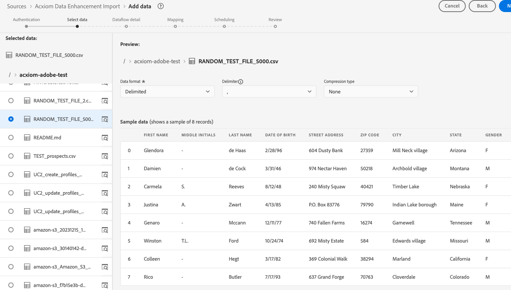
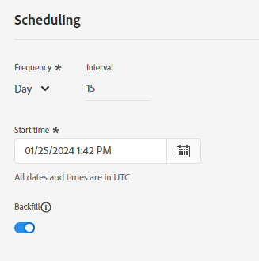

# 만들기 [!DNL Acxiom Data Ingestion] ui의 소스 연결 및 데이터 흐름

>[!NOTE]
>
>다음 [!DNL Acxiom Data Ingestion] 소스는 베타 버전입니다. 읽기 [사용 약관](../../../../home.md#terms-and-conditions) beta 레이블 소스 사용에 대한 자세한 내용은 소스 개요 를 참조하십시오.

사용 [!DNL Acxiom Data Ingestion] 수집할 소스 [!DNL Acxiom] 데이터를 Real-time Customer Data Platform으로 가져와서 자사 프로필을 보강합니다. 그러면 다음을 사용할 수 있습니다. [!DNL Acxiom]-향상된 자사 프로필을 통해 대상자를 개선하고 마케팅 채널 전반에서 활성화합니다.

이 자습서를 읽고 다음을 만드는 방법을 알아보십시오. [!DNL Acxiom Data Ingestion] Adobe Experience Platform 사용자 인터페이스를 사용한 소스 연결 및 데이터 흐름. 다음 [!DNL Acxiom Data Ingestion] 소스를 사용하여 다음에서 응답을 검색하고 매핑합니다. [!DNL Acxiom] Amazon S3를 드롭 포인트로 사용하는 개선 서비스.

## 전제 조건 {#prerequisites}

이 자습서에서는 다음 Experience Platform 구성 요소를 이해하고 있어야 합니다.

* [[!DNL Experience Data Model (XDM)] 시스템](../../../../../xdm/home.md): Experience Platform이 고객 경험 데이터를 구성하는 표준화된 프레임워크입니다.
   * [스키마 컴포지션 기본 사항](../../../../../xdm/schema/composition.md): 스키마 컴포지션의 주요 원칙 및 모범 사례를 포함하여 XDM 스키마의 기본 구성 요소에 대해 알아봅니다.
   * [스키마 편집기 튜토리얼](../../../../../xdm/tutorials/create-schema-ui.md): 스키마 편집기 UI를 사용하여 사용자 정의 스키마를 만드는 방법을 알아봅니다.
* [[!DNL Real-Time Customer Profile]](../../../../../profile/home.md): 여러 소스의 집계 데이터를 기반으로 통합 실시간 소비자 프로필을 제공합니다.

### 필요한 자격 증명 수집

Experience Platform 시 버킷에 액세스하려면 다음 자격 증명에 대한 유효한 값을 제공해야 합니다.

| 자격 증명 | 설명 |
| --- | --- |
| [!DNL Acxiom] 인증 키 | 인증 키입니다. 다음 위치에서 이 값을 검색할 수 있습니다. [!DNL Acxiom] 팀. |
| [!DNL Amazon S3] 액세스 키 | 버킷에 대한 액세스 키 ID입니다. 다음 위치에서 이 값을 검색할 수 있습니다. [!DNL Acxiom] 팀. |
| [!DNL Amazon S3] 비밀 키 | 버킷의 비밀 키 ID. 다음 위치에서 이 값을 검색할 수 있습니다. [!DNL Acxiom] 팀. |
| 버킷 이름 | 파일을 공유할 버킷입니다. 다음 위치에서 이 값을 검색할 수 있습니다. [!DNL Acxiom] 팀. |

>[!IMPORTANT]
>
>둘 다 있어야 합니다. **[!UICONTROL 소스 보기]** 및 **[!UICONTROL 소스 관리]** 에 연결하기 위해 계정에 대해 활성화된 권한 [!DNL Acxiom] Experience Platform 계정. 필요한 권한을 얻으려면 제품 관리자에게 문의하십시오. 자세한 내용은 [액세스 제어 UI 안내서](../../../../../access-control/ui/overview.md).

## 연결 [!DNL Acxiom] account

Platform UI에서 를 선택합니다. **[!UICONTROL 소스]** 왼쪽 탐색 모음에서 다음 위치에 액세스: [!UICONTROL 소스] 작업 영역. 다음 [!UICONTROL 카탈로그] 화면에는 계정을 만들 수 있는 다양한 소스가 표시됩니다.

화면 왼쪽에 있는 카탈로그에서 적절한 카테고리를 선택할 수 있습니다. 또는 검색 옵션을 사용하여 작업할 특정 소스를 찾을 수 있습니다.

아래 **[!UICONTROL 데이터 및 ID 파트너]** 범주, 선택 **[!UICONTROL Acxiom 데이터 섭취]** 다음을 선택합니다. **[!UICONTROL 설정]**.

>[!TIP]
>
>표시되는 소스 카드 **[!UICONTROL 데이터 추가]** 는 소스에 이미 인증된 계정이 있음을 의미합니다. 반면 소스 카드는 **[!UICONTROL 설정]** 은(는) 해당 소스를 사용하려면 자격 증명을 제공하고 새 계정을 만들어야 함을 의미합니다.

### 새 계정 만들기

새 자격 증명을 사용하는 경우 다음을 선택합니다 **[!UICONTROL 새 계정]**. 표시되는 입력 양식에서 이름, 설명(선택 사항) 및 [!DNL Acxiom] 자격 증명. 완료되면 다음을 선택합니다. **[!UICONTROL 소스에 연결]** 그런 다음 새 연결을 설정하는 데 시간이 걸릴 수 있습니다.

| 자격 증명 | 설명 |
| --- | --- |
| 계정 이름 | 계정 이름. |
| 설명 | (선택 사항) 계정의 목적에 대한 간단한 설명. |
| [!DNL Acxiom] 인증 키 | 다음 [!DNL Acxiom]-계정 승인에 필요한 키를 제공했습니다. 데이터베이스에 연결하려면 먼저 적절한 값과 일치해야 합니다.  이 키는 24자여야 하며 A-Z, a-z 및 0-9만 포함할 수 있습니다. |
| S3 액세스 키 | S3 액세스 키는 Amazon S3 위치를 참조합니다. S3 역할 권한이 정의된 경우 관리자가 제공합니다. |
| S3 비밀 키 | S3 비밀 키는 Amazon S3 위치를 참조합니다. S3 역할 권한이 정의된 경우 관리자가 제공합니다. |
| s3SessionToken | (선택 사항) S3에 연결할 때의 인증 토큰 값입니다. |
| serviceUrl | (선택 사항) 비표준 위치에서 S3에 연결할 때 사용할 URL 위치입니다. |
| 버킷 이름 | (선택 사항) 데이터 선택에서 시작 경로 역할을 하는 S3에 설정된 S3 버킷의 이름입니다. |
| 폴더 경로 | 버킷의 하위 디렉토리를 사용하는 경우 데이터 선택에서 경로를 시작 경로로 지정할 수도 있습니다. |

### 기존 계정 사용

기존 계정을 사용하려면 **[!UICONTROL 기존 계정]**.

목록에서 계정을 선택하여 해당 계정에 대한 세부 정보를 확인합니다. 계정을 선택한 후 다음을 선택합니다. **[!UICONTROL 다음]** 계속합니다.

## 데이터 선택

원하는 버킷 및 하위 디렉터리에서 수집할 파일을 선택합니다. 구분 기호와 압축 유형이 정의되면 데이터 미리보기를 제공할 수 있습니다. 파일을 선택한 후 다음을 선택합니다 **[!UICONTROL 다음]** 계속합니다.

>[!NOTE]
>
>JSON 및 Parquet 파일 유형이 나열되어 있지만, [!DNL Acxiom] 소스 워크플로우입니다.

## 데이터 세트 및 데이터 흐름 세부 정보 제공

그런 다음 데이터 세트 및 데이터 흐름에 대한 정보를 제공해야 합니다.

### 데이터 세트 세부 정보

>[!BEGINTABS]

>[!TAB 새 데이터 세트 사용]

데이터 세트는 스키마(열) 및 필드(행)를 포함하는 데이터 수집을 위한 저장소 및 관리 구조입니다. Experience Platform에 성공적으로 수집된 데이터는 데이터 세트로 데이터 레이크 내에 유지됩니다. 새 데이터 세트를 사용하려면 다음을 선택합니다. **[!UICONTROL 새 데이터 세트]**.

| 새 데이터 세트 세부 정보 | 설명 |
| --- | --- |
| 출력 데이터 세트 이름 | 새 데이터 세트의 이름입니다. |
| 설명 | (선택 사항) 데이터 세트의 목적에 대한 간단한 설명입니다. |
| 스키마 | 조직에 있는 스키마의 드롭다운 목록입니다. 소스 구성 프로세스 전에 고유한 스키마를 생성할 수도 있습니다. 자세한 내용은 의 안내서를 참조하십시오. [ui에서 스키마 만들기](../../../../../xdm/tutorials/create-schema-ui.md). |

>[!TAB 기존 데이터 세트 사용]

기존 데이터 세트를 사용하려면 **[!UICONTROL 기존 데이터 세트]**.

다음을 선택할 수 있습니다. **[!UICONTROL 고급 검색]** 실시간 고객 프로필에 수집하도록 활성화되었는지 여부 등 해당 세부 정보를 포함하여 조직에서 모든 데이터 세트의 창을 봅니다.

>[!ENDTABS]

+++프로필 수집, 오류 진단 및 부분 수집을 활성화하는 단계를 선택합니다.

데이터 세트가 실시간 고객 프로필에 대해 활성화된 경우 이 단계에서 전환할 수 있습니다 **[!UICONTROL 프로필 데이터 세트]** 프로필 수집을 위해 데이터를 활성화하려면 이 단계를 사용하여 을 활성화할 수도 있습니다 **[!UICONTROL 오류 진단]** 및 **[!UICONTROL 부분 수집]**.

* **[!UICONTROL 오류 진단]**: 선택 **[!UICONTROL 오류 진단]** 데이터 세트 활동 및 데이터 흐름 상태를 모니터링할 때 나중에 참조할 수 있는 오류 진단을 소스에 지시할 수 있습니다.
* **[!UICONTROL 부분 수집]**: 부분 일괄 처리 수집은 구성 가능한 특정 임계값까지 오류가 포함된 데이터를 수집하는 기능입니다. 이 기능을 사용하면 모든 정확한 데이터를 Experience Platform으로 성공적으로 수집할 수 있으며 잘못된 데이터는 모두 잘못된 이유에 대한 정보로 별도로 배치됩니다.

+++

### 데이터 흐름 세부 정보

데이터 세트가 구성되면 이름, 선택적 설명 및 경고 구성을 포함하여 데이터 흐름에 대한 세부 정보를 제공해야 합니다.

| 데이터 흐름 구성 | 설명 |
| --- | --- |
| 데이터 흐름 이름 | 데이터 흐름의 이름입니다.  기본적으로 가져올 파일의 이름이 사용됩니다. |
| 설명 | (선택 사항) 데이터 흐름에 대한 간략한 설명입니다. |
| 경고 | Experience Platform은 사용자가 구독할 수 있는 이벤트 기반 경고를 생성할 수 있습니다. 이러한 옵션은 모두 실행 중인 데이터 흐름으로 이러한 경고를 트리거합니다.  자세한 내용은 [경고 개요](../../alerts.md) <ul><li>**소스 데이터 흐름 실행 시작**: 데이터 흐름 실행이 시작될 때 알림을 받으려면 이 경고를 선택합니다.</li><li>**소스 데이터 흐름 실행 성공**: 데이터 흐름이 오류 없이 종료될 경우 알림을 받으려면 이 경고를 선택합니다.</li><li>**소스 데이터 흐름 실행 실패**: 데이터 흐름 실행이 오류로 인해 종료되는 경우 알림을 받으려면 이 경고를 선택합니다.</li></ul> |

## 매핑

Experience Platform에 데이터를 수집하기 전에 매핑 인터페이스를 사용하여 소스 데이터를 적절한 스키마 필드에 매핑합니다.  자세한 내용은 [UI의 매핑 안내서](../../../../../data-prep/ui/mapping.md)

## 데이터 흐름 수집 예약

그런 다음 예약 인터페이스를 사용하여 데이터 흐름의 수집 일정을 정의합니다.

| 구성 예약 중 | 설명 |
| --- | --- |
| 빈도 | 데이터 흐름이 실행되는 빈도를 구성하십시오. 빈도를 다음과 같이 설정할 수 있습니다. <ul><li>**한 번**: 빈도를 다음으로 설정 `once` 일회성 수집을 만듭니다. 일회성 수집 데이터 흐름을 만들 때는 간격 및 채우기 구성을 사용할 수 없습니다. 기본적으로 예약 빈도는 한 번으로 설정됩니다.</li><li>**분**: 빈도를 다음으로 설정 `minute` 데이터 흐름을 예약하여 분 단위로 데이터를 수집합니다.</li><li>**시간**:빈도 설정 `hour` 데이터 흐름을 예약하여 시간 단위로 데이터를 수집합니다.</li><li>**일**: 빈도를 다음으로 설정 `day` 데이터 흐름을 예약하여 하루 단위로 데이터를 수집합니다.</li><li>**주**: 빈도를 다음으로 설정 `week` 주 단위로 데이터를 수집하도록 데이터 흐름을 예약합니다.</li></ul> |
| 간격 | 빈도를 선택하면 간격 설정을 구성하여 모든 수집 사이에 시간대를 설정할 수 있습니다. 예를 들어 빈도를 일로 설정하고 간격을 15로 구성한 경우 데이터 흐름이 15일마다 실행됩니다. **참고**: 간격을 0으로 설정할 수 없습니다. |
| 시작 시간 | UTC 시간대로 표시되는 예상 실행의 타임스탬프입니다. |
| 채우기 | 채우기 는 처음 수집되는 데이터를 결정합니다. 다시 채우기를 활성화하면 처음 예약된 수집 중에 지정된 경로의 모든 현재 파일이 수집됩니다. 다시 채우기를 비활성화하면 첫 번째 수집 실행과 시작 시간 사이에 로드된 파일만 수집됩니다. 시작 시간 이전에 로드된 파일은 수집되지 않습니다. |

## 데이터 흐름 검토

수집 전에 데이터 흐름에 대한 요약을 보려면 검토 페이지를 사용하십시오. 세부 정보는 다음 카테고리로 그룹화됩니다.

* **연결** - 소스 유형, 선택한 소스 파일의 관련 경로 및 해당 소스 파일 내의 열 수를 표시합니다.
* **데이터 세트 할당 및 필드 매핑** - 데이터 세트가 준수하는 스키마를 포함하여 소스 데이터가 수집되는 데이터 세트를 표시합니다.
* **예약** - 수집 일정의 활성 기간, 빈도 및 간격을 표시합니다.
데이터 흐름을 검토했으면 마침 을 클릭하고 데이터 흐름이 생성될 시간을 허용합니다.

## 다음 단계

이 자습서를 따라 데이터 흐름을 만들어 에서 일괄 데이터를 가져올 수 있습니다. [!DNL Acxiom] 소스-Experience Platform. 추가 리소스는 아래 설명된 설명서를 참조하십시오.

### 데이터 흐름 모니터링

데이터 흐름이 만들어지면 데이터 흐름을 통해 수집되는 데이터를 모니터링하여 수집 비율, 성공 및 오류에 대한 정보를 볼 수 있습니다. 데이터 흐름을 모니터링하는 방법에 대한 자세한 내용은 다음 자습서를 참조하십시오 [ui에서 계정 및 데이터 흐름 모니터링](../../../../../dataflows/ui/monitor-sources.md).

### 데이터 흐름 업데이트

데이터 흐름 예약, 매핑 및 일반 정보에 대한 구성을 업데이트하려면 다음 자습서를 참조하십시오. [ui에서 소스 데이터 흐름 업데이트](../../update-dataflows.md).

### 데이터 흐름 삭제

를 사용하여 더 이상 필요하지 않거나 잘못 생성된 데이터 흐름을 삭제할 수 있습니다. **[!UICONTROL 삭제]** 다음에서 사용할 수 있는 함수 **[!UICONTROL 데이터 흐름]** 작업 영역. 데이터 흐름을 삭제하는 방법에 대한 자세한 내용은 [UI에서 데이터 흐름 삭제](../../delete.md).

## 추가 리소스 {#additional-resources}

자세한 내용은 [[!DNL Acxiom] InfoBase](https://www.acxiom.com/wp-content/uploads/2022/02/fs-acxiom-infobase_AC-0268-22.pdf).
