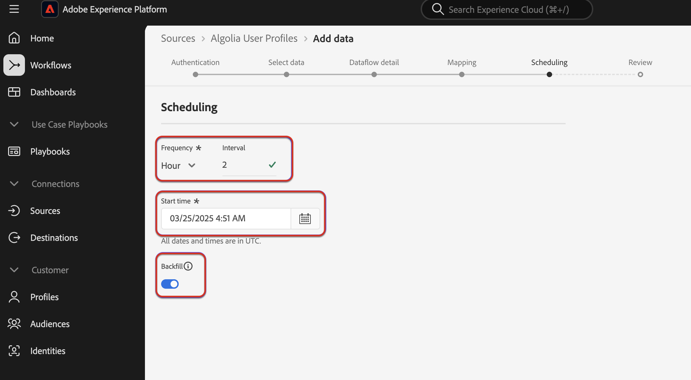

# UI를 사용하여 [!DNL Algolia User Profiles] 데이터를 Experience Platform으로 수집

사용자 인터페이스를 사용하여 [!DNL Algolia User Profiles] 계정의 데이터를 Adobe Experience Platform으로 수집하는 방법에 대해 알아보려면 이 자습서를 참조하십시오.

## 시작하기

>[!IMPORTANT]
>
>시작하기 전에 [[!DNL Algolia User Profiles] 개요](../../../../connectors/data-partners/algolia-user-profiles.md#prerequisites)에 설명된 필수 구성 요소 단계를 완료하십시오.

이 자습서에서는 Experience Platform의 다음 구성 요소를 이해하고 있어야 합니다.

* [[!DNL Experience Data Model (XDM)] 시스템](../../../../../xdm/home.md): Experience Platform에서 고객 경험 데이터를 구성하는 표준화된 프레임워크입니다.
   * [스키마 컴포지션의 기본 사항](../../../../../xdm/schema/composition.md): 스키마 컴포지션의 주요 원칙 및 모범 사례를 포함하여 XDM 스키마의 기본 구성 요소에 대해 알아봅니다.
   * [스키마 편집기 튜토리얼](../../../../../xdm/tutorials/create-schema-ui.md): 스키마 편집기 UI를 사용하여 사용자 지정 스키마를 만드는 방법을 알아봅니다.
* [[!DNL Real-Time Customer Profile]](../../../../../profile/home.md): 여러 원본의 집계된 데이터를 기반으로 통합된 실시간 소비자 프로필을 제공합니다.
* [소스](../../../../home.md): Experience Platform을 사용하면 Experience Platform 서비스를 사용하여 들어오는 데이터를 구조화하고 레이블을 지정하고 향상시키는 기능을 제공하는 동시에 다양한 소스에서 데이터를 수집할 수 있습니다.

### 필요한 자격 증명 수집

[!DNL Algolia]을(를) Experience Platform에 연결하려면 다음 자격 증명에 대한 값을 제공해야 합니다.

| 자격 증명 | 설명 |
| --- | --- |
| 애플리케이션 ID | [!DNL Algolia] 응용 프로그램 ID는 [!DNL Algolia] 계정에 할당된 고유 식별자입니다. |
| API 키 | [!DNL Algolia] API 키는 [!DNL Algolia]의 검색 및 인덱싱 서비스에 대한 API 요청을 인증하고 권한을 부여하는 데 사용되는 자격 증명입니다. |

이러한 자격 증명에 대한 자세한 내용은 [!DNL Algolia] [인증 설명서](https://www.algolia.com/doc/tools/cli/get-started/authentication/)를 참조하세요.

## [!DNL Algolia] 계정 연결

Experience Platform UI의 왼쪽 탐색에서 **[!UICONTROL 소스]**&#x200B;를 선택하여 *[!UICONTROL 소스]* 작업 영역에 액세스합니다. *[!UICONTROL 범주]* 패널에서 해당 범주를 선택할 수 있습니다. 또는 검색 창을 사용하여 사용할 특정 소스로 이동할 수 있습니다.

[!DNL Algolia]을(를) 사용하려면 *[!UICONTROL 데이터 및 ID 파트너]*&#x200B;에서 **[!UICONTROL Algolia]** 원본 카드를 선택한 다음 **[!UICONTROL 설정]**&#x200B;을 선택하십시오.

>[!TIP]
>
>지정된 소스에 아직 인증된 계정이 없는 경우 소스 카탈로그의 소스에 **[!UICONTROL 설정]** 옵션이 표시됩니다. 인증된 계정이 있으면 이 옵션이 **[!UICONTROL 데이터 추가]**(으)로 변경됩니다.

## 인증

### 기존 계정 사용

기존 계정을 사용하려면 **[!UICONTROL 기존 계정]**&#x200B;을(를) 선택한 다음 사용할 [!DNL Algolia User Profiles] 계정을 선택하십시오. 계속하려면 **[!UICONTROL 다음]**&#x200B;을 선택하세요.

### 새 계정 만들기

새 계정을 만드는 경우 **[!UICONTROL 새 계정]**&#x200B;을(를) 선택한 다음 이름, 선택적 설명 및 [!DNL Algolia] 자격 증명을 제공합니다. 완료되면 **[!UICONTROL 소스에 연결]**&#x200B;을 선택한 다음 새 연결을 설정할 수 있는 시간을 허용하세요.

## 데이터 추가

[!DNL Algolia User Profiles] 계정을 만든 후 **[!UICONTROL 데이터 추가]** 단계가 나타나며, Experience Platform으로 가져올 [!DNL Algolia] 사용자 프로필을 살펴볼 수 있는 인터페이스를 제공합니다.

* 인터페이스의 왼쪽 부분에서 선택적 **[!UICONTROL 인덱스]** 및 **[!UICONTROL 선호도]** 필드를 입력할 수 있습니다.
* 인터페이스의 오른쪽 부분에서 최대 100개의 사용자 프로필 행을 미리 볼 수 있습니다.

수집할 데이터를 선택하고 미리 보기를 마치면 **[!UICONTROL 다음]**&#x200B;을(를) 선택합니다.

## 데이터 흐름 세부 정보 제공

기존 데이터 집합을 사용하는 경우 [!DNL Algolia Profile] 필드 그룹을 사용하는 스키마와 연결된 데이터 집합을 선택하십시오.

새 데이터 집합을 만드는 경우 매핑 단계에서 필요한 [!DNL Algolia Profile] 필드 그룹을 사용하는 스키마를 선택하십시오.

## 데이터 필드를 XDM 스키마에 매핑

Experience Platform으로 데이터를 수집하기 전에 매핑 인터페이스를 사용하여 소스 데이터를 적절한 스키마 필드에 매핑합니다.  자세한 내용은 UI의 [매핑 가이드](../../../../../data-prep/ui/mapping.md)를 참조하십시오.

## 수집 실행 예약

그런 다음 예약 인터페이스를 사용하여 데이터 흐름의 수집 일정을 정의합니다.

<!-- The Scheduling step allows for configuration of the data/time to execute the [!DNL Algolia Uer Profiles] Source connector. There is configuration to backfill the data from [!DNL Algolia] which will pull all the profiles from the source system.  If the source is scheduled, then it will retrieve modified profiles from the [!DNL Algolia] based on the configured time interval. -->

| 구성 예약 중 | 설명 |
| --- | --- |
| 빈도 | 데이터 흐름이 실행되는 빈도를 구성하십시오. 빈도를 다음과 같이 설정할 수 있습니다. <ul><li>**한 번**: 빈도를 `once`(으)로 설정하여 일회성 수집을 만듭니다. 일회성 수집 데이터 흐름을 만들 때는 간격 및 채우기 구성을 사용할 수 없습니다. 기본적으로 예약 빈도는 한 번으로 설정됩니다.</li><li>**분**: 분 단위로 데이터를 수집하도록 데이터 흐름을 예약하려면 빈도를 `minute`(으)로 설정하십시오.</li><li>**시간**: 빈도를 `hour`(으)로 설정하여 시간당 기준으로 데이터를 수집하도록 데이터 흐름을 예약합니다.</li><li>**일**: 빈도를 `day`(으)로 설정하여 하루 단위로 데이터를 수집하도록 데이터 흐름을 예약합니다.</li><li>**주**: 주별로 데이터를 수집하도록 데이터 흐름을 예약하려면 빈도를 `week`(으)로 설정하십시오.</li></ul> |
| 간격 | 빈도를 선택하면 간격 설정을 구성하여 모든 수집 사이에 시간대를 설정할 수 있습니다. 예를 들어 빈도를 일로 설정하고 간격을 15로 구성한 경우 데이터 흐름이 15일마다 실행됩니다. 간격을 0으로 설정할 수 없습니다. 각 주파수에 대해 허용되는 최소 간격 값은 다음과 같습니다.<ul><li>**한 번**: 해당 없음</li><li>**분**: 15</li><li>**시간**: 1</li><li>**일**: 1</li><li>**주**: 1</li></ul> |
| 시작 시간 | UTC 시간대로 표시되는 예상 실행의 타임스탬프입니다. |
| 채우기 | 채우기 는 처음 수집되는 데이터를 결정합니다. 다시 채우기를 활성화하면 처음 예약된 수집 중에 지정된 경로의 모든 현재 파일이 수집됩니다. 다시 채우기를 비활성화하면 첫 번째 수집 실행과 시작 시간 사이에 로드된 파일만 수집됩니다. 시작 시간 이전에 로드된 파일은 수집되지 않습니다. |

## 데이터 흐름 검토

수집 전에 데이터 흐름에 대한 요약을 보려면 검토 페이지를 사용하십시오. 세부 정보는 다음 카테고리로 그룹화됩니다.

* **연결** - 원본 형식, 선택한 원본 파일의 관련 경로 및 해당 원본 파일에 있는 열의 수를 표시합니다.
* **데이터 세트 및 맵 필드 할당** - 데이터 세트가 준수하는 스키마를 포함하여 소스 데이터가 수집되는 데이터 세트를 표시합니다.
* **예약** - 수집 일정의 활성 기간, 빈도 및 간격을 표시합니다.

데이터 흐름을 검토한 후 **[!UICONTROL 완료]**&#x200B;를 선택하고 데이터 흐름이 만들어지도록 잠시 기다립니다.

## 다음 단계

이 자습서를 따라 [!DNL Algolia] 소스에서 Experience Platform으로 의도 데이터를 가져오기 위한 데이터 흐름을 만들었습니다. 추가 리소스는 아래 설명된 설명서를 참조하십시오.

### 데이터 흐름 모니터링

데이터 흐름이 만들어지면 데이터 흐름을 통해 수집되는 데이터를 모니터링하여 수집 비율, 성공 및 오류에 대한 정보를 볼 수 있습니다. 데이터 흐름을 모니터링하는 방법에 대한 자세한 내용은 [UI에서 계정 및 데이터 흐름 모니터링](../../../../../dataflows/ui/monitor-sources.md)에 대한 자습서를 참조하십시오.

### 데이터 흐름 업데이트

데이터 흐름 예약, 매핑 및 일반 정보에 대한 구성을 업데이트하려면 [UI에서 소스 데이터 흐름 업데이트](../../update-dataflows.md)에 대한 자습서를 참조하십시오.

### 데이터 흐름 삭제

**[!UICONTROL 데이터 흐름]** 작업 영역에서 사용할 수 있는 **[!UICONTROL Delete]** 함수를 사용하여 더 이상 필요하지 않거나 잘못 만들어진 데이터 흐름을 삭제할 수 있습니다. 데이터 흐름을 삭제하는 방법에 대한 자세한 내용은 [UI에서 데이터 흐름 삭제](../../delete.md)에 대한 자습서를 참조하십시오.
