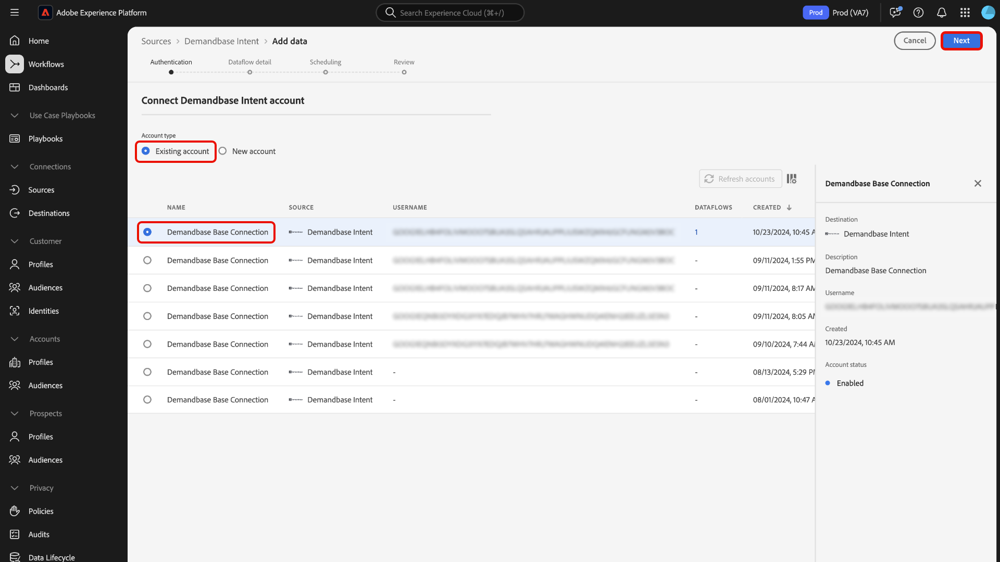

# UI를 사용하여 [!DNL Demandbase Intent]을(를) Experience Platform에 연결

사용자 인터페이스를 사용하여 [!DNL Demandbase Intent] 계정을 Adobe Experience Platform에 연결하는 방법에 대해 알아보려면 이 안내서를 참조하십시오.

## 시작하기

이 자습서에서는 Experience Platform의 다음 구성 요소를 이해하고 있어야 합니다.

* [Real-Time CDP B2B edition](../../../../../rtcdp/b2b-overview.md): Real-Time CDP B2B edition은 B2B 서비스 모델에서 작동하는 마케터용으로 특별히 빌드되었습니다. 여러 소스의 데이터를 함께 가져와서 사람 및 계정 프로필의 단일 보기로 결합합니다. 마케터는 이 통합 데이터를 통해 특정 대상자를 정확하게 타겟팅하고 사용 가능한 모든 채널에서 해당 대상자를 참여시킬 수 있습니다.
* [소스](../../../../home.md): Experience Platform을 사용하면 Experience Platform 서비스를 사용하여 들어오는 데이터를 구조화하고 레이블을 지정하고 향상시키는 기능을 제공하는 동시에 다양한 소스에서 데이터를 수집할 수 있습니다.
* [샌드박스](../../../../../sandboxes/home.md): Experience Platform은 단일 Experience Platform 인스턴스를 별도의 가상 환경으로 분할하여 디지털 경험 애플리케이션을 개발하고 발전시키는 데 도움이 되는 가상 샌드박스를 제공합니다.

### 전제 조건

인증 자격 증명을 검색하는 방법에 대한 자세한 내용은 [[!DNL Demandbase Intent] 개요](../../../../connectors/data-partners/demandbase.md)를 참조하십시오.

## 소스 카탈로그 탐색 {#navigate}

Experience Platform UI의 왼쪽 탐색에서 **[!UICONTROL 소스]**&#x200B;를 선택하여 *[!UICONTROL 소스]* 작업 영역에 액세스합니다. *[!UICONTROL 범주]* 패널에서 해당 범주를 선택할 수 있습니다. 또는 검색 창을 사용하여 사용할 특정 소스로 이동할 수 있습니다.

[!DNL Demandbase]을(를) 사용하려면 [!UICONTROL 데이터 및 ID 파트너]에서 **[!UICONTROL Demandbase Intent]** 원본 카드를 선택한 다음 **[!UICONTROL 데이터 추가]**&#x200B;를 선택하십시오.

>[!TIP]
>
>지정된 소스에 아직 인증된 계정이 없는 경우 소스 카탈로그의 소스에 **[!UICONTROL 설정]** 옵션이 표시됩니다. 인증된 계정이 있으면 이 옵션이 **[!UICONTROL 데이터 추가]**(으)로 변경됩니다.

## 인증 {#authentication}

### 기존 계정 사용 {#existing}

기존 계정을 사용하려면 **[!UICONTROL 기존 계정]**&#x200B;을 선택한 다음 인터페이스의 계정 목록에서 사용할 계정을 선택하십시오.

계정을 선택한 후 **[!UICONTROL 다음]**&#x200B;을(를) 선택하여 다음 단계로 진행합니다.

### 새 계정 만들기 {#create}

기존 계정이 없는 경우 소스와 일치하는 필요한 인증 자격 증명을 제공하여 새 계정을 만들어야 합니다.

새 계정을 만들려면 **[!UICONTROL 새 계정]**&#x200B;을 선택한 다음 계정 이름과 필요한 경우 계정 세부 정보에 대한 설명을 입력하십시오. 그런 다음 Experience Platform에 대해 소스를 인증하기 위해 적절한 인증 값을 제공합니다. [!DNL Demandbase Intent] 계정에 연결하려면 다음 자격 증명이 있어야 합니다.

* **액세스 키 ID**: [!DNL Demandbase] 액세스 키 ID입니다. Experience Platform 계정을 인증하는 데 필요한 61자의 영숫자 문자열입니다.
* **비밀 액세스 키**: [!DNL Demandbase] 비밀 액세스 키입니다. Experience Platform 계정을 인증하는 데 필요한 40자의 Base64로 인코딩된 문자열입니다.
* **버킷 이름**: 데이터를 가져올 [!DNL Demandbase] 버킷입니다.

## 데이터 흐름 세부 정보 제공 {#provide-dataflow-details}

계정이 인증되고 연결되면 이제 데이터 흐름에 대해 다음 세부 정보를 제공해야 합니다.

* **데이터 흐름 이름**: 데이터 흐름의 이름입니다. 데이터 흐름이 생성되고 처리되면 이 이름을 사용하여 UI에서 데이터 흐름을 검색할 수 있습니다.
* **설명**: (선택 사항) 데이터 흐름에 대한 간단한 설명 또는 추가 정보입니다.
* **도메인 원본**: Experience Platform 계정에 대한 원본 계정 레코드와 일치하는 도메인 또는 웹 사이트 필드입니다. 이 값은 구성에 따라 달라질 수 있습니다. 지정하지 않으면 도메인 기본값이 `accountOrganization.website`(으)로 설정됩니다.

## 데이터 흐름 예약 {#schedule-dataflow}

그런 다음 예약 인터페이스를 사용하여 데이터 흐름에 대한 수집 일정을 구성합니다.

* **빈도**: 데이터 흐름이 실행되는 빈도를 지정합니다. 매주 비율로 데이터를 수집하도록 [!DNL Demandbase] 데이터 흐름을 예약할 수 있습니다.
* **간격**: 간격은 각 수집 주기 사이의 시간을 나타냅니다. [!DNL Demandbase] 데이터 흐름의 유일한 지원 간격은 `1`입니다. 즉, 데이터 흐름은 일주일에 한 번, 매주 데이터를 수집합니다.
* **시작 시간**: 시작 시간은 데이터 흐름의 첫 번째 실행 반복이 발생하는 시기를 나타냅니다. [!DNL Demandbase]이(가) 매주 한 번, 월요일 오후 12시(UTC) Adobe에 데이터를 삭제합니다. 따라서 수집 시작 시간을 오후 12시(UTC) 이후로 설정해야 합니다. 또한 [!DNL Demandbase]이(가) Adobe에 파일을 삭제할 때 일정이 변경될 수 있으므로 이 파일을 사용하여 수집 시간을 확인해야 합니다.
* **다시 채우기**: 다시 채우기는 처음 수집되는 데이터를 결정합니다. 다시 채우기를 활성화하면 처음 예약된 수집 중에 지정된 경로의 모든 현재 파일이 수집됩니다. 다시 채우기를 비활성화하면 첫 번째 수집 실행과 시작 시간 사이에 로드된 파일만 수집됩니다. 시작 시간 이전에 로드된 파일은 수집되지 않습니다.

데이터 흐름의 수집 일정을 구성한 후 **[!UICONTROL 다음]**&#x200B;을(를) 선택하십시오.

## 데이터 흐름 검토 {#review-dataflow}

데이터 흐름 생성 프로세스의 마지막 단계는 데이터 흐름을 실행하기 전에 검토하는 것입니다. *[!UICONTROL 검토]* 단계를 사용하여 새 데이터 흐름이 실행되기 전에 자세한 내용을 검토하십시오. 세부 정보는 다음 카테고리로 그룹화됩니다.

* **연결**: 원본 형식, 선택한 원본 파일의 관련 경로 및 해당 원본 파일에 있는 열의 수를 표시합니다.
* **예약**: 수집 일정의 활성 기간, 빈도 및 간격을 표시합니다.

## 다음 단계

이 자습서를 따라 [!DNL Demandbase] 소스에서 Experience Platform으로 의도 데이터를 가져오기 위한 데이터 흐름을 만들었습니다. 추가 리소스는 아래 설명된 설명서를 참조하십시오.

### 데이터 흐름 모니터링

데이터 흐름이 만들어지면 데이터 흐름을 통해 수집되는 데이터를 모니터링하여 수집 비율, 성공 및 오류에 대한 정보를 볼 수 있습니다. 데이터 흐름을 모니터링하는 방법에 대한 자세한 내용은 [UI에서 계정 및 데이터 흐름 모니터링](../../../../../dataflows/ui/monitor-sources.md)에 대한 자습서를 참조하십시오.

### 데이터 흐름 업데이트

데이터 흐름 예약, 매핑 및 일반 정보에 대한 구성을 업데이트하려면 [UI에서 소스 데이터 흐름 업데이트](../../update-dataflows.md)에 대한 자습서를 참조하십시오.

### 데이터 흐름 삭제

**[!UICONTROL 데이터 흐름]** 작업 영역에서 사용할 수 있는 **[!UICONTROL Delete]** 함수를 사용하여 더 이상 필요하지 않거나 잘못 만들어진 데이터 흐름을 삭제할 수 있습니다. 데이터 흐름을 삭제하는 방법에 대한 자세한 내용은 [UI에서 데이터 흐름 삭제](../../delete.md)에 대한 자습서를 참조하십시오.
