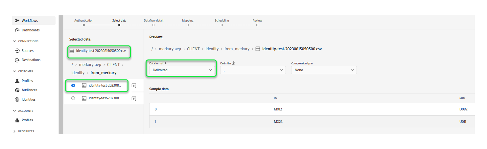

# 만들기 [!DNL Merkury Enterprise Identity Resolution] ui의 소스 연결 및 데이터 흐름

>[!NOTE]
>
>다음 [!DNL Merkury Enterprise Identity Resolution] 소스는 베타 버전입니다. 다음을 읽으십시오. [소스 개요](../../../../home.md#terms-and-conditions) beta 레이블 소스를 사용하는 방법에 대한 자세한 내용.

이 튜토리얼에서는 [!DNL Merkury Enterprise Identity Resolution] Adobe Experience Platform 사용자 인터페이스를 사용한 소스 연결 및 데이터 흐름.

## 시작하기

이 자습서에서는 다음 Experience Platform 구성 요소를 이해하고 있어야 합니다.

* [[!DNL Experience Data Model (XDM)] 시스템](../../../../../xdm/home.md): Experience Platform이 고객 경험 데이터를 구성하는 표준화된 프레임워크입니다.
   * [스키마 컴포지션 기본 사항](../../../../../xdm/schema/composition.md): 스키마 컴포지션의 주요 원칙 및 모범 사례를 포함하여 XDM 스키마의 기본 구성 요소에 대해 알아봅니다.
   * [스키마 편집기 튜토리얼](../../../../../xdm/tutorials/create-schema-ui.md): 스키마 편집기 UI를 사용하여 사용자 정의 스키마를 만드는 방법을 알아봅니다.
* [[!DNL Real-Time Customer Profile]](../../../../../profile/home.md): 여러 소스의 집계 데이터를 기반으로 통합 실시간 소비자 프로필을 제공합니다.

### 필요한 자격 증명 수집

Experience Platform 시 버킷에 액세스하려면 다음 자격 증명에 대한 유효한 값을 제공해야 합니다.

| 자격 증명 | 설명 |
| --- | --- |
| 액세스 키 | 버킷에 대한 액세스 키 ID입니다. 다음 위치에서 이 값을 검색할 수 있습니다. [!DNL Merkury] 팀. |
| 비밀 키 | 버킷의 비밀 키 ID. 다음 위치에서 이 값을 검색할 수 있습니다. [!DNL Merkury] 팀. |
| 버킷 이름 | 파일이 공유되는 머큐리 버킷입니다. 다음 위치에서 이 값을 검색할 수 있습니다. [!DNL Merkury] 팀. |

설정에 대한 자세한 내용 [!DNL Merkury] 및 기타 전제 조건은 다음을 참조하십시오. [[!DNL Merkury] 소스 개요](../../../../connectors/data-partners/merkury.md).

## Merkury 계정 연결

Platform UI에서 를 선택합니다. **[!UICONTROL 소스]** 왼쪽 탐색 모음에서 다음 위치에 액세스: [!UICONTROL 소스] 작업 영역. 다음 [!UICONTROL 카탈로그] 화면에는 계정을 만들 수 있는 다양한 소스가 표시됩니다.

화면 왼쪽에 있는 카탈로그에서 적절한 카테고리를 선택할 수 있습니다. 또는 검색 옵션을 사용하여 작업할 특정 소스를 찾을 수 있습니다.

아래 **[!UICONTROL 데이터 파트너]** 범주, 선택 **[!UICONTROL 메르쿠리]** 다음을 선택합니다. **[!UICONTROL 설정]**.

다음 **[!UICONTROL Merkury에 연결]** 페이지가 나타납니다. 이 페이지에서 새 자격 증명 또는 기존 자격 증명을 사용할 수 있습니다.

### 새 계정 만들기

새 자격 증명을 사용하는 경우 다음을 선택합니다 **[!UICONTROL 새 계정]**. 표시되는 입력 양식에서 이름, 설명(선택 사항) 및 [!DNL Merkury] 자격 증명. 완료되면 다음을 선택합니다. **[!UICONTROL 소스에 연결]** 그런 다음 새 연결을 설정하는 데 시간이 걸릴 수 있습니다.

### 기존 계정 사용

기존 계정을 사용하려면 **[!UICONTROL 기존 계정]** 을(를) 선택한 다음 [!DNL Merkury] 사용하려는 계정입니다. **[!UICONTROL 다음]**&#x200B;을 선택하여 계속하십시오.

>[!BEGINSHADEBOX]

**지원되는 파일 형식**

를 사용하여 다음 파일 형식을 수집할 수 있습니다. [!DNL Merkury] 소스:

* 구분 기호로 구분된 값 (DSV): 모든 단일 문자 값을 DSV 형식 데이터 파일의 구분 기호로 사용할 수 있습니다.
* [!DNL JavaScript Object Notation] (JSON): JSON 형식의 데이터 파일은 XDM을 준수해야 합니다.
* [!DNL Apache Parquet]: Parquet 포맷의 데이터 파일은 XDM을 준수해야 합니다.
* 압축된 파일: JSON 및 구분된 파일은 다음과 같이 압축할 수 있습니다. `bzip2`, `gzip`, `deflate`, `zipDeflate`, `tarGzip`, 및 `tar`.

>[!ENDSHADEBOX]

## 데이터 추가

을(를) 만든 후 [!DNL Merkury] 계정, **[!UICONTROL 데이터 추가]** 을 살펴볼 수 있는 인터페이스를 제공하는 단계가 나타납니다. [!DNL Merkury] 파일 계층 구조를 선택하고 Experience Platform 대상으로 가져올 폴더 또는 특정 파일을 선택합니다.

* 인터페이스의 왼쪽 부분은 디렉토리 브라우저이며 [!DNL Merkury] 파일 계층 구조.
* 인터페이스의 오른쪽 부분에서 호환 가능한 폴더 또는 파일에서 최대 100개의 데이터 행을 미리 볼 수 있습니다.

폴더 계층 구조에 액세스하려면 루트 폴더를 선택하십시오. 여기에서 단일 폴더를 선택하여 폴더의 모든 파일을 재귀적으로 수집할 수 있습니다. 전체 폴더를 수집할 때 해당 폴더의 모든 파일이 동일한 데이터 형식과 스키마를 공유하는지 확인해야 합니다.

폴더를 선택하면 오른쪽 인터페이스가 선택한 폴더의 첫 번째 파일 내용 및 구조에 대한 미리보기로 업데이트됩니다.

이 단계에서 계속하기 전에 데이터에 몇 가지 구성을 만들 수 있습니다. 먼저 을(를) 선택합니다 **[!UICONTROL 데이터 형식]** 그런 다음 나타나는 드롭다운 패널에서 파일에 적합한 데이터 형식을 선택합니다.

다음 표에는 지원되는 파일 유형에 적합한 데이터 형식이 나와 있습니다.

| 파일 유형 | 데이터 형식 |
| --- | --- |
| CSV로 내보내기 | [!UICONTROL 구분됨] |
| JSON | [!UICONTROL JSON] |
| 쪽모이 세공 | [!UICONTROL XDM Parquet] |

### 열 구분 기호 선택

+++구분 기호를 설정하는 방법에 대한 단계를 보려면 선택

데이터 형식을 구성한 후 구분된 파일을 수집할 때 열 구분 기호를 설정할 수 있습니다. 다음 항목 선택 **[!UICONTROL 구분 기호]** 옵션을 선택한 다음 드롭다운 메뉴에서 구분 기호를 선택합니다. 메뉴에는 쉼표()를 포함하여 구분 기호에 가장 자주 사용되는 옵션이 표시됩니다.`,`), 탭(`\t`), 파이프(`|`).

사용자 지정 구분 기호를 사용하려면 을 선택합니다. **[!UICONTROL 사용자 정의]** 팝업 입력 막대에 선택한 단일 문자 구분 기호를 입력합니다.

+++

### 압축된 파일 수집

+++ 압축 파일을 수집하는 방법에 대한 단계를 보려면 선택

압축 유형을 지정하여 압축된 JSON 또는 구분된 파일을 수집할 수도 있습니다.

다음에서 [!UICONTROL 데이터 선택] 단계에서는 수집할 압축 파일을 선택한 다음 해당 파일 유형과 XDM 호환 여부를 선택합니다. 그런 다음 을 선택합니다. **[!UICONTROL 압축 유형]** 그런 다음 소스 데이터에 적합한 압축 파일 유형을 선택합니다.

특정 파일을 플랫폼으로 가져오려면 폴더를 선택한 다음 수집할 파일을 선택합니다. 이 단계에서는 파일 이름 옆에 있는 미리 보기 아이콘을 사용하여 주어진 폴더 내에 있는 다른 파일의 파일 내용을 미리 볼 수도 있습니다.

완료되면 다음을 선택합니다. **[!UICONTROL 다음]**.

+++

## 데이터 흐름 세부 정보 제공

다음 [!UICONTROL 데이터 흐름 세부 정보] 페이지에서는 기존 데이터 세트를 사용할지 또는 새 데이터 세트를 사용할지 선택할 수 있습니다. 이 프로세스 중에 프로필에 수집할 데이터를 구성하고 다음과 같은 설정을 활성화할 수도 있습니다 [!UICONTROL 오류 진단], [!UICONTROL 부분 수집], 및 [!UICONTROL 경고].

### 기존 데이터 세트 사용

기존 데이터 세트에 데이터를 수집하려면 다음을 선택합니다. **[!UICONTROL 기존 데이터 세트]**. 다음을 사용하여 기존 데이터 세트를 검색할 수 있습니다. [!UICONTROL 고급 검색] 또는 드롭다운 메뉴에서 기존 데이터 세트 목록을 스크롤하여 옵션을 선택할 수 있습니다. 데이터 세트를 선택한 후에는 데이터 흐름의 이름과 설명을 입력합니다.

### 새 데이터 세트 사용

새 데이터 세트로 수집하려면 다음을 선택합니다. **[!UICONTROL 새 데이터 세트]** 그런 다음 출력 데이터 세트 이름과 선택적 설명을 제공합니다. 그런 다음 를 사용하여 매핑할 스키마를 선택합니다 [!UICONTROL 고급 검색] 또는 드롭다운 메뉴에서 기존 스키마 목록을 스크롤하여 선택합니다. 스키마를 선택하면 데이터 흐름의 이름과 설명을 입력합니다.

### 프로필 및 오류 진단 활성화

+++오류 진단 및 프로필 수집을 활성화하는 단계를 보려면 선택

그런 다음 **[!UICONTROL 프로필 데이터 세트]** 실시간 고객 프로필에 대한 데이터 세트를 활성화하려면 전환합니다. 이를 통해 엔티티의 속성 및 동작을 전체적으로 볼 수 있습니다. 모든 프로필 활성화 데이터 세트의 데이터는 프로필에 포함되며 데이터 흐름을 저장할 때 변경 사항이 적용됩니다.

[!UICONTROL 오류 진단] 에서는 데이터 흐름에서 발생하는 모든 잘못된 레코드에 대해 자세한 오류 메시지를 생성할 수 있습니다. [!UICONTROL 부분 수집] 을 사용하면 수동으로 정의하는 특정 임계값까지, 오류가 포함된 데이터를 수집할 수 있습니다. 다음을 참조하십시오. [부분 일괄 처리 수집 개요](../../../../../ingestion/batch-ingestion/partial.md) 추가 정보.

+++

### 경고 활성화

+++경고를 활성화하는 단계를 보려면 선택

경고를 활성화하여 데이터 흐름 상태에 대한 알림을 받을 수 있습니다. 목록에서 경고를 선택하여 데이터 흐름 상태에 대한 알림을 수신합니다. 경고에 대한 자세한 내용은 다음 안내서를 참조하십시오. [ui를 사용하여 소스 경고에 구독](../../alerts.md).

데이터 흐름에 세부 정보를 제공했으면 을 선택합니다. **[!UICONTROL 다음]**.

+++

## 데이터 필드를 XDM 스키마에 매핑

다음 [!UICONTROL 매핑] 소스 스키마의 소스 필드를 타겟 스키마의 해당 타겟 XDM 필드에 매핑하는 인터페이스를 제공하는 단계가 나타납니다.

Platform은 선택한 대상 스키마 또는 데이터 세트를 기반으로 자동 매핑된 필드에 대한 지능형 권장 사항을 제공합니다. 사용 사례에 맞게 매핑 규칙을 수동으로 조정할 수 있습니다. 필요에 따라 필드를 직접 매핑하도록 선택하거나 데이터 준비 함수를 사용하여 소스 데이터를 변환하여 계산된 값 또는 계산된 값을 파생할 수 있습니다. 매퍼 인터페이스 및 계산된 필드 사용에 대한 포괄적인 단계는 [데이터 준비 UI 안내서](../../../../../data-prep/ui/mapping.md).

소스 데이터가 성공적으로 매핑되면 다음을 선택합니다. **[!UICONTROL 다음]**.

## 수집 실행 예약

다음 [!UICONTROL 예약] 구성된 매핑을 사용하여 선택한 소스 데이터를 자동으로 수집하도록 수집 일정을 구성할 수 있는 단계가 나타납니다. 기본적으로 예약은 로 설정됩니다. `Once`. 수집 빈도를 조정하려면 다음을 선택합니다. **[!UICONTROL 빈도]** 드롭다운 메뉴에서 옵션을 선택합니다.

>[!TIP]
>
>일회성 수집 중에는 간격과 채우기가 표시되지 않습니다.

수집 빈도를 다음으로 설정하면 `Minute`, `Hour`, `Day`, 또는 `Week`, 그런 다음 모든 수집 사이에 설정된 시간대를 설정하려면 간격을 설정해야 합니다. 예를 들어 수집 빈도를 로 설정합니다. `Day` 및 간격이 다음으로 설정됨 `15` 는 데이터 흐름이 15일마다 데이터를 수집하도록 예약되어 있음을 의미합니다.

이 단계에서 을 활성화할 수도 있습니다 **채우기** 증분 데이터 수집을 위한 열을 정의합니다. 채우기 기능은 내역 데이터를 수집하는 데 사용되며 증분 수집을 위해 정의하는 열은 새 데이터를 기존 데이터와 구별할 수 있도록 합니다.

예약 구성에 대한 자세한 내용은 아래 표를 참조하십시오.

| 필드 | 설명 |
| --- | --- |
| 빈도 | 수집이 발생하는 빈도입니다. 선택 가능한 주파수는 다음과 같습니다. `Once`, `Minute`, `Hour`, `Day`, 및 `Week`. |
| 간격 | 선택한 주파수의 간격을 설정하는 정수입니다. 간격 값은 0이 아닌 정수여야 하며 15보다 크거나 같게 설정해야 합니다. |
| 시작 시간 | 첫 번째 수집이 발생하도록 설정된 시기를 나타내는 UTC 타임스탬프입니다. 시작 시간은 현재 UTC 시간보다 크거나 같아야 합니다. |
| 채우기 | 처음 수집되는 데이터를 결정하는 부울 값입니다. 다시 채우기를 활성화하면 처음 예약된 수집 중에 지정된 경로의 모든 현재 파일이 수집됩니다. 다시 채우기를 비활성화하면 첫 번째 수집 실행과 시작 시간 사이에 로드된 파일만 수집됩니다. 시작 시간 이전에 로드된 파일은 수집되지 않습니다. |

>[!NOTE]
>
>일괄 처리 수집의 경우 다음의 모든 데이터 흐름은 다음에 따라 소스에서 수집할 파일을 선택합니다 **마지막 수정일** 타임스탬프. 즉, 일괄 처리 데이터 흐름은 마지막 흐름 실행 이후 새로 추가되었거나 수정된 파일을 소스에서 선택합니다. 또한 예약된 플로우 실행 시간이 수집되기 전에 클라우드 스토리지 계정에 완전히 업로드되지 않은 파일은 수집하기 위해 선택할 수 없으므로 파일 업로드와 예약된 플로우 실행 간에 충분한 시간이 있는지 확인해야 합니다.

수집 일정 구성을 마쳤으면 다음을 선택합니다. **[!UICONTROL 다음]**.

## 데이터 흐름 검토

다음 **[!UICONTROL 리뷰]** 새 데이터 흐름을 만들기 전에 검토할 수 있는 단계가 나타납니다. 세부 사항은 다음 범주 내에서 그룹화됩니다.

* **[!UICONTROL 연결]**: 소스 유형, 선택한 소스 파일의 관련 경로 및 해당 소스 파일 내의 열 양을 표시합니다.
* **[!UICONTROL 데이터 세트 할당 및 필드 매핑]**: 데이터 세트가 준수하는 스키마를 포함하여 소스 데이터가 수집되는 데이터 세트를 표시합니다.
* **[!UICONTROL 예약]**: 수집 일정의 활성 기간, 빈도 및 간격을 표시합니다.

데이터 흐름을 검토하고 나면 **[!UICONTROL 완료]** 데이터 흐름이 만들어지는 데 시간이 걸릴 수 있습니다.

## 다음 단계

이 자습서를 따라 데이터 흐름을 만들어 에서 일괄 데이터를 가져올 수 있습니다. [!DNL Merkury] 소스-Experience Platform. 추가 리소스는 아래 설명된 설명서를 참조하십시오.

### 데이터 흐름 모니터링

데이터 흐름이 만들어지면 데이터 흐름을 통해 수집되는 데이터를 모니터링하여 수집 비율, 성공 및 오류에 대한 정보를 볼 수 있습니다. 데이터 흐름을 모니터링하는 방법에 대한 자세한 내용은 다음 자습서를 참조하십시오 [ui에서 계정 및 데이터 흐름 모니터링](../../monitor.md).

### 데이터 흐름 업데이트

데이터 흐름 예약, 매핑 및 일반 정보에 대한 구성을 업데이트하려면 다음 자습서를 참조하십시오. [ui에서 소스 데이터 흐름 업데이트](../../update-dataflows.md)

### 데이터 흐름 삭제

를 사용하여 더 이상 필요하지 않거나 잘못 생성된 데이터 흐름을 삭제할 수 있습니다. **[!UICONTROL 삭제]** 다음에서 사용할 수 있는 함수 **[!UICONTROL 데이터 흐름]** 작업 영역. 데이터 흐름을 삭제하는 방법에 대한 자세한 내용은 [UI에서 데이터 흐름 삭제](../../delete.md).