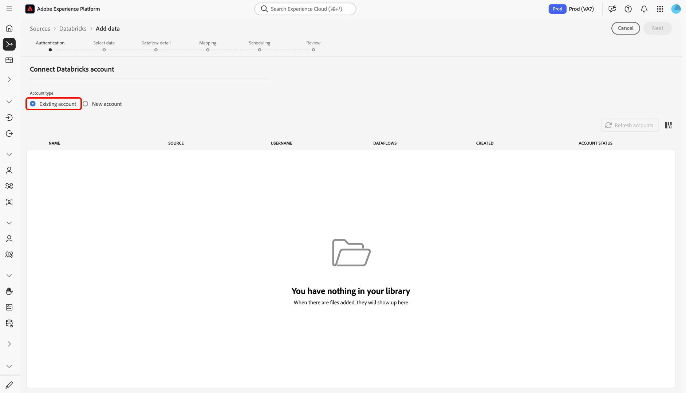

# UI에서 [!DNL Azure Databricks]을(를) Experience Platform에 연결

>[!AVAILABILITY]
>
>* [!DNL Azure Databricks] 소스는 Real-Time CDP Ultimate을 구매한 사용자가 소스 카탈로그에서 사용할 수 있습니다.
>
>* [!DNL Azure Databricks] 원본이 Beta 버전입니다. 베타 레이블 소스를 사용하는 방법에 대한 자세한 내용은 소스 개요에서 [약관](../../../../home.md#terms-and-conditions)을 참조하십시오.

UI의 소스 작업 영역을 사용하여 [!DNL Azure Databricks] 계정을 Adobe Experience Platform에 연결하는 방법을 알아보려면 이 안내서를 참조하십시오.

## 시작

이 안내서를 사용하려면 Experience Platform의 다음 구성 요소에 대해 이해하고 있어야 합니다.

* [소스](../../../../home.md): Experience Platform을 사용하면 Experience Platform 서비스를 사용하여 들어오는 데이터를 구조화하고 레이블을 지정하고 향상시키는 기능을 제공하는 동시에 다양한 소스에서 데이터를 수집할 수 있습니다.
* [샌드박스](../../../../../sandboxes/home.md): Experience Platform은 단일 Experience Platform 인스턴스를 별도의 가상 환경으로 분할하여 디지털 경험 애플리케이션을 개발하고 발전시키는 데 도움이 되는 가상 샌드박스를 제공합니다.

### 필요한 자격 증명 수집

[!DNL Azure Databricks]을(를) Experience Platform에 연결하려면 다음 자격 증명의 값을 제공하십시오.

| 자격 증명 | 설명 |
| --- | --- |
| 도메인 | [!DNL Azure Databricks] 작업 영역의 URL입니다. 예: `https://adb-1234567890123456.7.azuredatabricks.net`. |
| 클러스터 ID | [!DNL Azure Databricks]에 있는 클러스터의 ID입니다. 이 클러스터는 이미 기존 클러스터여야 하며 대화형 클러스터여야 합니다. |
| 액세스 토큰 | [!DNL Azure Databricks] 계정을 인증하는 액세스 토큰입니다. [!DNL Azure Databricks] 작업 영역을 사용하여 액세스 토큰을 생성할 수 있습니다. |
| 데이터베이스 | 델타 레이크에 있는 데이터베이스의 이름입니다. |

자세한 내용은 [[!DNL Azure Databricks] 개요](../../../../connectors/databases/databricks.md)를 참조하십시오.

## 소스 카탈로그 탐색

Experience Platform UI의 왼쪽 탐색에서 **[!UICONTROL 소스]**&#x200B;를 선택하여 *[!UICONTROL 소스]* 작업 영역에 액세스합니다. 카테고리를 선택하거나 검색 창을 사용하여 소스를 찾습니다.

[!DNL Azure Databricks]에 연결하려면 *[!UICONTROL 데이터베이스]* 범주로 이동하여 **[!UICONTROL Azure 데이터베이스]** 원본 카드를 선택한 다음 **[!UICONTROL 설정]**&#x200B;을 선택하세요.

>[!TIP]
>
>지정된 소스에 아직 인증된 계정이 없는 경우 소스 카탈로그의 소스에 **[!UICONTROL 설정]** 옵션이 표시됩니다. 인증된 계정을 만들면 이 옵션이 **[!UICONTROL 데이터 추가]**(으)로 변경됩니다.

### 기존 계정 사용

기존 계정을 사용하려면 **[!UICONTROL 기존 계정]**&#x200B;을(를) 선택한 다음 사용할 [!DNL Azure Databricks] 계정을 선택하십시오.

### 새 계정 만들기

새 계정을 만들려면 **[!UICONTROL 새 계정]**&#x200B;을(를) 선택하고 이름을 입력하고 선택적으로 계정에 대한 설명을 추가하십시오. 그런 다음 다음 다음 인증 자격 증명의 값을 제공합니다.

* 도메인
* 클러스터 ID
* 액세스 토큰
* 데이터베이스

또한 [!UICONTROL 스테이징 SAS URI] 자격 증명을 복사하여 [!DNL Azure Databricks] 환경에 붙여넣어야 합니다. 완료되면 **[!UICONTROL 소스에 연결]**&#x200B;을 선택하고 연결을 설정할 수 있도록 잠시 기다립니다.

## [!DNL Azure Databricks] 데이터에 대한 데이터 흐름 만들기

[!DNL Azure Databricks] 계정을 연결했으므로 이제 [데이터 흐름을 만들고 데이터베이스의 데이터를 Experience Platform으로 수집](../../dataflow/databases.md)할 수 있습니다.
