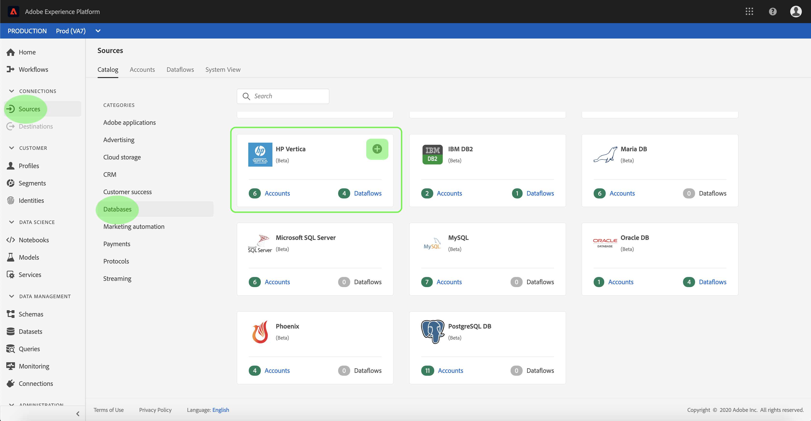

# HP 만들기 [!DNL Vertica] UI의 소스 연결

>[!NOTE]
>
> HP [!DNL Vertica] 커넥터가 베타 버전입니다. 자세한 내용은 [소스 개요](../../../../home.md#terms-and-conditions) 베타 레이블이 지정된 커넥터 사용에 대한 자세한 정보.

Adobe Experience Platform의 소스 커넥터는 예약된 방식으로 외부 소스 데이터를 수집할 수 있습니다. 이 자습서에서는 HP 생성 단계를 제공합니다 [!DNL Vertica] 소스 커넥터 [!DNL Platform] 사용자 인터페이스.

## 시작하기

이 자습서에서는 Adobe Experience Platform의 다음 구성 요소를 이해하고 있어야 합니다.

* [[!DNL Experience Data Model (XDM)] 시스템](../../../../../xdm/home.md): 표준화된 프레임워크 [!DNL Experience Platform] 고객 경험 데이터를 구성합니다.
   * [스키마 작성 기본 사항](../../../../../xdm/schema/composition.md): 스키마 컴포지션의 주요 원칙 및 모범 사례를 포함하여 XDM 스키마의 기본 빌딩 블록에 대해 알아봅니다.
   * [스키마 편집기 자습서](../../../../../xdm/tutorials/create-schema-ui.md): 스키마 편집기 UI를 사용하여 사용자 지정 스키마를 만드는 방법을 알아보십시오.
* [[!DNL Real-Time Customer Profile]](../../../../../profile/home.md): 여러 소스에서 집계된 데이터를 기반으로 통합된 실시간 소비자 프로필을 제공합니다.

이미 유효한 HP가 있는 경우 [!DNL Vertica] 연결을 통해 이 문서의 나머지 부분을 건너뛰고 다음 자습서를 진행할 수 있습니다. [데이터 흐름 구성](../../dataflow/databases.md).

### 필요한 자격 증명 수집

다음 섹션에서는 HP에 성공적으로 접속하기 위해 알아야 할 추가 정보를 제공합니다 [!DNL Vertica] 사용 [!DNL Flow Service] API.

| 자격 증명 | 설명 |
| ---------- | ----------- |
| `connectionString` | HP에 연결하는 데 사용되는 연결 문자열입니다. [!DNL Vertica] 인스턴스. HP용 연결 문자열 패턴 [!DNL Vertica] is `Server={SERVER};Port={PORT};Database={DATABASE};UID={USERNAME};PWD={PASSWORD}` |

시작하는 방법에 대한 자세한 내용은 [이 HP [!DNL Vertica] 문서](https://www.vertica.com/docs/9.2.x/HTML/Content/Authoring/ConnectingToVertica/ClientJDBC/CreatingAndConfiguringAConnection.htm).

## HP 연결 [!DNL Vertica] account

필요한 자격 증명을 수집하면 아래 단계에 따라 HP를 연결할 수 있습니다 [!DNL Vertica] 계정 대상 [!DNL Platform].

에 로그인합니다. [Adobe Experience Platform](https://platform.adobe.com) 그런 다음 **[!UICONTROL 소스]** 왼쪽 탐색 모음에서 를 클릭하여 **[!UICONTROL 소스]** 작업 공간. 다음 **[!UICONTROL 카탈로그]** 화면에는 계정을 만들 수 있는 다양한 소스가 표시됩니다.

화면 왼쪽에 있는 카탈로그에서 적절한 카테고리를 선택할 수 있습니다. 또는 검색 옵션을 사용하여 작업할 특정 소스를 찾을 수 있습니다.

아래에 **[!UICONTROL 데이터베이스]** 카테고리, 선택 **[!UICONTROL HP Vertica]**. 이 커넥터를 처음 사용하는 경우 **[!UICONTROL 구성]**. 그렇지 않으면 을 선택합니다. **[!UICONTROL 데이터 추가]** 새 HP를 만들려면 [!DNL Vertica] 커넥터.

다음 **[!UICONTROL HP Vertica에 연결]** 페이지가 나타납니다. 이 페이지에서 새 자격 증명 또는 기존 자격 증명을 사용할 수 있습니다.

### 새 계정

새 자격 증명을 사용하는 경우 **[!UICONTROL 새 계정]**. 표시되는 입력 양식에서 이름, 선택적 설명 및 HP를 입력합니다 [!DNL Vertica] 자격 증명. 완료되면 을 선택합니다 **[!UICONTROL Connect]** 그런 다음 새 연결이 설정될 시간을 허용합니다.

### 기존 계정

기존 계정을 연결하려면 HP를 선택합니다 [!DNL Vertica] 연결할 계정을 선택한 다음 **[!UICONTROL 다음]** 오른쪽 위 모서리에서 진행하십시오.

## 다음 단계

이 자습서를 따라 HP에 대한 연결을 설정했습니다 [!DNL Vertica] 계정이 필요합니다. 이제 다음 자습서를 계속 진행하고 [데이터 흐름을 구성하여 데이터 [!DNL Platform]](../../dataflow/databases.md).
