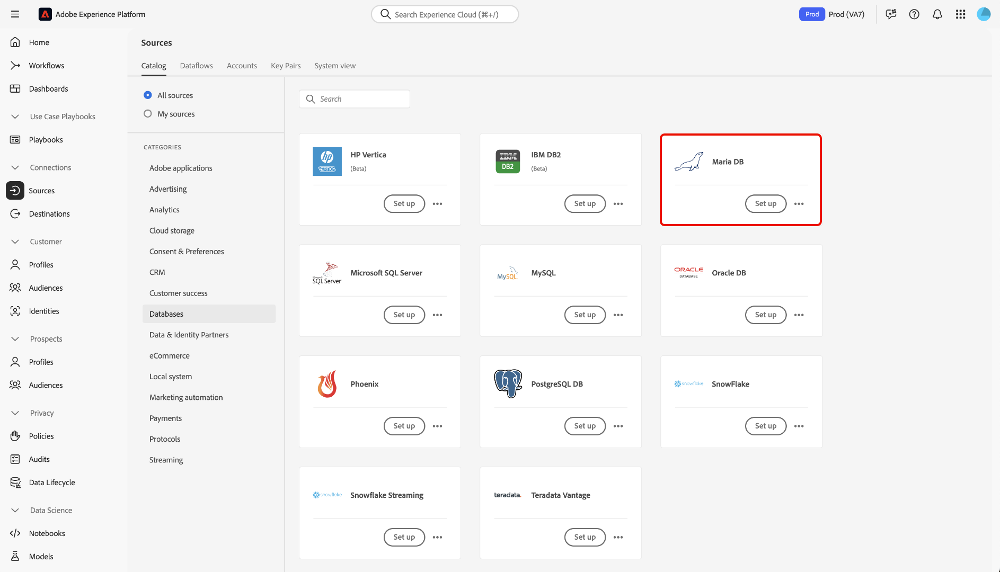

# UI를 사용하여 [!DNL MariaDB]을(를) Experience Platform에 연결

Experience Platform 사용자 인터페이스의 소스 작업 영역을 사용하여 [!DNL MariaDB] 계정을 Adobe Experience Platform에 연결하는 방법에 대해 알아보려면 이 안내서를 참조하십시오.

## 시작하기

이 자습서에서는 Experience Platform의 다음 구성 요소를 이해하고 있어야 합니다.

* [[!DNL Experience Data Model (XDM)] 시스템](../../../../../xdm/home.md): Experience Platform에서 고객 경험 데이터를 구성하는 표준화된 프레임워크입니다.
   * [스키마 컴포지션의 기본 사항](../../../../../xdm/schema/composition.md): 스키마 컴포지션의 주요 원칙 및 모범 사례를 포함하여 XDM 스키마의 기본 구성 요소에 대해 알아봅니다.
   * [스키마 편집기 튜토리얼](../../../../../xdm/tutorials/create-schema-ui.md): 스키마 편집기 UI를 사용하여 사용자 지정 스키마를 만드는 방법을 알아봅니다.
* [실시간 고객 프로필](../../../../../profile/home.md): 여러 소스의 집계 데이터를 기반으로 통합된 실시간 고객 프로필을 제공합니다.

이미 [!DNL MariaDB] 연결이 있는 경우 이 문서의 나머지 부분을 건너뛰고 [데이터 흐름 구성](../../dataflow/databases.md)에 대한 자습서로 진행할 수 있습니다.

### 필요한 자격 증명 수집

인증에 대한 자세한 내용은 [[!DNL MariaDB] 개요](../../../../connectors/databases/mariadb.md#prerequisites)를 읽어 보십시오.

## 소스 카탈로그 탐색

Experience Platform UI의 왼쪽 탐색에서 **[!UICONTROL 소스]**&#x200B;를 선택하여 *[!UICONTROL 소스]* 작업 영역에 액세스합니다. *[!UICONTROL 범주]* 패널에서 적절한 범주를 선택합니다. 또는 검색 창을 사용하여 사용할 특정 소스로 이동합니다.

[!DNL MariaDB]을(를) 사용하려면 *[!UICONTROL 데이터베이스]*&#x200B;에서 **[!UICONTROL MariaDB]** 원본 카드를 선택한 다음 **[!UICONTROL 설정]**&#x200B;을 선택하십시오.

>[!TIP]
>
>지정된 소스에 아직 인증된 계정이 없는 경우 소스 카탈로그의 소스에 **[!UICONTROL 설정]** 옵션이 표시됩니다. 인증된 계정을 만들면 이 옵션이 **[!UICONTROL 데이터 추가]**(으)로 변경됩니다.

## 기존 계정 사용 {#existing}

기존 계정을 사용하려면 **[!UICONTROL 기존 계정]**&#x200B;을(를) 선택한 다음 사용할 [!DNL MariaDB] 계정을 선택하십시오.

## 새 계정 만들기 {#create}

기존 계정이 없는 경우 소스와 일치하는 필요한 인증 자격 증명을 제공하여 새 계정을 만들어야 합니다.

새 계정을 만들려면 **[!UICONTROL 새 계정]**&#x200B;을 선택한 다음 이름을 입력하고 필요에 따라 계정에 대한 설명을 추가하십시오.

### Experience Platform에 연결

계정 키 또는 기본 인증을 사용하여 [!DNL MariaDB] 계정을 Experience Platform에 연결할 수 있습니다.

>[!BEGINTABS]

>[!TAB 계정 키 인증]

계정 키 인증을 사용하려면 **[!UICONTROL 계정 키 인증]**&#x200B;을 선택하고 [연결 문자열](../../../../connectors/databases/mariadb.md#azure)을 제공한 다음 **[!UICONTROL 소스에 연결]**&#x200B;을 선택하십시오.

>[!TAB 기본 인증]

기본 인증을 사용하려면 **[!UICONTROL 기본 인증]**&#x200B;을 선택하고 [인증 자격 증명](../../../../connectors/databases/mariadb.md#azure)의 값을 제공한 다음 **[!UICONTROL 소스에 연결]**&#x200B;을 선택하십시오.

>[!ENDTABS]

이 자습서에 따라 [!DNL MariaDB] 계정에 대한 연결을 설정했습니다. 이제 다음 자습서를 계속 진행하고 [데이터를 Experience Platform으로 가져오도록 데이터 흐름을 구성](../../dataflow/databases.md)할 수 있습니다.
