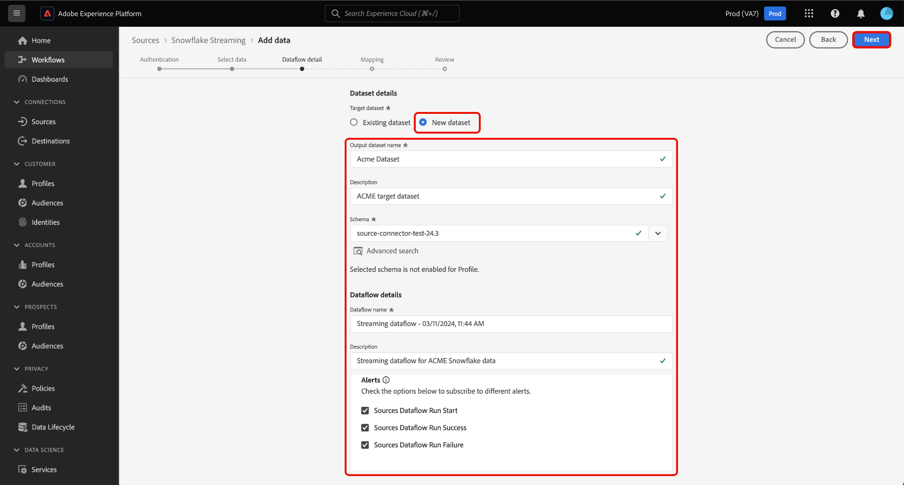

# UI를 사용하여 [!DNL Snowflake] 데이터베이스에서 Experience Platform으로 데이터 스트리밍

UI의 소스 작업 영역을 사용하여 [!DNL Snowflake] 데이터베이스에서 Experience Platform으로 데이터를 스트리밍하는 방법에 대해 알아보려면 이 안내서를 참조하십시오.

## 시작하기

이 자습서에서는 Experience Platform의 다음 구성 요소를 이해하고 있어야 합니다.

* [[!DNL Experience Data Model (XDM)] 시스템](../../../../../xdm/home.md): [!DNL Experience Platform]에서 고객 경험 데이터를 구성하는 표준화된 프레임워크입니다.
   * [스키마 컴포지션의 기본 사항](../../../../../xdm/schema/composition.md): 스키마 컴포지션의 주요 원칙 및 모범 사례를 포함하여 XDM 스키마의 기본 구성 요소에 대해 알아봅니다.
   * [스키마 편집기 튜토리얼](../../../../../xdm/tutorials/create-schema-ui.md): 스키마 편집기 UI를 사용하여 사용자 지정 스키마를 만드는 방법을 알아봅니다.
* [[!DNL Real-Time Customer Profile]](../../../../../profile/home.md): 여러 원본의 집계된 데이터를 기반으로 통합된 실시간 소비자 프로필을 제공합니다.

### 인증

[에서 Experience Platform으로 스트리밍 데이터를 수집하기 전에 완료해야 하는 단계에 대한 자세한 내용은  [!DNL Snowflake] 스트리밍 데이터](../../../../connectors/databases/snowflake-streaming.md)의 필수 구성 요소 설정[!DNL Snowflake]에 대한 안내서를 참조하십시오.

## [!DNL Snowflake Streaming] 소스를 사용하여 [!DNL Snowflake] 데이터를 Experience Platform으로 스트리밍

Experience Platform UI의 왼쪽 탐색에서 **[!UICONTROL 소스]**&#x200B;를 선택하여 [!UICONTROL 소스] 작업 영역에 액세스합니다. 화면 왼쪽에 있는 카탈로그에서 적절한 카테고리를 선택할 수 있습니다. 또는 검색 옵션을 사용하여 작업할 특정 소스를 찾을 수 있습니다.

*데이터베이스* 범주에서 **[!DNL Snowflake Streaming]**&#x200B;을(를) 선택한 다음 **[!UICONTROL 설정]**&#x200B;을(를) 선택합니다.

>[!TIP]
>
>원본 카탈로그에 인증된 계정이 없는 원본에는 **[!UICONTROL 설정]** 옵션이 표시됩니다. 인증된 계정이 있으면 이 옵션이 **[!UICONTROL 데이터 추가]**(으)로 변경됩니다.

**[!UICONTROL Snowflake 스트리밍 계정 연결]** 페이지가 나타납니다. 이 페이지에서 새 자격 증명 또는 기존 자격 증명을 사용할 수 있습니다.

### 새 계정 만들기

새 계정을 만들려면 **[!UICONTROL 새 계정]**&#x200B;을(를) 선택하고 계정에 대한 이름과 설명을 입력하십시오.

>[!BEGINTABS]

>[!TAB 기본 인증]

[!UICONTROL 기본 인증]을 사용하려면 **[!UICONTROL Snowflake에 대한 기본 인증]**&#x200B;을 선택하고 [!DNL Snowflake] 계정에 대한 자격 증명을 제공하세요. 완료되면 **[!UICONTROL 소스에 연결]**&#x200B;을 선택하고 연결을 설정할 수 있도록 잠시 기다립니다.

[!DNL Snowflake Streaming]필요한 자격 증명 수집[에 대한 자세한 내용은 ](../../../../connectors/databases/snowflake-streaming.md#gather-required-credentials) 개요를 읽어 보십시오.

>[!TAB KeyPair 인증]

[!UICONTROL KeyPair 인증]을(를) 사용하려면 **[!UICONTROL Snowflake에 대한 KeyPair 인증]**&#x200B;을(를) 선택하고 [!DNL Snowflake] 계정에 자격 증명을 제공하십시오. 완료되면 **[!UICONTROL 소스에 연결]**&#x200B;을 선택하고 연결을 설정할 수 있도록 잠시 기다립니다.

[!DNL Snowflake Streaming]필요한 자격 증명 수집[에 대한 자세한 내용은 ](../../../../connectors/databases/snowflake-streaming.md#gather-required-credentials) 개요를 읽어 보십시오.

>[!ENDTABS]

기존 계정을 사용하려면 **[!UICONTROL 기존 계정]**&#x200B;을 선택하고 목록에서 계정을 선택한 다음 **[!UICONTROL 다음]**&#x200B;을 선택하십시오.

## 데이터 선택 {#select-data}

>[!IMPORTANT]
>
>* 스트리밍 데이터 흐름을 만들려면 소스 테이블에 타임스탬프 열이 있어야 합니다. 타임스탬프는 Experience Platform이 데이터가 수집되는 시기와 증분 데이터가 스트리밍되는 시기를 아는 데 필요합니다. 기존 연결에 대한 타임스탬프 열을 소급하여 추가하고 새 데이터 흐름을 만들 수 있습니다.
>
>* 샘플 원본 데이터 파일의 데이터 필드의 대/소문자가 식별자에 대한 대/소문자 확인에 대한 [!DNL Snowflake]의 지침을 따르는지 확인하십시오. 자세한 내용은 [[!DNL Snowflake] 식별자 케이스](https://docs.snowflake.com/en/sql-reference/identifiers-syntax#label-identifier-casing)의 문서를 참조하십시오.

[!UICONTROL 데이터 선택] 단계가 나타납니다. 이 단계에서는 Experience Platform으로 가져올 데이터를 선택하고, 타임스탬프와 시간대를 구성하고, 원시 데이터 수집을 위한 샘플 소스 데이터 파일을 제공해야 합니다.

화면 왼쪽에 있는 데이터베이스 디렉터리를 사용하고 Experience Platform으로 가져올 테이블을 선택합니다.

그런 다음 테이블의 타임스탬프 열 유형을 선택합니다. 두 종류의 타임스탬프 열 `TIMESTAMP_NTZ` 또는 `TIMESTAMP_LTZ` 중에서 선택할 수 있습니다. `TIMESTAMP_NTZ`의 열 형식을 선택하는 경우 시간대도 제공해야 합니다. 열에는 null 아님 제약 조건이 있어야 합니다. 자세한 내용은 [제한 사항 및 자주 묻는 질문](../../../../connectors/databases/snowflake-streaming.md#limitations-and-frequently-asked-questions)에 대한 섹션을 참조하십시오.

이 단계에서 채우기 설정을 구성할 수도 있습니다. 채우기 는 처음 수집되는 데이터를 결정합니다. 다시 채우기를 활성화하면 처음 예약된 수집 중에 지정된 경로의 모든 현재 파일이 수집됩니다. 그렇지 않으면 첫 번째 수집 실행과 시작 시간 사이에 로드된 파일만 수집됩니다. 시작 시간 이전에 로드된 파일은 수집되지 않습니다.

**[!UICONTROL 다시 채우기]** 전환을 선택하여 다시 채우기를 사용하도록 설정합니다.

마지막으로 **[!UICONTROL 파일 선택]**&#x200B;을(를) 선택하여 샘플 소스 데이터를 업로드하여 나중에 원본 데이터를 XDM(Experience Data Model)에 매핑하는 데 사용할 매핑 집합을 만드는 데 도움을 줍니다.

완료되면 **[!UICONTROL 다음]**&#x200B;을(를) 선택하여 계속하십시오.

## 데이터 세트 및 데이터 흐름 세부 정보 제공 {#provide-dataset-and-dataflow-details}

그런 다음 데이터 세트 및 데이터 흐름에 대한 정보를 제공해야 합니다.

### 데이터 세트 세부 정보 {#dataset-details}

데이터 세트는 스키마(열) 및 필드(행)를 포함하는 데이터 수집을 위한 저장소 및 관리 구조입니다. Experience Platform에 성공적으로 수집된 데이터는 데이터 세트로 데이터 레이크 내에 유지됩니다. 이 단계에서는 새 데이터 세트를 만들거나 기존 데이터 세트를 사용할 수 있습니다.

기존 데이터 세트가 있는 경우 **[!UICONTROL 기존 데이터 세트]**&#x200B;를 선택한 다음 **[!UICONTROL 고급 검색]** 옵션을 사용하여 실시간 고객 프로필로 수집하도록 활성화되었는지 여부와 같은 각 세부 정보를 포함하여 조직의 모든 데이터 세트 창을 확인하십시오.

새 데이터 집합을 사용하려면 **[!UICONTROL 새 데이터 집합]**&#x200B;을(를) 선택한 다음 데이터 집합에 대한 이름과 선택적 설명을 입력하십시오. 데이터 세트에서 준수하는 XDM(경험 데이터 모델) 스키마도 선택해야 합니다.

| 새 데이터 세트 세부 정보 | 설명 |
| --- | --- |
| 출력 데이터 세트 이름 | 새 데이터 세트의 이름입니다. |
| 설명 | (선택 사항) 새 데이터 세트에 대한 간략한 개요. |
| 스키마 | 조직에 있는 스키마의 드롭다운 목록입니다. 소스 구성 프로세스 전에 고유한 스키마를 생성할 수도 있습니다. 자세한 내용은 [UI에서 XDM 스키마 만들기](../../../../../xdm/tutorials/create-schema-ui.md)에 대한 안내서를 참조하십시오. |

### 데이터 흐름 세부 정보 {#dataflow-details}

데이터 세트가 구성되면 이름, 선택적 설명 및 경고 구성을 포함하여 데이터 흐름에 대한 세부 정보를 제공해야 합니다.

| 데이터 흐름 구성 | 설명 |
| --- | --- |
| 데이터 흐름 이름 | 데이터 흐름의 이름입니다.  기본적으로 가져올 파일의 이름이 사용됩니다. |
| 설명 | (선택 사항) 데이터 흐름에 대한 간략한 설명입니다. |
| 경고 | Experience Platform은 사용자가 구독할 수 있는 이벤트 기반 경고를 생성할 수 있습니다. 이러한 옵션을 트리거하려면 실행 중인 데이터 흐름이 필요합니다. 자세한 내용은 [경고 개요](../../alerts.md)를 참조하세요. <ul><li>**원본 데이터 흐름 실행 시작**: 데이터 흐름 실행이 시작될 때 알림을 받으려면 이 경고를 선택하십시오.</li><li>**소스 데이터 흐름 실행 성공**: 데이터 흐름이 오류 없이 종료될 경우 알림을 받으려면 이 경고를 선택하십시오.</li><li>**원본 데이터 흐름 실행 실패**: 데이터 흐름 실행이 오류로 인해 종료되는 경우 알림을 받으려면 이 경고를 선택하십시오.</li></ul> |

완료되면 **[!UICONTROL 다음]**&#x200B;을(를) 선택하여 계속하십시오.

## 필드를 XDM 스키마에 매핑 {#mapping}

[!UICONTROL 매핑] 단계가 나타납니다. 매핑 인터페이스를 사용하여 소스 데이터를 Experience Platform에 수집하기 전에 해당 스키마 필드에 매핑한 다음 **[!UICONTROL 다음]**&#x200B;을 선택합니다. 매핑 인터페이스를 사용하는 방법에 대한 자세한 내용은 [데이터 준비 UI 안내서](../../../../../data-prep/ui/mapping.md)를 참조하십시오.

## 데이터 흐름 검토 {#review}

데이터 흐름 생성 프로세스의 마지막 단계는 데이터 흐름을 실행하기 전에 검토하는 것입니다. **[!UICONTROL 검토]** 단계를 사용하여 새 데이터 흐름이 실행되기 전에 자세한 내용을 검토하십시오. 세부 정보는 다음 카테고리로 그룹화됩니다.

* **연결**: 원본 형식, 선택한 원본 파일의 관련 경로 및 해당 원본 파일에 있는 열의 수를 표시합니다.
* **데이터 집합 및 맵 필드 할당**: 데이터 집합이 준수하는 스키마를 포함하여 소스 데이터가 수집되는 데이터 집합을 표시합니다.

데이터 흐름을 검토한 후 **[!UICONTROL 완료]**&#x200B;를 선택하고 데이터 흐름이 만들어지도록 잠시 기다립니다.

## 다음 단계

이 자습서를 따라 [!DNL Snowflake] 데이터에 대한 스트리밍 데이터 흐름을 만들었습니다. 추가 리소스는 아래 설명서를 참조하십시오.

### 데이터 흐름 모니터링

데이터 흐름이 만들어지면 데이터 흐름을 통해 수집되는 데이터를 모니터링하여 수집 비율, 성공 및 오류에 대한 정보를 볼 수 있습니다. 스트리밍 데이터 흐름을 모니터링하는 방법에 대한 자세한 내용은 [UI에서 스트리밍 데이터 흐름 모니터링](../../monitor-streaming.md)에 대한 자습서를 참조하십시오.

### 데이터 흐름 업데이트

데이터 흐름 예약, 매핑 및 일반 정보에 대한 구성을 업데이트하려면 [UI에서 소스 데이터 흐름 업데이트](../../update-dataflows.md)에 대한 자습서를 참조하십시오.

### 데이터 흐름 삭제

**[!UICONTROL 데이터 흐름]** 작업 영역에서 사용할 수 있는 **[!UICONTROL Delete]** 함수를 사용하여 더 이상 필요하지 않거나 잘못 만들어진 데이터 흐름을 삭제할 수 있습니다. 데이터 흐름을 삭제하는 방법에 대한 자세한 내용은 [UI에서 데이터 흐름 삭제](../../delete.md)에 대한 자습서를 참조하십시오.
