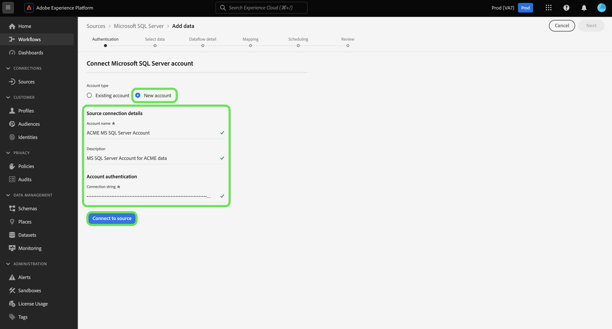

# UI에서 [!DNL Microsoft SQL Server] 소스 연결 만들기

사용자 인터페이스를 사용하여 [!DNL Microsoft SQL Server] 계정을 Adobe Experience Platform에 연결하는 방법에 대해 알아보려면 이 자습서를 참조하십시오.

## 시작하기

이 자습서에서는 Adobe Experience Platform의 다음 구성 요소를 이해하고 있어야 합니다.

* [[!DNL Experience Data Model (XDM)] 시스템](../../../../../xdm/home.md): Experience Platform이 고객 경험 데이터를 구성하는 표준화된 프레임워크입니다.
   * [스키마 컴포지션의 기본 사항](../../../../../xdm/schema/composition.md): 스키마 컴포지션의 주요 원칙 및 모범 사례를 포함하여 XDM 스키마의 기본 구성 요소에 대해 알아봅니다.
   * [스키마 편집기 튜토리얼](../../../../../xdm/tutorials/create-schema-ui.md): 스키마 편집기 UI를 사용하여 사용자 지정 스키마를 만드는 방법을 알아봅니다.
* [[!DNL Real-Time Customer Profile]](../../../../../profile/home.md): 여러 원본의 집계된 데이터를 기반으로 통합된 실시간 소비자 프로필을 제공합니다.

이미 올바른 [!DNL SQL Server] 연결이 있는 경우 이 문서의 나머지 부분을 건너뛰고 [데이터 흐름 구성](../../dataflow/databases.md)에 대한 자습서로 진행할 수 있습니다.

### 필요한 자격 증명 수집

[!DNL Platform]의 [!DNL SQL Server]에 연결하려면 다음 연결 속성을 제공해야 합니다.

| 자격 증명 | 설명 |
| ---------- | ----------- |
| 연결 문자열 | [!DNL Microsoft SQL Server] 계정과 연결된 연결 문자열입니다. 연결 문자열 패턴은 데이터 소스에 서버 이름을 사용하는지 또는 인스턴스 이름을 사용하는지에 따라 달라집니다.<ul><li>서버 이름을 사용하는 연결 문자열: `Data Source={SERVER_NAME};Initial Catalog={DATABASE};Integrated Security=False;User ID={USER_ID};Password={PASSWORD};`</li><li>인스턴스 이름을 사용하는 연결 문자열: `Data Source={INSTANCE_NAME};Initial Catalog={DATABASE};Integrated Security=False;User ID={USER_ID};Password={PASSWORD};` | `Data Source=mssqlserver.database.windows.net;Initial Catalog=mssqlserver_e2e_db;Integrated Security=False;User ID=mssqluser;Password=mssqlpassword` |

시작에 대한 자세한 내용은 [이 [!DNL SQL Server] 문서](https://docs.microsoft.com/en-us/dotnet/framework/data/adonet/sql/authentication-in-sql-server)를 참조하세요.

## [!DNL SQL Server] 계정 연결

Platform UI의 왼쪽 탐색에서 **[!UICONTROL 소스]**&#x200B;를 선택하여 [!UICONTROL 소스] 작업 영역에 액세스합니다. 화면 왼쪽에 있는 카탈로그에서 적절한 카테고리를 선택할 수 있습니다. 또는 검색 옵션을 사용하여 작업할 특정 소스를 찾을 수 있습니다.

*데이터베이스* 범주에서 **[!DNL Microsoft SQL Server]**&#x200B;을(를) 선택한 다음 **[!UICONTROL 설정]**&#x200B;을(를) 선택합니다.

>[!TIP]
>
>지정된 소스에 아직 인증된 계정이 없는 경우 소스 카탈로그의 소스에 **[!UICONTROL 설정]** 옵션이 표시됩니다. 인증된 계정이 있으면 이 옵션이 **[!UICONTROL 데이터 추가]**(으)로 변경됩니다.

**[!UICONTROL Microsoft SQL Server에 연결]** 페이지가 나타납니다. 이 페이지에서 새 자격 증명 또는 기존 자격 증명을 사용할 수 있습니다.

>[!BEGINTABS]

>[!TAB 새 계정 만들기]

새 계정을 만들려면 **[!UICONTROL 새 계정]**&#x200B;을(를) 선택하고 이름, 설명(선택 사항) 및 자격 증명을 제공합니다.

완료되면 **[!UICONTROL 소스에 연결]**&#x200B;을 선택한 다음 새 연결을 설정할 수 있는 시간을 허용하세요.

>[!TAB 기존 계정 사용]

기존 계정을 사용하려면 **[!UICONTROL 기존 계정]**&#x200B;을 선택한 다음 기존 계정 카탈로그에서 사용할 계정을 선택하십시오.

계속하려면 **[!UICONTROL 다음]**&#x200B;을(를) 선택하십시오.

>[!ENDTABS]

## 다음 단계

이 자습서에 따라 [!DNL SQL Server] 계정에 대한 연결을 설정했습니다. 이제 다음 자습서를 계속 진행하고 [데이터를 가져올 데이터 흐름을 구성 [!DNL Platform]](../../dataflow/databases.md)할 수 있습니다.
