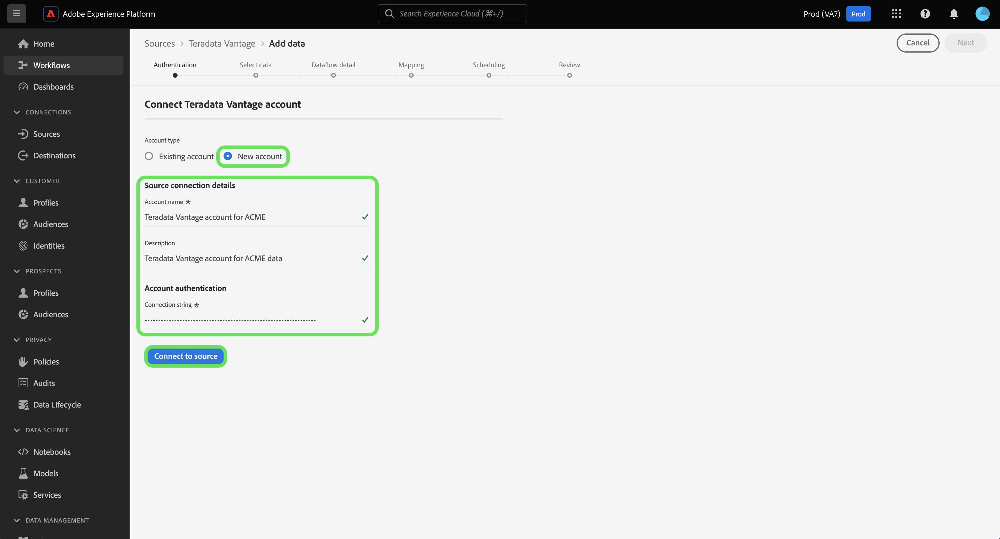

# (베타) 만들기 [!DNL Teradata Vantage] UI의 소스 연결

>[!NOTE]
>
> 다음 [!DNL Teradata Vantage] 소스가 베타 버전입니다. 자세한 내용은 [소스 개요](../../../../home.md#terms-and-conditions) 베타 레이블이 지정된 소스 사용에 대한 자세한 정보.

이 자습서에서는 을(를) 만드는 단계를 제공합니다 [!DNL Teradata Vantage] Adobe Experience Platform 사용자 인터페이스를 사용한 소스 커넥터.

## 시작하기

이 자습서에서는 Platform의 다음 구성 요소를 이해하고 있어야 합니다.

* [소스](../../../../home.md): Experience Platform을 사용하면 Experience Platform 서비스를 사용하여 들어오는 데이터를 구조화, 레이블 지정 및 향상시키는 기능을 제공하면서 다양한 소스에서 데이터를 수집할 수 있습니다.
* [샌드박스](../../../../../sandboxes/home.md): Experience Platform은 디지털 경험 애플리케이션을 개발하고 발전시키는 데 도움이 되는 단일 플랫폼 인스턴스를 별도의 가상 환경으로 분할하는 가상 샌드박스를 제공합니다.

### 필요한 자격 증명 수집

에 액세스하려면 [!DNL Teradata Vantage] 플랫폼의 계정은 다음 인증 값을 제공해야 합니다.

| 자격 증명 | 설명 |
| ---------- | ----------- |
| 연결 문자열 | 연결 문자열은 데이터 소스 및 연결 방법에 대한 정보를 제공하는 문자열입니다. 에 대한 연결 문자열 패턴 [!DNL Teradata Vantage] is `DBCName={SERVER};Uid={USERNAME};Pwd={PASSWORD}`. |

시작하는 방법에 대한 자세한 내용은 다음을 참조하십시오 [[!DNL Teradata Vantage] 문서](https://docs.teradata.com/r/Teradata-VantageTM-Advanced-SQL-Engine-Security-Administration/July-2021/Setting-Up-the-Administrative-Infrastructure/Controlling-Access-to-the-Operating-System/Working-with-OS-Level-Security-Options).

## 연결 [!DNL Teradata Vantage] account

플랫폼 UI에서 **[!UICONTROL 소스]** 왼쪽 탐색에서 로 이동하여 [!UICONTROL 소스] 작업 공간. 다음 [!UICONTROL 카탈로그] 화면에는 계정을 만들 수 있는 다양한 소스가 표시됩니다.

화면 왼쪽에 있는 카탈로그에서 적절한 카테고리를 선택할 수 있습니다. 또는 검색 막대를 사용하여 작업할 특정 소스를 찾을 수 있습니다.

아래에 [!UICONTROL 데이터베이스] 카테고리, 선택 **[!UICONTROL Teradata 밴티지]** 그런 다음 **[!UICONTROL 데이터 추가]**.

다음 **[!UICONTROL teradata Vantage에 연결]** 페이지가 나타납니다. 이 페이지에서 새 자격 증명 또는 기존 자격 증명을 사용할 수 있습니다.

### 기존 계정

기존 계정을 연결하려면 [!DNL Teradata Vantage] 연결할 계정을 선택한 다음 **[!UICONTROL 다음]** 계속 진행합니다.

### 새 계정

새 자격 증명을 사용하는 경우 **[!UICONTROL 새 계정]**. 표시되는 입력 양식에서 이름, 선택적 설명 및 [!DNL Teradata Vantage] 자격 증명. 완료되면 을 선택합니다 **[!UICONTROL Connect]** 그런 다음 새 연결이 설정될 시간을 허용합니다.

## 다음 단계

이 자습서에 따라 Teradata Vantage 계정에 대한 연결을 설정했습니다. 이제 다음 자습서를 계속 진행하고 [데이터를 플랫폼으로 가져오도록 데이터 흐름 구성](../../dataflow/databases.md).
