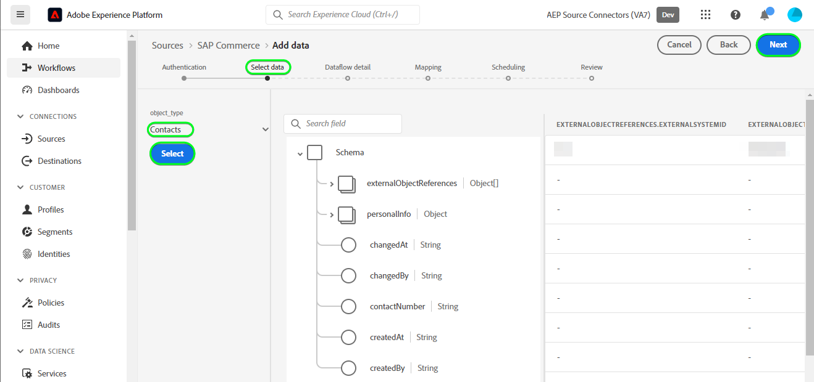

# 만들기 [!DNL SAP Commerce] UI의 소스 연결

>[!NOTE]
>
>다음 [!DNL SAP Commerce] 소스는 베타 버전입니다. 다음을 참조하십시오. [소스 개요](../../../../home.md#terms-and-conditions) beta 레이블 소스를 사용하는 방법에 대한 자세한 내용.

다음 튜토리얼에서는 다음을 만드는 단계를 설명합니다. [!DNL SAP Commerce] 가져올 소스 연결 [[!DNL SAP] 구독 청구](https://www.sap.com/products/financial-management/subscription-billing.html) Adobe Experience Platform 사용자 인터페이스를 사용하는 연락처 및 고객 데이터.

## 시작하기 {#getting-started}

이 자습서에서는 다음 Experience Platform 구성 요소를 이해하고 있어야 합니다.

* [[!DNL Experience Data Model (XDM)] 시스템](../../../../../xdm/home.md): 표준화된 프레임워크 [!DNL Experience Platform] 고객 경험 데이터를 구성합니다.
   * [스키마 컴포지션 기본 사항](../../../../../xdm/schema/composition.md): 스키마 컴포지션의 주요 원칙 및 모범 사례를 포함하여 XDM 스키마의 기본 구성 요소에 대해 알아봅니다.
   * [스키마 편집기 튜토리얼](../../../../../xdm/tutorials/create-schema-ui.md): 스키마 편집기 UI를 사용하여 사용자 정의 스키마를 만드는 방법을 알아봅니다.
* [[!DNL Real-Time Customer Profile]](../../../../../profile/home.md): 여러 소스의 집계 데이터를 기반으로 통합 실시간 소비자 프로필을 제공합니다.

이미 유효한 을(를) 가지고 있는 경우 [!DNL SAP Commerce] 계정, 이 문서의 나머지 부분을 건너뛰고 다음에 대한 자습서로 진행할 수 있습니다. [데이터 흐름 구성](../../dataflow/ecommerce.md).

### 필요한 자격 증명 수집 {#gather-credentials}

연결하려면 [!DNL SAP Commerce] Experience Platform을 수행하려면 다음 연결 속성에 대한 값을 제공해야 합니다.

| 자격 증명 | 설명 |
| --- | --- |
| 클라이언트 ID | 값: `clientId` 서비스 키에서. |
| 클라이언트 암호 | 값: `clientSecret` 서비스 키에서. |
| 토큰 엔드포인트 | 값: `url` 서비스 키에서 는 와 유사합니다. `https://subscriptionbilling.authentication.eu10.hana.ondemand.com`. |
| 지역 | 데이터 센터 위치. 영역은 다음 위치에 있습니다. `url` 와 유사한 값을 갖습니다. `eu10` 또는 `us10`. 예를 들어 `url` 은(는) `https://eu10.revenue.cloud.sap/api` 다음이 필요합니다 `eu10`. |

자세한 내용은 다음을 참조하십시오. [[!DNL SAP Commerce] 설명서](https://help.sap.com/docs/CLOUD_TO_CASH_OD/987aec876092428f88162e438acf80d6/c5fcaf96daff4c7a8520188e4d8a1843.html).

### 플랫폼 스키마 만들기 {#create-platform-schema}

만들기 전 [!DNL SAP Commerce] 소스 연결에서 소스에 사용할 Experience Platform 스키마를 먼저 만들어야 합니다. 다음 튜토리얼 참조: [플랫폼 스키마 생성](../../../../../xdm/schema/composition.md) 스키마를 만드는 방법에 대한 포괄적인 단계를 설명합니다.

다음 섹션을 확장하여 예제 스키마를 봅니다.

+++ 스키마 보기 예

```
{
  "_extconndev": {
    "addresses": [
      {
        "addressUUID": "{ADDRESS_UUID}",
        "city": "Burnaby",
        "country": "Canada",
        "email": "chandni@acme.com",
        "houseNumber": "27",
        "isDefault": false,
        "phone": "123-456-7890",
        "postalCode": "V3J 1X9",
        "state": "British Columbia",
        "street": "Beresford"
      }
    ],
    "changedAt": "1687204041",
    "changedBy": "vero@acme.com",
    "contactNumber": "123-456-7980",
    "corporateInfo": {
      "company": "acme"
    },
    "createAt": "1687204041",
    "createdBy": "vero@acme.com",
    "customReferences": [
      {
        "id": "Sample value",
        "typeCode": "Sample value"
      }
    ],
    "customerNumber": "Sample value",
    "customerType": "Sample value",
    "defaultAddress": {
      "addressUUID": "Sample value",
      "city": "North Vancouver",
      "country": "Canada",
      "email": "chandni@acme.come",
      "houseNumber": "34",
      "isDefault": false,
      "phone": "123-456-7890",
      "postalCode": "V7H 2P1",
      "state": "British Columbia",
      "street": "Maple"
    },
    "externalObjectReferences": [
      {
        "externalId": "{EXTERNAL_ID}",
        "externalIdTypeCode": "{EXTERNAL_ID_TYPE_CODE}",
        "externalSystemId": "{EXTERNAL_SYSTEM_ID}"
      }
    ],
    "markets": [
      {
        "active": false,
        "country": "USA",
        "currency": "USD",
        "marketId": "Sample value",
        "priceinfo": {
          "incoterms": "{INCO_TERMS}",
          "incotermsLocation": "{INCO_TERMS_LOCATION}",
          "priceGroup": "{PRICE_GROUP}",
          "priceListType": "{PRICE_LIST_TYPE}"
        },
        "salesArea": {
          "distributionChannel": "{DISTRIBUTION_CHANNEL}",
          "division": "{DIVISION}",
          "salesOrganization": "{SALES_ORGANIZATION}"
        }
      }
    ],
    "personalInfo": {
      "firstName": "Chandni",
      "lastName": "Kaur"
    }
  },
  "_id": "/uri-reference",
  "_repo": {
    "createDate": "2004-10-23T12:00:00-06:00",
    "modifyDate": "2004-10-23T12:00:00-06:00"
  },
  "createdByBatchID": "/uri-reference",
  "modifiedByBatchID": "/uri-reference",
  "personID": "{PERSON_ID}",
  "repositoryCreatedBy": "kevin@acme.com",
  "repositoryLastModifiedBy": "kevin@acme.com"
}
```

+++

## 연결 [!DNL SAP Commerce] account {#connect-account}

Platform UI에서 를 선택합니다. **[!UICONTROL 소스]** 왼쪽 탐색 모음에서 다음 위치에 액세스: [!UICONTROL 소스] 작업 영역. 다음 [!UICONTROL 카탈로그] 화면에는 계정을 만들 수 있는 다양한 소스가 표시됩니다.

화면 왼쪽에 있는 카탈로그에서 적절한 카테고리를 선택할 수 있습니다. 또는 검색 옵션을 사용하여 작업할 특정 소스를 찾을 수 있습니다.

아래 *전자 상거래* 범주, 선택 **[!UICONTROL SAP Commerce]**&#x200B;을 선택한 다음 을 선택합니다 **[!UICONTROL 데이터 추가]**.


다음 **[!UICONTROL SAP Commerce 계정 연결]** 페이지가 나타납니다. 이 페이지에서 새 자격 증명 또는 기존 자격 증명을 사용할 수 있습니다.

### 기존 계정 {#existing-account}

기존 계정을 사용하려면 [!DNL SAP Commerce] 새 데이터 흐름을 만들 계정 을 선택합니다. **[!UICONTROL 다음]** 계속합니다.


### 새 계정 {#new-account}

새 계정을 만드는 경우 다음을 선택합니다 **[!UICONTROL 새 계정]**&#x200B;을 누르고 이름, 설명(선택 사항) 및 자격 증명을 제공합니다. 완료되면 다음을 선택합니다. **[!UICONTROL 소스에 연결]** 그런 다음 새 연결을 설정하는 데 시간이 걸릴 수 있습니다.


### 데이터 선택 {#select-data}

마지막으로 플랫폼으로 수집할 객체 유형을 선택해야 합니다.

| 오브젝트 유형 | 설명 |
| --- | --- |
| `Customers` | 구독이 있는 엔티티입니다. |
| `Contacts` | 고객에 대한 연락처 세부 정보. |

>[!BEGINTABS]

>[!TAB 고객]

고객 데이터를 수집하려면 **[!UICONTROL 고객]** 을 개체 유형으로 클릭한 다음 을(를) 선택합니다. **[!UICONTROL 다음]**.


>[!TAB 연락처]

연락처 데이터를 수집하려면 **[!UICONTROL 연락처]** 을 개체 유형으로 클릭한 다음 을(를) 선택합니다. **[!UICONTROL 다음]**.



>[!ENDTABS]

## 다음 단계 {#next-steps}

이 자습서를 따라 [!DNL SAP Commerce] 계정입니다. 이제 다음 튜토리얼을 계속 진행하여 [데이터를 Platform으로 가져오는 데이터 흐름 구성](../../dataflow/ecommerce.md).

## 추가 리소스 {#additional-resources}

아래 섹션에서는 사용 시 참조할 수 있는 추가 리소스를 제공합니다. [!DNL SAP Commerce] 소스.

### 매핑 {#mapping}

Platform은 선택한 대상 스키마 또는 데이터 세트를 기반으로 자동 매핑된 필드에 대한 지능형 권장 사항을 제공합니다. 사용 사례에 맞게 매핑 규칙을 수동으로 조정할 수 있습니다. 필요에 따라 필드를 직접 매핑하도록 선택하거나 데이터 준비 함수를 사용하여 소스 데이터를 변환하여 계산된 값 또는 계산된 값을 파생할 수 있습니다. 매퍼 인터페이스 및 계산된 필드 사용에 대한 포괄적인 단계는 [데이터 준비 UI 안내서](../../../../../data-prep/ui/mapping.md).

데이터 흐름에 대한 매핑 구성은 스키마 및 수집하도록 선택한 개체 유형에 따라 다릅니다.

>[!BEGINTABS]

>[!TAB 고객]

고객 데이터의 경우 [!DNL SAP Commerce] 를 사용합니다. [고객](https://api.sap.com/api/BusinessPartner_APIs/path/GET_customers) 및 [고객-연락처 관계](https://api.sap.com/api/BusinessPartner_APIs/path/GET_relationships-customer-contacts) 의 엔드포인트 [!DNL SAP Business Partners] 데이터 검색을 위한 API

다음은에 대한 매핑 구성의 예입니다 [!DNL SAP Commerce] 고객 데이터에 대한 데이터 흐름:

| Target 필드 | 설명 |
| --- | --- |
| `customerNumber` | 고객 번호. |
| `corporateInfo` | 고객 번호. |
| `customerType` | 고객 유형. |
| `createdAt` | 고객을 만든 시기를 나타내는 타임스탬프입니다. |
| `changedAt` | 고객이 마지막으로 업데이트된 시기를 나타내는 타임스탬프입니다. |
| `markets[*].country` | 고객은 어레이 개체로 검색됩니다. |
| `addresses[*].email` | 고객의 여러 주소와 연결된 이메일이며 배열 개체로 검색됩니다. |
| `addresses[*].city` | 고객의 여러 주소와 연결된 도시가 배열 개체로 검색됩니다. |
| `addresses[*].addressUUID` | 고객의 여러 주소와 연결된 ID로, 배열 개체로 검색됩니다. |
| `externalObjectReferences[*].externalSystemId` | 배열 개체로 검색된 추가 데이터입니다. |
| `externalObjectReferences[*].externalId` | 배열 개체로 검색된 추가 데이터입니다. |
| `customReferences[*].id` | 배열 개체로 검색된 추가 데이터입니다. |
| `customReferences[*].typeCode` | 배열 개체로 검색된 추가 데이터입니다. |


>[!TAB 연락처]

연락처 데이터의 경우, [!DNL SAP Commerce] 를 사용합니다. [연락처](https://api.sap.com/api/BusinessPartner_APIs/path/GET_contacts) 의 엔드포인트 [!DNL SAP Business Partners] 데이터를 검색하기 위한 API입니다.

다음은에 대한 매핑 구성의 예입니다 [!DNL SAP Commerce] 연락처 데이터에 대한 데이터 흐름:

| Target 필드 | 설명 |
| --- | --- |
| `contactNumber` | 연락처 전화번호. |
| `createdAt` | 연락처가 만들어진 시기를 나타내는 타임스탬프입니다. |
| `changedAt` | 연락처가 마지막으로 업데이트된 시기를 나타내는 타임스탬프입니다. |
| `personalInfo.lastName` | 연락처의 성입니다. |
| `personalInfo.firstName` | 연락처의 이름. |
| `externalObjectReferences[*].externalSystemId` | 배열 개체로 검색된 추가 데이터입니다. |
| `externalObjectReferences[*].externalId` | 배열 개체로 검색된 추가 데이터입니다. |
| `externalObjectReferences[*].externalIdTypeCode` | 배열 개체로 검색된 추가 데이터입니다. |


>[!ENDTABS]

