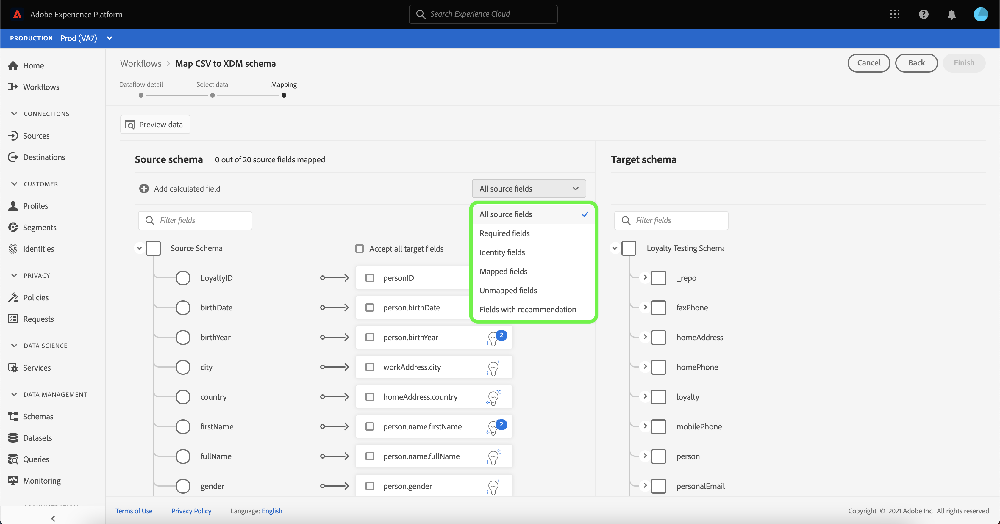
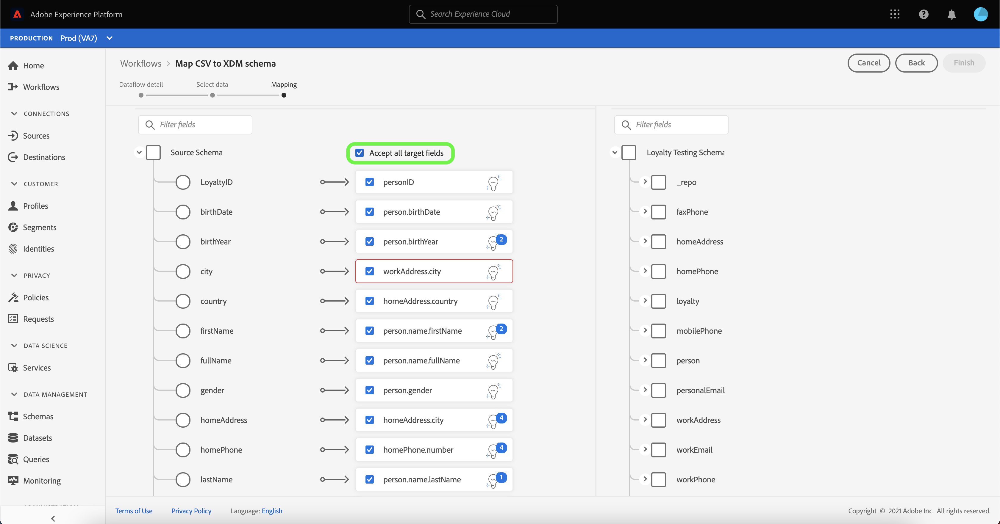

# UI에서 로컬 파일 업로드 소스 커넥터 만들기

이 자습서에서는 사용자 인터페이스를 사용하여 로컬 파일을 Platform에 수집하기 위해 로컬 파일 업로드 소스 커넥터를 만드는 단계를 제공합니다.

## 시작하기

이 자습서에서는 Platform의 다음 구성 요소를 이해하고 있어야 합니다.

* [[!DNL Experience Data Model (XDM)] 시스템](../../../../../xdm/home.md): 플랫폼이 고객 경험 데이터를 구성하는 표준화된 프레임워크입니다.
   * [스키마 작성 기본 사항](../../../../../xdm/schema/composition.md): 스키마 컴포지션의 주요 원칙 및 모범 사례를 포함하여 XDM 스키마의 기본 빌딩 블록에 대해 알아봅니다.
   * [스키마 편집기 자습서](../../../../../xdm/tutorials/create-schema-ui.md): 스키마 편집기 UI를 사용하여 사용자 지정 스키마를 만드는 방법을 알아보십시오.
* [[!DNL Real-time Customer Profile]](../../../../../profile/home.md): 여러 소스에서 집계된 데이터를 기반으로 통합된 실시간 소비자 프로필을 제공합니다.

## Platform에 로컬 파일 업로드

플랫폼 UI의 왼쪽 탐색 막대에서 **[!UICONTROL 소스]**&#x200B;를 선택하여 [!UICONTROL 소스] 작업 공간에 액세스합니다. [!UICONTROL 카탈로그] 화면에는 계정을 만들 수 있는 다양한 소스가 표시됩니다.

화면 왼쪽에 있는 카탈로그에서 적절한 카테고리를 선택할 수 있습니다. 또는 검색 옵션을 사용하여 작업할 특정 소스를 찾을 수 있습니다.

[!UICONTROL 로컬 시스템] 카테고리에서 **[!UICONTROL 로컬 파일 업로드]**&#x200B;를 선택한 다음 **[!UICONTROL 구성]**&#x200B;을 선택합니다.

### 기존 데이터 세트 사용

[!UICONTROL 데이터 흐름 세부 정보] 페이지에서는 CSV 데이터를 기존 데이터 세트에 수집할지 또는 새 데이터 세트에 수집할지를 선택할 수 있습니다.

CSV 데이터를 기존 데이터 세트에 수집하려면 **[!UICONTROL 기존 데이터 세트]**&#x200B;를 선택합니다. [!UICONTROL 고급 검색] 옵션을 사용하거나 드롭다운 메뉴에서 기존 데이터 세트 목록을 스크롤하여 기존 데이터 세트를 검색할 수 있습니다.

데이터 세트를 선택하고 데이터 흐름의 이름과 선택적 설명을 제공합니다.

이 프로세스 중에 [!UICONTROL 오류 진단] 및 [!UICONTROL 부분 수집]을 활성화할 수도 있습니다. [!UICONTROL 오류 ] 진단에서는 데이터 플로우에서 발생하는 모든 잘못된 레코드에 대한 자세한 오류 메시지 생성을 수행하는 반면,  [!UICONTROL 부분 ] 처리를 사용하면 수동으로 정의한 특정 임계값까지 오류가 포함된 데이터를 수집할 수 있습니다. 자세한 내용은 [부분 배치 수집 개요](../../../../../ingestion/batch-ingestion/partial.md)를 참조하십시오.

### 새 데이터 세트 사용

CSV 데이터를 새 데이터 세트에 수집하려면 **[!UICONTROL 새 데이터 세트]**&#x200B;를 선택한 다음 출력 데이터 세트 이름과 선택적 설명을 제공합니다. 다음으로, [!UICONTROL 고급 검색] 옵션을 사용하거나 드롭다운 메뉴에서 기존 스키마 목록을 스크롤하여 매핑할 스키마를 선택합니다.

스키마를 선택한 상태에서 데이터 흐름의 이름과 선택적 설명을 제공한 다음, 데이터 흐름도에 원하는 [!UICONTROL 오류 진단] 및 [!UICONTROL 부분 수집] 설정을 적용합니다. 완료되면 **[!UICONTROL 다음]**&#x200B;을 선택합니다.

### 데이터 선택

[!UICONTROL 데이터 선택] 단계가 나타나고 로컬 파일을 업로드하고 해당 구조와 컨텐츠를 미리 볼 수 있는 인터페이스를 제공합니다. **[!UICONTROL 파일 선택]** 을 선택하여 로컬 시스템에서 CSV 파일을 업로드합니다. 또는 업로드할 CSV 파일을 [!UICONTROL 파일 끌어다 놓기] 패널에 끌어다 놓을 수 있습니다.

>[!TIP]
>
>로컬 파일 업로드에서는 현재 CSV 파일만 지원합니다. 각 파일의 최대 파일 크기는 1GB입니다.

파일을 업로드하면 미리 보기 인터페이스가 업데이트되어 파일의 컨텐츠와 구조를 표시합니다.

파일에 따라, 소스 데이터에 대한 탭, 쉼표, 파이프 또는 사용자 지정 열 구분 기호와 같은 열 구분 기호를 선택할 수 있습니다. **[!UICONTROL 구분 기호]** 드롭다운 화살표를 선택한 다음 메뉴에서 적절한 구분 기호를 선택합니다.

완료되면 **[!UICONTROL 다음]**&#x200B;을 선택합니다.

### 매핑

[!UICONTROL 매핑] 단계가 나타나고, 소스 스키마의 소스 필드를 대상 스키마의 적절한 대상 XDM 필드에 매핑하는 인터페이스를 제공합니다.

#### 데이터 미리보기

선택한 데이터 집합에서 최대 100개의 샘플 데이터 행의 매핑 결과를 보려면 **[!UICONTROL 데이터 미리 보기]**&#x200B;를 선택하십시오.

미리 보기 중에 ID 열은 매핑 결과를 확인할 때 필요한 주요 정보이므로 첫 번째 필드로 우선 순위가 지정됩니다. 완료되면 **[!UICONTROL 닫기]**&#x200B;를 선택합니다.

#### 계산된 필드 추가

계산된 필드를 사용하면 입력 스키마의 속성을 기반으로 값을 만들 수 있습니다. 그런 다음 이러한 값을 대상 스키마의 속성에 지정하고 쉽게 참조할 수 있도록 이름 및 설명을 제공할 수 있습니다.

계속하려면 **[!UICONTROL 계산된 필드 추가]** 단추를 선택하십시오.

[!UICONTROL 계산된 필드 만들기] 패널이 나타납니다. 왼쪽 대화 상자에는 계산된 필드에서 지원되는 필드, 함수 및 연산자가 포함되어 있습니다. 탭 중 하나를 선택하여 표현식 편집기에 함수, 필드 또는 연산자를 추가합니다.

| 탭 | 설명 |
| --------- | ----------- |
| 함수 | 함수 탭에는 데이터를 변형하는 데 사용할 수 있는 함수가 나열됩니다. 계산된 필드 내에서 사용할 수 있는 함수에 대한 자세한 내용은 [데이터 준비(Mapper) 함수](../../../../../data-prep/functions.md)를 사용하여 안내서를 참조하십시오. |
| 필드 | 필드 탭에는 소스 스키마에서 사용할 수 있는 필드와 속성이 나열됩니다. |
| 연산자 | 연산자 탭에는 데이터를 변형하는 데 사용할 수 있는 연산자가 나열됩니다. |

필드, 함수 및 연산자를 수동으로 추가하려면 표현식 편집기를 선택합니다. 계산된 필드를 만든 후 **[!UICONTROL 저장]**&#x200B;을 선택하여 진행하십시오.

#### 필터 소스 스키마 매핑 트리

소스 스키마를 필터링하려면 **[!UICONTROL 모든 소스 필드]**&#x200B;를 선택한 다음 드롭다운 메뉴에서 매핑할 특정 필드를 선택합니다.

다음 표에는 소스 스키마 트리에 대한 정렬 옵션이 표시됩니다.

| 소스 필드 | 설명 |
| --- | --- |
| [!UICONTROL 모든 소스 필드] | 이 옵션은 소스 스키마의 모든 소스 필드를 표시합니다. 이 옵션은 기본적으로 표시됩니다. |
| [!UICONTROL 필수 필드] | 이 옵션은 매핑을 완료하는 데 필요한 필드만 표시하도록 소스 스키마를 필터링합니다. |
| [!UICONTROL ID 필드] | 이 옵션은 ID로 표시된 필드만 표시하도록 소스 스키마를 필터링합니다. |
| [!UICONTROL 매핑된 필드] | 이 옵션은 이미 매핑된 필드만 표시하도록 소스 스키마를 필터링합니다. |
| [!UICONTROL 매핑되지 않은 필드] | 이 옵션은 매핑되지 않은 필드만 표시하도록 소스 스키마를 필터링합니다. |
| [!UICONTROL 권장 사항이 있는 필드] | 이 옵션은 소스 스키마를 필터링하여 매핑 권장 사항이 포함된 필드만 표시합니다. |

#### 지능형 추천

Platform은 선택한 대상 스키마나 데이터 세트를 기반으로 자동 매핑 필드에 대한 지능형 권장 사항을 자동으로 제공합니다. 사용 사례에 맞게 매핑 규칙을 수동으로 조정할 수 있습니다.

모든 자동 생성 매핑 값을 허용하려면 **[!UICONTROL 모든 대상 필드 적용]**&#x200B;을 선택합니다.

경우에 따라 소스 스키마에 대해 두 개 이상의 권장 사항을 사용할 수 있습니다. 이렇게 되면 매핑 카드에 가장 두드러진 권장 사항이 표시되고 그 뒤에는 사용 가능한 추가 권장 사항의 수가 포함된 파란색 원이 표시됩니다. 전구 아이콘을 선택하면 추가 권장 사항 목록이 표시됩니다. 대신 매핑할 권장 사항 옆에 있는 확인란을 선택하여 대체 권장 사항 중 하나를 선택할 수 있습니다.

또는 소스 스키마를 대상 스키마에 수동으로 매핑하도록 선택할 수 있습니다. 이렇게 하려면 매핑할 소스 스키마를 마우스로 가리킨 다음 더하기(`+`) 아이콘을 선택합니다.

**[!UICONTROL 소스를 대상 필드에 매핑]** 팝오버가 나타납니다. 여기에서 매핑할 필드를 선택한 후 **[!UICONTROL 저장]**&#x200B;을 클릭하여 새 매핑을 추가할 수 있습니다.

완료되면 **[!UICONTROL 완료됨]**&#x200B;을 선택합니다.

## 데이터 수집 모니터링

CSV 파일이 매핑되고 생성되면 모니터링 대시보드를 사용하여 CSV 파일을 통해 수집되는 데이터를 모니터링할 수 있습니다. 자세한 내용은 UI](../../../../../dataflows/ui/monitor-sources.md)에서 소스 데이터 흐름 모니터링에 대한 자습서를 참조하십시오.[

## 다음 단계

이 자습서를 따라 플랫 CSV 파일을 XDM 스키마에 매핑하고 플랫폼으로 수집했습니다. 이제 이 데이터를 [!DNL Real-time Customer Profile] 등의 다운스트림 [!DNL Platform] 서비스에서 사용할 수 있습니다. 자세한 내용은 [[!DNL Real-time Customer Profile]](../../../../../profile/home.md) 개요를 참조하십시오.
