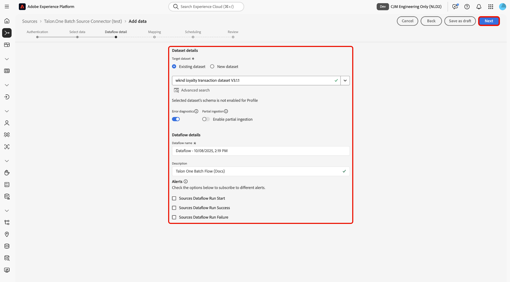

# UI를 사용하여 [!DNL Talon.One]에서 Experience Platform으로 일괄 처리 데이터 수집

>[!AVAILABILITY]
>
>[!DNL Talon.One] 원본이 Beta 버전입니다. 베타 레이블 소스를 사용하는 방법에 대한 자세한 내용은 소스 개요에서 [약관](../../../../home.md#terms-and-conditions)을 참조하십시오.

UI의 소스 작업 영역을 사용하여 [!DNL Talon.One] 계정의 일괄 처리 데이터를 Adobe Experience Platform으로 수집하는 방법에 대해 알아보려면 이 자습서를 참조하십시오.

## 시작

이 자습서에서는 Experience Platform의 다음 구성 요소를 이해하고 있어야 합니다.

* [[!DNL Experience Data Model (XDM)] 시스템](../../../../../xdm/home.md): Experience Platform에서 고객 경험 데이터를 구성하는 표준화된 프레임워크입니다.
   * [스키마 컴포지션의 기본 사항](../../../../../xdm/schema/composition.md): 스키마 컴포지션의 주요 원칙 및 모범 사례를 포함하여 XDM 스키마의 기본 구성 요소에 대해 알아봅니다.
   * [스키마 편집기 튜토리얼](../../../../../xdm/tutorials/create-schema-ui.md): 스키마 편집기 UI를 사용하여 사용자 지정 스키마를 만드는 방법을 알아봅니다.
* [[!DNL Real-Time Customer Profile]](../../../../../profile/home.md): 여러 원본의 집계된 데이터를 기반으로 통합된 실시간 소비자 프로필을 제공합니다.

>[!IMPORTANT]
>
>계정을 Experience Platform에 연결하기 전에 완료해야 하는 필수 구성 요소 단계에 대해 알아보려면 [[!DNL Talon.One] 개요](../../../../connectors/loyalty/talon-one.md)를 읽어 보십시오.

## 소스 카탈로그 탐색

Experience Platform UI의 왼쪽 탐색에서 **[!UICONTROL 소스]**&#x200B;를 선택하여 *[!UICONTROL 소스]* 작업 영역에 액세스합니다. *[!UICONTROL 범주]* 패널에서 적절한 범주를 선택합니다. 또는 검색 창을 사용하여 사용할 특정 소스로 이동합니다.

[!DNL Talon.One]에서 데이터를 수집하려면 **[!UICONTROL 충성도]**&#x200B;에서 *[!UICONTROL Talon.One 일괄 Source 커넥터]* 소스 카드를 선택한 다음 **[!UICONTROL 데이터 추가]**&#x200B;를 선택하십시오.

>[!TIP]
>
>지정된 소스에 아직 인증된 계정이 없는 경우 소스 카탈로그의 소스에 **[!UICONTROL 설정]** 옵션이 표시됩니다. 인증된 계정을 만들면 이 옵션이 **[!UICONTROL 데이터 추가]**(으)로 변경됩니다.

### 새 계정 만들기

[!DNL Talon.One] 원본에 대한 새 계정을 만들려면 **[!UICONTROL 새 계정]**&#x200B;을(를) 선택하고 계정에 대한 이름과 선택적 설명을 입력하십시오. 그런 다음 [!DNL Talon.One] 도메인과 [!UICONTROL Talon.One 관리 API 키]를 제공하십시오. 완료되면 **[!UICONTROL 소스에 연결]**&#x200B;을 선택하고 연결을 설정할 수 있도록 잠시 기다립니다.

### 기존 계정 사용

기존 계정을 사용하려면 **[!UICONTROL 기존 계정]**&#x200B;을(를) 선택하고 계정 인터페이스에서 사용할 [!DNL Talon.One] 계정을 선택하십시오.

## 데이터 선택

인증되면 **applicationId** 및 **sessionType**&#x200B;의 값을 제공하십시오. 이 단계에서 미리보기 기능을 사용하여 데이터의 구조를 검사할 수 있습니다. 완료되면 **[!UICONTROL 다음]**&#x200B;을(를) 선택하여 계속하십시오.

## 데이터 세트 및 데이터 흐름 세부 정보 구성

그런 다음 데이터 세트 및 데이터 흐름에 대한 정보를 제공해야 합니다.

### 데이터 세트 세부 정보

데이터 집합은 스키마(열/필드)와 레코드(행)를 포함하는 데이터 수집을 위한 저장소 및 관리 구성입니다. Experience Platform에 성공적으로 수집된 데이터는 데이터 세트로 데이터 레이크 내에 유지됩니다.

이 단계에서는 기존 데이터 세트를 사용하거나 새 데이터 세트를 만들 수 있습니다.

>[!NOTE]
>
>기존 데이터 집합을 사용하는지 또는 새 데이터 집합을 만드는지 여부에 관계없이 데이터 집합이 **프로필** 수집에 대해 활성화되었는지 확인해야 합니다.

+++프로필 수집, 오류 진단 및 부분 수집을 활성화하는 단계를 선택합니다.

Real-Time Customer Profile에 대해 데이터 세트를 사용하도록 설정한 경우 이 단계에서 **[!UICONTROL 프로필 데이터 세트]**&#x200B;를 전환하여 프로필 수집에 데이터를 사용하도록 설정할 수 있습니다. 이 단계를 사용하여 **[!UICONTROL 오류 진단]** 및 **[!UICONTROL 부분 수집]**&#x200B;을 사용하도록 설정할 수도 있습니다.

* **[!UICONTROL 오류 진단]**: **[!UICONTROL 오류 진단]**&#x200B;을 선택하여 데이터 집합 활동 및 데이터 흐름 상태를 모니터링할 때 나중에 참조할 수 있는 오류 진단을 생성하도록 소스에 지시합니다.
* **[!UICONTROL 부분 수집]**: 부분 일괄 처리 수집은 구성 가능한 특정 임계값까지 오류가 포함된 데이터를 수집하는 기능입니다. 이 기능을 사용하면 모든 정확한 데이터를 Experience Platform에 성공적으로 수집할 수 있으며 잘못된 데이터는 모두 잘못된 이유에 대한 정보로 별도로 배치됩니다.

+++

## 데이터 흐름 세부 정보

데이터 세트가 구성되면 이름, 선택적 설명 및 경고 구성을 포함하여 데이터 흐름에 대한 세부 정보를 제공해야 합니다.

| 데이터 흐름 구성 | 설명 |
| --- | --- |
| 데이터 흐름 이름 | 데이터 흐름의 이름입니다. 기본적으로 가져올 파일의 이름이 사용됩니다. |
| 설명 | (선택 사항) 데이터 흐름에 대한 간략한 설명입니다. |
| 경고 | Experience Platform은 사용자가 구독할 수 있는 이벤트 기반 경고를 생성할 수 있으며, 이러한 옵션을 사용하면 실행 중인 데이터 흐름이 이를 트리거할 수 있습니다.  자세한 내용은 [경고 개요](../../alerts.md)를 참조하세요. <ul><li>**원본 데이터 흐름 실행 시작**: 데이터 흐름 실행이 시작될 때 알림을 받으려면 이 경고를 선택하십시오.</li><li>**소스 데이터 흐름 실행 성공**: 데이터 흐름이 오류 없이 종료될 경우 알림을 받으려면 이 경고를 선택하십시오.</li><li>**원본 데이터 흐름 실행 실패**: 데이터 흐름 실행이 오류로 인해 종료되는 경우 알림을 받으려면 이 경고를 선택하십시오.</li></ul> |

{style="table-layout:auto"}

## 매핑

데이터 세트 및 데이터 흐름 세부 사항이 구성된 경우 이제 소스 데이터 필드를 해당 대상 XDM 필드에 매핑할 수 있습니다. Experience Platform으로 데이터를 수집하기 전에 매핑 인터페이스를 사용하여 소스 데이터를 적절한 스키마 필드에 매핑합니다. 자세한 내용은 UI의 [매핑 가이드](../../../../../data-prep/ui/mapping.md)를 참조하십시오.

>[!IMPORTANT]
>
>[!DNL Talon.One] 원본 데이터 매핑에 대한 추가 지침을 보려면 [[!DNL Talon.One] 개요](../../../../connectors/loyalty/talon-one.md#mapping)를 읽어 보십시오.

## 데이터 흐름 수집 예약

[!UICONTROL 예약] 단계가 나타납니다. 구성된 매핑을 사용하여 선택한 소스 데이터를 자동으로 수집하도록 수집 일정을 구성하려면 인터페이스를 사용하십시오. 기본적으로 예약은 `Once`(으)로 설정됩니다. 수집 빈도를 조정하려면 **[!UICONTROL 빈도]**&#x200B;를 선택한 다음 드롭다운 메뉴에서 옵션을 선택합니다.

>[!TIP]
>
>일회성 수집 중에는 간격과 채우기가 표시되지 않습니다.

수집 빈도를 `Minute`, `Hour`, `Day` 또는 `Week`(으)로 설정한 경우 모든 수집 사이에 일정 간격을 설정해야 합니다. 예를 들어 수집 빈도를 `Day`(으)로 설정하고 간격을 `15`(으)로 설정하면 데이터 흐름이 15일마다 데이터를 수집하도록 예약됩니다.

이 단계에서는 **다시 채우기**&#x200B;를 사용하도록 설정하고 데이터의 증분 수집을 위한 열을 정의할 수도 있습니다. 채우기 기능은 내역 데이터를 수집하는 데 사용되며 증분 수집을 위해 정의하는 열은 새 데이터를 기존 데이터와 구별할 수 있도록 합니다.

예약 구성에 대한 자세한 내용은 아래 표를 참조하십시오.

| 구성 예약 중 | 설명 |
| --- | --- |
| 빈도 | 데이터 흐름이 실행되는 빈도를 구성하십시오. 빈도를 다음과 같이 설정할 수 있습니다. <ul><li>**한 번**: 빈도를 `once`(으)로 설정하여 일회성 수집을 만듭니다. 일회성 수집 데이터 흐름을 만들 때는 간격 및 채우기 구성을 사용할 수 없습니다. 기본적으로 예약 빈도는 한 번으로 설정됩니다.</li><li>**분**: 분 단위로 데이터를 수집하도록 데이터 흐름을 예약하려면 빈도를 `minute`(으)로 설정하십시오.</li><li>**시간**: 빈도를 `hour`(으)로 설정하여 시간당 기준으로 데이터를 수집하도록 데이터 흐름을 예약합니다.</li><li>**일**: 빈도를 `day`(으)로 설정하여 하루 단위로 데이터를 수집하도록 데이터 흐름을 예약합니다.</li><li>**주**: 주별로 데이터를 수집하도록 데이터 흐름을 예약하려면 빈도를 `week`(으)로 설정하십시오.</li></ul> |
| 간격 | 빈도를 선택하면 간격 설정을 구성하여 모든 수집 사이에 시간대를 설정할 수 있습니다. 예를 들어 빈도를 일로 설정하고 간격을 15로 구성한 경우 데이터 흐름이 15일마다 실행됩니다. 간격을 0으로 설정할 수 없습니다. 각 주파수에 대해 허용되는 최소 간격 값은 다음과 같습니다.<ul><li>**한 번**: 해당 없음</li><li>**분**: 15</li><li>**시간**: 1</li><li>**일**: 1</li><li>**주**: 1</li></ul> |
| 시작 시간 | UTC 시간대로 표시되는 예상 실행의 타임스탬프입니다. |
| 채우기 | 채우기 는 처음 수집되는 데이터를 결정합니다. 다시 채우기를 활성화하면 처음 예약된 수집 중에 지정된 경로의 모든 현재 파일이 수집됩니다. 다시 채우기를 비활성화하면 첫 번째 수집 실행과 시작 시간 사이에 로드된 파일만 수집됩니다. 시작 시간 이전에 로드된 파일은 수집되지 않습니다. |

## 검토

*[!UICONTROL 검토]* 단계가 표시되어 데이터 흐름을 만들기 전에 세부 사항을 검토할 수 있습니다. 세부 사항은 다음 범주 내에서 그룹화됩니다.

* **[!UICONTROL 연결]**: 계정 이름, 원본 플랫폼 및 원본 이름을 표시합니다.
* **[!UICONTROL 데이터 집합 및 맵 필드 할당]**: 대상 데이터 집합과 데이터 집합이 준수하는 스키마를 표시합니다.

세부 정보가 올바른지 확인한 후 **[!UICONTROL 마침]**&#x200B;을 선택합니다.

## 데이터 흐름 모니터링

데이터 흐름이 만들어지면 데이터 흐름을 통해 수집되는 데이터를 모니터링하여 수집 비율, 성공 및 오류에 대한 정보를 볼 수 있습니다. 데이터 흐름을 모니터링하는 방법에 대한 자세한 내용은 [UI에서 계정 및 데이터 흐름 모니터링](../../../../../dataflows/ui/monitor-sources.md)에 대한 자습서를 참조하십시오.