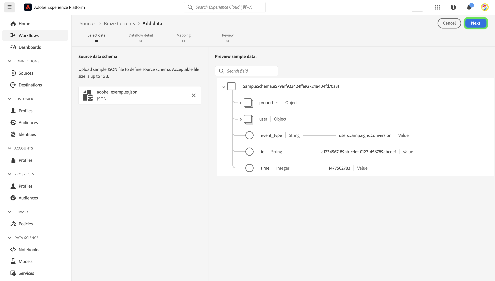

# UI에서 [!DNL Braze Currents] 소스 연결 만들기

>[!NOTE]
>
>[!DNL Braze Currents] 원본이 Beta 버전입니다. 베타 레이블 소스를 사용하는 방법에 대한 자세한 내용은 [소스 개요](../../../../home.md#terms-and-conditions)를 참조하십시오.

[!DNL Braze]은(는) 실시간으로 소비자와 브랜드 간의 고객 중심 상호 작용을 지원합니다. [!DNL Braze Currents]은(는) Braze 플랫폼의 참여 이벤트에 대한 실시간 데이터 스트림으로, [!DNL Braze] 플랫폼에서 가장 강력하면서도 세분화된 내보내기입니다.

다음 자습서를 참조하여 [!DNL Braze] 계정의 참여 이벤트 데이터를 UI의 Adobe Experience Platform으로 가져오는 방법을 알아보십시오.

## 전제 조건

이 안내서의 단계를 완료하려면 다음이 필요합니다.

* [Adobe Experience Platform](https://platform.adobe.com)에 대한 로그인 및 새 스트리밍 원본 연결을 만들 수 있는 권한입니다.
* [[!DNL Braze] 대시보드](https://dashboard.braze.com/sign_in)에 대한 로그인, 사용하지 않은 [현재 커넥터 라이선스](https://www.braze.com/docs/user_guide/data_and_analytics/braze_currents) 및 커넥터를 만들 수 있는 권한. 자세한 내용은 [설정 요구 사항 [!DNL Currents]](https://www.braze.com/docs/user_guide/data_and_analytics/braze_currents/setting_up_currents/#requirements)을 읽어 보십시오.

## 시작하기

이 자습서에서는 Adobe Experience Platform의 다음 구성 요소를 이해하고 있어야 합니다.

* [[!DNL Experience Data Model (XDM)] 시스템](../../../../../xdm/home.md): [!DNL Experience Platform]에서 고객 경험 데이터를 구성하는 표준화된 프레임워크입니다.
   * [스키마 컴포지션의 기본 사항](../../../../../xdm/schema/composition.md): 스키마 컴포지션의 주요 원칙 및 모범 사례를 포함하여 XDM 스키마의 기본 구성 요소에 대해 알아봅니다.
   * [스키마 편집기 튜토리얼](../../../../../xdm/tutorials/create-schema-ui.md): 스키마 편집기 UI를 사용하여 사용자 지정 스키마를 만드는 방법을 알아봅니다.
* [[!DNL Real-Time Customer Profile]](../../../../../profile/home.md): 여러 원본의 집계된 데이터를 기반으로 통합된 실시간 소비자 프로필을 제공합니다.

이 자습서에서는 [[!DNL Braze] 전류](https://www.braze.com/docs/user_guide/data_and_analytics/braze_currents)에 대한 작업 이해도 필요합니다.

이미 [!DNL Braze] 연결이 있는 경우 이 문서의 나머지 부분을 건너뛰고 [데이터 흐름 구성](../../dataflow/marketing-automation.md)에 대한 자습서로 진행할 수 있습니다.

## XDM 스키마 만들기

>[!TIP]
>
>[!DNL Braze Currents] 연결을 처음 만드는 경우 XDM(경험 데이터 모델) 스키마를 만들어야 합니다. [!DNL Braze Currents]에 대한 스키마를 이미 만든 경우 이 단계를 건너뛰고 [Experience Platform에 계정 연결](#connect)(으)로 진행할 수 있습니다.

Platform UI에서 왼쪽 탐색을 사용한 다음 **[!UICONTROL 스키마]**&#x200B;을(를) 선택하여 [!UICONTROL 스키마] 작업 영역에 액세스합니다. **[!UICONTROL 스키마 만들기]**&#x200B;를 선택한 다음 **[!UICONTROL 경험 이벤트]**&#x200B;를 선택합니다. 계속하려면 **[!UICONTROL 다음]**&#x200B;을 선택하세요.

스키마의 이름과 설명을 입력합니다. 그런 다음 [!UICONTROL 컴포지션] 패널을 사용하여 스키마 특성을 구성합니다. [!UICONTROL 필드 그룹]에서 **[!UICONTROL 추가]**&#x200B;를 선택하고 [!UICONTROL 현재 동기화 사용자 이벤트] 필드 그룹을 추가하십시오. 완료되면 **[!UICONTROL 저장]**&#x200B;을 선택합니다.

스키마에 대한 자세한 내용은 [UI에서 스키마 만들기](../../../../../xdm/tutorials/create-schema-ui.md)에 대한 안내서를 참조하십시오.

## [!DNL Braze] 계정을 Experience Platform에 연결 {#connect}

Platform UI의 왼쪽 탐색에서 **[!UICONTROL 소스]**&#x200B;를 선택하여 [!UICONTROL 소스] 작업 영역에 액세스합니다. 화면 왼쪽에 있는 카탈로그에서 적절한 카테고리를 선택할 수 있습니다. 또는 검색 옵션을 사용하여 작업할 특정 소스를 찾을 수 있습니다.

*마케팅 자동화* 범주에서 **[!UICONTROL 현재 동기화]**&#x200B;를 선택한 다음 **[!UICONTROL 데이터 추가]**&#x200B;를 선택합니다.

그런 다음 제공된 [브레이즈 전류 샘플 파일](https://github.com/Appboy/currents-examples/blob/master/sample-data/Adobe/adobe_examples.json)을 업로드하십시오. 이 파일에는 브레이즈가 이벤트의 일부로 보낼 수 있는 모든 필드가 포함되어 있습니다.

파일이 업로드되면 매핑할 데이터 세트 및 스키마에 대한 정보를 포함하여 데이터 흐름 세부 정보를 제공해야 합니다.  브레이즈 커런츠 소스를 처음 연결하는 경우 새 데이터 세트를 만듭니다.  그렇지 않으면 브레이크 스키마를 참조하는 기존 데이터 세트를 사용할 수 있습니다.  새 데이터 세트를 만드는 경우 이전 섹션에서 만든 스키마를 사용합니다.

그런 다음 매핑 인터페이스를 사용하여 데이터에 대한 매핑을 구성합니다.

매핑에는 해결해야 하는 다음과 같은 문제가 있습니다.

소스 데이터에서 *id*&#x200B;이(가) *_braze.appID*&#x200B;에 잘못 매핑됩니다. 스키마의 루트 수준에서 대상 매핑 필드를 *_id*(으)로 변경해야 합니다. 그런 다음 *properties.is_amp*&#x200B;이(가) *_braze.messaging.email.isAMP*&#x200B;에 매핑되어 있는지 확인하십시오.

*타임스탬프*&#x200B;에 대한 *time* 매핑을 삭제한 다음 추가(`+`) 아이콘을 선택한 다음 **[!UICONTROL 계산된 필드 추가]**&#x200B;를 선택하십시오. 제공된 상자에 *시간 \* 1000*&#x200B;을 입력하고 **[!UICONTROL 저장]**&#x200B;을 선택합니다.

새 계산된 필드가 추가되면 새 소스 필드 옆의 **[!UICONTROL 대상 필드 매핑]**&#x200B;을(를) 선택하고 스키마의 루트 수준에서 *타임스탬프*&#x200B;에 매핑합니다. 그런 다음 **[!UICONTROL 유효성 검사]**&#x200B;를 선택하여 더 이상 오류가 없는지 확인해야 합니다.

>[!IMPORTANT]
>
>브레이즈 타임스탬프는 밀리초로 표시되지 않고, 초 단위로 표시됩니다. Experience Platform의 타임스탬프를 정확하게 반영하려면 계산된 필드를 밀리초 단위로 만들어야 합니다. &quot;시간 * 1000&quot;의 계산은 Experience Platform 내의 타임스탬프 필드에 매핑하는 데 적합한 밀리초로 적절히 변환됩니다.
>
>에 대해 계산된 필드를 만드는 중

완료되면 **[!UICONTROL 다음]**&#x200B;을 선택합니다. 검토 페이지를 사용하여 데이터 흐름의 세부 정보를 확인한 다음 **[!UICONTROL 마침]**&#x200B;을 선택합니다.

### 필요한 자격 증명 수집

연결이 생성되면 다음 자격 증명 값을 수집해야 합니다. 그러면 동기화 대시보드에서 제공하여 데이터를 Experience Platform으로 전송합니다. 자세한 내용은 [!DNL Braze] [Current로 이동 가이드](https://www.braze.com/docs/user_guide/data_and_analytics/braze_currents/setting_up_currents/#step-2-navigate-to-currents)를 참조하십시오.

| 필드 | 설명 |
| --- | --- |
| 클라이언트 ID | Experience Platform 소스와 연결된 클라이언트 ID. |
| 클라이언트 암호 | Experience Platform 소스와 연결된 클라이언트 암호입니다. |
| 임차인 ID | Experience Platform 소스와 연결된 테넌트 ID입니다. |
| 샌드박스 이름 | Experience Platform 소스와 연결된 샌드박스 입니다. |
| 데이터 흐름 ID | Experience Platform 소스와 연결된 데이터 흐름 ID. |
| 스트리밍 엔드포인트 | Experience Platform 소스와 연결된 스트리밍 엔드포인트. **참고**: [!DNL Braze]에서 일괄 처리 스트리밍 끝점으로 자동 변환합니다. |

### 데이터를 데이터 소스로 스트리밍하도록 [!DNL Braze Currents] 구성

[!DNL Braze Dashboard] 내에서 파트너 통합 **->** 데이터 내보내기로 이동한 다음 **[!DNL Create New Current]**&#x200B;을(를) 선택합니다. 커넥터의 이름, 커넥터에 대한 알림에 대한 연락처 정보 및 위에 나열된 자격 증명을 제공하라는 메시지가 표시됩니다. 받을 이벤트를 선택하고 원하는 필드 제외/변환을 선택적으로 구성한 다음 **[!DNL Launch Current]**&#x200B;을(를) 선택합니다.

## 다음 단계

이 자습서에 따라 [!DNL Braze] 계정에 대한 연결을 설정했습니다. 이제 다음 자습서를 계속 진행하고 [마케팅 자동화 시스템 데이터를 가져올 데이터 흐름을 구성 [!DNL Platform]](../../dataflow/marketing-automation.md)할 수 있습니다.
