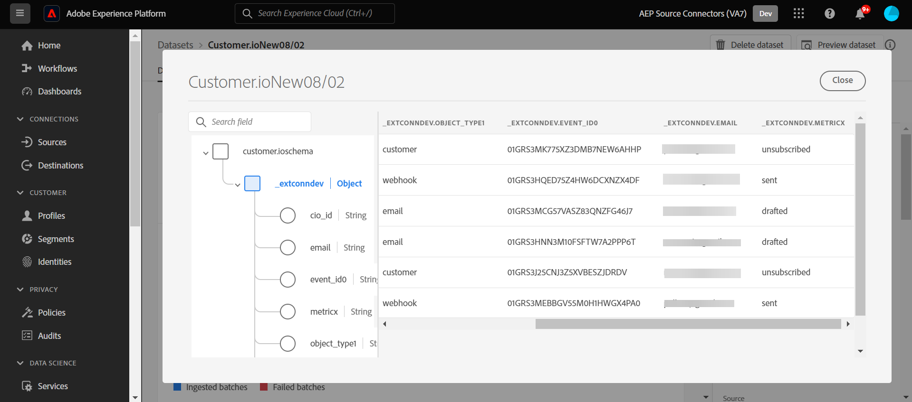

# 만들기 [!DNL Customer.io] ui의 소스 연결 및 데이터 흐름

>[!NOTE]
>
>다음 [!DNL Customer.io] 소스는 베타 버전입니다. 다음을 읽으십시오. [소스 개요](../../../../home.md#terms-and-conditions) beta 레이블 소스를 사용하는 방법에 대한 자세한 내용.

이 자습서에서는 다음을 만드는 단계를 제공합니다 [!DNL Customer.io] Adobe Experience Platform 사용자 인터페이스를 사용한 소스 연결 및 데이터 흐름.

## 시작하기 {#getting-started}

이 자습서에서는 다음 Experience Platform 구성 요소를 이해하고 있어야 합니다.

* [[!DNL Experience Data Model (XDM)] 시스템](../../../../../xdm/home.md): 표준화된 프레임워크 [!DNL Experience Platform] 고객 경험 데이터를 구성합니다.
   * [스키마 컴포지션 기본 사항](../../../../../xdm/schema/composition.md): 스키마 컴포지션의 주요 원칙 및 모범 사례를 포함하여 XDM 스키마의 기본 구성 요소에 대해 알아봅니다.
   * [스키마 편집기 튜토리얼](../../../../../xdm/tutorials/create-schema-ui.md): 스키마 편집기 UI를 사용하여 사용자 정의 스키마를 만드는 방법을 알아봅니다.
* [[!DNL Real-Time Customer Profile]](../../../../../profile/home.md): 여러 소스의 집계 데이터를 기반으로 통합 실시간 소비자 프로필을 제공합니다.

## 전제 조건 {#prerequisites}

다음 섹션에서는 다음을 만들기 전에 완료해야 하는 전제 조건에 대한 정보를 제공합니다. [!DNL Customer.io] 소스 연결.

### 소스 스키마를 정의할 샘플 JSON [!DNL Customer.io] {#prerequisites-json-schema}

만들기 전 [!DNL Customer.io] 소스 연결에서 소스 스키마를 제공해야 합니다. 아래 JSON을 사용할 수 있습니다.

```
{
  "event_id": "01E4C4CT6YDC7Y5M7FE1GWWPQJ",
  "object_type": "customer",
  "metric": "subscribed",
  "timestamp": 1613063089,
  "data": {
    "customer_id": "42",
    "email_address": "test@example.com",
    "identifiers": {
      "id": "42",
      "email": "test@example.com",
      "cio_id": "d9c106000001"
    }
  }
}
```

### 에 대한 플랫폼 스키마 만들기 [!DNL Customer.io] {#create-platform-schema}

또한 소스에 사용할 Platform 스키마를 생성해야 합니다. 다음 튜토리얼 참조: [플랫폼 스키마 생성](../../../../../xdm/schema/composition.md) 스키마를 만드는 방법에 대한 포괄적인 단계를 설명합니다.


## 연결 [!DNL Customer.io] account {#connect-account}

Platform UI에서 를 선택합니다. **[!UICONTROL 소스]** 을(를) 왼쪽 탐색에서 [!UICONTROL 소스] workspace 를 참조하고 Experience Platform에서 사용할 수 있는 소스 카탈로그를 확인하십시오.

사용 *[!UICONTROL 카테고리]* 메뉴를 사용하여 범주를 기준으로 소스를 필터링합니다. 또는 검색 막대에 소스 이름을 입력하여 카탈로그에서 특정 소스를 찾습니다.

로 이동 [!UICONTROL 마케팅 자동화] 범주 보기 [!DNL Customer.io] 소스 카드. 시작하려면 다음을 선택합니다. **[!UICONTROL 데이터 추가]**.


## 데이터 선택 {#select-data}

다음 **[!UICONTROL 데이터 선택]** 플랫폼으로 가져올 데이터를 선택할 수 있는 인터페이스를 제공하는 단계가 나타납니다.

* 인터페이스의 왼쪽 부분은 계정 내에서 사용 가능한 데이터 스트림을 볼 수 있는 브라우저입니다.
* 인터페이스의 오른쪽 부분에서 JSON 파일에서 최대 100개의 데이터 행을 미리 볼 수 있습니다.

선택 **[!UICONTROL 파일 업로드]** 로컬 시스템에서 JSON 파일을 업로드합니다. 또는 업로드할 JSON 파일을 [!UICONTROL 파일 드래그 앤 드롭] 패널.


파일이 업로드되면 미리보기 인터페이스가 업데이트되어 업로드한 스키마의 미리보기가 표시됩니다. 미리보기 인터페이스를 사용하여 파일의 내용과 구조를 검사할 수 있습니다. 다음을 사용할 수도 있습니다 [!UICONTROL 검색 필드] 스키마 내의 특정 항목에 액세스하는 유틸리티입니다.

완료되면 다음을 선택합니다. **[!UICONTROL 다음]**.


## 데이터 흐름 세부 정보 {#dataflow-detail}

다음 **데이터 흐름 세부 정보** 데이터 흐름의 이름과 설명을 제공할 수 있는 기회와 함께 기존 데이터 세트를 사용하거나 데이터 흐름의 새 데이터 세트를 설정할 수 있는 옵션이 제공되는 단계가 나타납니다. 이 단계에서는 프로필 수집, 오류 진단, 부분 수집 및 경고에 대한 설정을 구성할 수도 있습니다.

완료되면 다음을 선택합니다. **[!UICONTROL 다음]**.


## 매핑 {#mapping}

다음 [!UICONTROL 매핑] 소스 스키마의 소스 필드를 타겟 스키마의 해당 타겟 XDM 필드에 매핑하는 인터페이스를 제공하는 단계가 나타납니다.

Platform은 선택한 대상 스키마 또는 데이터 세트를 기반으로 자동 매핑된 필드에 대한 지능형 권장 사항을 제공합니다. 사용 사례에 맞게 매핑 규칙을 수동으로 조정할 수 있습니다. 필요에 따라 필드를 직접 매핑하도록 선택하거나 데이터 준비 함수를 사용하여 소스 데이터를 변환하여 계산된 값 또는 계산된 값을 파생할 수 있습니다. 매퍼 인터페이스 및 계산된 필드 사용에 대한 포괄적인 단계는 [데이터 준비 UI 안내서](../../../../../data-prep/ui/mapping.md).

아래 나열된 모든 매핑은 필수이며, 로 진행하기 전에 설정해야 합니다. [!UICONTROL 리뷰] 스테이지.

| Target 필드 | 설명 |
| --- | --- |
| `object_type` | 객체 유형은에서 [!DNL Customer.io] [events](https://customer.io/docs/webhooks/#events) 지원되는 유형에 대한 설명서입니다. |
| `id` | 개체의 식별자입니다. |
| `email` | 오브젝트와 연계된 이메일 주소. |
| `event_id` | 이벤트에 대한 고유 식별자. |
| `cio_id` | 다음 [!DNL Customer.io] 이벤트용 식별자. |
| `metric` | 이벤트 유형. 자세한 내용은 [!DNL Customer.io] [events](https://customer.io/docs/webhooks/#events) 지원되는 유형에 대한 설명서입니다. |
| `timestamp` | 이벤트가 발생한 타임스탬프. |

>[!IMPORTANT]
>
>매핑 안 함 `cio_id` 실행 시 [!DNL Customer.io] 의 webhook `test mode` 에서 전송된 관련 필드가 없기 때문에 [!DNL Customer.io].

소스 데이터가 성공적으로 매핑되면 다음을 선택합니다. **[!UICONTROL 다음]**.


## 검토 {#review}

다음 **[!UICONTROL 리뷰]** 새 데이터 흐름을 만들기 전에 검토할 수 있는 단계가 나타납니다. 세부 사항은 다음 범주 내에서 그룹화됩니다.

* **[!UICONTROL 연결]**: 소스 유형, 선택한 소스 파일의 관련 경로 및 해당 소스 파일 내의 열 양을 표시합니다.
* **[!UICONTROL 데이터 세트 할당 및 필드 매핑]**: 데이터 세트가 준수하는 스키마를 포함하여 소스 데이터가 수집되는 데이터 세트를 표시합니다.

데이터 흐름을 검토한 후 다음을 선택합니다 **[!UICONTROL 완료]** 데이터 흐름이 만들어지는 데 시간이 걸릴 수 있습니다.


## 스트리밍 끝점 URL 가져오기 {#get-streaming-endpoint}

스트리밍 데이터 흐름이 만들어지면 이제 스트리밍 끝점 URL을 검색할 수 있습니다. 이 끝점은 Webhook에 가입하는 데 사용되며 스트리밍 소스에서 Experience Platform과 통신할 수 있습니다.

웹후크를 구성하는 데 사용되는 URL을 구성하기 위해 [!DNL Customer.io] 다음을 검색해야 합니다.

* **[!UICONTROL 데이터 흐름 ID]**
* **[!UICONTROL 스트리밍 엔드포인트]**

을(를) 검색하려면 **[!UICONTROL 데이터 흐름 ID]** 및 **[!UICONTROL 스트리밍 엔드포인트]**&#x200B;로 이동합니다. [!UICONTROL 데이터 흐름 활동] 방금 만든 데이터 흐름의 페이지이며 아래쪽에서 세부 정보를 복사합니다. [!UICONTROL 속성] 패널.


스트리밍 끝점 및 데이터 흐름 ID를 검색했으면 다음 패턴을 기반으로 URL을 빌드합니다. ```{STREAMING_ENDPOINT}?x-adobe-flow-id={DATAFLOW_ID}```. 예를 들어 구성된 웹후크 URL은 다음과 같을 수 있습니다. ``https://dcs.adobedc.net/collection/febc116d22ba0ea2868e9c93b199375302afb8a589617700991bb8f3f0341ad7?x-adobe-flow-id=439b3fc4-3042-4a3a-b5e0-a494898d3fb0``

## 에서 보고 웹후크 설정 [!DNL Customer.io] {#set-up-webhook}

웹후크 URL이 생성되면 이제 를 사용하여 보고 웹후크를 설정할 수 있습니다. [!DNL Customer.io] 사용자 인터페이스. 보고 웹후크 설정 단계는 [[!DNL Customer.io] 안내서](https://customer.io/docs/webhooks/#setup) 웹 후크 설정 시.

다음에서 [!DNL Customer.io] 사용자 인터페이스, 입력 [webhook URL](#get-streaming-endpoint-url) 다음에서 [!DNL WEBHOOK ENDPOINT] 필드.


>[!TIP]
>
>보고 웹후크에 대해 다양한 이벤트를 구독할 수 있습니다. 다음과 같은 경우 각 이벤트의 메시지가 플랫폼에 수집됩니다. [!DNL Customer.io] 작업 이벤트 트리거 기준이 충족됩니다. 다른 이벤트에 대한 자세한 내용은 [[!DNL Customer.io] 이벤트 설명서](https://customer.io/docs/webhooks/#events).

## 다음 단계 {#next-steps}

이 자습서에 따라 스트리밍 데이터 흐름을 구성하여 [!DNL Customer.io] Experience Platform 대상 데이터. 수집 중인 데이터를 모니터링하려면 의 안내서를 참조하십시오. [Platform UI를 사용하여 스트리밍 데이터 흐름 모니터링](../../monitor-streaming.md).

## 추가 리소스 {#additional-resources}

아래 섹션에서는 사용 시 참조할 수 있는 추가 리소스를 제공합니다. [!DNL Customer.io] 소스.

### 가드레일 {#guardrails}

보호 기능에 대한 자세한 내용은 다음을 참조하십시오. [[!DNL Customer.io] 시간 초과 및 실패 페이지](https://customer.io/docs/webhooks/#timeouts-and-failures).

### 유효성 검사 {#validation}

소스 및 를 올바르게 설정했는지 확인하려면 [!DNL Customer.io] 메시지가 수집되는 경우 아래 단계를 따르십시오.

* 다음을 확인할 수 있습니다. [!DNL Customer.io] **[!UICONTROL 활동 로그]** 캡처하고 있는 이벤트를 식별하는 페이지 [!DNL Customer.io].


* Platform UI에서 를 선택합니다. **[!UICONTROL 데이터 흐름 보기]** 의 옆에 [!DNL Customer.io] 소스 카탈로그의 카드 메뉴. 그런 다음 을 선택합니다. **[!UICONTROL 데이터 세트 미리 보기]** 내에서 선택한 이벤트에 대해 수집된 데이터를 확인하려면 [!DNL Customer.io].


