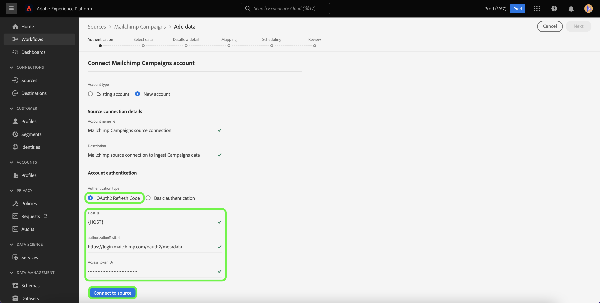
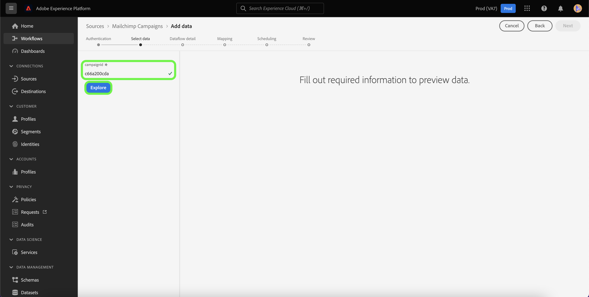

# Experience Platform UI를 사용하여 [!DNL Mailchimp Campaigns] 소스 연결 만들기

이 자습서에서는 사용자 인터페이스를 사용하여 [!DNL Mailchimp Campaigns] 데이터를 Adobe Experience Platform으로 수집하기 위한 [!DNL Mailchimp] 소스 커넥터를 만드는 단계를 제공합니다.

## 시작하기

이 안내서를 사용하려면 Adobe Experience Platform의 다음 구성 요소에 대해 이해하고 있어야 합니다.

* [소스](../../../../home.md): Experience Platform을 사용하면 [!DNL Experience Platform] 서비스를 사용하여 들어오는 데이터를 구조화하고 레이블을 지정하고 개선하는 기능을 제공하는 동시에 다양한 소스에서 데이터를 수집할 수 있습니다.
* [샌드박스](../../../../../sandboxes/home.md): Experience Platform은 단일 Experience Platform 인스턴스를 별도의 가상 환경으로 분할하여 디지털 경험 애플리케이션을 개발하고 발전시키는 데 도움이 되는 가상 샌드박스를 제공합니다.

## 필요한 자격 증명 수집

[!DNL Mailchimp Campaigns] 데이터를 Experience Platform으로 가져오려면 먼저 [!DNL Mailchimp] 계정에 해당하는 적절한 인증 자격 증명을 제공해야 합니다.

[!DNL Mailchimp Campaigns] 원본은 OAuth 2 새로 고침 코드와 기본 인증을 모두 지원합니다. 이러한 인증 유형에 대한 자세한 내용은 아래 표를 참조하십시오.

### OAuth 2 새로 고침 코드

| 자격 증명 | 설명 |
| --- | --- |
| 도메인 | MailChimp API에 연결하는 데 사용되는 루트 URL. 루트 URL의 형식은 `https://{DC}.api.mailchimp.com`입니다. 여기서 `{DC}`은(는) 계정에 해당하는 데이터 센터를 나타냅니다. |
| 인증 테스트 URL | 인증 테스트 URL은 [!DNL Mailchimp]을(를) Experience Platform에 연결할 때 자격 증명의 유효성을 검사하는 데 사용됩니다. 제공되지 않으면 소스 연결 생성 단계에서 자격 증명을 자동으로 확인합니다. |
| 액세스 토큰 | 소스 인증에 사용되는 해당 액세스 토큰입니다. OAuth 기반 인증에 필요합니다. |

OAuth 2를 사용하여 [!DNL Mailchimp] 계정을 Experience Platform에 인증하는 방법에 대한 자세한 내용은 이 [[!DNL Mailchimp] OAuth 2 사용에 대한 문서](https://mailchimp.com/developer/marketing/guides/access-user-data-oauth-2/)를 참조하십시오.

### 기본 인증

| 자격 증명 | 설명 |
| --- | --- |
| 도메인 | MailChimp API에 연결하는 데 사용되는 루트 URL. 루트 URL의 형식은 `https://{DC}.api.mailchimp.com`입니다. 여기서 `{DC}`은(는) 계정에 해당하는 데이터 센터를 나타냅니다. |
| 사용자 이름 | MailChimp 계정에 해당하는 사용자 이름입니다. 기본 인증에 필요합니다. |
| 암호 | MailChimp 계정에 해당하는 암호입니다. 기본 인증에 필요합니다. |

## [!DNL Mailchimp Campaigns] 계정을 Experience Platform에 연결

Experience Platform UI의 왼쪽 탐색 모음에서 **[!UICONTROL 소스]**&#x200B;를 선택하여 [!UICONTROL 소스] 작업 영역에 액세스합니다. [!UICONTROL 카탈로그] 화면에 계정을 만들 수 있는 다양한 소스가 표시됩니다.

화면 왼쪽에 있는 카탈로그에서 적절한 카테고리를 선택할 수 있습니다. 또는 검색 옵션을 사용하여 작업할 특정 소스를 찾을 수 있습니다.

[!UICONTROL 마케팅 자동화] 범주에서 **[!UICONTROL Mailchimp 캠페인]**&#x200B;을 선택한 다음 **[!UICONTROL 데이터 추가]**&#x200B;를 선택합니다.

**[!UICONTROL Connect Mailchimp Campaigns 계정]** 페이지가 나타납니다. 이 페이지에서 기존 계정에 액세스할지 또는 새 계정을 만들지 여부를 선택할 수 있습니다.

### 기존 계정

기존 계정을 사용하려면 새 데이터 흐름을 만들 [!DNL Mailchimp Campaigns] 계정을 선택한 다음 **[!UICONTROL 다음]**&#x200B;을 선택하여 계속합니다.

### 새 계정

새 계정을 만드는 경우 **[!UICONTROL 새 계정]**&#x200B;을(를) 선택한 다음 [!DNL Mailchimp Campaigns] 원본 연결 세부 정보에 대한 이름과 설명을 입력하십시오.

#### OAuth 2를 사용하여 인증

OAuth 2를 사용하려면 [!UICONTROL OAuth 2 새로 고침 코드]을 선택하고, 도메인, 인증 테스트 URL 및 액세스 토큰에 대한 값을 제공한 다음 **[!UICONTROL 소스에 연결]**&#x200B;을 선택하십시오. 자격 증명의 유효성을 검사할 때까지 잠시 기다린 후 **[!UICONTROL 다음]**&#x200B;을(를) 선택하여 계속하십시오.

#### 기본 인증을 사용하여 인증

기본 인증을 사용하려면 [!UICONTROL 기본 인증]을 선택하고 도메인, 사용자 이름 및 암호 값을 제공한 다음 **[!UICONTROL 소스에 연결]**&#x200B;을 선택하십시오. 자격 증명의 유효성을 검사할 때까지 잠시 기다린 후 **[!UICONTROL 다음]**&#x200B;을(를) 선택하여 계속하십시오.

### [!DNL Mailchimp Campaigns]개 데이터 선택

소스가 인증되면 [!DNL Mailchimp Campaigns] 계정에 해당하는 `campaignId`을(를) 제공해야 합니다.

[!UICONTROL 데이터 선택] 페이지에서 `campaignId`을(를) 입력한 다음 **[!UICONTROL 탐색]**&#x200B;을(를) 선택하십시오.

페이지가 데이터의 계층 구조를 탐색하고 검사할 수 있는 대화형 스키마 트리로 업데이트됩니다. 계속하려면 **[!UICONTROL 다음]**&#x200B;을(를) 선택하십시오.

## 다음 단계

[!DNL Mailchimp] 계정이 인증되고 [!DNL Mailchimp Campaigns] 데이터가 선택되면 이제 데이터 흐름을 만들어 데이터를 Experience Platform으로 가져올 수 있습니다. 데이터 흐름을 만드는 방법에 대한 자세한 단계는 [마케팅 자동화 데이터를 Experience Platform으로 가져오기 위한 데이터 흐름 만들기](../../dataflow/marketing-automation.md)에 대한 설명서를 참조하십시오.
