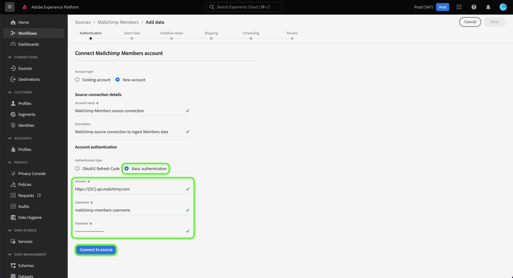

# 만들기 [!DNL Mailchimp Members] 플랫폼 UI를 사용한 소스 연결

이 자습서에서는 을(를) 만드는 단계를 제공합니다 [!DNL Mailchimp] 수집할 원본 커넥터 [!DNL Mailchimp Members] 사용자 인터페이스를 사용하여 Adobe Experience Platform에 데이터를 추가합니다.

## 시작하기

이 안내서에서는 Adobe Experience Platform의 다음 구성 요소를 이해하고 있어야 합니다.

* [소스](../../../../home.md): 플랫폼을 사용하면 다양한 소스에서 데이터를 수집할 수 있으며 다음을 사용하여 들어오는 데이터를 구조화, 레이블 지정 및 향상시키는 기능을 제공할 수 있습니다 [!DNL Platform] 서비스.
* [샌드박스](../../../../../sandboxes/home.md): 플랫폼은 디지털 경험 애플리케이션을 개발하고 발전시키는 데 도움이 되는 단일 플랫폼 인스턴스를 별도의 가상 환경으로 분할하는 가상 샌드박스를 제공합니다.

## 필요한 자격 증명 수집

당신의 [!DNL Mailchimp Members] 데이터를 Platform으로 전송하려면 먼저 [!DNL Mailchimp] 계정이 필요합니다.

다음 [!DNL Mailchimp Members] 소스는 OAuth 2 새로 고침 코드 및 기본 인증을 모두 지원합니다. 이러한 인증 유형에 대한 자세한 내용은 아래 표를 참조하십시오.

### OAuth 2 새로 고침 코드

| 자격 증명 | 설명 |
| --- | --- |
| 도메인 | MailChimp API에 연결하는 데 사용되는 루트 URL입니다. 루트 URL의 형식은 다음과 같습니다 `https://{DC}.api.mailchimp.com`, 위치 `{DC}` 계정에 해당하는 데이터 센터를 나타냅니다. |
| 인증 테스트 URL | 연결 시 자격 증명을 확인하는 데 인증 테스트 URL을 사용합니다 [!DNL Mailchimp] 플랫폼. 이 값이 제공되지 않으면 원본 연결 생성 단계 동안 자격 증명이 자동으로 선택됩니다. |
| 액세스 토큰 | 소스를 인증하는 데 사용되는 해당 액세스 토큰. OAuth 기반 인증에 필요합니다. |

OAuth 2를 사용하여 인증을 받는 방법에 대한 자세한 내용은 [!DNL Mailchimp] Platform 계정을 참조하십시오. [[!DNL Mailchimp] OAuth 2 사용에 대한 문서](https://mailchimp.com/developer/marketing/guides/access-user-data-oauth-2/).

### 기본 인증

| 자격 증명 | 설명 |
| --- | --- |
| 도메인 | MailChimp API에 연결하는 데 사용되는 루트 URL입니다. 루트 URL의 형식은 다음과 같습니다 `https://{DC}.api.mailchimp.com`, 위치 `{DC}` 계정에 해당하는 데이터 센터를 나타냅니다. |
| 사용자 이름 | MailChimp 계정에 해당하는 사용자 이름입니다. 기본 인증에 필요합니다. |
| 암호 | MailChimp 계정에 해당하는 암호입니다. 기본 인증에 필요합니다. |

## 연결 [!DNL Mailchimp Members] 플랫폼에 계정

플랫폼 UI에서 **[!UICONTROL 소스]** 왼쪽 탐색 모음에서 를 클릭하여 [!UICONTROL 소스] 작업 공간. 다음 [!UICONTROL 카탈로그] 화면에 계정을 만들 수 있는 다양한 소스가 표시됩니다.

화면 왼쪽에 있는 카탈로그에서 적절한 카테고리를 선택할 수 있습니다. 또는 검색 옵션을 사용하여 작업할 특정 소스를 찾을 수 있습니다.

아래에 [!UICONTROL 마케팅 자동화] 카테고리, 선택 **[!UICONTROL 메일 침팬지 캠페인]**&#x200B;를 선택한 다음 을 선택합니다. **[!UICONTROL 데이터 추가]**.

다음 **[!UICONTROL 메일 캠페인 계정 연결]** 페이지가 나타납니다. 이 페이지에서 기존 계정에 액세스할지 또는 새 계정을 만들지 여부를 선택할 수 있습니다.

### 기존 계정

기존 계정을 사용하려면 [!DNL Mailchimp Members] 새 데이터 흐름을 만들 계정을 선택한 다음 **[!UICONTROL 다음]** 계속 진행합니다.

### 새 계정

새 계정을 만드는 경우 **[!UICONTROL 새 계정]**, 그런 다음 이름 및 설명을 입력합니다 [!DNL Mailchimp Members] 소스 연결 세부 정보

#### OAuth 2를 사용하여 인증

OAuth 2를 사용하려면 을(를) 선택합니다. [!UICONTROL OAuth 2 새로 고침 코드]을 입력하여 도메인, 인증 테스트 URL 및 액세스 토큰에 대한 값을 제공한 다음 **[!UICONTROL 소스에 연결]**. 자격 증명이 유효한지 잠시 후에 을 선택합니다 **[!UICONTROL 다음]** 계속 진행합니다.

#### 기본 인증을 사용하여 인증

기본 인증을 사용하려면 [!UICONTROL 기본 인증]도메인, 사용자 이름 및 암호 값을 제공한 다음 을 선택합니다. **[!UICONTROL 소스에 연결]**. 자격 증명이 유효한지 잠시 후에 을 선택합니다 **[!UICONTROL 다음]** 계속 진행합니다.

### 선택 [!DNL Mailchimp Members] 데이터

소스가 인증되면 다음에 을 제공해야 합니다 `listId` 해당 [!DNL Mailchimp Members] 계정이 필요합니다.

설정 [!UICONTROL 데이터 선택] 페이지에서 `listId` 그런 다음 **[!UICONTROL 탐색]**.

페이지는 데이터의 계층 구조를 탐색하고 검사할 수 있는 대화형 스키마 트리로 업데이트됩니다. 선택 **[!UICONTROL 다음]** 계속 진행합니다.

## 다음 단계

사용 [!DNL Mailchimp] 계정 인증 및 [!DNL Mailchimp Members] 데이터를 선택한 경우 이제 데이터 흐름 만들기를 시작하여 데이터를 Platform으로 가져올 수 있습니다. 데이터 흐름을 만드는 방법에 대한 자세한 단계는 [마케팅 자동화 데이터를 플랫폼으로 가져오기 위한 데이터 흐름 만들기](../../dataflow/marketing-automation.md).
