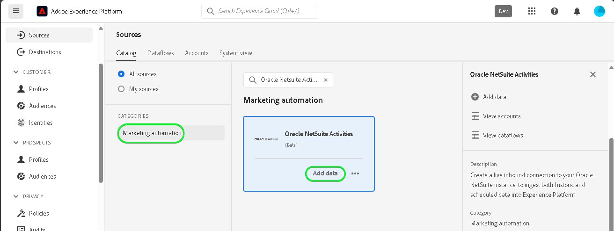

# UI에서 [!DNL Oracle NetSuite Activities] 소스 연결 만들기

>[!NOTE]
>
>[!DNL Oracle NetSuite Activities] 원본이 Beta 버전입니다. 베타 레이블 소스를 사용하는 방법에 대한 자세한 내용은 [소스 개요](../../../../home.md#terms-and-conditions)를 참조하십시오.

[!DNL Oracle NetSuite Activities] 계정의 이벤트 데이터를 UI의 Adobe Experience Platform으로 가져오는 방법을 알아보려면 다음 자습서를 참조하십시오.

## 시작하기 {#getting-started}

이 자습서에서는 Experience Platform의 다음 구성 요소를 이해하고 있어야 합니다.

* [[!DNL Experience Data Model (XDM)] 시스템](../../../../../xdm/home.md): [!DNL Experience Platform]에서 고객 경험 데이터를 구성하는 표준화된 프레임워크입니다.
   * [스키마 컴포지션의 기본 사항](../../../../../xdm/schema/composition.md): 스키마 컴포지션의 주요 원칙 및 모범 사례를 포함하여 XDM 스키마의 기본 구성 요소에 대해 알아봅니다.
   * [스키마 편집기 튜토리얼](../../../../../xdm/tutorials/create-schema-ui.md): 스키마 편집기 UI를 사용하여 사용자 지정 스키마를 만드는 방법을 알아봅니다.
* [[!DNL Real-Time Customer Profile]](../../../../../profile/home.md): 여러 원본의 집계된 데이터를 기반으로 통합된 실시간 소비자 프로필을 제공합니다.

이미 유효한 [!DNL Oracle NetSuite] 계정이 있는 경우 이 문서의 나머지 부분을 건너뛰고 [데이터 흐름 구성](../../dataflow/marketing-automation.md)에 대한 자습서로 진행할 수 있습니다.

>[!TIP]
>
>인증 자격 증명을 검색하는 방법에 대한 자세한 내용은 [[!DNL Oracle NetSuite] 개요](../../../../connectors/marketing-automation/oracle-netsuite.md)를 참조하십시오.

## [!DNL Oracle NetSuite] 계정 연결 {#connect-account}

Experience Platform UI의 왼쪽 탐색에서 **[!UICONTROL 소스]**&#x200B;를 선택하여 [!UICONTROL 소스] 작업 영역에 액세스합니다. 화면 왼쪽에 있는 카탈로그에서 적절한 카테고리를 선택할 수 있습니다. 또는 검색 옵션을 사용하여 작업할 특정 소스를 찾을 수 있습니다.

*마케팅 자동화* 범주에서 **[!DNL Oracle NetSuite Activities]**&#x200B;을(를) 선택한 다음 **[!UICONTROL 데이터 추가]**&#x200B;를 선택합니다.

**[!UICONTROL Oracle NetSuite 활동 연결 계정]** 페이지가 나타납니다. 이 페이지에서 새 자격 증명 또는 기존 자격 증명을 사용할 수 있습니다.

>[!IMPORTANT]
>
>새로 고침 토큰은 7일 후에 만료됩니다. 토큰이 만료되면 업데이트된 토큰으로 Experience Platform에 계정을 만들어야 합니다. 업데이트된 토큰으로 새 계정을 만들지 않으면 다음 오류 메시지가 표시될 수 있습니다. `The request could not be processed. Error from flow provider: The request could not be processed. Rest call failed with client error, status code 401 Unauthorized, please check your activity settings.`

### 기존 계정 {#existing-account}

기존 계정을 사용하려면 새 데이터 흐름을 만들 [!DNL Oracle NetSuite Activities] 계정을 선택한 다음 **[!UICONTROL 다음]**&#x200B;을 선택하여 계속합니다.

### 새 계정 {#new-account}

새 계정을 만드는 경우 **[!UICONTROL 새 계정]**&#x200B;을(를) 선택한 다음 이름, 설명(선택 사항) 및 자격 증명을 제공합니다. 완료되면 **[!UICONTROL 소스에 연결]**&#x200B;을 선택한 다음 새 연결을 설정할 수 있는 시간을 허용하세요.

## 다음 단계 {#next-steps}

이 자습서에 따라 [!DNL Oracle NetSuite Activities] 계정에 대한 연결을 설정했습니다. 이제 다음 자습서를 계속 진행하고 [데이터를 Experience Platform으로 가져오도록 데이터 흐름을 구성](../../dataflow/marketing-automation.md)할 수 있습니다.

## 추가 리소스 {#additional-resources}

아래 섹션에서는 [!DNL Oracle NetSuite Activities] 소스를 사용할 때 참조할 수 있는 추가 리소스를 제공합니다.

### 매핑 {#mapping}

Experience Platform은 선택한 대상 스키마 또는 데이터 세트를 기반으로 자동 매핑된 필드에 대한 지능형 권장 사항을 제공합니다. 사용 사례에 맞게 매핑 규칙을 수동으로 조정할 수 있습니다. 필요에 따라 필드를 직접 매핑하도록 선택하거나 데이터 준비 함수를 사용하여 소스 데이터를 변환하여 계산된 값 또는 계산된 값을 파생할 수 있습니다. 매퍼 인터페이스 및 계산된 필드 사용에 대한 포괄적인 단계는 [데이터 준비 UI 안내서](../../../../../data-prep/ui/mapping.md)를 참조하십시오.

>[!NOTE]
>
>표시되는 필드는 [!DNL Oracle NetSuite] 계정이 액세스할 수 있는 구독에 따라 다릅니다. 예를 들어 청구에 대한 액세스 권한이 없는 경우 청구 관련 필드가 표시되지 않습니다.

### 일정 조정 {#scheduling}

수집을 위해 [!DNL Oracle NetSuite Activities] 데이터 흐름을 예약할 때 다음 빈도 및 간격 구성을 선택해야 합니다.

| 빈도 | 간격 |
| --- | --- |
| `Once` | 1 |

데이터를 검색하는 동안 [!DNL Oracle NetSuite]이(가) 타임스탬프 대신 날짜 형식으로 마지막으로 수정되거나 만들어진 날짜에 응답합니다. 따라서 예약은 하루로 제한됩니다.

일정에 대한 값을 제공했으면 **[!UICONTROL 다음]**&#x200B;을 선택합니다.

