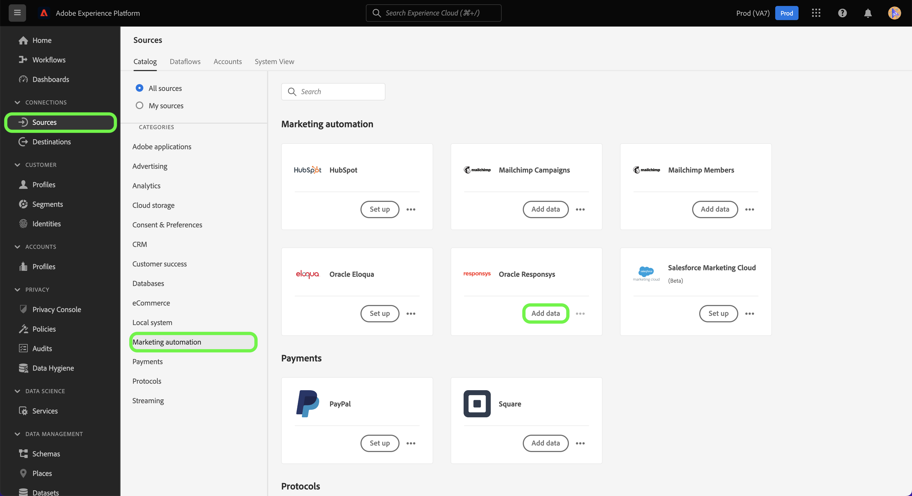

# (Beta) Experience Platform UI를 사용하여 [!DNL Oracle Responsys] 소스 연결 만들기

>[!NOTE]
>
>[!DNL Oracle Responsys] 원본이 Beta 버전입니다. 베타 레이블 커넥터 사용에 대한 자세한 내용은 [소스 개요](../../../../home.md#terms-and-conditions)를 참조하십시오.

이 자습서에서는 Adobe Experience Platform 사용자 인터페이스를 사용하여 [[!DNL Oracle Responsys]](../../../../connectors/marketing-automation/oracle-responsys.md) 소스 연결을 만드는 단계를 제공합니다.

## 시작하기

이 안내서를 사용하려면 Experience Platform의 다음 구성 요소에 대해 이해하고 있어야 합니다.

* [소스](../../../../home.md): Experience Platform을 사용하면 Experience Platform 서비스를 사용하여 들어오는 데이터를 구조화하고 레이블을 지정하고 향상시키는 기능을 제공하는 동시에 다양한 소스에서 데이터를 수집할 수 있습니다.
* [샌드박스](../../../../../sandboxes/home.md): Experience Platform은 단일 Experience Platform 인스턴스를 별도의 가상 환경으로 분할하여 디지털 경험 애플리케이션을 개발하고 발전시키는 데 도움이 되는 가상 샌드박스를 제공합니다.

Experience Platform에 인증된 [!DNL Oracle Responsys] 계정이 이미 있는 경우 이 문서의 나머지 부분을 건너뛰고 [마케팅 자동화 데이터를 Experience Platform으로 가져오기 위한 데이터 흐름 만들기](../../dataflow/marketing-automation.md)에 대한 자습서로 진행할 수 있습니다.

### 필요한 자격 증명 수집

[!DNL Oracle Responsys]을(를) Experience Platform에 연결하려면 다음 인증 속성에 대한 값을 제공해야 합니다.

| 자격 증명 | 설명 |
| --- | --- |
| 엔드포인트 | [!DNL Oracle Responsys] 인스턴스의 REST 인증 끝점 URL입니다. |
| 클라이언트 ID | [!DNL Oracle Responsys] 인스턴스의 클라이언트 ID. |
| 클라이언트 암호 | [!DNL Oracle Responsys] 인스턴스의 클라이언트 암호입니다. |

[!DNL Oracle Responsys]의 인증 자격 증명에 대한 자세한 내용은 [[!DNL Oracle Responsys] 인증 가이드](https://docs.oracle.com/en/cloud/saas/marketing/responsys-develop/API/GetStarted/authentication.htm)를 참조하십시오.

필요한 자격 증명을 수집했으면 아래 단계에 따라 [!DNL Oracle Responsys] 계정을 Experience Platform에 연결할 수 있습니다.

## [!DNL Oracle Responsys] 계정 연결

Experience Platform UI의 왼쪽 탐색에서 **[!UICONTROL 소스]**&#x200B;를 선택하여 [!UICONTROL 소스] 작업 영역에 액세스합니다. [!UICONTROL 카탈로그] 화면에 계정을 만들 수 있는 다양한 소스가 표시됩니다.

화면 왼쪽에 있는 카탈로그에서 적절한 카테고리를 선택할 수 있습니다. 또는 검색 옵션을 사용하여 작업할 특정 소스를 찾을 수 있습니다.

[!UICONTROL 마케팅 자동화] 범주에서 **[!UICONTROL Oracle Responsys]**&#x200B;을(를) 선택한 다음 **[!UICONTROL 데이터 추가]**&#x200B;를 선택합니다.

**[!UICONTROL Oracle Responsys 계정 연결]** 페이지가 나타납니다. 이 페이지에서 새 자격 증명 또는 기존 자격 증명을 사용할 수 있습니다.

### 기존 계정

기존 계정을 사용하려면 새 데이터 흐름을 만들 [!DNL Oracle Responsys] 계정을 선택한 다음 **[!UICONTROL 다음]**&#x200B;을 선택하여 계속합니다.

### 새 계정

새 계정을 만들려면 **[!UICONTROL 새 계정]**&#x200B;을(를) 선택한 다음 이름, 선택적 설명 및 [!DNL Oracle Responsys] 자격 증명에 대한 적절한 값을 제공합니다. 완료되면 **[!UICONTROL 소스에 연결]**&#x200B;을 선택한 다음 새 연결을 설정할 수 있는 시간을 허용하세요.

## 다음 단계

이 자습서를 따라 [!DNL Oracle Responsys] 계정과 Experience Platform 간의 소스 연결을 인증하고 만들었습니다. 이제 다음 자습서를 계속 진행하고 [데이터 흐름을 만들어 마케팅 자동화 데이터를 Experience Platform으로 가져올 수 있습니다](../../dataflow/marketing-automation.md).
