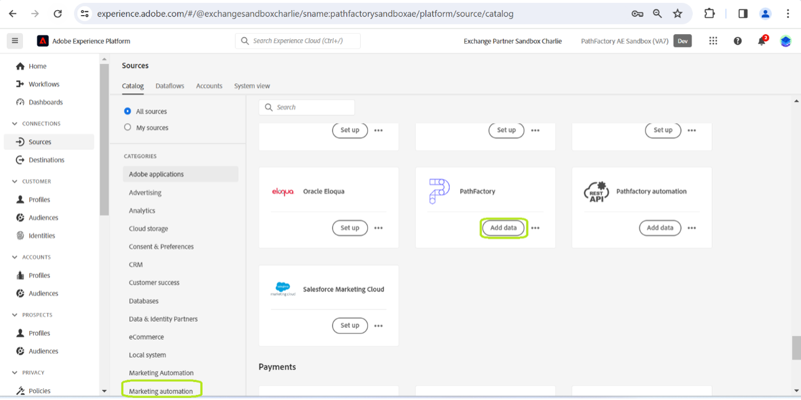

# 연결 [!DNL PathFactory] UI를 통해 Experience Platform 할 계정

이 튜토리얼에서는 을(를) 연결하는 방법에 대한 단계를 제공합니다. [!DNL PathFactory] UI를 통해 Adobe Experience Platform에 대한 방문자, 세션 및 페이지 보기 횟수 데이터를 제공합니다.

## 시작하기

이 자습서에서는 다음 Experience Platform 구성 요소를 이해하고 있어야 합니다.

* [[!DNL Experience Data Model (XDM)] 시스템](../../../../../xdm/home.md): 표준화된 프레임워크 [!DNL Experience Platform] 고객 경험 데이터를 구성합니다.
   * [스키마 컴포지션 기본 사항](../../../../../xdm/schema/composition.md): 스키마 컴포지션의 주요 원칙 및 모범 사례를 포함하여 XDM 스키마의 기본 구성 요소에 대해 알아봅니다.
   * [스키마 편집기 튜토리얼](../../../../../xdm/tutorials/create-schema-ui.md): 스키마 편집기 UI를 사용하여 사용자 정의 스키마를 만드는 방법을 알아봅니다.
* [[!DNL Real-Time Customer Profile]](../../../../../profile/home.md): 여러 소스의 집계 데이터를 기반으로 통합 실시간 소비자 프로필을 제공합니다.

이미 다음 항목이 있는 경우: [!DNL PathFactory] 계정, 이 문서의 나머지 부분을 건너뛰고 다음에 대한 자습서로 진행할 수 있습니다. [ui를 사용하여 마케팅 자동화 데이터를 Experience Platform으로 가져오기](../../dataflow/marketing-automation.md).

### 필요한 자격 증명 수집 {#gather-credentials}

플랫폼에서 PathFactory 계정에 액세스하려면 다음 값을 제공해야 합니다.

| 자격 증명 | 설명 |
| ---------- | ----------- |
| 사용자 이름 | PathFactory 계정 사용자 이름입니다. 시스템에서 계정을 식별하는 데 필수적입니다. |
| 암호 | PathFactory 계정과 연결된 암호입니다. 무단 액세스를 방지하기 위해 보안을 유지해야 합니다. |
| 도메인 | PathFactory 계정과 연결된 도메인입니다. 일반적으로 PathFactory URL 내의 고유 식별자를 참조합니다. |
| 액세스 토큰 | 시스템과 PathFactory 간의 보안 통신을 보장하기 위해 API 인증에 사용되는 고유한 토큰입니다. |
| API 엔드포인트 | 데이터 액세스를 위한 특정 API 엔드포인트: 방문자, 세션 및 페이지 보기. 각 끝점은 검색할 수 있는 서로 다른 데이터 세트에 해당합니다. **참고:** 이러한 구성 요소는에 의해 미리 정의됩니다. [!DNL PathFactory] 및 은 액세스하려는 데이터에만 해당됩니다. <ul><li>**방문자 엔드포인트**: `/api/public/v3/data_lake_apis/visitors.json`</li><li>**세션 끝점**: `/api/public/v3/data_lake_apis/sessions.json`</li><li>**페이지 조회수 엔드포인트**: `/api/public/v3/data_lake_apis/page_views.json`</li></ul> |

자격 증명 보안 및 사용 방법에 대한 자세한 지침과 액세스 토큰 획득 및 새로 고침에 대해서는 다음을 참조하십시오. [PathFactory 지원 센터](https://support.pathfactory.com/categories/adobe/). 이 리소스는 자격 증명 관리와 효과적이고 안전한 API 통합에 대한 포괄적인 안내서를 제공합니다.

## 연결 [!DNL PathFactory] account

Platform UI에서 를 선택합니다. **[!UICONTROL 소스]** 을(를) 왼쪽 탐색에서 [!UICONTROL 소스] 작업 영역. 다음 [!UICONTROL 카탈로그] Experience Platform에서 지원하는 다양한 소스를 표시합니다.

범주 목록에서 적절한 범주를 선택할 수 있습니다. 검색 창을 사용하여 특정 소스를 필터링할 수도 있습니다.

아래 [!UICONTROL 마케팅 자동화] 범주, 선택 **[!UICONTROL PathFactory]** 다음을 선택합니다. **[!UICONTROL 설정]**.

다음 **[!UICONTROL PathFactory에 연결]** 페이지가 나타납니다. 이 페이지에서 새 계정을 만들거나 기존 계정을 사용할 수 있습니다.

### 새 계정

새 계정을 만들려면 다음을 선택합니다. **[!UICONTROL 새 계정]** 계정의 이름, 설명(선택 사항) 및 [!DNL PathFactory] 계정입니다.

완료되면 다음을 선택합니다. **[!UICONTROL 소스에 연결]** 그런 다음 새 연결을 설정하는 데 시간이 걸릴 수 있습니다.

### 기존 계정

기존 계정이 이미 있는 경우 다음을 선택합니다. **[!UICONTROL 기존 계정]** 그런 다음 표시되는 목록에서 사용할 계정을 선택합니다.

## 다음 단계

이 자습서를 따라 [!DNL PathFactory] 계정과 Experience Platform. 이제 다음 튜토리얼을 계속 진행하여 [마케팅 자동화 데이터를 Experience Platform 상태로 가져오는 데이터 흐름 만들기](../../dataflow/marketing-automation.md).
