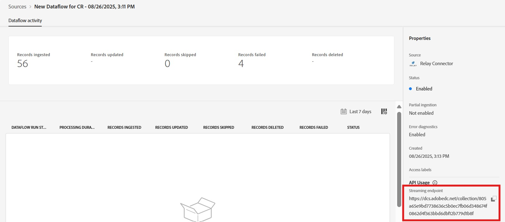

# UI에서 Experience Platform에 릴레이 연결

>[!NOTE]
>
>[!DNL Relay Connector] 원본이 Beta 버전입니다. 베타 레이블 소스를 사용하는 방법에 대한 자세한 내용은 [소스 개요](../../../../home.md#terms-and-conditions)를 참조하십시오.

[!DNL Relay Connector]을(를) 사용하면 여정에서 가장 의미 있는 순간에 고객에게 개인화된 경험을 제공할 수 있으므로 [!DNL Relay Network] 통합에서 Adobe Experience Platform으로 이벤트를 스트리밍하는 인바운드 연결을 만들어 더 강한 관계를 구축하고 충성도와 가치를 높이는 데 도움이 됩니다.

Experience Platform UI의 소스 작업 영역에서 [!DNL Relay Connector]을(를) 사용하는 방법에 대해 알아보려면 이 안내서를 참조하십시오.

>[!IMPORTANT]
>
>이 설명서 페이지는 *[!DNL Relay Network]* 팀에서 관리합니다. 문의 사항이나 업데이트 요청은 *[[!DNL Relay Network]](https://www.relaynetwork.com/)&#x200B;(으)로 직접 문의하거나 [info@relaynetwork.com](mailto:info@relaynetwork.com)*(으)로 전자 메일을 보내십시오.

## [!DNL Relay Connector] 소스 연결

Experience Platform UI의 왼쪽 탐색 모음에서 **[!UICONTROL Sources]**&#x200B;을(를) 선택하여 [!UICONTROL Sources] 작업 영역에 액세스합니다. [!UICONTROL Catalog] 화면에는 계정을 만들 수 있는 다양한 소스가 표시됩니다. 화면 왼쪽에 있는 카탈로그에서 적절한 카테고리를 선택하거나 검색 옵션을 사용하여 특정 소스를 찾을 수 있습니다.

*[!UICONTROL Marketing automation]* 범주에서 [!DNL Relay Connector] 원본 카드를 선택하고 **[!UICONTROL Add data]**&#x200B;을(를) 선택합니다.

>[!TIP]
>
>인증된 계정이 없는 경우 소스 카탈로그의 소스에 **[!UICONTROL Set up]** 옵션이 표시됩니다. 계정이 인증되면 이 옵션은 **[!UICONTROL Add data]**(으)로 변경됩니다.

### 데이터 선택

**[!UICONTROL Connect Relay Connector source]** 인터페이스가 나타납니다. *[!UICONTROL Select data]* 인터페이스를 사용하여 원본 데이터 스키마를 검색하거나 지정하십시오. 또는 샘플 JSON 파일을 업로드하여 소스 스키마를 정의할 수 있습니다.

>[!NOTE]
>
>허용되는 파일 크기는 최대 1GB입니다.

데이터가 업로드된 후 [!UICONTROL Preview sample data] 섹션을 사용하여 데이터를 미리 볼 수 있습니다.

### 데이터 흐름 세부 정보

그런 다음 *[!UICONTROL Dataflow details]* 인터페이스를 사용하여 데이터 흐름에 대한 **이름** 및 **선택적 설명**&#x200B;을 제공합니다. 또한 사용할 **[!UICONTROL Target dataset]**&#x200B;을(를) 선택하십시오. 새 데이터 세트를 만들거나 기존 데이터 세트를 사용할 수 있습니다.

### 매핑

이름을 기반으로 필드를 일치시키는 자동 맵 기능을 사용하여 소스 필드를 XDM 스키마 필드에 매핑하거나 보다 정밀한 제어를 위해 사용자 지정 매핑을 만들 수 있습니다. 필요한 경우 연결, 서식 지정 또는 이름 변경과 같은 변환을 적용하여 데이터가 대상 스키마에 완벽하게 맞도록 할 수도 있습니다. 매핑에 대한 자세한 내용은 [데이터 준비 UI 안내서](../../../../../data-prep/ui/mapping.md)를 참조하십시오.

>[!TIP]
>
>릴레이가 소스로 전송하는 이벤트 및 데이터 값의 유형에 대한 자세한 내용은 [[!DNL Relay Network] 푸시 이벤트](https://docs.relaynetwork.com/docs/push-events) 설명서를 참조하십시오. 이 정보를 통해 **경험 이벤트 스키마**&#x200B;를 적절히 디자인할 수 있습니다.

### 검토

마지막으로 **소스, 데이터 세트 및 매핑**&#x200B;을 포함한 모든 구성을 검토하십시오. 완료되면 **완료**&#x200B;를 선택하여 데이터 흐름을 만듭니다.

### 스트리밍 끝점 URL 검색

데이터 흐름을 만들면 데이터 흐름 페이지 오른쪽의 *속성* 섹션에서 **스트리밍 끝점 URL** 및 기타 관련 세부 정보를 찾을 수 있습니다.

**릴레이 콘솔**&#x200B;에서 웹후크를 설정하려면 이 값을 사용하십시오. 푸시 구성에 대한 자세한 지침은 Relay 설명서 [푸시 API 구성](https://docs.relaynetwork.com/docs/configuring-the-push-api)을 참조하십시오.

## 추가 리소스

* [흐름 서비스 API를 사용하여 새 연결 사양을 만듭니다](https://experienceleague.adobe.com/en/docs/experience-platform/sources/sdk/streaming-sdk/create)
* [UI를 사용하여 소스에 연결](https://experienceleague.adobe.com/en/docs/experience-platform/sources/sdk/streaming-sdk/submit#test-your-source-using-the-ui)
