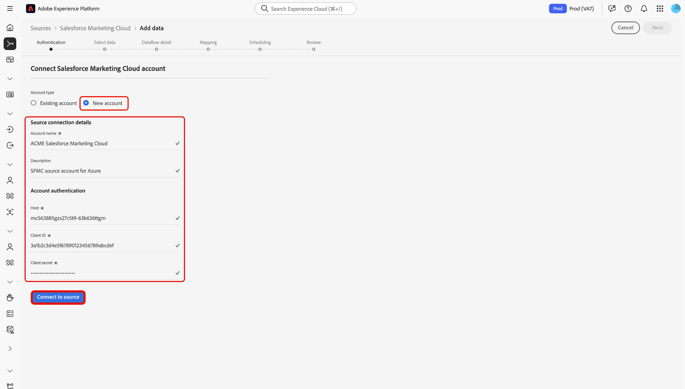

# UI를 통해 [!DNL Salesforce Marketing Cloud] 계정을 Experience Platform에 연결

>[!WARNING]
>
>[!DNL Salesforce Marketing Cloud] 원본은 2026년 1월에 사용되지 않습니다. 대안으로 새로운 정보원이 올해 말 공개될 것이다. 새 소스가 릴리스되면 2026년 1월 말 이전에 새 계정 연결 및 데이터 흐름을 생성하여 새 소스로 마이그레이션할 계획이어야 합니다.

Experience Platform 사용자 인터페이스의 소스 작업 영역을 사용하여 [!DNL Salesforce Marketing Cloud] 계정을 Adobe Experience Platform에 연결하는 방법에 대해 알아보려면 이 안내서를 참조하십시오.

## 시작

이 자습서에서는 Experience Platform의 다음 구성 요소를 이해하고 있어야 합니다.

* [[!DNL Experience Data Model (XDM)] 시스템](../../../../../xdm/home.md): [!DNL Experience Platform]에서 고객 경험 데이터를 구성하는 표준화된 프레임워크입니다.
   * [스키마 컴포지션의 기본 사항](../../../../../xdm/schema/composition.md): 스키마 컴포지션의 주요 원칙 및 모범 사례를 포함하여 XDM 스키마의 기본 구성 요소에 대해 알아봅니다.
   * [스키마 편집기 튜토리얼](../../../../../xdm/tutorials/create-schema-ui.md): 스키마 편집기 UI를 사용하여 사용자 지정 스키마를 만드는 방법을 알아봅니다.
* [[!DNL Real-Time Customer Profile]](../../../../../profile/home.md): 여러 원본의 집계된 데이터를 기반으로 통합된 실시간 소비자 프로필을 제공합니다.

이미 [!DNL Salesforce Marketing Cloud] 계정이 있는 경우 이 문서의 나머지 부분을 건너뛰고 [UI를 사용하여 Experience Platform에 마케팅 자동화 데이터를 가져오는 중](../../dataflow/marketing-automation.md)에 대한 자습서를 진행할 수 있습니다.

### 필요한 자격 증명 수집

인증에 대한 자세한 내용은 [[!DNL Salesforce Marketing Cloud] 개요](../../../../connectors/marketing-automation/salesforce-marketing-cloud.md#prerequisites)를 읽어 보십시오.

## 소스 카탈로그 탐색

>[!IMPORTANT]
>
>사용자 지정 개체 수집은 현재 [!DNL Salesforce Marketing Cloud] 원본 통합에서 지원되지 않습니다.

Experience Platform UI의 왼쪽 탐색에서 **[!UICONTROL 소스]**&#x200B;를 선택하여 *[!UICONTROL 소스]* 작업 영역에 액세스합니다. 카테고리를 선택하거나 검색 창을 사용하여 소스를 찾습니다.

[!DNL Salesforce Marketing Cloud]에 연결하려면 *[!UICONTROL Marketing Automation]* 범주로 이동하여 **[!UICONTROL Salesforce Marketing Cloud]** 소스 카드를 선택한 다음 **[!UICONTROL 설정]**&#x200B;을 선택하십시오.

>[!TIP]
>
>지정된 소스에 아직 인증된 계정이 없는 경우 소스 카탈로그의 소스에 **[!UICONTROL 설정]** 옵션이 표시됩니다. 인증된 계정을 만들면 이 옵션이 **[!UICONTROL 데이터 추가]**(으)로 변경됩니다.

## 기존 계정 사용 {#existing}

기존 계정을 사용하려면 **[!UICONTROL 기존 계정]**&#x200B;을(를) 선택한 다음 사용할 [!DNL Salesforce Marketing Cloud] 계정을 선택하십시오.

## 새 계정 만들기 {#new}

[!DNL Salesforce Marketing Cloud] 원본을 사용하여 [!DNL Azure] 또는 [!DNL Amazon Web Services]&#x200B;(AWS)의 Experience Platform에 연결할 수 있습니다.

### [!DNL Azure]에서 Experience Platform에 연결 {#azure}

[!DNL Azure]에서 Experience Platform에 연결하려면 계정 이름, 선택적 설명 및 [계정 인증 자격 증명](../../../../connectors/marketing-automation/salesforce-marketing-cloud.md#azure)을 제공하세요. 완료되면 **[!UICONTROL 소스에 연결]**&#x200B;을 선택하고 연결을 설정할 수 있도록 잠시 기다립니다.

### Amazon Web Services(AWS)에서 Experience Platform에 연결 {#aws}

>[!AVAILABILITY]
>
>이 섹션은 Amazon Web Services(AWS)에서 실행되는 Experience Platform 구현에 적용됩니다. AWS에서 실행되는 Experience Platform은 현재 제한된 수의 고객이 사용할 수 있습니다. 지원되는 Experience Platform 인프라에 대한 자세한 내용은 [Experience Platform 멀티 클라우드 개요](../../../../../landing/multi-cloud.md)를 참조하세요.

[!DNL AWS]의 Experience Platform에 연결하려면 VA6 샌드박스에 있는지 확인하고 계정 이름, 선택적 설명 및 [계정 인증 자격 증명](../../../../connectors/marketing-automation/salesforce-marketing-cloud.md#aws)을 제공하십시오. 완료되면 **[!UICONTROL 소스에 연결]**&#x200B;을 선택하고 연결을 설정할 수 있도록 잠시 기다립니다.

## [!DNL Salesforce Marketing Cloud] 데이터에 대한 데이터 흐름 만들기

[!DNL Salesforce Marketing Cloud]을(를) 연결했으므로 이제 [데이터 흐름을 만들고 마케팅 자동화 공급자에서 Experience Platform으로 데이터를 수집](../../dataflow/marketing-automation.md)할 수 있습니다.
