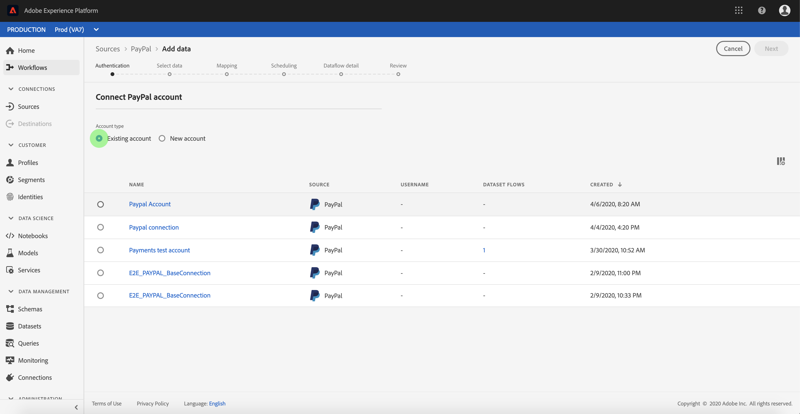

# UI에서 [!DNL PayPal] 소스 연결 만들기

>[!IMPORTANT]
>
>[!DNL PayPal] 원본은 2025년 5월 말에 사용되지 않습니다. [!DNL PayPal] 원본 대신 [[!DNL Data Landing Zone]](../cloud-storage/data-landing-zone.md)을(를) 사용할 수 있습니다.

Adobe Experience Platform의 Source 커넥터는 일정에 따라 외부 소스 데이터를 수집하는 기능을 제공합니다. 이 자습서에서는 Platform 사용자 인터페이스를 사용하여 [!DNL PayPal] 소스 커넥터를 만드는 단계를 제공합니다.

## 시작하기

이 자습서에서는 Adobe Experience Platform의 다음 구성 요소를 이해하고 있어야 합니다.

* [[!DNL Experience Data Model (XDM)] 시스템](../../../../../xdm/home.md): [!DNL Experience Platform]에서 고객 경험 데이터를 구성하는 표준화된 프레임워크입니다.
   * [스키마 컴포지션의 기본 사항](../../../../../xdm/schema/composition.md): 스키마 컴포지션의 주요 원칙 및 모범 사례를 포함하여 XDM 스키마의 기본 구성 요소에 대해 알아봅니다.
   * [스키마 편집기 튜토리얼](../../../../../xdm/tutorials/create-schema-ui.md): 스키마 편집기 UI를 사용하여 사용자 지정 스키마를 만드는 방법을 알아봅니다.
* [[!DNL Real-Time Customer Profile]](../../../../../profile/home.md): 여러 원본의 집계된 데이터를 기반으로 통합된 실시간 소비자 프로필을 제공합니다.

이미 올바른 [!DNL PayPal] 연결이 있는 경우 이 문서의 나머지 부분을 건너뛰고 [데이터 흐름 구성](../../dataflow/payments.md)에 대한 자습서로 진행할 수 있습니다.

### 필요한 자격 증명 수집

[!DNL PayPal] 계정 플랫폼에 액세스하려면 다음 값을 제공해야 합니다.

| 자격 증명 | 설명 |
| ---------- | ----------- |
| `host` | [!DNL PayPal] 인스턴스의 URL. |
| `clientID` | [!DNL PayPal] 응용 프로그램과 연결된 클라이언트 ID입니다. |
| `clientSecret` | [!DNL PayPal] 응용 프로그램과 연결된 클라이언트 암호입니다. |

시작에 대한 자세한 내용은 이 [[!DNL PayPal] 문서](https://developer.paypal.com/docs/api/overview/#get-credentials)를 참조하세요.

## [!DNL PayPal] 계정 연결

필요한 자격 증명을 수집했으면 아래 단계에 따라 [!DNL PayPal] 계정을 플랫폼에 연결할 수 있습니다.

[Adobe Experience Platform](https://platform.adobe.com)에 로그인한 다음 왼쪽 탐색 막대에서 **[!UICONTROL 소스]**&#x200B;를 선택하여 **[!UICONTROL 소스]** 작업 영역에 액세스합니다. **[!UICONTROL 카탈로그]** 화면에 계정을 만들 수 있는 다양한 소스가 표시됩니다.

화면 왼쪽에 있는 카탈로그에서 적절한 카테고리를 선택할 수 있습니다. 또는 검색 옵션을 사용하여 작업할 특정 소스를 찾을 수 있습니다.

**[!UICONTROL 결제]** 범주 아래에서 **[!UICONTROL PayPal]**&#x200B;을 선택합니다. 이 커넥터를 처음 사용하는 경우 **[!UICONTROL 구성]**&#x200B;을 선택하세요. 그렇지 않으면 **[!UICONTROL 데이터 추가]**&#x200B;를 선택하여 새 [!DNL PayPal] 커넥터를 만드십시오.

**[!UICONTROL PayPal에 연결]** 페이지가 나타납니다. 이 페이지에서 새 자격 증명 또는 기존 자격 증명을 사용할 수 있습니다.

### 새 계정

새 자격 증명을 사용하는 경우 **[!UICONTROL 새 계정]**&#x200B;을(를) 선택하십시오. 표시되는 입력 양식에서 이름, 선택적 설명 및 [!DNL PayPal] 자격 증명을 제공합니다. 완료되면 **[!UICONTROL 연결]**&#x200B;을 선택한 다음 새 연결을 설정할 시간을 허용합니다.

### 기존 계정

기존 계정에 연결하려면 연결할 [!DNL PayPal] 계정을 선택한 후 **[!UICONTROL 다음]**&#x200B;을(를) 선택하여 계속하십시오.

## 다음 단계

이 자습서에 따라 [!DNL PayPal] 계정에 대한 연결을 설정했습니다. 이제 다음 자습서를 계속 진행하고 [결제 데이터를 플랫폼으로 가져오기 위한 데이터 흐름을 구성](../../dataflow/payments.md)할 수 있습니다.
