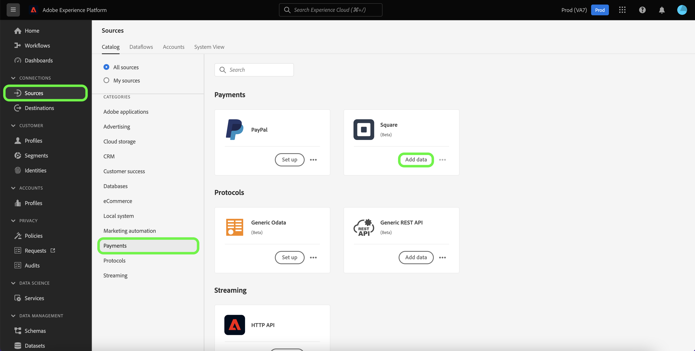

# 만들기 [!DNL Square] UI의 소스 연결

이 자습서에서는 을(를) 만드는 단계를 제공합니다 [!DNL Square] 플랫폼 사용자 인터페이스를 사용하는 소스 커넥터.

## 시작하기

이 자습서에서는 Adobe Experience Platform의 다음 구성 요소를 이해하고 있어야 합니다.

* [[!DNL Experience Data Model (XDM)] 시스템](../../../../../xdm/home.md): 표준화된 프레임워크 [!DNL Experience Platform] 고객 경험 데이터를 구성합니다.
   * [스키마 작성 기본 사항](../../../../../xdm/schema/composition.md): 스키마 컴포지션의 주요 원칙 및 모범 사례를 포함하여 XDM 스키마의 기본 빌딩 블록에 대해 알아봅니다.
   * [스키마 편집기 자습서](../../../../../xdm/tutorials/create-schema-ui.md): 스키마 편집기 UI를 사용하여 사용자 지정 스키마를 만드는 방법을 알아보십시오.
* [[!DNL Real-Time Customer Profile]](../../../../../profile/home.md): 여러 소스에서 집계된 데이터를 기반으로 통합된 실시간 소비자 프로필을 제공합니다.

### 필요한 자격 증명 수집

에 액세스하려면 [!DNL Square] 계정 플랫폼에서는 다음 값을 제공해야 합니다.

| 자격 증명 | 설명 |
| --- | --- |
| Host | 의 URL입니다 [!DNL Square] 인스턴스. |
| 클라이언트 ID | 와 연결된 클라이언트 ID [!DNL Square] 계정이 필요합니다. |
| 클라이언트 암호 | 와 연결된 클라이언트 암호입니다. [!DNL Square] 계정이 필요합니다. |
| 액세스 토큰 | 액세스 토큰은 [!DNL Square] OAuth 2.0 인증이 있는 계정. 액세스 토큰은 [!DNL Square]. |
| 새로 고침 토큰 | 새로 고침 토큰은 현재 액세스 토큰이 만료되면 새 액세스 토큰을 생성하는 데 사용됩니다. 새로 고침 토큰은 [!DNL Square]. |

이러한 자격 증명과 자격 증명을 가져오는 방법에 대한 자세한 내용은 [[!DNL Square] oaUth에 대한 설명서](https://developer.squareup.com/docs/oauth-api/receive-and-manage-tokens).

필요한 자격 증명을 수집하면 아래 단계에 따라 를 연결할 수 있습니다 [!DNL Square] Platform에 계정을 설정합니다.

## 연결 [!DNL Square] account

플랫폼 UI에서 **[!UICONTROL 소스]** 왼쪽 탐색에서 로 이동하여 [!UICONTROL 소스] 작업 공간. 다음 [!UICONTROL 카탈로그] 화면에 계정을 만들 수 있는 다양한 소스가 표시됩니다.

화면 왼쪽에 있는 카탈로그에서 적절한 카테고리를 선택할 수 있습니다. 또는 검색 옵션을 사용하여 작업할 특정 소스를 찾을 수 있습니다.

아래에 [!UICONTROL 결제] 카테고리, 선택 **[!UICONTROL 사각형]**&#x200B;를 선택한 다음 을 선택합니다. **[!UICONTROL 데이터 추가]**.

다음 **[!UICONTROL 정사각형 연결]** 페이지가 나타납니다. 이 페이지에서 새 자격 증명 또는 기존 자격 증명을 사용할 수 있습니다.

### 기존 계정

기존 계정을 사용하려면 [!DNL Square] 새 데이터 흐름을 만들 계정을 선택한 다음 **[!UICONTROL 다음]** 계속 진행합니다.

### 새 계정

새 계정을 만드는 경우 **[!UICONTROL 새 계정]**, 그런 다음 이름, 선택적 설명 및 적절한 값을 제공합니다. [!DNL Square] 자격 증명. 완료되면 을 선택합니다 **[!UICONTROL 소스에 연결]** 그런 다음 새 연결이 설정될 시간을 허용합니다.

## 다음 단계

이 자습서를 따라 사용자 간에 소스 연결을 인증하고 만들었습니다 [!DNL Square] 계정 및 플랫폼. 이제 다음 자습서를 계속 진행하고 [데이터 흐름을 만들어 결제 데이터를 플랫폼으로 가져오기](../../dataflow/payments.md).
