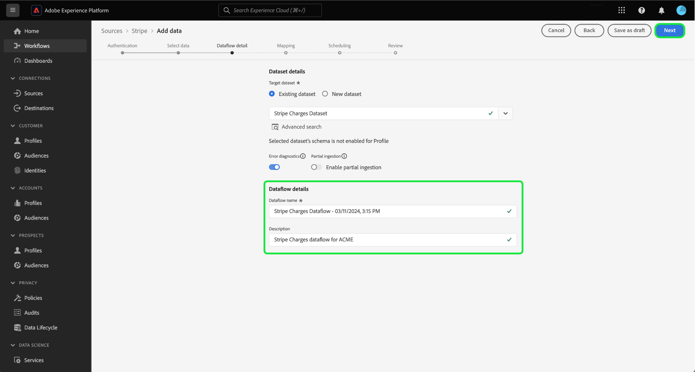

# 사용자 인터페이스를 사용하여 [!DNL Stripe] 계정에서 Experience Platform으로 결제 데이터 수집

>[!NOTE]
>
>[!DNL Stripe] 원본이 Beta 버전입니다. 베타 레이블 소스를 사용하는 방법에 대한 자세한 내용은 소스 개요에서 [약관](../../../../home.md#terms-and-conditions)을 참조하십시오.

사용자 인터페이스를 사용하여 [!DNL Stripe] 계정에서 Adobe Experience Platform으로 결제 데이터를 수집하는 방법에 대해 알아보려면 다음 자습서를 읽어 보십시오.

## 시작하기

이 자습서에서는 다음 Experience Platform 구성 요소를 이해하고 있어야 합니다.

* [[!DNL Experience Data Model (XDM)] 시스템](../../../../../xdm/home.md): [!DNL Experience Platform]에서 고객 경험 데이터를 구성하는 표준화된 프레임워크입니다.
   * [스키마 컴포지션의 기본 사항](../../../../../xdm/schema/composition.md): 스키마 컴포지션의 주요 원칙 및 모범 사례를 포함하여 XDM 스키마의 기본 구성 요소에 대해 알아봅니다.
   * [스키마 편집기 튜토리얼](../../../../../xdm/tutorials/create-schema-ui.md): 스키마 편집기 UI를 사용하여 사용자 지정 스키마를 만드는 방법을 알아봅니다.
* [[!DNL Real-Time Customer Profile]](../../../../../profile/home.md): 여러 원본의 집계된 데이터를 기반으로 통합된 실시간 소비자 프로필을 제공합니다.

### 인증

인증 자격 증명을 검색하는 방법에 대한 자세한 내용은 [[!DNL Stripe] 개요](../../../../connectors/payments/stripe.md)를 참조하십시오.

## [!DNL Stripe] 계정 연결 {#connect}

Platform UI의 왼쪽 탐색에서 **[!UICONTROL 소스]**&#x200B;를 선택하여 [!UICONTROL 소스] 작업 영역에 액세스합니다. 화면 왼쪽에 있는 카탈로그에서 적절한 카테고리를 선택할 수 있습니다. 또는 검색 옵션을 사용하여 작업할 특정 소스를 찾을 수 있습니다.

*결제* 범주에서 **[!DNL Stripe]**&#x200B;을(를) 선택한 다음 **[!UICONTROL 설정]**&#x200B;을(를) 선택합니다.

>[!TIP]
>
>지정된 소스에 아직 인증된 계정이 없는 경우 소스 카탈로그의 소스에 **[!UICONTROL 설정]** 옵션이 표시됩니다. 인증된 계정이 있으면 이 옵션이 **[!UICONTROL 데이터 추가]**(으)로 변경됩니다.

**[!UICONTROL Stripe 계정 연결]** 페이지가 나타납니다. 이 페이지에서 새 자격 증명 또는 기존 자격 증명을 사용할 수 있습니다.

>[!BEGINTABS]

>[!TAB 새 계정 만들기]

새 계정을 만들려면 **[!UICONTROL 새 계정]**&#x200B;을(를) 선택하고 이름, 설명(선택 사항) 및 자격 증명을 제공합니다.

완료되면 **[!UICONTROL 소스에 연결]**&#x200B;을 선택한 다음 새 연결을 설정할 수 있는 시간을 허용하세요.

| 자격 증명 | 설명 |
| --- | --- |
| 액세스 토큰 | [!DNL Stripe] 액세스 토큰입니다. 액세스 토큰을 검색하는 방법에 대한 자세한 내용은 [[!DNL Stripe] 인증 안내서](../../../../connectors/payments/stripe.md)를 참조하십시오. |

>[!TAB 기존 계정 사용]

기존 계정을 사용하려면 **[!UICONTROL 기존 계정]**&#x200B;을 선택한 다음 기존 계정 카탈로그에서 사용할 계정을 선택하십시오.

계속하려면 **[!UICONTROL 다음]**&#x200B;을(를) 선택하십시오.

>[!ENDTABS]

## 데이터 선택 {#select-data}

계정에 액세스할 수 있으므로 수집하려는 [!DNL Stripe] 데이터에 대한 적절한 경로를 식별해야 합니다. **[!UICONTROL 리소스 경로]**&#x200B;을(를) 선택한 다음 데이터를 수집할 끝점을 선택합니다. 사용 가능한 [!DNL Stripe] 끝점은 다음과 같습니다.

* 청구
* 구독수
* 환불
* 잔고 거래
* 고객
* 가격

끝점을 선택하면 인터페이스가 미리 보기 화면으로 업데이트되어 선택한 [!DNL Stripe] 끝점의 데이터 구조가 표시됩니다. 계속하려면 **[!UICONTROL 다음]**&#x200B;을(를) 선택하십시오.

## 데이터 세트 및 데이터 흐름 세부 정보 제공 {#provide-dataset-and-dataflow-details}

그런 다음 데이터 세트 및 데이터 흐름에 대한 정보를 제공해야 합니다.

### 데이터 세트 세부 정보 {#dataset-details}

데이터 세트는 스키마(열) 및 필드(행)를 포함하는 데이터 수집을 위한 저장소 및 관리 구조입니다. Experience Platform에 성공적으로 수집된 데이터는 데이터 세트로 데이터 레이크 내에 저장됩니다. 이 단계에서는 새 데이터 세트를 만들거나 기존 데이터 세트를 사용할 수 있습니다.

>[!BEGINTABS]

>[!TAB 새 데이터 세트 사용]

새 데이터 집합을 사용하려면 **[!UICONTROL 새 데이터 집합]**&#x200B;을(를) 선택한 다음 데이터 집합에 대한 이름과 선택적 설명을 입력하십시오. 데이터 세트에서 준수하는 XDM(경험 데이터 모델) 스키마도 선택해야 합니다.

| 새 데이터 세트 세부 정보 | 설명 |
| --- | --- |
| 출력 데이터 세트 이름 | 새 데이터 세트의 이름입니다. |
| 설명 | (선택 사항) 새 데이터 세트에 대한 간략한 설명입니다. |
| 스키마 | 조직에 있는 스키마의 드롭다운 목록입니다. 소스 구성 프로세스 전에 고유한 스키마를 생성할 수도 있습니다. 자세한 내용은 [UI에서 XDM 스키마 만들기](../../../../../xdm/tutorials/create-schema-ui.md)에 대한 안내서를 참조하십시오. |

>[!TAB 기존 데이터 세트 사용]

기존 데이터 세트가 이미 있는 경우 **[!UICONTROL 기존 데이터 세트]**&#x200B;를 선택한 다음 **[!UICONTROL 고급 검색]** 옵션을 사용하여 실시간 고객 프로필에 수집하도록 활성화되었는지 여부와 같은 각 세부 정보를 포함하여 조직의 모든 데이터 세트 창을 확인하십시오.

>[!ENDTABS]

+++프로필 수집, 오류 진단 및 부분 수집을 활성화하는 단계를 선택합니다.

Real-Time Customer Profile에 대해 데이터 세트를 사용하도록 설정한 경우 이 단계에서 **[!UICONTROL 프로필 데이터 세트]**&#x200B;를 전환하여 프로필 수집을 위해 데이터를 사용하도록 설정할 수 있습니다. 이 단계를 사용하여 **[!UICONTROL 오류 진단]** 및 **[!UICONTROL 부분 수집]**&#x200B;을 사용하도록 설정할 수도 있습니다.

* **[!UICONTROL 오류 진단]**: **[!UICONTROL 오류 진단]**&#x200B;을 선택하여 데이터 집합 활동 및 데이터 흐름 상태를 모니터링할 때 나중에 참조할 수 있는 오류 진단을 생성하도록 소스에 지시합니다.
* **[!UICONTROL 부분 수집]**: 부분 일괄 처리 수집은 구성 가능한 특정 임계값까지 오류가 포함된 데이터를 수집하는 기능입니다. 이 기능을 사용하면 모든 정확한 데이터를 Experience Platform으로 성공적으로 수집할 수 있으며 잘못된 데이터는 모두 잘못된 이유에 대한 정보로 별도로 배치됩니다.

+++

### 데이터 흐름 세부 정보 {#dataflow-details}

데이터 세트가 구성되면 이름, 선택적 설명 및 경고 구성을 포함하여 데이터 흐름에 대한 세부 정보를 제공해야 합니다.

| 데이터 흐름 구성 | 설명 |
| --- | --- |
| 데이터 흐름 이름 | 데이터 흐름의 이름입니다.  기본적으로 가져올 파일의 이름이 사용됩니다. |
| 설명 | (선택 사항) 데이터 흐름에 대한 간략한 설명입니다. |
| 경고 | Experience Platform은 사용자가 구독할 수 있는 이벤트 기반 경고를 생성할 수 있습니다. 이러한 옵션을 모두 트리거하려면 실행 중인 데이터 흐름이 필요합니다.  자세한 내용은 [경고 개요](../../alerts.md)를 참조하세요. <ul><li>**원본 데이터 흐름 실행 시작**: 데이터 흐름 실행이 시작될 때 알림을 받으려면 이 경고를 선택하십시오.</li><li>**소스 데이터 흐름 실행 성공**: 데이터 흐름이 오류 없이 종료될 경우 알림을 받으려면 이 경고를 선택하십시오.</li><li>**원본 데이터 흐름 실행 실패**: 데이터 흐름 실행이 오류로 인해 종료되는 경우 알림을 받으려면 이 경고를 선택하십시오.</li></ul> |

완료되면 **[!UICONTROL 다음]**&#x200B;을(를) 선택하여 계속하십시오.

## 필드를 XDM 스키마에 매핑 {#mapping}

**[!UICONTROL 매핑]** 단계가 나타납니다. 매핑 인터페이스를 사용하여 소스 데이터를 적절한 스키마 필드에 매핑한 다음 해당 데이터를 Experience Platform에 수집합니다. 매핑 인터페이스를 사용하는 방법에 대한 자세한 내용은 [데이터 준비 UI 안내서](../../../../../data-prep/ui/mapping.md)를 참조하십시오.

## 수집 일정 구성 {#scheduling}

그런 다음 예약 인터페이스를 사용하여 데이터 흐름에 대한 수집 일정을 만듭니다.

빈도 드롭다운을 선택하여 데이터 흐름의 수집 빈도를 구성합니다.

달력 아이콘을 선택하고 팝업 달력을 사용하여 수집 시작 시간을 구성할 수도 있습니다.

| 구성 예약 중 | 설명 |
| --- | --- |
| 빈도 | 데이터 흐름이 실행되는 빈도를 구성하십시오. 빈도를 다음과 같이 설정할 수 있습니다. <ul><li>**한 번**: 빈도를 `once`(으)로 설정하여 일회성 수집을 만듭니다. 일회성 수집 데이터 흐름을 만들 때는 간격 및 채우기 구성을 사용할 수 없습니다. 기본적으로 예약 빈도는 한 번으로 설정됩니다.</li><li>**분**: 분 단위로 데이터를 수집하도록 데이터 흐름을 예약하려면 빈도를 `minute`(으)로 설정하십시오.</li><li>**시간**: 빈도를 `hour`(으)로 설정하여 시간당 기준으로 데이터를 수집하도록 데이터 흐름을 예약합니다.</li><li>**일**: 빈도를 `day`(으)로 설정하여 하루 단위로 데이터를 수집하도록 데이터 흐름을 예약합니다.</li><li>**주**: 주별로 데이터를 수집하도록 데이터 흐름을 예약하려면 빈도를 `week`(으)로 설정하십시오.</li></ul> |
| 간격 | 빈도를 선택하면 간격 설정을 구성하여 모든 수집 사이에 시간대를 설정할 수 있습니다. 예를 들어 빈도를 일로 설정하고 간격을 15로 구성한 경우 데이터 흐름이 15일마다 실행됩니다. 간격을 0으로 설정할 수 없습니다. 각 주파수에 대해 허용되는 최소 간격 값은 다음과 같습니다.<ul><li>**한 번**: 해당 없음</li><li>**분**: 15</li><li>**시간**: 1</li><li>**일**: 1</li><li>**주**: 1</li></ul> |
| 시작 시간 | UTC 시간대로 표시되는 예상 실행의 타임스탬프입니다. |
| 채우기 | 채우기 는 처음 수집되는 데이터를 결정합니다. 다시 채우기를 활성화하면 처음 예약된 수집 중에 지정된 경로의 모든 현재 파일이 수집됩니다. 다시 채우기를 비활성화하면 첫 번째 수집 실행과 시작 시간 사이에 로드된 파일만 수집됩니다. 시작 시간 이전에 로드된 파일은 수집되지 않습니다. |

데이터 흐름의 수집 일정을 구성한 후 **[!UICONTROL 다음]**&#x200B;을(를) 선택하십시오.

## 데이터 흐름 검토

데이터 흐름 생성 프로세스의 마지막 단계는 데이터 흐름을 실행하기 전에 검토하는 것입니다. **[!UICONTROL 검토]** 단계를 사용하여 새 데이터 흐름이 실행되기 전에 자세한 내용을 검토하십시오. 세부 정보는 다음 카테고리로 그룹화됩니다.

* **연결**: 원본 형식, 선택한 원본 파일의 관련 경로 및 해당 원본 파일에 있는 열의 수를 표시합니다.
* **데이터 집합 및 맵 필드 할당**: 데이터 집합이 준수하는 스키마를 포함하여 소스 데이터가 수집되는 데이터 집합을 표시합니다.
* **예약**: 수집 일정의 활성 기간, 빈도 및 간격을 표시합니다.

데이터 흐름을 검토한 후 **[!UICONTROL 완료]**&#x200B;를 선택하고 데이터 흐름이 만들어지도록 잠시 기다립니다.

## 다음 단계

이 자습서를 따라 [!DNL Stripe] 원본에서 결제 데이터를 Experience Platform 상태로 가져오는 데이터 흐름을 만들었습니다. 추가 리소스는 아래 설명된 설명서를 참조하십시오.

### 데이터 흐름 모니터링

데이터 흐름이 만들어지면 데이터 흐름을 통해 수집되는 데이터를 모니터링하여 수집 비율, 성공 및 오류에 대한 정보를 볼 수 있습니다. 데이터 흐름을 모니터링하는 방법에 대한 자세한 내용은 [UI에서 계정 및 데이터 흐름 모니터링](../../../../../dataflows/ui/monitor-sources.md)에 대한 자습서를 참조하십시오.

### 데이터 흐름 업데이트

데이터 흐름 예약, 매핑 및 일반 정보에 대한 구성을 업데이트하려면 [UI에서 소스 데이터 흐름 업데이트](../../update-dataflows.md)에 대한 자습서를 참조하십시오.

### 데이터 흐름 삭제

**[!UICONTROL 데이터 흐름]** 작업 영역에서 사용할 수 있는 **[!UICONTROL Delete]** 함수를 사용하여 더 이상 필요하지 않거나 잘못 만들어진 데이터 흐름을 삭제할 수 있습니다. 데이터 흐름을 삭제하는 방법에 대한 자세한 내용은 [UI에서 데이터 흐름 삭제](../../delete.md)에 대한 자습서를 참조하십시오.
