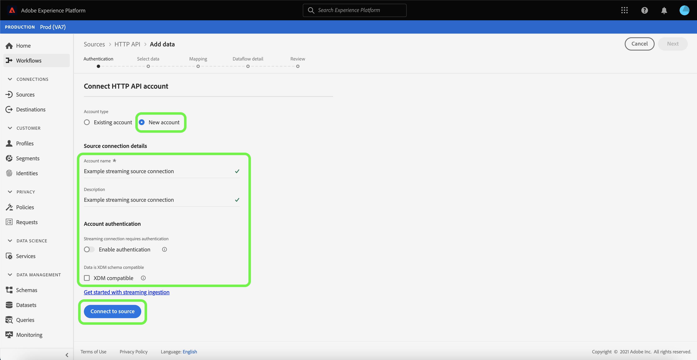

# UI를 사용하여 스트리밍 연결 만들기

이 자습서에서는 [!UICONTROL Sources] 작업 영역을 사용하여 스트리밍 소스 연결을 만드는 단계를 제공합니다.

## 시작하기

이 자습서에서는 Adobe Experience Platform의 다음 구성 요소에 대해 작업해야 합니다.

- [[!DNL Experience Data Model (XDM)] 시스템](../../../../../xdm/home.md):고객 경험 데이터를  [!DNL Experience Platform] 구성하는 표준화된 프레임워크
   - [스키마 컴포지션의 기본 사항](../../../../../xdm/schema/composition.md):스키마 컴포지션의 주요 원칙 및 모범 사례를 포함하여 XDM 스키마의 기본 구성 블록에 대해 알아봅니다.
   - [스키마 편집기 자습서](../../../../../xdm/tutorials/create-schema-ui.md):스키마 편집기 UI를 사용하여 사용자 정의 스키마를 생성하는 방법을 알아봅니다.
- [[!DNL Real-time Customer Profile]](../../../../../profile/home.md):여러 소스에서 집계된 데이터를 기반으로 통합된 실시간 소비자 프로필을 제공합니다.

## 스트리밍 연결 만들기

플랫폼 UI의 왼쪽 탐색 메뉴에서 **[!UICONTROL Sources]**&#x200B;을 선택하여 [!UICONTROL Sources] 작업 영역에 액세스합니다. [!UICONTROL Catalog] 화면에는 계정을 만들 수 있는 다양한 소스가 표시됩니다.

화면의 왼쪽에 있는 카탈로그에서 적절한 범주를 선택할 수 있습니다. 또는 검색 옵션을 사용하여 작업할 특정 소스를 찾을 수 있습니다.

**[!UICONTROL Streaming]** 범주에서 **[!UICONTROL HTTP API]**&#x200B;을 선택한 다음 **[!UICONTROL Add data]**&#x200B;를 선택합니다.

**[!UICONTROL Connect HTTP API account]** 페이지가 나타납니다. 이 페이지에서 새 자격 증명이나 기존 자격 증명을 사용할 수 있습니다.

### 기존 계정

기존 계정을 사용하려면 새 데이터 흐름을 만들 HTTP API 계정을 선택한 다음 **[!UICONTROL Next]**&#x200B;을 선택하여 계속 진행합니다.

### 새 계정

새 계정을 만드는 경우 **[!UICONTROL New account]**&#x200B;을 선택합니다. 표시되는 입력 양식에서 계정 이름과 선택적 설명을 입력합니다. 다음 구성 속성을 제공하는 옵션도 제공됩니다.

- **[!UICONTROL Authentication]:** 이 속성은 스트리밍 연결에 인증이 필요한지 여부를 결정합니다. 인증을 통해 신뢰할 수 있는 소스에서 데이터를 수집할 수 있습니다. PII(개인 식별 정보)를 취급하는 경우 이 속성을 설정해야 합니다. 기본적으로 이 속성은 꺼져 있습니다.
- **[!UICONTROL XDM compatible]:** 이 속성은 이 스트리밍 연결이 XDM 스키마와 호환되는 이벤트를 전송하는지 여부를 나타냅니다. 기본적으로 이 속성은 꺼져 있습니다.

완료되면 **[!UICONTROL Connect to source]**&#x200B;을 선택하고 **[!UICONTROL Next]**&#x200B;을 선택하여 진행하십시오.

## 데이터 선택

HTTP API 연결을 만든 후 데이터를 업로드하고 미리 볼 수 있는 인터페이스를 제공하는 **[!UICONTROL Select data]** 단계가 나타납니다.

데이터를 업로드하려면 **[!UICONTROL Upload files]**&#x200B;을 선택합니다. 또는 데이터를 드래그하여 인터페이스의 [!UICONTROL Drag and drop files] 섹션에 놓을 수 있습니다.

데이터가 업로드되면 인터페이스의 오른쪽을 사용하여 파일 계층 구조를 미리 볼 수 있습니다. 계속하려면 **[!UICONTROL Next]**&#x200B;을 선택합니다.

## 데이터 필드를 XDM 스키마에 매핑

소스 데이터를 플랫폼 데이터 집합에 매핑하기 위한 인터페이스를 제공하는 [!UICONTROL Mapping] 단계가 나타납니다.

CSV 파일을 사용하려면 XDM 호환 파일이어야 하며 매핑이 수동으로 구성되지 않아도 됩니다. 반면 CSV 파일을 사용하려면 매핑을 명시적으로 구성해야 하지만 매핑할 소스 데이터 필드를 선택할 수 있어야 합니다. XDM 불만 사항으로 표시된 JSON 파일은 수동 구성이 필요 없습니다. 그러나 XDM 규격으로 표시되지 않으면 매핑을 명시적으로 구성해야 합니다.

수집할 인바운드 데이터의 데이터 세트를 선택합니다. 기존 데이터 집합을 사용하거나 새 데이터 집합을 만들 수 있습니다.

### 새 데이터 세트 만들기

새 데이터 세트를 만들려면 **[!UICONTROL New dataset]**&#x200B;을 선택합니다. 표시되는 양식에서 데이터 세트에 대한 대상 스키마는 물론 이름, 선택적 설명을 제공합니다. [!DNL Profile] 사용 가능한 스키마를 선택하는 경우 데이터 집합도 [!DNL Profile] 사용 가능이어야 하는지 선택할 수 있습니다.

### 기존 데이터 세트 사용

기존 데이터 집합을 사용하려면 **[!UICONTROL Existing dataset]**&#x200B;을 선택합니다. 나타나는 양식에서 사용할 데이터 세트를 선택합니다. 데이터 세트를 선택하고 나면 데이터 세트를 [!DNL Profile] 활성화할지 여부를 선택할 수 있습니다.

### 표준 필드 매핑

필요에 따라 필드를 직접 매핑하거나 데이터 준비 함수를 사용하여 계산된 값 또는 계산된 값을 파생하도록 소스 데이터를 변형할 수 있습니다. 데이터 매핑 및 매퍼 함수에 대한 자세한 내용은 [CSV 데이터를 XDM 스키마 필드](../../../../../ingestion/tutorials/map-a-csv-file.md)에 매핑하기 튜토리얼을 참조하십시오.

새 소스 필드를 추가하려면 **[!UICONTROL Add new mapping]**&#x200B;을 선택합니다.

새 소스 필드와 대상 필드 쌍이 나타납니다. 새 소스 필드를 추가하려면 [!UICONTROL Select source field] 입력 막대 옆에 있는 화살표 아이콘을 선택합니다.

[!UICONTROL Select attributes] 패널에서는 파일 계층 구조를 살펴보고 대상 XDM 필드에 매핑할 특정 소스 필드를 선택할 수 있습니다. 매핑할 소스 필드를 선택한 후 **[!UICONTROL Select]** 을 선택하여 계속 진행합니다.

소스 필드를 선택하면 매핑할 적절한 대상 XDM 필드를 식별할 수 있습니다. 대상 필드 섹션에서 스키마 아이콘을 선택합니다.

대상 데이터 집합의 스키마를 탐색할 수 있는 인터페이스를 제공하는 [!UICONTROL Map source field to target field] 창이 나타납니다. 소스 필드와 일치하는 대상 필드를 선택한 다음 **[!UICONTROL Select]**&#x200B;을 선택하여 계속 진행합니다.

소스 필드가 모두 해당 대상 XDM 필드에 매핑되면 **[!UICONTROL Next]** 을 선택합니다.

## 데이터 흐름 세부 정보

**[!UICONTROL Dataflow detail]** 단계가 나타납니다. 이 페이지에서 이름 및 선택적 설명을 지정하여 만든 데이터 플로우에 대한 세부 정보를 제공할 수 있습니다.

데이터 흐름에 대한 세부 정보를 제공한 후 **[!UICONTROL Next]**&#x200B;을 선택합니다.

## 리뷰

데이터 흐름 세부 정보를 검토하기 전에 **[!UICONTROL Review]** 단계가 나타납니다. 세부 사항은 다음 카테고리 내에 있는 그룹입니다.

- **[!UICONTROL Connection]**:계정 이름, 소스 플랫폼 및 소스 이름을 표시합니다.
- **[!UICONTROL Assign dataset and map fields]**:데이터 세트가 준수하는 대상 데이터 세트와 스키마를 표시합니다.

세부 사항이 올바른지 확인한 후 **[!UICONTROL Finish]**&#x200B;을 선택합니다.

## 스트리밍 끝점 URL 가져오기

연결이 생성되면 소스 세부 정보 페이지가 나타납니다. 이 페이지에는 이전에 실행한 데이터 흐름, ID 및 스트리밍 끝점 URL을 비롯하여 새로 만든 연결에 대한 세부 정보가 표시됩니다.

## 다음 단계

이 자습서를 따라 스트리밍 HTTP 연결을 만들어 스트리밍 끝점을 사용하여 다양한 [!DNL Data Ingestion] API에 액세스할 수 있습니다. API에서 스트리밍 연결을 만들기 위한 지침은 [스트리밍 연결 자습서](../../../api/create/streaming/http.md)를 참조하십시오.

데이터를 플랫폼으로 스트리밍하는 방법을 알아보려면 [스트리밍 시간 시리즈 데이터](../../../../../ingestion/tutorials/streaming-time-series-data.md)에 대한 자습서 또는 [스트리밍 레코드 데이터](../../../../../ingestion/tutorials/streaming-record-data.md)에 대한 자습서를 읽으십시오.
