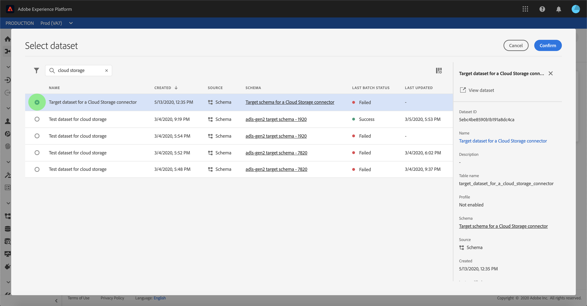

# UI에서 클라우드 스토리지 배치 연결에 대한 데이터 흐름 구성

데이터 흐름은 소스에서 다음으로 데이터를 검색하고 수집하는 예약된 작업입니다 [!DNL Platform] 데이터 세트. 이 자습서에서는 클라우드 저장소 계정을 사용하여 새 데이터 흐름을 구성하는 단계를 제공합니다.

## 시작하기

이 자습서에서는 Adobe Experience Platform의 다음 구성 요소를 이해하고 있어야 합니다.

* [[!DNL Experience Data Model (XDM)] 시스템](../../../../../xdm/home.md): 표준화된 프레임워크 [!DNL Experience Platform] 고객 경험 데이터를 구성합니다.
   * [스키마 작성 기본 사항](../../../../../xdm/schema/composition.md): 스키마 컴포지션의 주요 원칙 및 모범 사례를 포함하여 XDM 스키마의 기본 빌딩 블록에 대해 알아봅니다.
   * [스키마 편집기 자습서](../../../../../xdm/tutorials/create-schema-ui.md): 스키마 편집기 UI를 사용하여 사용자 지정 스키마를 만드는 방법을 알아보십시오.
* [[!DNL Real-time Customer Profile]](../../../../../profile/home.md): 여러 소스에서 집계된 데이터를 기반으로 통합된 실시간 소비자 프로필을 제공합니다.

또한 이 자습서에서는 클라우드 저장소 계정이 설정되어 있어야 합니다. UI에서 다른 클라우드 스토리지 계정을 만드는 자습서 목록은 [소스 커넥터 개요](../../../../home.md).

### 지원되는 파일 형식

[!DNL Experience Platform] 에서는 외부 저장소에서 수집할 다음 파일 형식을 지원합니다.

* 구분 기호로 구분된 값(DSV): 모든 단일 문자 값은 DSV 형식 데이터 파일의 구분 기호로 사용할 수 있습니다.
* [!DNL JavaScript Object Notation] (JSON): JSON 형식 데이터 파일은 XDM 규격 파일이어야 합니다.
* [!DNL Apache Parquet]: Parquet 형식의 데이터 파일은 XDM 규격 파일이어야 합니다.
* 압축된 파일: JSON 및 구분된 파일은 다음과 같이 압축할 수 있습니다. `bzip2`, `gzip`, `deflate`, `zipDeflate`, `tarGzip`, 및 `tar`.

## 데이터 선택

클라우드 스토리지 계정을 만든 후 **[!UICONTROL 데이터 선택]** 클라우드 스토리지 파일 계층 구조를 탐색할 수 있는 인터페이스를 제공하는 단계가 나타납니다.

* 인터페이스의 왼쪽 부분은 클라우드 스토리지 파일과 디렉토리를 표시하는 디렉토리 브라우저입니다.
* 인터페이스의 오른쪽 부분에서 호환되는 파일에서 최대 100개의 데이터 행을 미리 볼 수 있습니다.

나열된 폴더를 선택하면 폴더 계층 구조를 더 깊은 폴더로 트래버스할 수 있습니다. 단일 폴더를 선택하여 폴더의 모든 파일을 재귀적으로 수집할 수 있습니다. 전체 폴더를 섭취할 때 폴더의 모든 파일이 동일한 스키마를 공유하는지 확인해야 합니다.

호환되는 파일 또는 폴더를 선택한 후에는 [!UICONTROL 데이터 형식 선택] 드롭다운 메뉴 아래의 제품에서 사용할 수 있습니다.

다음 표에는 지원되는 파일 형식에 적절한 데이터 형식이 표시됩니다.

| 파일 유형 | 데이터 형식 |
| --- | --- |
| CSV로 내보내기 | [!UICONTROL 구분 기호] |
| JSON | [!UICONTROL JSON] |
| 쪽모이 세공 | [!UICONTROL XDM Parquet] |

선택 **[!UICONTROL JSON]** 및 가 미리 보기 인터페이스를 채울 때까지 몇 초 동안 기다립니다.

>[!NOTE]
>
>구분된 파일 및 JSON 파일 유형과 달리, Parquet 형식 파일은 미리 볼 수 없습니다.

미리 보기 인터페이스를 사용하면 파일의 내용 및 구조를 검사할 수 있습니다. 기본적으로 미리 보기 인터페이스에서는 선택한 폴더에 첫 번째 파일이 표시됩니다.

다른 파일을 미리 보려면 검사할 파일 이름 옆에 있는 미리 보기 아이콘을 선택합니다.

폴더에 있는 파일의 내용과 구조를 검사했으면 을 선택합니다 **[!UICONTROL 다음]** 를 클릭하여 폴더의 모든 파일을 재귀적으로 수집할 수 있습니다.

특정 파일을 선택하려면 수집할 파일을 선택한 다음 선택합니다 **[!UICONTROL 다음]**.

### 구분된 파일에 대한 사용자 지정 구분 기호 설정

구분된 파일을 수집할 때 사용자 지정 구분 기호를 설정할 수 있습니다. 을(를) 선택합니다 **[!UICONTROL 구분 기호]** 옵션을 선택한 다음 드롭다운 메뉴에서 구분 기호를 선택합니다. 메뉴에는 쉼표( )를 포함하여 구분 기호에 가장 자주 사용되는 옵션이 표시됩니다`,`), 탭(`\t`) 및 파이프(`|`). 사용자 지정 구분 기호를 사용하려면 **[!UICONTROL 사용자 지정]** 팝업 입력 막대에서 선택한 단일 문자 구분 기호를 입력합니다.

데이터 형식을 선택하고 구분 기호를 설정하면 **[!UICONTROL 다음]**.

### 압축된 파일 수집

압축 유형을 지정하여 압축 JSON 또는 구분된 파일을 수집할 수 있습니다.

에서 [!UICONTROL 데이터 선택] 단계에서 수집하기 위해 압축된 파일을 선택한 다음 해당 파일 유형과 XDM 규격 파일 여부를 선택합니다. 다음 을 선택합니다. **[!UICONTROL 압축 유형]** 그런 다음 소스 데이터에 적합한 압축 파일 유형을 선택합니다.

압축된 파일 유형이 식별되면 **[!UICONTROL 다음]** 계속 진행합니다.

## XDM 스키마에 데이터 필드 매핑

다음 **[!UICONTROL 매핑]** 소스 데이터를 [!DNL Platform] 데이터 세트. Parquet에서 형식이 지정된 소스 파일은 XDM 규격 파일이어야 하며, 수동으로 매핑을 구성할 필요가 없습니다. 반면 CSV 파일을 사용하려면 명시적으로 매핑을 구성해야 하지만 매핑할 소스 데이터 필드를 선택할 수 있도록 하십시오. XDM 불만 사항으로 표시된 JSON 파일은 수동 구성이 필요하지 않습니다. 그러나 XDM 규격으로 표시되지 않으면 매핑을 명시적으로 구성해야 합니다.

수집할 인바운드 데이터에 대한 데이터 세트를 선택합니다. 기존 데이터 세트를 사용하거나 새 데이터 세트를 만들 수 있습니다.

**기존 데이터 세트 사용**

기존 데이터 세트에 데이터를 수집하려면 을 선택합니다 **[!UICONTROL 기존 데이터 세트]**&#x200B;그런 다음 데이터 세트 아이콘을 선택합니다.

다음 **[!UICONTROL 데이터 세트 선택]** 대화 상자가 나타납니다. 사용할 데이터 세트를 찾아 선택한 다음 를 클릭합니다 **[!UICONTROL 계속]**.

**새 데이터 세트 사용**

데이터를 새 데이터 세트에 수집하려면 을 선택합니다 **[!UICONTROL 새 데이터 세트]** 제공된 필드에 데이터 집합의 이름과 설명을 입력합니다. 스키마를 추가하려면 **[!UICONTROL 스키마 선택]** 대화 상자 또는, **[!UICONTROL 스키마 고급 검색]** 적절한 스키마를 검색하기 위해.

이 단계에서에 데이터 세트를 활성화할 수 있습니다 [!DNL Real-time Customer Profile] 엔티티의 속성 및 동작을 전체적으로 확인할 수 있습니다. 활성화된 모든 데이터 세트의 데이터는 [!DNL Profile] 및 변경 사항은 데이터 흐름을 저장할 때 적용됩니다.

전환 **[!UICONTROL 프로필 데이터 세트]** target 데이터 세트에 대한 활성화 단추 [!DNL Profile].

다음 **[!UICONTROL 스키마 선택]** 대화 상자가 나타납니다. 새 데이터 세트에 적용할 스키마를 선택한 다음 를 선택합니다 **[!UICONTROL 완료]**.

필요에 따라 필드를 직접 매핑하거나 데이터 준비 함수를 사용하여 소스 데이터를 변환하여 계산 또는 계산된 값을 도출할 수 있습니다. 매퍼 함수 및 계산된 필드에 대한 자세한 내용은 [데이터 준비 함수 안내서](../../../../../data-prep/functions.md) 또는 [계산된 필드 안내서](../../../../../data-prep/calculated-fields.md).

JSON 파일의 경우 필드를 다른 필드에 직접 매핑하는 것 외에도 개체를 다른 개체 및 배열에 직접 매핑할 수 있습니다. 또한 클라우드 저장소 소스 커넥터를 사용하여 JSON 파일의 배열과 같은 복잡한 데이터 유형을 미리 보고 매핑할 수 있습니다.

서로 다른 유형에 매핑할 수 없습니다. 예를 들어 개체를 배열에 매핑하거나 필드를 개체에 매핑할 수 없습니다.

>[!TIP]
>
>플랫폼은 선택한 대상 스키마나 데이터 세트를 기반으로 자동 매핑 필드에 대한 지능형 권장 사항을 제공합니다. 사용 사례에 맞게 매핑 규칙을 수동으로 조정할 수 있습니다.

선택 **[!UICONTROL 데이터 미리 보기]** 선택한 데이터 세트에서 최대 100개의 샘플 데이터 행의 매핑 결과를 확인하십시오.

미리 보기 중에 ID 열은 매핑 결과를 확인할 때 필요한 주요 정보이므로 첫 번째 필드로 우선 순위가 지정됩니다.

소스 데이터가 매핑되면 **[!UICONTROL 닫기]**.

## 수집 실행 예약

다음 **[!UICONTROL 예약]** 구성된 매핑을 사용하여 선택한 소스 데이터를 자동으로 수집하도록 수집 일정을 구성할 수 있는 단계가 나타납니다. 다음 표에서는 스케줄링에 대해 다양한 구성 가능한 필드에 대해 설명합니다.

| 필드 | 설명 |
| --- | --- |
| 빈도 | 선택할 수 있는 주파수는 다음과 같습니다 `Once`, `Minute`, `Hour`, `Day`, 및 `Week`. |
| 간격 | 선택한 주파수의 간격을 설정하는 정수입니다. |
| 시작 시간 | 첫 번째 수집이 발생하도록 설정된 시기를 나타내는 UTC 타임스탬프입니다. |
| 채우기 | 처음에 수집되는 데이터를 결정하는 부울 값입니다. If **[!UICONTROL 채우기]** 이 활성화되어 있으면 지정된 경로에 있는 모든 현재 파일이 첫 번째 예약된 수집 중에 수집됩니다. If **[!UICONTROL 채우기]** 이 비활성화되어 있으면 첫 번째 수집 실행과 시작 시간 사이에 로드된 파일만 수집됩니다. 시작 시간 전에 로드된 파일은 수집되지 않습니다. |

데이터 흐름은 예약된 기준에 따라 데이터를 자동으로 수집하도록 설계되었습니다. 먼저 수집 빈도를 선택합니다. 그런 다음 간격을 설정하여 두 흐름 실행 사이의 기간을 지정합니다. 간격 값은 0이 아닌 정수여야 하며 15보다 크거나 같도록 설정해야 합니다.

수집 시작 시간을 설정하려면 시작 시간 상자에 표시되는 날짜 및 시간을 조정하십시오. 또는 달력 아이콘을 선택하여 시작 시간 값을 편집할 수 있습니다. 시작 시간은 UTC의 현재 시간보다 크거나 같아야 합니다.

예약의 값을 제공하고 을 선택합니다 **[!UICONTROL 다음]**.

>[!NOTE]
>
>다음의 모든 데이터 흐름에서는 일괄 처리를 위해 해당 파일을 기반으로 소스에서 수집할 파일을 선택합니다 **마지막 수정 날짜** timestamp. 즉, 일괄 처리 데이터 흐름은 마지막 데이터 흐름 실행 이후 새로 만들거나 수정한 소스에서 파일을 선택합니다.

### 1회 수집 데이터 흐름 설정

1회 수집을 설정하려면 빈도 드롭다운 화살표를 선택하고 을(를) 선택합니다 **[!UICONTROL 한 번]**. 시작 시간이 향후에 남아 있는 한 1회 빈도 수집을 위해 데이터 흐름 세트를 계속 편집할 수 있습니다. 시작 시간이 경과하면 1회 빈도 값을 더 이상 편집할 수 없습니다. **[!UICONTROL 간격]** 및 **[!UICONTROL 채우기]** 1회 수집 데이터 흐름을 설정할 때에는 표시되지 않습니다.

>[!IMPORTANT]
>
>데이터 흐름을 사용할 때 일회성 수집으로 예약하는 것이 좋습니다 [FTP 커넥터](../../../../connectors/cloud-storage/ftp.md).

일정에 적절한 값을 제공한 후 **[!UICONTROL 다음]**.

## 데이터 흐름 세부 정보 제공 {#provide-dataflow-details}

>[!CONTEXTUALHELP]
>id="platform_sources_alerts_subscribe"
>title="소스 경고 구독"
>abstract="소스 데이터 흐름에 대한 알림 경고를 수신하려면 구독하려는 옵션을 선택합니다."
>additional-url="https://experienceleague.adobe.com/docs/experience-platform/sources/ui-tutorials/dataflow/cloud-storage.html?lang=en#provide-dataflow-details" text="자세한 내용은 문서에서 알아보십시오"

다음 **[!UICONTROL 데이터 흐름 세부 정보]** 새 데이터 흐름의 이름을 지정하고 간단한 설명을 제공할 수 있는 단계가 나타납니다.

이 프로세스 중에 **[!UICONTROL 부분 수집]** 및 **[!UICONTROL 오류 진단]**. 활성화 **[!UICONTROL 부분 수집]** 는 사용자가 설정할 수 있는 특정 임계값까지 오류가 포함된 데이터를 수집하는 기능을 제공합니다. 활성화 **[!UICONTROL 오류 진단]** 은 별도로 일괄 처리되는 잘못된 데이터에 대한 세부 정보를 제공합니다. 자세한 내용은 [부분 배치 수집 개요](../../../../../ingestion/batch-ingestion/partial.md).

데이터 흐름의 값을 제공하고 을 선택합니다 **[!UICONTROL 다음]**.

## 데이터 흐름 검토

다음 **[!UICONTROL 검토]** 새 데이터 흐름을 만들기 전에 검토할 수 있는 단계가 나타납니다. 세부 사항은 다음 범주 내에 그룹화됩니다.

* **[!UICONTROL 연결]**: 소스 유형, 선택한 소스 파일의 관련 경로 및 해당 소스 파일 내의 열 양을 표시합니다.
* **[!UICONTROL 데이터 세트 및 맵 필드 할당]**: 데이터 세트가 준수하는 스키마를 포함하여 소스 데이터가 수집되는 데이터 세트를 표시합니다.
* **[!UICONTROL 예약]**: 수집 예약의 활성 기간, 빈도 및 간격을 표시합니다.

데이터 흐름을 검토한 후 **[!UICONTROL 완료]** 데이터 흐름을 만들 시간을 허용합니다.

## 데이터 흐름 모니터링

데이터 흐름이 만들어지면 이를 통해 수집되는 데이터를 모니터링하여 수집률, 성공 및 오류에 대한 정보를 볼 수 있습니다. 데이터 흐름을 모니터링하는 방법에 대한 자세한 내용은 [UI에서 계정 및 데이터 흐름 모니터링](../../monitor.md).

## 데이터 흐름 삭제

더 이상 필요하지 않거나 잘못된 데이터 흐름을 **[!UICONTROL 삭제]** 함수에서 사용 가능한 함수 **[!UICONTROL 데이터 흐름]** 작업 공간. 데이터 흐름을 삭제하는 방법에 대한 자세한 내용은 [UI에서 데이터 흐름 삭제](../../delete.md).

## 다음 단계

이 자습서를 따라 외부 클라우드 저장소에서 데이터를 가져올 데이터 흐름을 성공적으로 만들어 데이터 세트 모니터링에 대한 통찰력을 얻을 수 있습니다. 데이터 흐름 만들기에 대한 자세한 내용을 보려면 아래 비디오를 시청하여 학습 내용을 보완할 수 있습니다. 또한 이제 다운스트림에서 들어오는 데이터를 사용할 수 있습니다 [!DNL Platform] 와 같은 서비스 [!DNL Real-time Customer Profile] 및 [!DNL Data Science Workspace]. 자세한 내용은 다음 문서를 참조하십시오.

* [[!DNL Real-time Customer Profile] 개요](../../../../../profile/home.md)
* [[!DNL Data Science Workspace] 개요](../../../../../data-science-workspace/home.md)

>[!WARNING]
>
> 다음 [!DNL Platform] 다음 비디오에 표시된 UI가 오래되었습니다. 최신 UI 스크린샷 및 기능은 위의 설명서를 참조하십시오.

>[!VIDEO](https://video.tv.adobe.com/v/29695?quality=12&learn=on)

## 부록

다음 섹션에서는 소스 커넥터 작업에 대한 추가 정보를 제공합니다.

### 데이터 흐름 비활성화

데이터 흐름을 만들면 즉시 활성 상태가 되고 제공된 일정에 따라 데이터를 수집합니다. 아래 지침에 따라 언제든지 활성 데이터 흐름을 비활성화할 수 있습니다.

내 **[!UICONTROL 소스]** 작업 영역에서 **[!UICONTROL 찾아보기]** 탭. 다음으로 비활성화하려는 활성 데이터 흐름과 연결된 계정 이름을 클릭합니다.

다음 **[!UICONTROL 소스 활동]** 페이지가 나타납니다. 목록에서 활성 데이터 흐름을 선택하여 열기 **[!UICONTROL 속성]** 화면 오른쪽의 열(다음을 포함합니다) **[!UICONTROL 활성화됨]** 전환 단추. 데이터 흐름을 비활성화하려면 전환을 클릭하십시오. 동일한 전환을 사용하여 데이터 흐름을 비활성화한 후 다시 활성화할 수 있습니다.

### 에 대한 인바운드 데이터 활성화 [!DNL Profile] 인구

소스 커넥터의 인바운드 데이터는 다음을 강화 및 채우는 데 사용할 수 있습니다 [!DNL Real-time Customer Profile] 데이터. 를 채우는 방법에 대한 자세한 정보 [!DNL Real-time Customer Profile] 데이터는에서 자습서를 참조하십시오. [프로필 채우기](../../profile.md).
